# DaemonSet Explained

## What is a DaemonSet?

A **DaemonSet** ensures that a copy of a Pod runs on **all (or selected) nodes** in a Kubernetes cluster. Unlike Deployments that run a specific number of replicas, DaemonSets automatically scale with your cluster.

---

## DaemonSet vs Other Workloads

| Feature | DaemonSet | Deployment | StatefulSet |
|---------|-----------|------------|-------------|
| **Pods per node** | 1 per node | Any number | Any number |
| **Auto-scales with nodes** | ✅ Yes | ❌ No | ❌ No |
| **Pod identity** | Random | Random | Stable ordinal |
| **Use case** | Node-level agents | Stateless apps | Stateful apps |

---

## How DaemonSet Works


---

## Node Addition Flow

When a new node joins the cluster, DaemonSet automatically schedules a pod:


---

## Update Strategies

### 1. RollingUpdate (Default)

Updates pods one node at a time to minimize disruption:

```mermaid
flowchart LR
    subgraph Before["Before Update"]
        N1A["Node 1: v1"] 
        N2A["Node 2: v1"]
        N3A["Node 3: v1"]
    end
    
    subgraph During["During Update"]
        N1B["Node 1: v2 ✅"]
        N2B["Node 2: v1 → v2"]
        N3B["Node 3: v1"]
    end
    
    subgraph After["After Update"]
        N1C["Node 1: v2 ✅"]
        N2C["Node 2: v2 ✅"]
        N3C["Node 3: v2 ✅"]
    end
    
    Before --> During --> After
```



### 2. OnDelete

Only updates pods when you manually delete them:

```yaml
updateStrategy:
  type: OnDelete
```

Use this when you need complete control over the update process.

---

## Key Configuration Sections

### Tolerations

By default, DaemonSets won't run on tainted nodes (like control-plane nodes). Use tolerations to allow scheduling:

```yaml
tolerations:
- key: node-role.kubernetes.io/control-plane
  operator: Exists
  effect: NoSchedule
```

### Node Selector (Optional)

Run DaemonSet only on specific nodes:

```yaml
spec:
  template:
    spec:
      nodeSelector:
        disk: ssd  # Only nodes with label disk=ssd
```

### Downward API

Inject pod/node metadata as environment variables:


---

## Common Use Cases

| Use Case | Example |
|----------|---------|
| **Log Collection** | Fluentd, Filebeat, Logstash |
| **Monitoring** | Prometheus Node Exporter, Datadog Agent |
| **Storage** | Ceph, GlusterFS |
| **Networking** | Calico, Weave, Cilium |
| **Security** | Falco, Sysdig |

---

## Commands Quick Reference

```bash
# Create DaemonSet
kubectl apply -f daemonset-simple.yaml

# View DaemonSet
kubectl get daemonset node-logger

# View pods on each node
kubectl get pods -o wide -l app=node-logger

# Check DaemonSet status
kubectl describe daemonset node-logger

# View logs from all pods
kubectl logs -l app=node-logger

# View logs from specific node's pod
kubectl logs -l app=node-logger --field-selector spec.nodeName=minikube

# Delete DaemonSet
kubectl delete daemonset node-logger
```

---

## Resource Considerations

> [!IMPORTANT]
> DaemonSet pods run on **every node**, so resource limits are crucial!

```yaml
resources:
  requests:
    cpu: 50m       # Guaranteed 0.05 CPU per node
    memory: 64Mi   # Guaranteed 64Mi per node
  limits:
    cpu: 100m      # Maximum 0.1 CPU per node
    memory: 128Mi  # Maximum 128Mi per node
```

**Calculation example:**
- 10 nodes × 128Mi memory limit = 1.28GB total memory reserved

---

## Troubleshooting

| Issue | Cause | Solution |
|-------|-------|----------|
| Pod not running on node | Node has taints | Add tolerations |
| Pod pending | Insufficient resources | Reduce resource requests |
| Pod CrashLoopBackOff | Container error | Check logs with `kubectl logs` |
| Not all nodes have pods | nodeSelector mismatch | Verify node labels |
