# Log Collector DaemonSet Explained

## What is a Log Collector DaemonSet?

A **Log Collector DaemonSet** runs on every node in your cluster to collect container logs and ship them to a centralized location.

```mermaid
flowchart TB
    subgraph Cluster["Kubernetes Cluster"]
        subgraph Node1["Node 1"]
            C1A[Container A]
            C1B[Container B]
            L1[("🔵 Log Collector")]
        end
        
        subgraph Node2["Node 2"]
            C2A[Container C]
            C2B[Container D]
            L2[("🔵 Log Collector")]
        end
        
        subgraph Node3["Node 3"]
            C3A[Container E]
            L3[("🔵 Log Collector")]
        end
    end
    
    C1A -->|logs| L1
    C1B -->|logs| L1
    C2A -->|logs| L2
    C2B -->|logs| L2
    C3A -->|logs| L3
    
    L1 --> Output["📤 Centralized Logs<br/>(Elasticsearch, Loki, S3)"]
    L2 --> Output
    L3 --> Output
    
    style L1 fill:#50fa7b,stroke:#8be9fd,color:#282a36
    style L2 fill:#50fa7b,stroke:#8be9fd,color:#282a36
    style L3 fill:#50fa7b,stroke:#8be9fd,color:#282a36
    style Output fill:#bd93f9,stroke:#ff79c6,color:#f8f8f2
```



---

## How Container Logging Works in Kubernetes


### Log Flow Steps

| Step | What Happens |
|------|--------------|
| 1 | Application writes to **stdout/stderr** |
| 2 | Kubelet redirects output to log files |
| 3 | Logs stored in `/var/log/containers/*.log` |
| 4 | Log collector reads from this directory |
| 5 | Logs shipped to centralized storage |

---

## Why Use a DaemonSet for Logging?

```mermaid
flowchart LR
    subgraph WhyDaemonSet["Why DaemonSet?"]
        R1["✅ Runs on EVERY node"]
        R2["✅ Auto-scales with cluster"]
        R3["✅ Node-level access"]
        R4["✅ Consistent log collection"]
    end
    
    style WhyDaemonSet fill:#282a36,stroke:#50fa7b,color:#f8f8f2
```



| Feature | Benefit |
|---------|---------|
| **One pod per node** | Every node's logs are collected |
| **Auto-scales** | New nodes automatically get a collector |
| **Host path access** | Can read node-level log files |
| **Tolerations** | Runs on control-plane nodes too |

---

## Key Configuration Explained

### 1. Tolerations (Run on ALL Nodes)

```yaml
tolerations:
  - operator: Exists   # Tolerate any taint
```

This ensures the log collector runs on:
- ✅ Worker nodes
- ✅ Control-plane nodes
- ✅ Tainted nodes (GPU, spot instances, etc.)

### 2. Host Path Volume Mount

```yaml
volumes:
  - name: varlog
    hostPath:
      path: /var/log   # Node's log directory
      
volumeMounts:
  - name: varlog
    mountPath: /var/log
    readOnly: true     # Only read, don't modify
```


### 3. Node Name Environment Variable

```yaml
env:
  - name: NODE_NAME
    valueFrom:
      fieldRef:
        fieldPath: spec.nodeName
```

This injects the node name so logs can be tagged with their source.

---

## Step-by-Step Demo

### 1. Apply the Log Collector

```bash
kubectl apply -f daemonset-fluentd.yaml
```

### 2. Check DaemonSet Status

```bash
kubectl get daemonset log-collector -n kube-system

# Expected output:
# NAME            DESIRED   CURRENT   READY   UP-TO-DATE   AVAILABLE
# log-collector   1         1         1       1            1
```

### 3. View Collector Pods

```bash
kubectl get pods -n kube-system -l app=log-collector -o wide
```

### 4. Watch Collected Logs

```bash
kubectl logs -n kube-system -l app=log-collector -f
```

### 5. Generate Test Logs

```bash
# Create a pod that generates logs
kubectl run test-logger --image=busybox -- sh -c "while true; do echo 'Hello from test-logger at $(date)'; sleep 5; done"

# Watch the logs appear in the collector (wait ~30 seconds)
kubectl logs -n kube-system -l app=log-collector -f
```

### 6. Cleanup

```bash
kubectl delete -f daemonset-fluentd.yaml
kubectl delete pod test-logger
```

---

## Log Collector Comparison

```mermaid
flowchart LR
    subgraph Tools["Popular Log Collectors"]
        FB["Fluent Bit<br/>🪶 Lightweight"]
        FD["Fluentd<br/>🔧 Feature-rich"]
        PT["Promtail<br/>📊 For Loki"]
        FW["Filebeat<br/>📈 For ELK"]
    end
    
    style FB fill:#50fa7b,stroke:#8be9fd,color:#282a36
    style FD fill:#ffb86c,stroke:#f1fa8c,color:#282a36
    style PT fill:#ff79c6,stroke:#bd93f9,color:#f8f8f2
    style FW fill:#8be9fd,stroke:#50fa7b,color:#282a36
```



| Tool | Memory | Best For |
|------|--------|----------|
| **Fluent Bit** | ~10MB | Edge, resource-constrained |
| **Fluentd** | ~50MB | Complex routing, plugins |
| **Promtail** | ~25MB | Grafana Loki stack |
| **Filebeat** | ~30MB | Elasticsearch/ELK stack |

---

## Production Recommendations


### Install Production Log Collectors

```bash
# Fluent Bit (lightweight)
helm repo add fluent https://fluent.github.io/helm-charts
helm install fluent-bit fluent/fluent-bit

# Promtail (for Loki)
helm repo add grafana https://grafana.github.io/helm-charts
helm install promtail grafana/promtail

# Fluentd
kubectl apply -f https://raw.githubusercontent.com/fluent/fluentd-kubernetes-daemonset/master/fluentd-daemonset-forward.yaml
```

---

## Troubleshooting

| Issue | Cause | Solution |
|-------|-------|----------|
| No logs collected | Wrong log path | Check `/var/log/containers/` exists |
| Pod not running on node | Taints blocking | Add `operator: Exists` toleration |
| Missing logs from some pods | Namespace filtering | Check collector configuration |
| High memory usage | Too many logs | Add log filtering, increase limits |

### Debug Commands

```bash
# Check collector pod
kubectl get pods -n kube-system -l app=log-collector

# View collector logs
kubectl logs -n kube-system -l app=log-collector

# Exec into collector pod
kubectl exec -it -n kube-system <pod-name> -- sh

# List log files on node
kubectl exec -it -n kube-system <pod-name> -- ls /var/log/containers/
```

---

## Related Files

- [daemonset-fluentd.yaml](daemonset-fluentd.yaml) - Log collector DaemonSet
- [daemonset-simple.yaml](daemonset-simple.yaml) - Basic DaemonSet example
- [daemonset-explained.md](daemonset-explained.md) - DaemonSet concepts
- [daemonset-node-selector.yaml](daemonset-node-selector.yaml) - NodeSelector example
