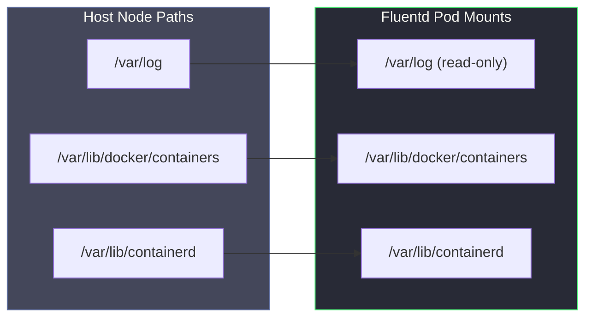

# Fluentd DaemonSet Explained

## What is Fluentd?

**Fluentd** is a popular open-source log collector that unifies logging infrastructure. As a DaemonSet, it runs on every node to collect container logs.


---

## How Fluentd Collects Logs

```mermaid
flowchart LR
    subgraph Node["Node"]
        subgraph Containers["Containers"]
            App1["App 1"]
            App2["App 2"]
        end
        
        subgraph HostPath["/var/log/containers/"]
            Log1["app1_default_xxx.log"]
            Log2["app2_default_xxx.log"]
        end
        
        subgraph Fluentd["Fluentd Pod"]
            Tail["📖 Tail Source"]
            Parse["🔄 Parser"]
            Filter["🏷️ Filter"]
            Out["📤 Output"]
        end
    end
    
    App1 -->|stdout/stderr| Log1
    App2 -->|stdout/stderr| Log2
    Log1 --> Tail
    Log2 --> Tail
    Tail --> Parse
    Parse --> Filter
    Filter --> Out
    
    style Fluentd fill:#282a36,stroke:#bd93f9,color:#f8f8f2
    style Tail fill:#50fa7b,stroke:#8be9fd,color:#282a36
    style Parse fill:#ffb86c,stroke:#f1fa8c,color:#282a36
    style Filter fill:#ff79c6,stroke:#bd93f9,color:#f8f8f2
    style Out fill:#8be9fd,stroke:#50fa7b,color:#282a36
```



### Log Flow Steps

| Step | Component | Description |
|------|-----------|-------------|
| 1 | Container | App writes to stdout/stderr |
| 2 | Kubelet | Redirects to `/var/log/containers/*.log` |
| 3 | Fluentd Source | Tails log files with `@type tail` |
| 4 | Parser | Parses JSON log format |
| 5 | Filter | Adds metadata (node, namespace, pod) |
| 6 | Output | Sends to destination (stdout, ES, S3) |

---

## Architecture Components


| Resource | Purpose |
|----------|---------|
| **DaemonSet** | Ensures Fluentd runs on every node |
| **ServiceAccount** | Identity for RBAC |
| **ClusterRole** | Permissions to read pods/namespaces |
| **ClusterRoleBinding** | Connects SA to ClusterRole |
| **ConfigMap** | Fluentd configuration file |

---

## Volume Mounts

Fluentd needs access to host paths to read container logs:



| Host Path | Contains | Runtime |
|-----------|----------|---------|
| `/var/log` | Container logs, system logs | All |
| `/var/lib/docker/containers` | Docker container logs | Docker |
| `/var/lib/containerd` | Containerd container logs | Containerd/CRI-O |

---

## How to View Logs with Fluentd

### Step 1: Apply Fluentd DaemonSet

```bash
kubectl apply -f daemonset-fluentd.yaml
```

### Step 2: Verify Fluentd is Running

```bash
# Check DaemonSet status
kubectl get daemonset fluentd -n kube-system

# Expected output:
# NAME      DESIRED   CURRENT   READY   UP-TO-DATE   AVAILABLE
# fluentd   1         1         1       1            1

# Check pods
kubectl get pods -n kube-system -l app=fluentd-logging -o wide
```

### Step 3: View Collected Logs

```bash
# Stream Fluentd logs (shows all collected container logs)
kubectl logs -n kube-system -l app=fluentd-logging -f
```

### Step 4: Generate Test Logs

```bash
# Create a pod that generates logs
kubectl run test-logger --image=busybox -- sh -c "while true; do echo 'Hello from test-logger at $(date)'; sleep 5; done"

# Watch Fluentd collect these logs
kubectl logs -n kube-system -l app=fluentd-logging -f | grep test-logger
```

### Step 5: Filter Logs by Namespace/Pod

```bash
# See logs from specific namespace
kubectl logs -n kube-system -l app=fluentd-logging | grep '"namespace_name":"default"'

# See logs from specific pod
kubectl logs -n kube-system -l app=fluentd-logging | grep '"pod_name":"test-logger"'
```

---

## Log Flow Diagram

```mermaid
sequenceDiagram
    participant App as Application Pod
    participant Kubelet as Kubelet
    participant FS as /var/log/containers/
    participant Fluentd as Fluentd Pod
    participant Output as Output (stdout/ES)
    
    App->>Kubelet: 1. Write to stdout
    Kubelet->>FS: 2. Save to log file
    Fluentd->>FS: 3. Tail log files
    FS->>Fluentd: 4. New log lines
    Fluentd->>Fluentd: 5. Parse & enrich
    Fluentd->>Output: 6. Send to output
    
    Note over Fluentd: Adds metadata:<br/>• node_name<br/>• namespace<br/>• pod_name<br/>• container
```



---

## Fluentd Configuration Breakdown

```yaml
# SOURCE: Define where to read logs from
<source>
  @type tail                              # Tail files like 'tail -f'
  path /var/log/containers/*.log          # Path to container logs
  pos_file /var/log/fluentd.log.pos       # Track read position
  tag kubernetes.*                        # Tag for routing
</source>

# FILTER: Add/modify log fields
<filter kubernetes.**>
  @type record_transformer
  <record>
    node_name "#{ENV['K8S_NODE_NAME']}"   # Add node name
  </record>
</filter>

# OUTPUT: Where to send logs
<match kubernetes.**>
  @type stdout                            # Print to stdout
</match>
```

---

## Common Output Destinations


| Destination | Plugin | Use Case |
|-------------|--------|----------|
| **Elasticsearch** | `@type elasticsearch` | Full-text search, Kibana |
| **AWS S3** | `@type s3` | Long-term storage |
| **CloudWatch** | `@type cloudwatch_logs` | AWS native logging |
| **Kafka** | `@type kafka` | Stream processing |
| **stdout** | `@type stdout` | Development/debugging |

---

## Quick Reference Commands

```bash
# Apply Fluentd
kubectl apply -f daemonset-fluentd.yaml

# Check status
kubectl get daemonset fluentd -n kube-system
kubectl get pods -n kube-system -l app=fluentd-logging

# View collected logs
kubectl logs -n kube-system -l app=fluentd-logging -f

# View Fluentd config
kubectl describe configmap fluentd-config -n kube-system

# Restart Fluentd (after config change)
kubectl rollout restart daemonset/fluentd -n kube-system

# Delete everything
kubectl delete -f daemonset-fluentd.yaml
```

---

## Troubleshooting

| Issue | Cause | Solution |
|-------|-------|----------|
| Fluentd not starting | Missing RBAC | Apply ClusterRole and ClusterRoleBinding |
| No logs collected | Wrong log path | Check `/var/log/containers/` exists on node |
| Pods in CrashLoop | Config error | Check `kubectl logs -n kube-system <pod>` |
| High memory usage | Too many logs | Add buffer limits, filter noisy logs |

### Debug Commands

```bash
# Check Fluentd pod logs
kubectl logs -n kube-system -l app=fluentd-logging

# Exec into Fluentd pod
kubectl exec -it -n kube-system deploy/fluentd -- sh

# Check if log files exist
kubectl exec -it -n kube-system <fluentd-pod> -- ls /var/log/containers/
```

---

## Related Files

- [daemonset-simple.yaml](daemonset-simple.yaml) - Basic DaemonSet example
- [daemonset-explained.md](daemonset-explained.md) - DaemonSet concepts
- [daemonset-node-selector.yaml](daemonset-node-selector.yaml) - NodeSelector example
