# DaemonSet with NodeSelector Explained

## What is NodeSelector in DaemonSet?

A **nodeSelector** allows a DaemonSet to run only on nodes that have specific labels, instead of running on all nodes.

```mermaid
flowchart TB
    subgraph Cluster["Kubernetes Cluster"]
        subgraph Node1["Node 1<br/>🏷️ gpu=true"]
            P1[("🔵 GPU Monitor")]
        end
        
        subgraph Node2["Node 2<br/>🏷️ gpu=true"]
            P2[("🔵 GPU Monitor")]
        end
        
        subgraph Node3["Node 3<br/>❌ No GPU label"]
            P3[("No Pod")]
        end
        
        subgraph Node4["Node 4<br/>❌ No GPU label"]
            P4[("No Pod")]
        end
    end
    
    DS[("📋 DaemonSet<br/>nodeSelector: gpu=true")] --> P1
    DS --> P2
    DS -.->|"Skipped"| Node3
    DS -.->|"Skipped"| Node4
    
    style DS fill:#bd93f9,stroke:#ff79c6,color:#f8f8f2
    style P1 fill:#50fa7b,stroke:#8be9fd,color:#282a36
    style P2 fill:#50fa7b,stroke:#8be9fd,color:#282a36
    style Node3 fill:#6272a4,stroke:#44475a,color:#f8f8f2
    style Node4 fill:#6272a4,stroke:#44475a,color:#f8f8f2
```



---

## Regular DaemonSet vs NodeSelector DaemonSet

```mermaid
flowchart LR
    subgraph Regular["Regular DaemonSet"]
        R1[Node 1] --> RP1[Pod ✅]
        R2[Node 2] --> RP2[Pod ✅]
        R3[Node 3] --> RP3[Pod ✅]
        R4[Node 4] --> RP4[Pod ✅]
    end
    
    subgraph NodeSelector["NodeSelector DaemonSet<br/>gpu=true"]
        N1["Node 1<br/>gpu=true"] --> NP1[Pod ✅]
        N2["Node 2<br/>gpu=true"] --> NP2[Pod ✅]
        N3["Node 3<br/>no label"] --> NP3[❌ No Pod]
        N4["Node 4<br/>no label"] --> NP4[❌ No Pod]
    end
    
    style Regular fill:#44475a,stroke:#6272a4,color:#f8f8f2
    style NodeSelector fill:#282a36,stroke:#bd93f9,color:#f8f8f2
    style RP1 fill:#50fa7b,stroke:#8be9fd,color:#282a36
    style RP2 fill:#50fa7b,stroke:#8be9fd,color:#282a36
    style RP3 fill:#50fa7b,stroke:#8be9fd,color:#282a36
    style RP4 fill:#50fa7b,stroke:#8be9fd,color:#282a36
    style NP1 fill:#50fa7b,stroke:#8be9fd,color:#282a36
    style NP2 fill:#50fa7b,stroke:#8be9fd,color:#282a36
    style NP3 fill:#ff5555,stroke:#ff79c6,color:#f8f8f2
    style NP4 fill:#ff5555,stroke:#ff79c6,color:#f8f8f2
```



| Feature | Regular DaemonSet | NodeSelector DaemonSet |
|---------|-------------------|------------------------|
| **Runs on** | All nodes | Only matching nodes |
| **Scales to new nodes** | All new nodes | Only if label matches |
| **Use case** | Cluster-wide agents | Hardware-specific workloads |

---

## How NodeSelector Works


---

## Key Configuration

### NodeSelector in Pod Spec

```yaml
spec:
  template:
    spec:
      # Only schedule on nodes with this label
      nodeSelector:
        gpu: "true"    # Label key: value
```

### Multiple Labels

You can require multiple labels:

```yaml
nodeSelector:
  gpu: "true"
  environment: "production"
  # Node must have BOTH labels
```

---

## NodeSelector vs Node Affinity

| Feature | NodeSelector | Node Affinity |
|---------|--------------|---------------|
| **Complexity** | Simple | Complex |
| **Operators** | Equal only | In, NotIn, Exists, etc. |
| **Soft preference** | ❌ No | ✅ Yes (preferred) |
| **Required vs preferred** | Required only | Both |

### NodeSelector (Simple)
```yaml
nodeSelector:
  gpu: "true"
```

### Node Affinity (Advanced)
```yaml
affinity:
  nodeAffinity:
    requiredDuringSchedulingIgnoredDuringExecution:
      nodeSelectorTerms:
        - matchExpressions:
            - key: gpu
              operator: In
              values: ["true", "nvidia"]
```

---

## Common Use Cases

```mermaid
flowchart TB
    subgraph UseCases["NodeSelector DaemonSet Use Cases"]
        GPU["🎮 GPU Monitoring<br/>nodeSelector: gpu=true"]
        SSD["💾 SSD Storage<br/>nodeSelector: disk=ssd"]
        HPC["🖥️ HPC Workloads<br/>nodeSelector: cpu=high-performance"]
        Edge["🌐 Edge Nodes<br/>nodeSelector: location=edge"]
    end
    
    style GPU fill:#50fa7b,stroke:#8be9fd,color:#282a36
    style SSD fill:#ffb86c,stroke:#f1fa8c,color:#282a36
    style HPC fill:#ff79c6,stroke:#bd93f9,color:#f8f8f2
    style Edge fill:#8be9fd,stroke:#50fa7b,color:#282a36
```



| Use Case | Node Label | Description |
|----------|------------|-------------|
| GPU monitoring | `gpu=true` | Monitor NVIDIA/AMD GPUs |
| SSD storage daemon | `disk=ssd` | Cache on SSD nodes only |
| High-performance nodes | `cpu=high-perf` | Specialized compute |
| Edge deployment | `location=edge` | Run on edge nodes |

---

## Step-by-Step Demo

### 1. Check Current Labels

```bash
kubectl get nodes --show-labels
```

### 2. Add GPU Label to Node

```bash
kubectl label nodes minikube gpu=true
```

### 3. Apply the DaemonSet

```bash
kubectl apply -f daemonset-node-selector.yaml
```

### 4. Verify Pod is Running

```bash
kubectl get daemonset gpu-monitor
kubectl get pods -l app=gpu-monitor -o wide

# Expected:
# NAME              DESIRED   CURRENT   READY
# gpu-monitor       1         1         1
```

### 5. Remove Label (Pod Terminates)

```bash
kubectl label nodes minikube gpu-

kubectl get pods -l app=gpu-monitor
# Pod should be terminating or gone
```

### 6. Re-add Label (Pod Starts Again)

```bash
kubectl label nodes minikube gpu=true

kubectl get pods -l app=gpu-monitor
# New pod should be starting
```

---

## Dynamic Behavior

```mermaid
flowchart LR
    subgraph Before["Before: No Label"]
        N1["Node<br/>❌ no gpu label"]
        D1["DaemonSet<br/>DESIRED: 0"]
    end
    
    subgraph After["After: Label Added"]
        N2["Node<br/>✅ gpu=true"]
        D2["DaemonSet<br/>DESIRED: 1"]
        P2["Pod Running"]
    end
    
    Before -->|"kubectl label node gpu=true"| After
    N2 --> P2
    
    style Before fill:#6272a4,stroke:#44475a,color:#f8f8f2
    style After fill:#50fa7b,stroke:#8be9fd,color:#282a36
    style P2 fill:#bd93f9,stroke:#ff79c6,color:#f8f8f2
```



> [!TIP]
> DaemonSet automatically responds to label changes! Add a label → pod starts. Remove label → pod terminates.

---

## Troubleshooting

| Issue | Cause | Solution |
|-------|-------|----------|
| Pod not running | Node doesn't have required label | Add label: `kubectl label nodes <node> gpu=true` |
| DaemonSet DESIRED: 0 | No nodes match nodeSelector | Check node labels |
| Pod pending | Node has taints | Add tolerations to DaemonSet |

### Debug Commands

```bash
# Check node labels
kubectl get nodes --show-labels

# Check DaemonSet status
kubectl describe daemonset gpu-monitor

# Check events
kubectl get events --sort-by='.lastTimestamp'
```

---

## Related Files

- [daemonset-simple.yaml](daemonset-simple.yaml) - Basic DaemonSet (all nodes)
- [daemonset-explained.md](daemonset-explained.md) - DaemonSet concepts
- [taints-tolerations.yaml](taints-tolerations.yaml) - Taints and tolerations
