# Init Containers Explained

## What are Init Containers?

**Init containers** run **before** the main application container starts. They run to completion, one at a time, in order.


---

## Our Demo: 4 Init Containers

```mermaid
flowchart TB
    subgraph Init["Init Containers (Sequential)"]
        I1["1️⃣ wait-for-db<br/>📍 Check DNS"]
        I2["2️⃣ check-db<br/>🔌 Check Connection"]
        I3["3️⃣ run-migration<br/>🗄️ Create Tables"]
        I4["4️⃣ download-config<br/>📥 Write Config"]
    end
    
    subgraph MainApp["Main Container"]
        App["🚀 app<br/>Read config & run"]
    end
    
    I1 --> I2 --> I3 --> I4 --> App
    
    style I1 fill:#8be9fd,stroke:#50fa7b,color:#282a36
    style I2 fill:#ff79c6,stroke:#bd93f9,color:#f8f8f2
    style I3 fill:#ffb86c,stroke:#f1fa8c,color:#282a36
    style I4 fill:#bd93f9,stroke:#ff79c6,color:#f8f8f2
    style App fill:#50fa7b,stroke:#8be9fd,color:#282a36
```



---

## What Each Init Container Does

### 1️⃣ wait-for-db (DNS Check)

| Property | Value |
|----------|-------|
| **Image** | `busybox:1.35` |
| **Tool Used** | `nslookup` |
| **Purpose** | Wait until PostgreSQL service is discoverable via DNS |
| **Creates DB?** | ❌ No |

```bash
# What it runs:
until nslookup postgres-service.default.svc.cluster.local; do
  sleep 2
done
```

**Why busybox?** Only needs basic tools like `nslookup`, `sh`, `echo`.

---

### 2️⃣ check-db (Connection Check)

| Property | Value |
|----------|-------|
| **Image** | `postgres:13-alpine` |
| **Tool Used** | `pg_isready` |
| **Purpose** | Wait until PostgreSQL accepts connections |
| **Creates DB?** | ❌ No |

```bash
# What it runs:
until pg_isready -h postgres-service -U admin; do
  sleep 2
done
```

**Why postgres image?** Because `pg_isready` tool is ONLY available in the postgres image, not in busybox.


---

### 3️⃣ run-migration (SQL Execution)

| Property | Value |
|----------|-------|
| **Image** | `postgres:13-alpine` |
| **Tool Used** | `psql` |
| **Purpose** | Create database tables |
| **Creates DB?** | ⚠️ Creates TABLE (not database) |

```bash
# What it runs:
psql -h postgres-service -U admin -d mydb -c "
  CREATE TABLE IF NOT EXISTS migrations (
    id SERIAL PRIMARY KEY,
    version VARCHAR(50),
    applied_at TIMESTAMP DEFAULT CURRENT_TIMESTAMP
  );
  INSERT INTO migrations (version) VALUES ('v1.0.0');
"
```

**Why postgres image?** Because `psql` command is ONLY available in the postgres image.

> [!NOTE]
> The database `mydb` must already exist (created by the PostgreSQL server via `POSTGRES_DB` env var).

---

### 4️⃣ download-config (Write Config File)

| Property | Value |
|----------|-------|
| **Image** | `busybox:1.35` |
| **Tool Used** | `echo`, `sh` |
| **Purpose** | Generate configuration file for main app |
| **Creates DB?** | ❌ No |

```bash
# What it runs:
echo "api_key=secret123" > /config/app.conf
echo "db_host=postgres-service" >> /config/app.conf
echo "log_level=info" >> /config/app.conf
```

**Why busybox?** Only needs basic shell commands.

---

## Image Selection Summary


| Init Container | Needs | Image |
|----------------|-------|-------|
| wait-for-db | `nslookup` | busybox ✅ |
| check-db | `pg_isready` | postgres ✅ |
| run-migration | `psql` | postgres ✅ |
| download-config | `echo`, `sh` | busybox ✅ |

---

## Shared Volume Flow

Init containers can share data with main containers using volumes:


---

## Pod Status Progression

```
NAME        READY   STATUS     RESTARTS   AGE
init-demo   0/1     Init:0/4   0          2s    ← wait-for-db running
init-demo   0/1     Init:1/4   0          5s    ← check-db running
init-demo   0/1     Init:2/4   0          10s   ← run-migration running
init-demo   0/1     Init:3/4   0          15s   ← download-config running
init-demo   1/1     Running    0          20s   ← Main app running! ✅
```

---

## Quick Demo

### Setup PostgreSQL First

```bash
# Create PostgreSQL pod
kubectl run postgres --image=postgres:13-alpine \
  --env="POSTGRES_USER=admin" \
  --env="POSTGRES_PASSWORD=password" \
  --env="POSTGRES_DB=mydb" \
  --port=5432

# Expose as service
kubectl expose pod postgres --name=postgres-service --port=5432
```

### Run Init Containers Demo

```bash
# Apply
kubectl apply -f init-containers-demo.yaml

# Watch progress
kubectl get pods -w

# View each init container's logs
kubectl logs init-demo -c wait-for-db
kubectl logs init-demo -c check-db
kubectl logs init-demo -c run-migration
kubectl logs init-demo -c download-config
kubectl logs init-demo -c app
```

### Cleanup

```bash
kubectl delete pod init-demo postgres
kubectl delete svc postgres-service
```

---

## Key Rules

> [!IMPORTANT]
> 1. Init containers run **one at a time**, **in order**
> 2. Each must **exit with code 0** before next starts
> 3. If any fails, **pod restarts from init-1**
> 4. Use **correct image** for the tools you need

---

## Troubleshooting

| Issue | Cause | Solution |
|-------|-------|----------|
| `Init:0/4` stuck | Service not found | Create postgres-service first |
| `Init:1/4` stuck | DB not accepting connections | Wait for PostgreSQL to be ready |
| `Init:CrashLoopBackOff` | Command failed | Check logs: `kubectl logs <pod> -c <init-name>` |

---

## Related Files

- [init-containers-demo.yaml](init-containers-demo.yaml) - Full working example
