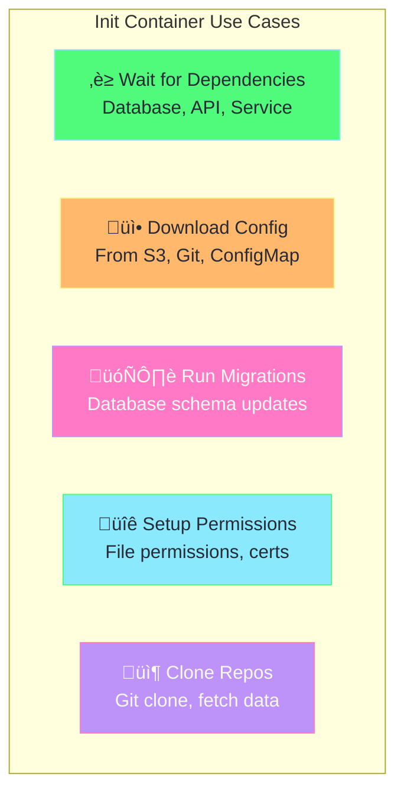
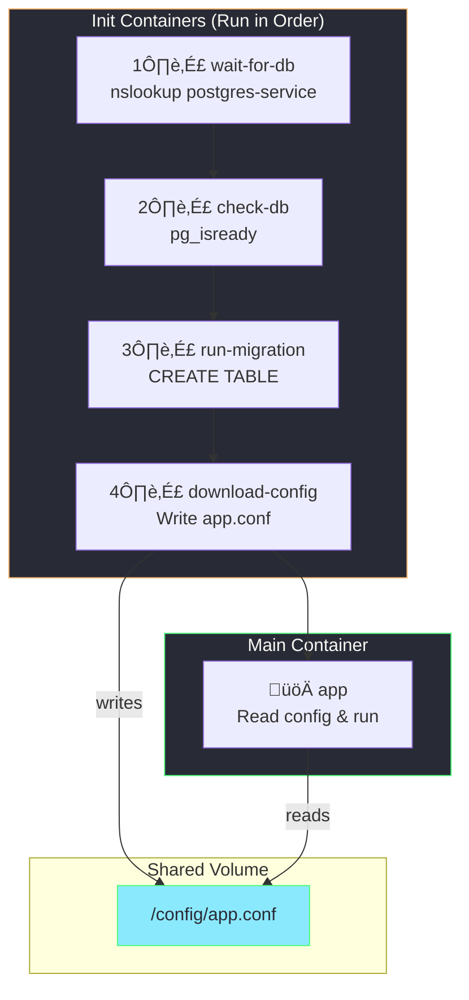

# Init Containers Explained

## What are Init Containers?

**Init containers** are specialized containers that run **before** the main application containers start. They run to completion, one at a time, in order.


---

## Init vs Main Containers

| Feature | Init Containers | Main Containers |
|---------|-----------------|-----------------|
| **Run order** | Sequential (one at a time) | Parallel (all at once) |
| **Must complete** | ✅ Yes, before next starts | ❌ Run until terminated |
| **Readiness probes** | ❌ Not supported | ✅ Supported |
| **Restart behavior** | Pod restarts if fails | Depends on restartPolicy |
| **Use case** | Setup, dependencies | Application logic |

---

## How Init Containers Work


---

## Common Use Cases



| Use Case | Example |
|----------|---------|
| **Wait for service** | `until nslookup mydb; do sleep 2; done` |
| **Download config** | `wget -O /config/app.conf http://config-server/config` |
| **Database migration** | `psql -c "CREATE TABLE..."` |
| **Git clone** | `git clone https://github.com/repo.git /data` |
| **Set permissions** | `chmod 600 /secrets/*` |

---

## Demo Architecture



---

## Pod Status During Init

Watch pod status change as init containers complete:

```
NAME        READY   STATUS     RESTARTS   AGE
init-demo   0/1     Init:0/4   0          5s    ← Init 1 running
init-demo   0/1     Init:1/4   0          10s   ← Init 2 running
init-demo   0/1     Init:2/4   0          15s   ← Init 3 running
init-demo   0/1     Init:3/4   0          20s   ← Init 4 running
init-demo   1/1     Running    0          25s   ← Main container running!
```

---

## Failure Behavior


If any init container fails:
1. Pod enters **CrashLoopBackOff** or restarts
2. All init containers run again **from the beginning**
3. This continues until success or backoff limit

---

## Quick Demo

### Step 1: Create PostgreSQL (Optional)

```bash
# Create PostgreSQL pod
kubectl run postgres --image=postgres:13-alpine \
  --env="POSTGRES_USER=admin" \
  --env="POSTGRES_PASSWORD=password" \
  --env="POSTGRES_DB=mydb" \
  --port=5432

# Expose as service
kubectl expose pod postgres --name=postgres-service --port=5432
```

### Step 2: Apply Init Containers Demo

```bash
kubectl apply -f init-containers-demo.yaml
```

### Step 3: Watch Progress

```bash
# Watch pod status
kubectl get pods -w

# You'll see:
# init-demo   0/1     Init:0/4   0          1s
# init-demo   0/1     Init:1/4   0          5s
# ... and so on
```

### Step 4: View Init Container Logs

```bash
# View each init container's logs
kubectl logs init-demo -c wait-for-db
kubectl logs init-demo -c check-db
kubectl logs init-demo -c run-migration
kubectl logs init-demo -c download-config

# View main container logs
kubectl logs init-demo -c app
```

### Step 5: Cleanup

```bash
kubectl delete pod init-demo
kubectl delete pod postgres
kubectl delete svc postgres-service
```

---

## Key Points

> [!IMPORTANT]
> - Init containers run **one at a time**, **in order**
> - All init containers must **succeed** before main container starts
> - Init containers **can use different images** than main container
> - Use **shared volumes** to pass data from init to main containers

---

## Troubleshooting

| Issue | Cause | Solution |
|-------|-------|----------|
| `Init:0/4` stuck | First init container waiting | Check logs: `kubectl logs <pod> -c <init-container>` |
| `Init:CrashLoopBackOff` | Init container failing | Check logs for error |
| Main container not starting | Init not complete | Wait for all init containers |

### Debug Commands

```bash
# Describe pod to see init container status
kubectl describe pod init-demo

# View init container logs
kubectl logs init-demo -c wait-for-db

# View events
kubectl get events --sort-by='.lastTimestamp'
```

---

## Related Files

- [init-containers-demo.yaml](init-containers-demo.yaml) - Full working example
- [daemonset-simple.yaml](daemonset-simple.yaml) - DaemonSet example

---

## Deep Dive: What Happens When You Run `kubectl apply`?

When you execute `kubectl apply -f init-containers-demo.yaml`, a complex orchestration happens behind the scenes.

### Complete Flow Diagram


---

### Step-by-Step Breakdown

#### 1️⃣ kubectl Sends Request to API Server


**What happens:**
1. kubectl reads your YAML file
2. Converts to JSON
3. Sends HTTPS POST request to API Server
4. Includes your kubeconfig credentials

```bash
# You can see the raw API call:
kubectl apply -f init-containers-demo.yaml -v=6
```

---

#### 2️⃣ API Server Validates & Stores

```mermaid
flowchart TB
    subgraph APIServer["API Server Processing"]
        Auth["🔐 Authentication<br/>Who are you?"]
        Authz["✅ Authorization<br/>Can you create pods?"]
        Admission["🔍 Admission Controllers<br/>Mutate & Validate"]
        Store["💾 Store in etcd"]
    end
    
    Request["Pod YAML"] --> Auth
    Auth --> Authz
    Authz --> Admission
    Admission --> Store
    
    style Auth fill:#ff79c6,stroke:#bd93f9,color:#f8f8f2
    style Authz fill:#50fa7b,stroke:#8be9fd,color:#282a36
    style Admission fill:#ffb86c,stroke:#f1fa8c,color:#282a36
    style Store fill:#8be9fd,stroke:#50fa7b,color:#282a36
```



**Validation includes:**
- YAML syntax valid?
- All required fields present?
- Resource limits valid?
- Image names valid?
- Init container names unique?

---

#### 3️⃣ Scheduler Assigns Pod to Node


**Scheduler checks:**
- Node has enough CPU/memory?
- Node matches nodeSelector?
- Node tolerates pod's tolerations?
- Pod fits resource requests?

---

#### 4️⃣ Kubelet Receives Pod & Runs Init Containers


**For each init container:**
1. Pull image (if not cached)
2. Create container
3. Start container
4. Wait for exit code 0
5. Move to next init container

---

#### 5️⃣ Container Runtime Interaction


**Minikube uses containerd by default.**

---

### Timeline View

```mermaid
gantt
    title Pod Lifecycle Timeline
    dateFormat X
    axisFormat %s
    
    section API
    kubectl apply           :a1, 0, 1
    API validates           :a2, 1, 2
    Store in etcd           :a3, 2, 3
    
    section Scheduler
    Find node               :s1, 3, 4
    Bind to minikube        :s2, 4, 5
    
    section Kubelet
    Pull busybox            :k1, 5, 7
    Init 1 wait-for-db      :k2, 7, 12
    Pull postgres           :k3, 12, 15
    Init 2 check-db         :k4, 15, 18
    Init 3 migration        :k5, 18, 21
    Pull busybox            :k6, 21, 22
    Init 4 config           :k7, 22, 24
    Main container          :k8, 24, 30
```



---

### Status Updates You'll See

| Time | Status | What's Happening |
|------|--------|------------------|
| 0s | `Pending` | Pod created, waiting for scheduler |
| 1s | `Pending` | Scheduler assigned to node |
| 2s | `Init:0/4` | First init container starting |
| 5s | `Init:0/4` | First init container running |
| 10s | `Init:1/4` | Second init container starting |
| 15s | `Init:2/4` | Third init container starting |
| 20s | `Init:3/4` | Fourth init container starting |
| 25s | `Running` | All init done, main container running |

---

### What Gets Stored in etcd?

```yaml
# Simplified view of pod in etcd
apiVersion: v1
kind: Pod
metadata:
  name: init-demo
  namespace: default
  uid: abc123-def456
  creationTimestamp: "2026-01-10T12:30:00Z"
spec:
  nodeName: minikube    # Added by scheduler
  initContainers: [...]
  containers: [...]
status:
  phase: Running
  initContainerStatuses:
    - name: wait-for-db
      state:
        terminated:
          exitCode: 0   # Success!
    - name: check-db
      state:
        terminated:
          exitCode: 0
    # ... and so on
  containerStatuses:
    - name: app
      state:
        running:
          startedAt: "2026-01-10T12:30:25Z"
```

---

### Watch It Happen Live

```bash
# Terminal 1: Watch pod status
kubectl get pods -w

# Terminal 2: Watch events
kubectl get events -w --field-selector involvedObject.name=init-demo

# Terminal 3: Watch API server logs (if accessible)
kubectl logs -n kube-system -l component=kube-apiserver -f
```

---

### Key Components Involved

| Component | Role | Location |
|-----------|------|----------|
| **kubectl** | CLI client, sends requests | Your machine |
| **API Server** | REST API, validates, stores | Control plane |
| **etcd** | Distributed key-value store | Control plane |
| **Scheduler** | Assigns pods to nodes | Control plane |
| **Kubelet** | Runs containers on node | Each node |
| **Container Runtime** | Actually runs containers | Each node |

---

### Summary Flow

```mermaid
flowchart TB
    A["1. kubectl apply"] --> B["2. API Server validates"]
    B --> C["3. Stored in etcd"]
    C --> D["4. Scheduler assigns node"]
    D --> E["5. Kubelet pulls images"]
    E --> F["6. Run init-1"]
    F --> G["7. Run init-2"]
    G --> H["8. Run init-3"]
    H --> I["9. Run init-4"]
    I --> J["10. Start main container"]
    J --> K["11. Pod Running! ✅"]
    
    style A fill:#50fa7b,stroke:#8be9fd,color:#282a36
    style K fill:#50fa7b,stroke:#8be9fd,color:#282a36
    style F fill:#ffb86c,stroke:#f1fa8c,color:#282a36
    style G fill:#ffb86c,stroke:#f1fa8c,color:#282a36
    style H fill:#ffb86c,stroke:#f1fa8c,color:#282a36
    style I fill:#ffb86c,stroke:#f1fa8c,color:#282a36
```



