# Sidecar Pattern Explained

## What is the Sidecar Pattern?

A **sidecar** is a helper container that runs alongside your main application container in the same Pod.

```mermaid
flowchart LR
    subgraph Pod["Pod"]
        App["🚀 Main App"]
        S1["📤 Sidecar 1<br/>Log Shipper"]
        S2["🔍 Sidecar 2<br/>Analyzer"]
        Vol[("📁 Shared<br/>Volume")]
    end
    
    App -->|writes| Vol
    Vol -->|reads| S1
    Vol -->|reads| S2
    
    style App fill:#50fa7b,stroke:#8be9fd,color:#282a36
    style S1 fill:#ffb86c,stroke:#f1fa8c,color:#282a36
    style S2 fill:#ff79c6,stroke:#bd93f9,color:#f8f8f2
    style Vol fill:#8be9fd,stroke:#50fa7b,color:#282a36
```



---

## Traditional vs Native Sidecars

### Traditional Sidecar (All K8s Versions)

Sidecars in `containers` section - all start in parallel:

```yaml
spec:
  containers:
    - name: app           # Main app
    - name: log-shipper   # Sidecar 1
    - name: log-analyzer  # Sidecar 2
```

### Native Sidecar (K8s 1.28+)

Sidecars in `initContainers` with `restartPolicy: Always`:

```yaml
spec:
  initContainers:
    - name: log-shipper
      restartPolicy: Always   # ← Makes it a native sidecar!
    - name: log-analyzer
      restartPolicy: Always
  containers:
    - name: app               # Starts AFTER sidecars
```

---

## Comparison


| Feature | Traditional | Native (1.28+) |
|---------|-------------|----------------|
| **Defined in** | `containers` | `initContainers` |
| **restartPolicy** | Not needed | `Always` |
| **Startup order** | All parallel | Sidecars → App |
| **Sidecar ready first** | ❌ No | ✅ Yes |
| **Shutdown order** | All parallel | App → Sidecars |

---

## Common Sidecar Use Cases

```mermaid
flowchart TB
    subgraph UseCases["Sidecar Use Cases"]
        UC1["📤 Log Shipping<br/>Fluentd, Filebeat"]
        UC2["🔒 Service Mesh<br/>Envoy, Istio"]
        UC3["📊 Monitoring<br/>Prometheus exporter"]
        UC4["🔐 Auth Proxy<br/>OAuth2 proxy"]
        UC5["💾 Data Sync<br/>Git sync"]
    end
    
    style UC1 fill:#50fa7b,stroke:#8be9fd,color:#282a36
    style UC2 fill:#ff79c6,stroke:#bd93f9,color:#f8f8f2
    style UC3 fill:#ffb86c,stroke:#f1fa8c,color:#282a36
    style UC4 fill:#8be9fd,stroke:#50fa7b,color:#282a36
    style UC5 fill:#bd93f9,stroke:#ff79c6,color:#f8f8f2
```



| Sidecar Type | Example | Purpose |
|--------------|---------|---------|
| **Log Shipper** | Fluentd, Filebeat | Ship logs to Elasticsearch |
| **Service Mesh** | Envoy (Istio) | mTLS, traffic routing |
| **Monitoring** | Prometheus exporter | Expose metrics |
| **Auth Proxy** | OAuth2 proxy | Handle authentication |
| **Data Sync** | git-sync | Sync config from Git |

---

## How Our Example Works

```mermaid
flowchart TB
    subgraph Pod["Sidecar Logging Pod"]
        App["🚀 Main App<br/>Writes logs"]
        Ship["📤 Log Shipper<br/>Ships logs"]
        Analyze["🔍 Log Analyzer<br/>Alerts on errors"]
        Vol[("/var/log/app.log")]
    end
    
    App -->|"write"| Vol
    Vol -->|"tail -f"| Ship
    Vol -->|"tail -f"| Analyze
    
    Ship -->|"[SHIPPED]"| External["External Service"]
    Analyze -->|"[ALERT]"| Alert["Error Alert"]
    
    style App fill:#50fa7b,stroke:#8be9fd,color:#282a36
    style Ship fill:#ffb86c,stroke:#f1fa8c,color:#282a36
    style Analyze fill:#ff79c6,stroke:#bd93f9,color:#f8f8f2
```



1. **Main App** writes logs to `/var/log/app.log`
2. **Log Shipper** reads logs and ships to external service
3. **Log Analyzer** monitors for ERROR/WARN and alerts

---

## Native Sidecar Startup Order


---

## Quick Demo

### Run Traditional Sidecar

```bash
kubectl apply -f sidecar-logging.yaml
kubectl get pod sidecar-traditional

# View app logs
kubectl logs sidecar-traditional -c app

# View shipped logs
kubectl logs sidecar-traditional -c log-shipper

# View alerts
kubectl logs sidecar-traditional -c log-analyzer
```

### Run Native Sidecar (K8s 1.28+)

```bash
kubectl get pod sidecar-native

# View logs
kubectl logs sidecar-native -c app
kubectl logs sidecar-native -c log-shipper
```

### Cleanup

```bash
kubectl delete pod sidecar-traditional sidecar-native
```

---

## Key Points

> [!IMPORTANT]
> - Sidecars share **network** and **volumes** with main app
> - Use **emptyDir** volumes for inter-container communication
> - Native sidecars (1.28+) use `restartPolicy: Always` in initContainers
> - Native sidecars start **before** main app

---

## Related Files

- [sidecar-logging.yaml](sidecar-logging.yaml) - Working examples
- [init-containers-demo.yaml](init-containers-demo.yaml) - Init containers
