```mermaid
graph TD
    DELETE[kubectl delete -f statefulset-postgresql.yaml]
    
    DELETE -->|"✓ Deleted"| SVC1[Service: postgres]
    DELETE -->|"✓ Deleted"| SVC2[Service: postgres-lb]
    DELETE -->|"✓ Deleted"| CM[ConfigMap: postgres-config]
    DELETE -->|"✓ Deleted"| SEC[Secret: postgres-secret]
    DELETE -->|"✓ Deleted"| STS[StatefulSet: postgres]
    DELETE -->|"✓ Deleted"| PODS[All Pods]
    
    DELETE -.->|"❌ NOT Deleted!"| PVC0[PVC: postgres-storage-postgres-0]
    DELETE -.->|"❌ NOT Deleted!"| PVC1[PVC: postgres-storage-postgres-1]
    DELETE -.->|"❌ NOT Deleted!"| PVC2[PVC: postgres-storage-postgres-2]
    
    NOTE[⚠️ PVCs must be deleted manually:<br/>kubectl delete pvc -l app=postgres]
```

# PostgreSQL StatefulSet Deployment Flow

This document explains what happens step-by-step when you run:

```bash
kubectl apply -f statefulset-postgresql.yaml
```

---

## Overview: What Gets Created


---

## Step 1: API Server Receives the Request


---

## Step 2: StatefulSet Controller Takes Action


---

## Step 3: Sequential Pod Creation (OrderedReady)

This is the KEY difference from Deployments. Pods are created **one at a time**, waiting for each to be Ready.

```mermaid
sequenceDiagram
    participant STS as StatefulSet Controller
    participant Node as Worker Node
    participant PVC as PVC Controller
    
    Note over STS: Start with 0 pods, need 3
    
    STS->>PVC: Create PVC: postgres-storage-postgres-0
    PVC-->>STS: PVC Bound
    STS->>Node: Create Pod: postgres-0
    Node-->>STS: Pod Running
    Note over Node: Wait for Readiness Probe...
    Node-->>STS: Pod Ready ✓
    
    Note over STS: 1 pod ready, need 3
    
    STS->>PVC: Create PVC: postgres-storage-postgres-1
    PVC-->>STS: PVC Bound
    STS->>Node: Create Pod: postgres-1
    Node-->>STS: Pod Running
    Note over Node: Wait for Readiness Probe...
    Node-->>STS: Pod Ready ✓
    
    Note over STS: 2 pods ready, need 3
    
    STS->>PVC: Create PVC: postgres-storage-postgres-2
    PVC-->>STS: PVC Bound
    STS->>Node: Create Pod: postgres-2
    Node-->>STS: Pod Running
    Note over Node: Wait for Readiness Probe...
    Node-->>STS: Pod Ready ✓
    
    Note over STS: 3 pods ready ✓ Done!
```



---

## Step 4: Container Startup Inside Each Pod


---

## Step 5: DNS Records Created by Headless Service


---

## Step 6: Client Connection Flow


---

## What Happens When a Pod Crashes?

```mermaid
sequenceDiagram
    participant STS as StatefulSet Controller
    participant Node as Worker Node
    participant PVC as Existing PVC
    
    Note over Node: postgres-0 crashes!
    Node-->>STS: Pod postgres-0 terminated
    
    Note over STS: Current: 2 pods<br/>Desired: 3 pods
    
    STS->>Node: Create Pod: postgres-0 (same name!)
    Note over STS: Uses existing PVC
    STS->>PVC: Attach PVC: postgres-storage-postgres-0
    PVC-->>STS: Already exists, reattach
    
    Node-->>STS: Pod Running
    Node-->>STS: Pod Ready ✓
    
    Note over Node: Data preserved!<br/>Same hostname, same storage
```



---

## Scaling Up (replicas: 3 → 5)

```bash
kubectl scale statefulset postgres --replicas=5
```


---

## Scaling Down (replicas: 5 → 2)

```bash
kubectl scale statefulset postgres --replicas=2
```


---

## Rolling Update Flow

```bash
kubectl set image statefulset/postgres postgres=postgres:14
```


---

## Cleanup: What Gets Deleted

```bash
kubectl delete -f statefulset-postgresql.yaml
```



---

## Complete Architecture Summary

```mermaid
graph TB
    subgraph External["🌐 External"]
        CLIENT[👤 Client Application]
    end
    
    subgraph Cluster["☸️ Kubernetes Cluster"]
        subgraph Services["🔗 Services"]
            LB[📡 postgres-lb<br/>ClusterIP: 10.96.x.x]
            HEADLESS[🔍 postgres<br/>ClusterIP: None]
        end
        
        subgraph Config["⚙️ Configuration"]
            CM[📋 ConfigMap<br/>postgres-config]
            SEC[🔐 Secret<br/>postgres-secret]
        end
        
        subgraph STS["🗃️ StatefulSet: postgres"]
            POD0[🟢 postgres-0<br/>Primary]
            POD1[🔵 postgres-1<br/>Replica]
            POD2[🔵 postgres-2<br/>Replica]
        end
        
        subgraph Storage["💾 Persistent Storage"]
            PVC0[📦 PVC-0<br/>2Gi]
            PVC1[📦 PVC-1<br/>2Gi]
            PVC2[📦 PVC-2<br/>2Gi]
        end
    end
    
    %% Client Traffic (Orange lines)
    CLIENT --> LB
    LB --> POD0
    LB --> POD1
    LB --> POD2
    
    %% DNS Resolution (Blue dashed lines)
    HEADLESS -.->|DNS| POD0
    HEADLESS -.->|DNS| POD1
    HEADLESS -.->|DNS| POD2
    
    %% ConfigMap injection (Purple lines)
    CM --> POD0
    CM --> POD1
    CM --> POD2
    
    %% Secret injection (Red lines)
    SEC --> POD0
    SEC --> POD1
    SEC --> POD2
    
    %% Storage mounting (Yellow lines)
    POD0 --> PVC0
    POD1 --> PVC1
    POD2 --> PVC2

    %% Node Styling
    style CLIENT fill:#e1f5fe,stroke:#01579b,stroke-width:2px,color:#01579b
    style LB fill:#fff3e0,stroke:#e65100,stroke-width:2px,color:#e65100
    style HEADLESS fill:#fff3e0,stroke:#e65100,stroke-width:2px,color:#e65100
    style CM fill:#f3e5f5,stroke:#7b1fa2,stroke-width:2px,color:#7b1fa2
    style SEC fill:#fce4ec,stroke:#c2185b,stroke-width:2px,color:#c2185b
    style POD0 fill:#c8e6c9,stroke:#2e7d32,stroke-width:3px,color:#1b5e20
    style POD1 fill:#bbdefb,stroke:#1565c0,stroke-width:2px,color:#0d47a1
    style POD2 fill:#bbdefb,stroke:#1565c0,stroke-width:2px,color:#0d47a1
    style PVC0 fill:#fff9c4,stroke:#f9a825,stroke-width:2px,color:#f57f17
    style PVC1 fill:#fff9c4,stroke:#f9a825,stroke-width:2px,color:#f57f17
    style PVC2 fill:#fff9c4,stroke:#f9a825,stroke-width:2px,color:#f57f17

    %% Link Styling (Colored Lines)
    %% Client to LB (Orange - Traffic)
    linkStyle 0 stroke:#e65100,stroke-width:3px
    %% LB to Pods (Orange - Traffic)
    linkStyle 1 stroke:#e65100,stroke-width:2px
    linkStyle 2 stroke:#e65100,stroke-width:2px
    linkStyle 3 stroke:#e65100,stroke-width:2px
    %% Headless DNS (Blue - DNS Resolution)
    linkStyle 4 stroke:#1565c0,stroke-width:2px,stroke-dasharray:5
    linkStyle 5 stroke:#1565c0,stroke-width:2px,stroke-dasharray:5
    linkStyle 6 stroke:#1565c0,stroke-width:2px,stroke-dasharray:5
    %% ConfigMap (Purple - Config Injection)
    linkStyle 7 stroke:#7b1fa2,stroke-width:2px
    linkStyle 8 stroke:#7b1fa2,stroke-width:2px
    linkStyle 9 stroke:#7b1fa2,stroke-width:2px
    %% Secret (Red/Pink - Secret Injection)
    linkStyle 10 stroke:#c2185b,stroke-width:2px
    linkStyle 11 stroke:#c2185b,stroke-width:2px
    linkStyle 12 stroke:#c2185b,stroke-width:2px
    %% PVC (Yellow - Storage)
    linkStyle 13 stroke:#f9a825,stroke-width:3px
    linkStyle 14 stroke:#f9a825,stroke-width:3px
    linkStyle 15 stroke:#f9a825,stroke-width:3px
```



### Color Legend

| Line Color | Connection Type | Description |
|------------|-----------------|-------------|
| 🟧 **Orange** | Client Traffic | Client → Service → Pods (network requests) |
| 🔵 **Blue Dashed** | DNS Resolution | Headless Service → Pods (DNS lookup) |
| 🟪 **Purple** | ConfigMap | Config injection into pods (env vars) |
| 🟥 **Pink/Red** | Secret | Secret injection into pods (passwords) |
| 🟨 **Yellow** | Storage | Pods → PVCs (persistent data mount) |

### Node Color Legend

| Color | Component Type | Description |
|-------|---------------|-------------|
| 🟦 Light Blue | Client | External application connecting to cluster |
| 🟧 Orange | Services | Network endpoints (LoadBalancer & Headless) |
| 🟪 Purple | ConfigMap | Non-sensitive configuration data |
| 🟥 Pink | Secret | Sensitive data (passwords) |
| 🟩 Green | Primary Pod | First pod (postgres-0), typically the leader |
| 🔵 Blue | Replica Pods | Secondary pods (postgres-1, postgres-2) |
| 🟨 Yellow | PVCs | Persistent storage volumes |

---

## Quick Reference Commands

| Action | Command |
|--------|---------|
| Deploy | `kubectl apply -f statefulset-postgresql.yaml` |
| Watch pods | `kubectl get pods -w -l app=postgres` |
| Check StatefulSet | `kubectl get statefulset postgres` |
| Check PVCs | `kubectl get pvc` |
| Connect to DB | `kubectl exec -it postgres-0 -- psql -U admin -d mydb` |
| Scale up | `kubectl scale statefulset postgres --replicas=5` |
| Scale down | `kubectl scale statefulset postgres --replicas=2` |
| Update image | `kubectl set image statefulset/postgres postgres=postgres:14` |
| Delete all | `kubectl delete -f statefulset-postgresql.yaml` |
| Delete PVCs | `kubectl delete pvc -l app=postgres` |
