```mermaid
sequenceDiagram
    participant STS as 🎛️ StatefulSet Controller
    participant P2 as 🔵 myapp-2
    participant P1 as 🔵 myapp-1
    participant P0 as 🟢 myapp-0

    Note over STS: Update Strategy: RollingUpdate<br/>Updates in REVERSE order (highest first)
    
    Note over STS,P2: 🟠 Step 1: Update myapp-2
    STS->>P2: Terminate myapp-2 (nginx:1.20)
    P2-->>STS: Terminated
    STS->>P2: Create myapp-2 (nginx:1.21)
    P2-->>STS: Running
    P2-->>STS: Ready ✓
    
    Note over STS,P1: 🟠 Step 2: Update myapp-1
    STS->>P1: Terminate myapp-1 (nginx:1.20)
    P1-->>STS: Terminated
    STS->>P1: Create myapp-1 (nginx:1.21)
    P1-->>STS: Running
    P1-->>STS: Ready ✓
    
    Note over STS,P0: 🟠 Step 3: Update myapp-0
    STS->>P0: Terminate myapp-0 (nginx:1.20)
    P0-->>STS: Terminated
    STS->>P0: Create myapp-0 (nginx:1.21)
    P0-->>STS: Running
    P0-->>STS: Ready ✓
    
    Note over STS: ✅ All pods updated to nginx:1.21!
```

# StatefulSet Update Strategies Explained

This document explains how StatefulSet update strategies work when you run:

```bash
kubectl apply -f statefulset-update.yaml
```

---

## What Gets Created


---

## Update Strategy Types

```mermaid
flowchart TD
    subgraph TYPES["🔄 Update Strategy Types"]
        ROLLING[RollingUpdate<br/>Default]
        ONDELETE[OnDelete<br/>Manual]
    end
    
    ROLLING --> R1[✅ Automatic updates]
    ROLLING --> R2[✅ Reverse order: 2→1→0]
    ROLLING --> R3[✅ Waits for Ready]
    ROLLING --> R4[✅ Supports partition]
    
    ONDELETE --> O1[⏸️ No automatic updates]
    ONDELETE --> O2[🗑️ Update on manual delete]
    ONDELETE --> O3[🎯 Full control]
    
    style ROLLING fill:#50fa7b,stroke:#6272a4,color:#282a36
    style ONDELETE fill:#ffb86c,stroke:#6272a4,color:#282a36
    style R1 fill:#8be9fd,stroke:#6272a4,color:#282a36
    style R2 fill:#8be9fd,stroke:#6272a4,color:#282a36
    style R3 fill:#8be9fd,stroke:#6272a4,color:#282a36
    style R4 fill:#8be9fd,stroke:#6272a4,color:#282a36
    style O1 fill:#bd93f9,stroke:#6272a4,color:#282a36
    style O2 fill:#bd93f9,stroke:#6272a4,color:#282a36
    style O3 fill:#bd93f9,stroke:#6272a4,color:#282a36
```



---

## RollingUpdate Flow (Step-by-Step)

When you trigger an update:

```bash
kubectl set image statefulset/myapp nginx=nginx:1.21
```



---

## Partition Strategy (Canary Deployment)

The `partition` field controls which pods get updated:

```mermaid
flowchart LR
    subgraph PART["📊 Partition Values"]
        P0["partition: 0<br/>Update ALL"]
        P1["partition: 1<br/>Update 2 pods"]
        P2["partition: 2<br/>Update 1 pod"]
        P3["partition: 3<br/>Update NONE"]
    end
    
    P0 --> ALL[myapp-0 ✓<br/>myapp-1 ✓<br/>myapp-2 ✓]
    P1 --> TWO[myapp-0 ✗<br/>myapp-1 ✓<br/>myapp-2 ✓]
    P2 --> ONE[myapp-0 ✗<br/>myapp-1 ✗<br/>myapp-2 ✓]
    P3 --> NONE[myapp-0 ✗<br/>myapp-1 ✗<br/>myapp-2 ✗]
    
    style P0 fill:#50fa7b,stroke:#6272a4,color:#282a36
    style P1 fill:#8be9fd,stroke:#6272a4,color:#282a36
    style P2 fill:#ffb86c,stroke:#6272a4,color:#282a36
    style P3 fill:#ff5555,stroke:#6272a4,color:#282a36
    style ALL fill:#50fa7b,stroke:#6272a4,color:#282a36
    style TWO fill:#8be9fd,stroke:#6272a4,color:#282a36
    style ONE fill:#ffb86c,stroke:#6272a4,color:#282a36
    style NONE fill:#ff5555,stroke:#6272a4,color:#282a36
```



---

## Canary Update Workflow

```mermaid
sequenceDiagram
    participant User as 👤 User
    participant STS as 🎛️ StatefulSet
    participant P0 as myapp-0
    participant P1 as myapp-1
    participant P2 as myapp-2

    Note over User: Want to test nginx:1.22 safely
    
    Note over User,STS: 🟠 Step 1: Set partition to 2 (canary)
    User->>STS: kubectl patch statefulset myapp<br/>partition: 2
    
    Note over User,STS: 🟠 Step 2: Update image
    User->>STS: kubectl set image nginx=nginx:1.22
    
    Note over STS,P2: Only myapp-2 updates!
    STS->>P2: Update to nginx:1.22
    P2-->>STS: Ready ✓
    
    Note over P0,P1: myapp-0 and myapp-1 stay on nginx:1.21
    
    Note over User: 🔍 Test myapp-2, verify it works
    
    Note over User,STS: 🟢 Step 3: Roll out to all
    User->>STS: kubectl patch statefulset myapp<br/>partition: 0
    
    STS->>P1: Update to nginx:1.22
    P1-->>STS: Ready ✓
    STS->>P0: Update to nginx:1.22
    P0-->>STS: Ready ✓
    
    Note over User: ✅ All pods now on nginx:1.22!
```



---

## Before vs After Update

```mermaid
flowchart LR
    subgraph BEFORE["⬅️ Before Update"]
        B0[myapp-0<br/>nginx:1.20]
        B1[myapp-1<br/>nginx:1.20]
        B2[myapp-2<br/>nginx:1.20]
    end
    
    UPDATE[🔄 kubectl set image<br/>nginx=nginx:1.21]
    
    subgraph AFTER["➡️ After Update"]
        A0[myapp-0<br/>nginx:1.21]
        A1[myapp-1<br/>nginx:1.21]
        A2[myapp-2<br/>nginx:1.21]
    end
    
    B0 --> UPDATE
    B1 --> UPDATE
    B2 --> UPDATE
    UPDATE --> A2
    UPDATE --> A1
    UPDATE --> A0
    
    NOTE[Update Order:<br/>myapp-2 first<br/>myapp-1 second<br/>myapp-0 last]
    
    style B0 fill:#ffb86c,stroke:#6272a4,color:#282a36
    style B1 fill:#ffb86c,stroke:#6272a4,color:#282a36
    style B2 fill:#ffb86c,stroke:#6272a4,color:#282a36
    style UPDATE fill:#bd93f9,stroke:#6272a4,color:#282a36
    style A0 fill:#50fa7b,stroke:#6272a4,color:#282a36
    style A1 fill:#50fa7b,stroke:#6272a4,color:#282a36
    style A2 fill:#50fa7b,stroke:#6272a4,color:#282a36
    style NOTE fill:#f1fa8c,stroke:#6272a4,color:#282a36
```



---

## OnDelete Strategy

With `updateStrategy.type: OnDelete`:

```mermaid
sequenceDiagram
    participant User as 👤 User
    participant STS as 🎛️ StatefulSet
    participant P0 as myapp-0
    participant P1 as myapp-1
    participant P2 as myapp-2

    Note over User: Update image with OnDelete strategy
    User->>STS: kubectl set image nginx=nginx:1.21
    
    Note over STS: Nothing happens automatically!<br/>Pods stay on nginx:1.20
    
    Note over User: Manually delete pods one by one
    
    User->>P2: kubectl delete pod myapp-2
    STS->>P2: Recreate with nginx:1.21
    P2-->>STS: Ready ✓
    
    Note over User: Verify myapp-2, then continue
    
    User->>P1: kubectl delete pod myapp-1
    STS->>P1: Recreate with nginx:1.21
    P1-->>STS: Ready ✓
    
    User->>P0: kubectl delete pod myapp-0
    STS->>P0: Recreate with nginx:1.21
    P0-->>STS: Ready ✓
    
    Note over User: ✅ All pods updated manually!
```



---

## Data Persistence During Updates

```mermaid
flowchart TD
    subgraph UPDATE["🔄 During Update"]
        OLD[myapp-0<br/>nginx:1.20]
        NEW[myapp-0<br/>nginx:1.21]
    end
    
    OLD -->|Terminated| DEL[Pod Deleted]
    DEL -->|Recreated| NEW
    
    subgraph PVC["💾 PVC: data-myapp-0"]
        DATA["/data directory<br/>All files preserved!"]
    end
    
    OLD ---|Mounted| DATA
    NEW ---|Re-mounted| DATA
    
    NOTE[✅ Same PVC reattaches<br/>✅ Data survives updates<br/>✅ No data loss]
    
    style OLD fill:#ffb86c,stroke:#6272a4,color:#282a36
    style NEW fill:#50fa7b,stroke:#6272a4,color:#282a36
    style DEL fill:#ff5555,stroke:#6272a4,color:#282a36
    style DATA fill:#f1fa8c,stroke:#6272a4,color:#282a36
    style NOTE fill:#8be9fd,stroke:#6272a4,color:#282a36
```



---

## When to Use Each Strategy

```mermaid
flowchart TD
    START{What's your<br/>use case?}
    
    START -->|"Safe automatic updates"| ROLLING[🟢 RollingUpdate<br/>partition: 0]
    START -->|"Test before full rollout"| CANARY[🟡 RollingUpdate<br/>partition: 2]
    START -->|"Full manual control"| ONDELETE[🔴 OnDelete]
    START -->|"Pause all updates"| PAUSE[⏸️ RollingUpdate<br/>partition: 3]
    
    ROLLING --> R_USE[Web apps, APIs<br/>Standard deployments]
    CANARY --> C_USE[Production databases<br/>Critical services]
    ONDELETE --> O_USE[Database migrations<br/>Manual verification needed]
    PAUSE --> P_USE[Maintenance windows<br/>Freeze deployments]
    
    style START fill:#ffb86c,stroke:#6272a4,color:#282a36
    style ROLLING fill:#50fa7b,stroke:#6272a4,color:#282a36
    style CANARY fill:#f1fa8c,stroke:#6272a4,color:#282a36
    style ONDELETE fill:#ff5555,stroke:#6272a4,color:#282a36
    style PAUSE fill:#bd93f9,stroke:#6272a4,color:#282a36
    style R_USE fill:#8be9fd,stroke:#6272a4,color:#282a36
    style C_USE fill:#8be9fd,stroke:#6272a4,color:#282a36
    style O_USE fill:#8be9fd,stroke:#6272a4,color:#282a36
    style P_USE fill:#8be9fd,stroke:#6272a4,color:#282a36
```



---

## Quick Reference Commands

| Action | Command |
|--------|---------|
| Deploy | `kubectl apply -f statefulset-update.yaml` |
| Watch pods | `kubectl get pods -l app=myapp -w` |
| Check images | `kubectl get pods -l app=myapp -o jsonpath='{range .items[*]}{.metadata.name}{"\t"}{.spec.containers[0].image}{"\n"}{end}'` |
| Update image | `kubectl set image statefulset/myapp nginx=nginx:1.21` |
| Rollout status | `kubectl rollout status statefulset/myapp` |
| Set partition | `kubectl patch statefulset myapp -p '{"spec":{"updateStrategy":{"rollingUpdate":{"partition":2}}}}'` |
| Rollback | `kubectl rollout undo statefulset/myapp` |
| Delete all | `kubectl delete -f statefulset-update.yaml` |
| Delete PVCs | `kubectl delete pvc -l app=myapp` |
