# Taints and Tolerations Explained

## What are Taints and Tolerations?

**Taints** are applied to **nodes** to repel pods.  
**Tolerations** are applied to **pods** to allow scheduling on tainted nodes.

> [!TIP]
> Think of it like a "No Entry" sign (taint) on a building, and a special pass (toleration) that allows certain people in.

---

## How They Work Together

```mermaid
flowchart LR
    subgraph Nodes
        N1["Node 1<br/>🏷️ No Taint"]
        N2["Node 2<br/>⚠️ Taint: gpu=true"]
        N3["Node 3<br/>⚠️ Taint: gpu=true"]
    end
    
    subgraph Pods
        P1["Pod A<br/>❌ No Toleration"]
        P2["Pod B<br/>✅ Tolerates: gpu=true"]
    end
    
    P1 -->|"Can schedule"| N1
    P1 -.->|"❌ Rejected"| N2
    P1 -.->|"❌ Rejected"| N3
    
    P2 -->|"Can schedule"| N1
    P2 -->|"Can schedule"| N2
    P2 -->|"Can schedule"| N3
    
    style N2 fill:#ffcccc
    style N3 fill:#ffcccc
    style P2 fill:#ccffcc
```



---

## Taint Effects

| Effect | New Pods | Existing Pods | Use Case |
|--------|----------|---------------|----------|
| **NoSchedule** | ❌ Blocked | ✅ Stay | Dedicated nodes |
| **PreferNoSchedule** | ⚠️ Avoid if possible | ✅ Stay | Soft preference |
| **NoExecute** | ❌ Blocked | ❌ Evicted | Maintenance, failures |

---

## Taint Syntax


### Common Commands

```bash
# Add a taint
kubectl taint nodes node1 gpu=true:NoSchedule

# View node taints
kubectl describe node node1 | grep Taints

# Remove a taint (add minus sign at end)
kubectl taint nodes node1 gpu=true:NoSchedule-

# Remove all taints with a key
kubectl taint nodes node1 gpu-
```

---

## Toleration Operators

### Equal Operator
Matches exact key, value, AND effect:

```yaml
tolerations:
- key: "gpu"
  operator: "Equal"
  value: "true"
  effect: "NoSchedule"
```

### Exists Operator
Matches key only (value ignored):

```yaml
tolerations:
- key: "gpu"
  operator: "Exists"
  effect: "NoSchedule"
```

### Match All Taints
Empty key with Exists matches **everything**:

```yaml
tolerations:
- operator: "Exists"
```

---

## Matching Rules

```mermaid
flowchart TD
    Start["Pod wants to schedule"] --> Check{"Node has taints?"}
    Check -->|No| Allow["✅ Schedule allowed"]
    Check -->|Yes| Match{"Pod tolerates<br/>all taints?"}
    Match -->|Yes| Allow
    Match -->|No| Effect{"Taint effect?"}
    Effect -->|NoSchedule| Block["❌ Cannot schedule"]
    Effect -->|PreferNoSchedule| Prefer["⚠️ Try other nodes first"]
    Effect -->|NoExecute| Evict["❌ Cannot schedule<br/>+ Evict existing"]
```



---

## Common Use Cases

### 1. Dedicated Hardware (GPU/SSD)

```bash
# Taint GPU nodes
kubectl taint nodes gpu-node-1 gpu=true:NoSchedule
```

```yaml
# Pod that needs GPU
tolerations:
- key: "gpu"
  operator: "Equal"
  value: "true"
  effect: "NoSchedule"
nodeSelector:
  hardware: gpu  # Also ensure scheduling ONLY on GPU nodes
```

### 2. Environment Isolation

```bash
# Taint production nodes
kubectl taint nodes prod-node environment=production:NoSchedule
```

### 3. Control Plane Access

```yaml
# Run monitoring on control-plane
tolerations:
- key: "node-role.kubernetes.io/control-plane"
  operator: "Exists"
  effect: "NoSchedule"
```

### 4. Node Maintenance

```bash
# Evict pods for maintenance (with 1 hour grace)
kubectl taint nodes node1 maintenance=true:NoExecute

# Pods with this toleration stay for 1 hour
tolerations:
- key: "maintenance"
  effect: "NoExecute"
  tolerationSeconds: 3600
```

---

## Taints vs Node Selectors vs Node Affinity

| Feature | Purpose | Applied To |
|---------|---------|------------|
| **Taints/Tolerations** | Repel pods from nodes | Nodes repel Pods |
| **Node Selector** | Attract pods to nodes | Pods select Nodes |
| **Node Affinity** | Complex attraction rules | Pods prefer Nodes |

> [!IMPORTANT]
> Tolerations only **allow** scheduling on tainted nodes. To **ensure** a pod runs on specific nodes, combine with `nodeSelector` or `nodeAffinity`.

---

## Built-in Taints

Kubernetes automatically adds these taints:

| Taint | Meaning |
|-------|---------|
| `node.kubernetes.io/not-ready` | Node not ready |
| `node.kubernetes.io/unreachable` | Node unreachable |
| `node.kubernetes.io/memory-pressure` | Node has memory pressure |
| `node.kubernetes.io/disk-pressure` | Node has disk pressure |
| `node.kubernetes.io/pid-pressure` | Node has PID pressure |
| `node.kubernetes.io/unschedulable` | Node marked unschedulable |

---

## Minikube Example

```bash
# View current taints on minikube node
kubectl describe node minikube | grep -A5 Taints

# Add a custom taint
kubectl taint nodes minikube special=true:NoSchedule

# Try to schedule a pod without toleration (will be Pending)
kubectl run test --image=nginx

# Check pod status
kubectl get pods

# Remove the taint
kubectl taint nodes minikube special=true:NoSchedule-
```

---

## Quick Reference

```bash
# Add taint
kubectl taint nodes NODE KEY=VALUE:EFFECT

# Remove taint
kubectl taint nodes NODE KEY=VALUE:EFFECT-

# View taints
kubectl get nodes -o custom-columns=NAME:.metadata.name,TAINTS:.spec.taints

# Check why pod is pending
kubectl describe pod POD_NAME | grep -A10 Events
```
