# Chapter 1: CNI Fundamentals 🌐

## Table of Contents

1. [What is CNI?](#what-is-cni)
2. [Why Do We Need CNI?](#why-do-we-need-cni)
3. [CNI Specification](#cni-specification)
4. [CNI Commands Explained](#cni-commands-explained)
5. [Core Components](#core-components)
6. [IP Address Management (IPAM)](#ip-address-management-ipam)
7. [CNI Configuration Files](#cni-configuration-files)
8. [Quick Reference](#quick-reference)

---

## What is CNI?

### Simple Definition

**CNI (Container Network Interface)** is like a standard "contract" or "agreement" that tells Kubernetes how to set up networking for your pods. 

Think of it this way: when you create a pod, Kubernetes needs to give it an IP address and make sure it can talk to other pods. CNI is the standard way this happens.

### Real-World Analogy

Imagine you're moving into a new apartment building:
- **The building** = Kubernetes cluster
- **Your apartment** = Your pod
- **Getting phone/internet connected** = CNI setting up networking
- **The phone company** = CNI plugin (like Calico or Flannel)

Just like there's a standard process for getting utilities connected to any apartment, CNI provides a standard process for connecting any container to the network.

### What CNI Actually Does

When Kubernetes creates a pod, CNI performs these 4 main tasks:

1. **Assigns an IP address** - Every pod gets its own unique IP (like getting a phone number)
2. **Creates a network interface** - A virtual "network card" inside the pod (like getting a phone)
3. **Sets up routes** - So traffic knows how to reach other pods (like a phone directory)
4. **Cleans up when done** - Removes everything when the pod is deleted (like disconnecting service)

### Visual Overview

The following diagram shows what CNI provides versus what it does NOT do:

```mermaid
flowchart TB
    subgraph Definition["✅ What CNI Provides"]
        direction TB
        S1["📋 Standard Specification<br/>(The rules all plugins follow)"]
        S2["📚 Reference Libraries<br/>(Code that plugins can use)"]
        S3["🔌 Plugin Interface<br/>(How plugins talk to Kubernetes)"]
        S4["🛠️ Network Configuration<br/>(How to configure networks)"]
    end
    
    subgraph NotCNI["❌ What CNI is NOT"]
        direction TB
        N1["Not a running service or daemon"]
        N2["Not a specific network solution"]
        N3["Not Kubernetes-specific<br/>(also works with Docker, Podman)"]
    end
    
    style Definition fill:#50fa7b,stroke:#8be9fd,color:#282a36
    style NotCNI fill:#ff5555,stroke:#ff79c6,color:#282a36
```



**Key Point:** CNI is just a specification (a set of rules). The actual networking work is done by **CNI plugins** like Calico, Flannel, or Cilium. These plugins follow the CNI rules to set up pod networking.

---

## Why Do We Need CNI?

### The Problem Before CNI

Before CNI existed, every container platform (Docker, rkt, Kubernetes) had its own way of doing networking. This caused several problems:

#### Problems Without a Standard:
1. **No Interoperability** - Network solutions built for Docker wouldn't work with Kubernetes
2. **Duplicated Effort** - Each platform reinvented networking from scratch
3. **Vendor Lock-in** - Once you picked a networking solution, you were stuck with it
4. **Complexity** - Operators had to learn different networking for each platform

### How CNI Solved This

CNI created a **standard interface** that sits between the container runtime (like containerd) and network plugins:

```
                     BEFORE CNI                          
    ┌──────────────────────────────────────────────────┐
    │                                                   │
    │   Docker ──── Docker's network                   │
    │                                                   │
    │   rkt ─────── rkt's network     (Incompatible!)  │
    │                                                   │
    │   K8s ─────── K8s network                        │
    │                                                   │
    └──────────────────────────────────────────────────┘

                      AFTER CNI                          
    ┌──────────────────────────────────────────────────┐
    │                                                   │
    │   containerd ─┐                                  │
    │               │                                  │
    │   CRI-O ──────┼──► CNI Standard ──► Calico      │
    │               │         │                        │
    │   Podman ─────┘         ├──────────► Flannel    │
    │                         │                        │
    │                         └──────────► Cilium     │
    │                                                   │
    │   (Any runtime works with any plugin!)           │
    │                                                   │
    └──────────────────────────────────────────────────┘
```

### Benefits of CNI

| Benefit | Explanation |
|---------|-------------|
| **Flexibility** | Switch between Calico, Flannel, Cilium anytime |
| **Simplicity** | Learn CNI once, use any plugin |
| **Innovation** | Plugin developers can focus on features, not compatibility |
| **Multi-platform** | Same plugin works with Docker, Kubernetes, Podman |

---

## CNI Specification

### The CNI Contract

The CNI specification defines a simple "contract" between the container runtime (like containerd) and network plugins. This contract specifies:

1. **What information the runtime provides** (container ID, network namespace path)
2. **What the plugin must do** (create interface, assign IP)
3. **What the plugin must return** (IP address, routes, DNS settings)

### How CNI Communication Works

When Kubernetes creates a pod, here's the exact flow:


**Explanation of the flow:**

1. **Kubelet** asks the container runtime to create a pod
2. **Container runtime** calls the CNI plugin binary (like `/opt/cni/bin/calico`)
3. **CNI plugin** creates network interfaces and assigns IPs
4. **CNI plugin** returns the IP address and other info in JSON format
5. **Pod is ready** to receive traffic

### CNI Input and Output

The CNI plugin receives configuration via **stdin** (standard input) and environment variables, then returns results via **stdout** (standard output):

**Input (what the plugin receives):**
```json
{
  "cniVersion": "1.0.0",
  "name": "my-network",
  "type": "bridge",
  "bridge": "cni0",
  "ipam": {
    "type": "host-local",
    "subnet": "10.244.0.0/24"
  }
}
```

**Environment Variables:**
```bash
CNI_COMMAND=ADD           # What to do (ADD, DEL, CHECK)
CNI_CONTAINERID=abc123    # Container identifier
CNI_NETNS=/var/run/netns/xxx  # Path to network namespace
CNI_IFNAME=eth0           # Interface name to create
CNI_PATH=/opt/cni/bin     # Where to find plugin binaries
```

**Output (what the plugin returns):**
```json
{
  "cniVersion": "1.0.0",
  "interfaces": [
    {
      "name": "eth0",
      "mac": "0a:58:0a:f4:00:05",
      "sandbox": "/var/run/netns/xxx"
    }
  ],
  "ips": [
    {
      "address": "10.244.0.5/24",
      "gateway": "10.244.0.1"
    }
  ],
  "routes": [
    { "dst": "0.0.0.0/0" }
  ],
  "dns": {
    "nameservers": ["10.96.0.10"]
  }
}
```

---

## CNI Commands Explained

CNI defines 4 commands that plugins must implement. Think of these as the "verbs" in the CNI language:

### 1. ADD Command

**Purpose:** Set up networking for a new container

**When it runs:** Every time a pod is created

**What it does:**
1. Creates a network namespace (isolated network for the pod)
2. Creates a virtual ethernet (veth) pair
3. Assigns an IP address from the configured range
4. Sets up routing so the pod can reach other pods
5. Returns the IP address and configuration

**Example scenario:**
```
You create a pod → Kubelet calls CNI with ADD → Pod gets IP 10.244.0.5
```

### 2. DEL Command

**Purpose:** Clean up networking when container is deleted

**When it runs:** Every time a pod is deleted

**What it does:**
1. Removes the veth pair
2. Releases the IP address back to the pool
3. Cleans up any iptables rules
4. Removes routes

**Important:** DEL must be "idempotent" - calling it multiple times should not cause errors.

**Example scenario:**
```
You delete a pod → Kubelet calls CNI with DEL → IP 10.244.0.5 is released
```

### 3. CHECK Command

**Purpose:** Verify that container's network is still correctly configured

**When it runs:** Periodically or on-demand for health checking

**What it does:**
1. Checks that the interface exists
2. Verifies the IP is still assigned
3. Confirms routes are in place
4. Returns OK or an error

**Example scenario:**
```
Kubelet health check → CNI CHECK → Returns "OK" or "Error: interface missing"
```

### 4. VERSION Command

**Purpose:** Report which CNI specification versions the plugin supports

**When it runs:** When runtime wants to know plugin capabilities

**What it returns:**
```json
{
  "cniVersion": "1.0.0",
  "supportedVersions": ["0.3.0", "0.3.1", "0.4.0", "1.0.0"]
}
```

### Command Summary Table

| Command | When Used | Input | Output |
|---------|-----------|-------|--------|
| **ADD** | Pod created | Network config | IP, routes, DNS |
| **DEL** | Pod deleted | Network config | Success/Error |
| **CHECK** | Health check | Network config + Previous result | OK/Error |
| **VERSION** | Capability query | None | Supported versions |

---

## Core Components

### Where CNI Lives on Your System

CNI has two important directories on every Kubernetes node:

```
/etc/cni/net.d/          ← Configuration files
├── 10-calico.conflist   ← Calico configuration
├── 87-podman.conflist   ← Podman configuration (if installed)
└── 99-loopback.conf     ← Loopback interface config

/opt/cni/bin/            ← Plugin executables (binaries)
├── bridge               ← Creates Linux bridge networks
├── calico               ← Calico main plugin
├── calico-ipam          ← Calico IP management
├── flannel              ← Flannel plugin
├── host-local           ← Simple local IP management
├── loopback             ← Loopback interface plugin
├── portmap              ← Maps container ports to host
└── tuning               ← Tunes network parameters
```

### Plugin Types Explained

There are 3 types of CNI plugins, each with a different purpose:

#### 1. Main Plugins (Create Network Interfaces)

These plugins create the actual network interface inside the pod:

| Plugin | What It Does | When to Use |
|--------|--------------|-------------|
| **bridge** | Creates a Linux bridge and connects pods to it | Default for most setups |
| **macvlan** | Gives pods their own MAC address on physical network | When pods need to look like physical machines |
| **ipvlan** | Similar to macvlan but shares MAC address | Lower overhead than macvlan |
| **ptp** | Point-to-point link between pod and host | Simple, no bridge needed |
| **host-device** | Moves a physical device into the pod | When pod needs direct hardware access |

#### 2. IPAM Plugins (Manage IP Addresses)

IPAM = IP Address Management. These plugins assign and track IP addresses:

| Plugin | How It Works | Best For |
|--------|--------------|----------|
| **host-local** | Stores IPs in files on the local node | Single node, simple setups |
| **dhcp** | Gets IPs from a DHCP server | Enterprise environments with existing DHCP |
| **calico-ipam** | Stores IPs in Kubernetes API | Production multi-node clusters |
| **static** | Uses manually configured IPs | When you need specific IPs |

#### 3. Meta Plugins (Add Extra Features)

These plugins "chain" with other plugins to add features:

| Plugin | What It Adds |
|--------|--------------|
| **portmap** | Maps ports from host to container (like docker -p) |
| **bandwidth** | Limits network bandwidth for containers |
| **firewall** | Adds iptables rules for the container |
| **tuning** | Sets sysctl parameters (like TCP settings) |
| **flannel** | Helper that delegates to the flannel backend |

### How Plugins Chain Together

Multiple plugins can work together. The configuration file lists them in order:

```
┌────────────────────────────────────────────────────────────────┐
│                     Plugin Chain Example                        │
│                                                                 │
│  Pod Created                                                    │
│       │                                                         │
│       ▼                                                         │
│  ┌─────────────────┐                                           │
│  │ 1. bridge       │  Creates veth pair, assigns IP            │
│  │    plugin       │  (Main plugin)                            │
│  └────────┬────────┘                                           │
│           │                                                     │
│           ▼                                                     │
│  ┌─────────────────┐                                           │
│  │ 2. portmap      │  Sets up port forwarding if needed        │
│  │    plugin       │  (Meta plugin)                            │
│  └────────┬────────┘                                           │
│           │                                                     │
│           ▼                                                     │
│  ┌─────────────────┐                                           │
│  │ 3. bandwidth    │  Applies rate limiting                    │
│  │    plugin       │  (Meta plugin)                            │
│  └────────┬────────┘                                           │
│           │                                                     │
│           ▼                                                     │
│  Pod has network with all features!                            │
│                                                                 │
└────────────────────────────────────────────────────────────────┘
```

---

## IP Address Management (IPAM)

### What is IPAM?

IPAM (IP Address Management) is responsible for:
- **Allocating** unique IP addresses to each pod
- **Tracking** which IPs are in use and which are free
- **Releasing** IPs when pods are deleted

Without IPAM, you could have two pods with the same IP address, which would break networking!

### How Host-Local IPAM Works

The simplest IPAM plugin is `host-local`. It works like this:

```
┌────────────────────────────────────────────────────────────────┐
│                    Host-Local IPAM Process                      │
│                                                                 │
│  Configuration: subnet = 10.244.0.0/24 (256 IPs available)     │
│                                                                 │
│  ALLOCATION:                                                    │
│  ┌──────────────────────────────────────────────────────────┐  │
│  │  1. Pod A created                                         │  │
│  │  2. IPAM checks: which IPs are free?                     │  │
│  │  3. IPAM picks: 10.244.0.5                               │  │
│  │  4. IPAM records: "10.244.0.5 → Pod A"                   │  │
│  │  5. IPAM returns: 10.244.0.5 to CNI                      │  │
│  └──────────────────────────────────────────────────────────┘  │
│                                                                 │
│  STORAGE (on disk):                                             │
│  /var/lib/cni/networks/my-network/                             │
│  ├── 10.244.0.5          ← Contains "container-id-for-pod-a"  │
│  ├── 10.244.0.6          ← Contains "container-id-for-pod-b"  │
│  ├── 10.244.0.7          ← Contains "container-id-for-pod-c"  │
│  └── last_reserved_ip.0  ← Remembers last allocated IP        │
│                                                                 │
│  RELEASE:                                                       │
│  ┌──────────────────────────────────────────────────────────┐  │
│  │  1. Pod A deleted                                         │  │
│  │  2. IPAM called with DEL                                 │  │
│  │  3. IPAM deletes file: /var/lib/cni/.../10.244.0.5      │  │
│  │  4. IP 10.244.0.5 is now free for reuse!                │  │
│  └──────────────────────────────────────────────────────────┘  │
│                                                                 │
└────────────────────────────────────────────────────────────────┘
```

### IPAM Configuration Example

Here's how you configure IPAM in a CNI config file:

```json
{
  "ipam": {
    "type": "host-local",
    "ranges": [
      [
        {
          "subnet": "10.244.0.0/24",
          "rangeStart": "10.244.0.10",
          "rangeEnd": "10.244.0.250",
          "gateway": "10.244.0.1"
        }
      ]
    ],
    "routes": [
      { "dst": "0.0.0.0/0" }
    ]
  }
}
```

**Explanation of each field:**
- `type`: Which IPAM plugin to use (host-local)
- `subnet`: The IP range to allocate from (10.244.0.0/24 = 256 IPs)
- `rangeStart`: First IP to allocate (skip 0-9)
- `rangeEnd`: Last IP to allocate (leave some for static assignment)
- `gateway`: The default gateway for pods (usually the bridge IP)
- `routes`: Routes to add to the pod (0.0.0.0/0 = default route)

---

## CNI Configuration Files

### Configuration File Location

CNI looks for configuration files in `/etc/cni/net.d/`. Files are processed in alphabetical order, so:
- `10-calico.conflist` runs before `99-loopback.conf`
- Lower numbers = higher priority

### Two Configuration Formats

#### Format 1: Single Plugin (.conf)

Used when you only need one plugin:

```json
{
  "cniVersion": "1.0.0",
  "name": "simple-bridge",
  "type": "bridge",
  "bridge": "cni0",
  "isGateway": true,
  "ipMasq": true,
  "ipam": {
    "type": "host-local",
    "subnet": "10.244.0.0/24"
  }
}
```

**Line-by-line explanation:**
- `cniVersion`: CNI specification version this config uses
- `name`: Human-readable name for this network
- `type`: Which plugin to run (looks for /opt/cni/bin/bridge)
- `bridge`: Name of the Linux bridge to create/use
- `isGateway`: Bridge should have an IP and act as gateway
- `ipMasq`: Enable NAT for outbound traffic
- `ipam`: IP address management configuration (nested)

#### Format 2: Plugin Chain (.conflist)

Used when you need multiple plugins working together:

```json
{
  "cniVersion": "1.0.0",
  "name": "my-network",
  "plugins": [
    {
      "type": "bridge",
      "bridge": "cni0",
      "isGateway": true,
      "ipam": {
        "type": "host-local",
        "subnet": "10.244.0.0/24"
      }
    },
    {
      "type": "portmap",
      "capabilities": {
        "portMappings": true
      }
    },
    {
      "type": "bandwidth",
      "ingressRate": 1000000,
      "egressRate": 1000000
    }
  ]
}
```

**This configuration:**
1. First creates a bridge network with IP allocation
2. Then adds port mapping support (for hostPort)
3. Finally adds bandwidth limiting (1 Mbps in/out)

### View Minikube's CNI Config

You can see what CNI configuration Minikube uses:

```bash
# SSH into Minikube
minikube ssh

# View all CNI configs
cat /etc/cni/net.d/*

# List CNI binaries
ls /opt/cni/bin/
```

---

## Quick Reference

### Key Terms Glossary

| Term | Simple Explanation |
|------|-------------------|
| **CNI** | The standard interface for container networking |
| **CNI Plugin** | A program that implements the CNI standard (Calico, Flannel) |
| **IPAM** | System that manages IP address allocation |
| **veth pair** | Virtual cable connecting pod to host network |
| **Network Namespace** | Isolated network space for a pod |
| **Bridge** | Virtual switch connecting multiple veth pairs |

### Common Commands

```bash
# View CNI configuration
cat /etc/cni/net.d/*

# List CNI plugins
ls /opt/cni/bin/

# Check which CNI is running (Calico example)
kubectl get pods -n kube-system -l k8s-app=calico-node

# View CNI logs
kubectl logs -n kube-system -l k8s-app=calico-node -c calico-node

# See pod IPs
kubectl get pods -o wide
```

### Key Takeaways

> [!IMPORTANT]
> **Remember these 5 key points:**
> 
> 1. **CNI is a specification**, not a tool - plugins implement it
> 2. **4 commands**: ADD (create), DEL (cleanup), CHECK (verify), VERSION (info)
> 3. **Plugins are just executables** in `/opt/cni/bin/`
> 4. **IPAM is separate** - it's a plugin for managing IPs
> 5. **Configuration files** in `/etc/cni/net.d/` control everything

---

## What's Next?

Now that you understand CNI fundamentals, the next chapter explains how CNI integrates with Kubernetes:

**[Chapter 2: CNI Architecture →](02-cni-architecture.md)**

You'll learn:
- How Kubelet calls CNI
- What the pause container does
- Pod sandbox networking
- Network namespace lifecycle
