# Chapter 1: CNI Fundamentals 🌐

## Table of Contents

1. [What is CNI?](#what-is-cni)
2. [History and Evolution](#history-and-evolution)
3. [CNI Specification](#cni-specification)
4. [Core Components](#core-components)
5. [IP Address Management (IPAM)](#ip-address-management-ipam)
6. [CNI Configuration](#cni-configuration)

---

## What is CNI?

### Definition

**CNI (Container Network Interface)** is a specification and set of libraries for configuring network interfaces in Linux containers. It's the **standard API** between container runtimes and network implementations.

```mermaid
flowchart TB
    subgraph Definition["What CNI Provides"]
        S1["📋 Standard Specification"]
        S2["📚 Reference Libraries"]
        S3["🔌 Plugin Interface"]
        S4["🛠️ Network Configuration"]
    end
    
    subgraph NotCNI["What CNI is NOT"]
        N1["❌ Not a daemon/service"]
        N2["❌ Not a network solution"]
        N3["❌ Not Kubernetes-specific"]
    end
    
    style Definition fill:#50fa7b,stroke:#8be9fd,color:#282a36
    style NotCNI fill:#ff5555,stroke:#ff79c6,color:#282a36
```



### Why CNI was Created

```
┌──────────────────────────────────────────────────────────────────────┐
│                     BEFORE CNI (The Problem)                          │
│                                                                       │
│  Docker, rkt, Kubernetes - each had their own networking             │
│  • No interoperability between platforms                              │
│  • Duplicated development effort                                      │
│  • Vendor lock-in                                                     │
└──────────────────────────────────────────────────────────────────────┘
                                   │
                                   ▼
┌──────────────────────────────────────────────────────────────────────┐
│                     AFTER CNI (The Solution)                          │
│                                                                       │
│  ┌─────────────┐    ┌─────────────┐    ┌─────────────┐              │
│  │ containerd  │    │   CRI-O     │    │   podman    │              │
│  └──────┬──────┘    └──────┬──────┘    └──────┬──────┘              │
│         └──────────────────┼──────────────────┘                      │
│                            ▼                                          │
│              ┌─────────────────────────┐                              │
│              │    CNI SPECIFICATION    │                              │
│              └─────────────────────────┘                              │
│                            │                                          │
│         ┌──────────────────┼──────────────────┐                      │
│         ▼                  ▼                  ▼                      │
│  ┌───────────┐      ┌───────────┐      ┌───────────┐                │
│  │  Calico   │      │  Flannel  │      │  Cilium   │                │
│  └───────────┘      └───────────┘      └───────────┘                │
└──────────────────────────────────────────────────────────────────────┘
```

---

## History and Evolution


---

## CNI Specification

### The Contract

CNI defines a simple contract between container runtimes and network plugins:


### CNI Commands

| Command | Purpose | Output |
|---------|---------|--------|
| **ADD** | Create network for container | IP address, routes, DNS |
| **DEL** | Delete network for container | Success/Error |
| **CHECK** | Verify network is correct | OK/Error |
| **VERSION** | Report supported versions | Version list |

### Environment Variables

```bash
# CNI passes these environment variables:
CNI_COMMAND=ADD|DEL|CHECK|VERSION
CNI_CONTAINERID=abc123def456...
CNI_NETNS=/var/run/netns/cni-xxx
CNI_IFNAME=eth0
CNI_PATH=/opt/cni/bin
```

---

## Core Components

### Component Architecture


### Plugin Types


---

## IP Address Management (IPAM)

IPAM handles IP allocation for containers:


### IPAM Plugins Comparison

| Plugin | Storage | Use Case |
|--------|---------|----------|
| **host-local** | Local disk | Single node, simple |
| **dhcp** | DHCP server | Enterprise networks |
| **calico-ipam** | etcd/K8s | Production clusters |

---

## CNI Configuration

### Single Plugin (.conf)

```json
{
  "cniVersion": "1.0.0",
  "name": "mybridge",
  "type": "bridge",
  "bridge": "cni0",
  "isGateway": true,
  "ipam": {
    "type": "host-local",
    "subnet": "10.0.1.0/24"
  }
}
```

### Plugin Chain (.conflist)

```json
{
  "cniVersion": "1.0.0",
  "name": "mynetwork",
  "plugins": [
    {
      "type": "bridge",
      "bridge": "cni0",
      "ipam": {
        "type": "host-local",
        "subnet": "10.0.1.0/24"
      }
    },
    {
      "type": "portmap",
      "capabilities": {"portMappings": true}
    }
  ]
}
```

---

## Key Takeaways

> [!IMPORTANT]
> 1. **CNI is a specification**, not a specific tool
> 2. **4 operations**: ADD, DEL, CHECK, VERSION
> 3. **Plugins are executables** that read stdin/write stdout
> 4. **IPAM is separate** from interface creation
> 5. **Config in** `/etc/cni/net.d/`

---

**[Next: Chapter 2 - CNI Architecture →](02-cni-architecture.md)**
