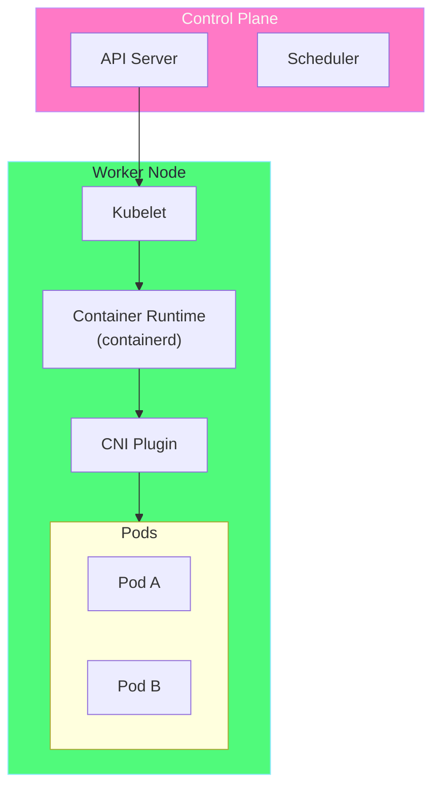
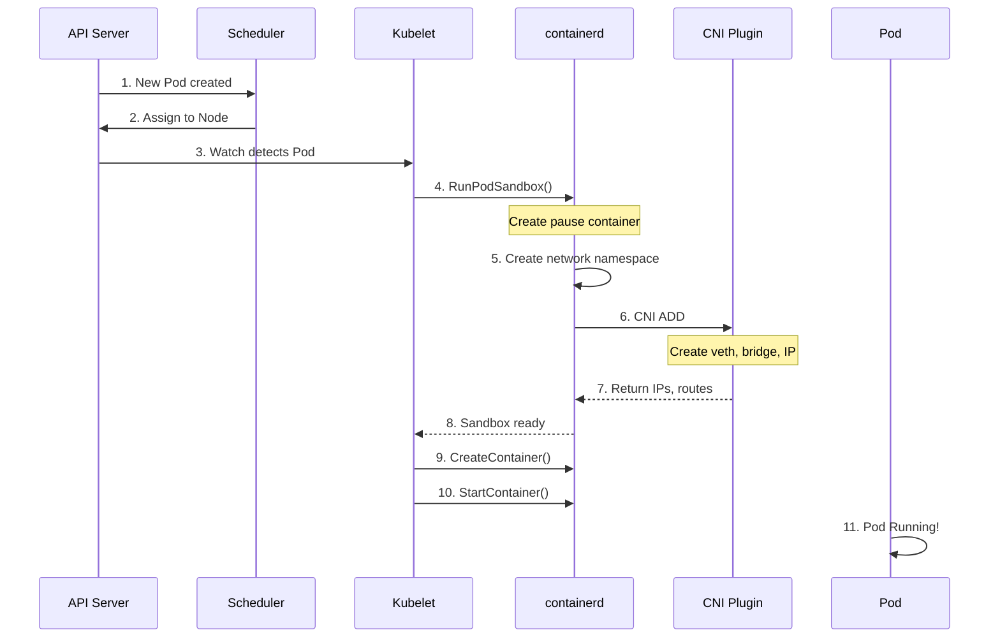
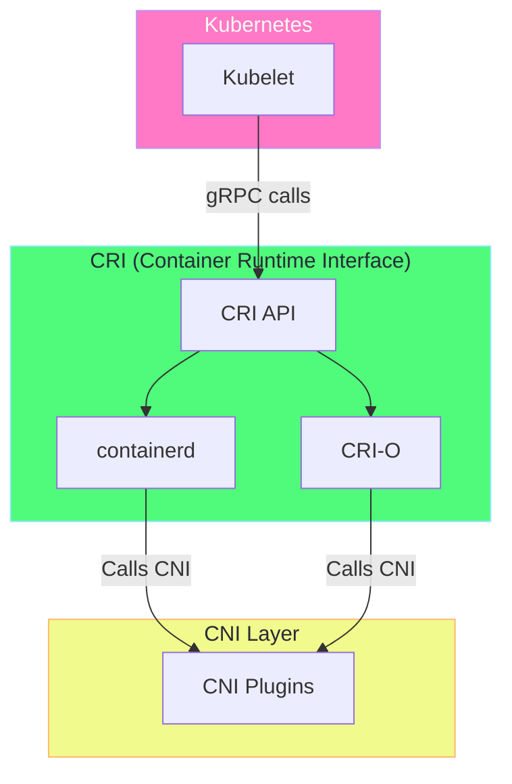
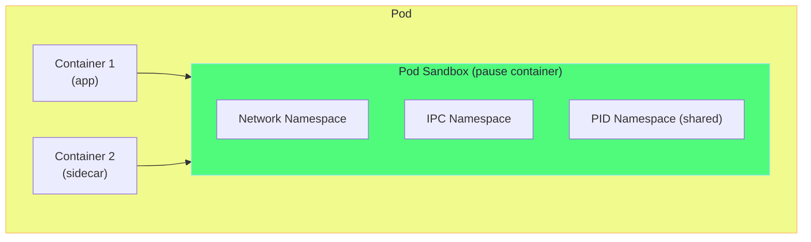
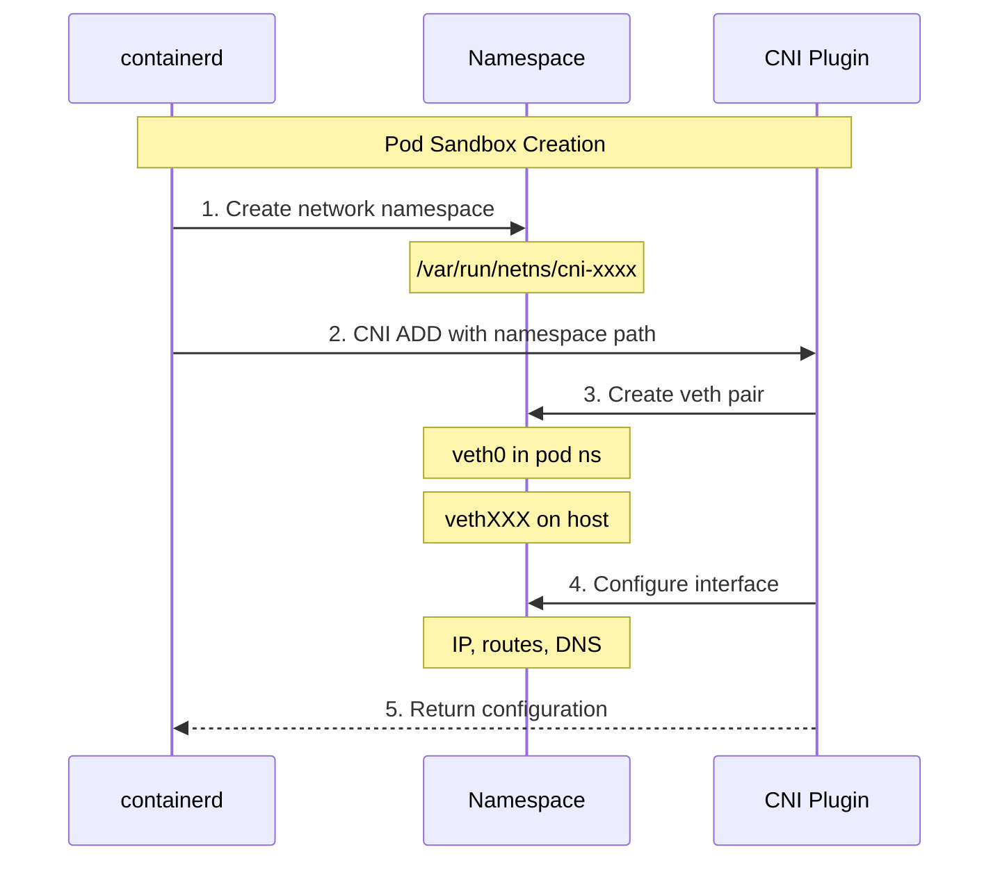

# Chapter 2: CNI Architecture 🏗️

## Table of Contents

1. [Kubernetes & CNI Integration](#kubernetes--cni-integration)
2. [Kubelet CNI Flow](#kubelet-cni-flow)
3. [Container Runtime Integration](#container-runtime-integration)
4. [Pod Sandbox Networking](#pod-sandbox-networking)
5. [Network Namespace Lifecycle](#network-namespace-lifecycle)

---

## Kubernetes & CNI Integration

### How Kubernetes Uses CNI



### The Integration Points

```
┌─────────────────────────────────────────────────────────────────────────┐
│                        KUBERNETES CNI INTEGRATION                        │
├─────────────────────────────────────────────────────────────────────────┤
│                                                                          │
│  1. CONFIGURATION                                                        │
│     Kubelet reads: /etc/cni/net.d/*.conf, *.conflist                   │
│     Kubelet finds: /opt/cni/bin/<plugin-name>                          │
│                                                                          │
│  2. KUBELET PARAMETERS                                                   │
│     --network-plugin=cni                                                 │
│     --cni-conf-dir=/etc/cni/net.d                                       │
│     --cni-bin-dir=/opt/cni/bin                                          │
│                                                                          │
│  3. FLOW                                                                 │
│     Pod Created → Kubelet → CRI → CNI ADD → Pod has network            │
│     Pod Deleted → Kubelet → CRI → CNI DEL → Network cleaned up         │
│                                                                          │
└─────────────────────────────────────────────────────────────────────────┘
```

---

## Kubelet CNI Flow

### Pod Creation Sequence



### Detailed Step Breakdown

```
┌─────────────────────────────────────────────────────────────────────────┐
│                         POD CREATION STEPS                               │
├─────────────────────────────────────────────────────────────────────────┤
│                                                                          │
│  STEP 1-3: SCHEDULING                                                    │
│  ┌─────────────┐    ┌─────────────┐    ┌─────────────┐                 │
│  │ API Server  │───▶│  Scheduler  │───▶│   Kubelet   │                 │
│  │ stores pod  │    │ picks node  │    │ gets event  │                 │
│  └─────────────┘    └─────────────┘    └─────────────┘                 │
│                                                                          │
│  STEP 4-7: SANDBOX CREATION                                              │
│  ┌─────────────┐    ┌─────────────┐    ┌─────────────┐                 │
│  │   Kubelet   │───▶│ containerd  │───▶│ CNI Plugin  │                 │
│  │  calls CRI  │    │creates netns│    │ configures  │                 │
│  │             │    │             │    │  network    │                 │
│  └─────────────┘    └─────────────┘    └─────────────┘                 │
│                                              │                           │
│                                              ▼                           │
│  STEP 8-11: CONTAINER START          ┌─────────────────┐               │
│  ┌─────────────┐                     │ IP: 10.0.1.5    │               │
│  │   Kubelet   │────────────────────▶│ Routes: ✓      │               │
│  │starts conts │                     │ DNS: ✓         │               │
│  └─────────────┘                     │ Pod Running!   │               │
│                                      └─────────────────┘               │
│                                                                          │
└─────────────────────────────────────────────────────────────────────────┘
```

---

## Container Runtime Integration

### CRI and CNI Relationship



### containerd CNI Integration

```yaml
# containerd config.toml CNI section
# Location: /etc/containerd/config.toml

[plugins."io.containerd.grpc.v1.cri".cni]
  # CNI binary directory
  bin_dir = "/opt/cni/bin"
  
  # CNI configuration directory
  conf_dir = "/etc/cni/net.d"
  
  # Maximum number of concurrent CNI calls
  max_conf_num = 1
  
  # CNI configuration file template
  conf_template = ""
```

---

## Pod Sandbox Networking

### What is a Pod Sandbox?

The Pod sandbox is the foundation for pod networking. It's created by the "pause" container.



### Pause Container Role

```
┌─────────────────────────────────────────────────────────────────────────┐
│                        PAUSE CONTAINER                                   │
├─────────────────────────────────────────────────────────────────────────┤
│                                                                          │
│  Purpose: Hold namespaces for the pod                                    │
│                                                                          │
│  ┌─────────────────────────────────────────────────────────────────┐   │
│  │                         POD                                      │   │
│  │  ┌─────────────────────────────────────────────────────────────┐│   │
│  │  │                  PAUSE CONTAINER                            ││   │
│  │  │                                                              ││   │
│  │  │  Network Namespace: Contains eth0, IP address, routes       ││   │
│  │  │  IPC Namespace: Shared memory, semaphores                   ││   │
│  │  │  PID Namespace: Process isolation                           ││   │
│  │  │                                                              ││   │
│  │  └─────────────────────────────────────────────────────────────┘│   │
│  │                           ▲         ▲                           │   │
│  │                           │         │                           │   │
│  │  ┌──────────────────┐    │         │    ┌──────────────────┐  │   │
│  │  │   App Container   │────┘         └────│ Sidecar Container│  │   │
│  │  │   Joins pause's   │                   │   Joins pause's   │  │   │
│  │  │   namespaces      │                   │   namespaces      │  │   │
│  │  └──────────────────┘                   └──────────────────┘  │   │
│  └─────────────────────────────────────────────────────────────────┘   │
│                                                                          │
│  Benefits:                                                               │
│  • Containers share network (localhost works)                           │
│  • Containers share IPC (shared memory works)                           │
│  • Pod survives container restarts                                      │
│                                                                          │
└─────────────────────────────────────────────────────────────────────────┘
```

### Multi-Container Pod Networking

```yaml
# Example: Multi-container pod sharing network namespace
apiVersion: v1
kind: Pod
metadata:
  name: multi-container-pod
spec:
  containers:
  - name: web
    image: nginx:1.21
    ports:
    - containerPort: 80
  - name: sidecar
    image: busybox
    command: ['sh', '-c', 'while true; do wget -q -O- localhost:80; sleep 5; done']
    # Can access web on localhost because they share network namespace!
```

---

## Network Namespace Lifecycle

### Creation Flow



### Namespace Persistence

```
┌─────────────────────────────────────────────────────────────────────────┐
│                     NETWORK NAMESPACE LIFECYCLE                          │
├─────────────────────────────────────────────────────────────────────────┤
│                                                                          │
│  CREATION:                                                               │
│  ┌─────────────────┐                                                    │
│  │ Pod Scheduled   │                                                    │
│  │       ↓         │                                                    │
│  │ Create netns    │  →  /var/run/netns/cni-abc123                     │
│  │       ↓         │                                                    │
│  │ CNI configures  │  →  veth pair, IP, routes                         │
│  │       ↓         │                                                    │
│  │ Containers join │  →  All containers share netns                    │
│  └─────────────────┘                                                    │
│                                                                          │
│  PERSISTENCE:                                                            │
│  • Namespace exists as long as pause container runs                     │
│  • Survives app container crashes and restarts                          │
│  • Pod IP remains stable                                                │
│                                                                          │
│  DELETION:                                                               │
│  ┌─────────────────┐                                                    │
│  │ Pod Deleted     │                                                    │
│  │       ↓         │                                                    │
│  │ CNI DEL called  │  →  Remove veth, release IP                       │
│  │       ↓         │                                                    │
│  │ Remove netns    │  →  /var/run/netns/cni-abc123 deleted             │
│  └─────────────────┘                                                    │
│                                                                          │
└─────────────────────────────────────────────────────────────────────────┘
```

### Viewing Namespaces in Minikube

```bash
# SSH into Minikube
minikube ssh

# List network namespaces (as root)
sudo ip netns list

# Example output:
# cni-12345678-90ab-cdef-1234-567890abcdef
# cni-abcdefgh-ijkl-mnop-qrst-uvwxyz123456

# View interfaces in a namespace
sudo ip netns exec cni-12345678-90ab-cdef-1234-567890abcdef ip addr

# View routes in a namespace
sudo ip netns exec cni-12345678-90ab-cdef-1234-567890abcdef ip route
```

---

## Key Takeaways

> [!IMPORTANT]
> 1. **Kubelet orchestrates** pod creation via CRI → CNI
> 2. **Pause container** holds the network namespace
> 3. **All pod containers** share the same network namespace
> 4. **CNI is called** during sandbox creation, not container start
> 5. **Namespace survives** container restarts

---

**[Next: Chapter 3 - CNI Plugins Deep Dive →](03-cni-plugins-deep-dive.md)**
