# Chapter 2: CNI Architecture 🏗️

## Table of Contents

1. [Overview](#overview)
2. [How Kubernetes Uses CNI](#how-kubernetes-uses-cni)
3. [The Pod Creation Journey](#the-pod-creation-journey)
4. [Container Runtime Integration](#container-runtime-integration)
5. [The Pause Container Explained](#the-pause-container-explained)
6. [Network Namespace Lifecycle](#network-namespace-lifecycle)
7. [Hands-on: Explore the Architecture](#hands-on-explore-the-architecture)

---

## Overview

This chapter explains **how CNI integrates with Kubernetes**. By the end, you'll understand exactly what happens behind the scenes when a pod gets its network.

### The Big Picture

When you run `kubectl create deployment nginx --image=nginx`, many components work together to give that pod a network. Here's the chain of command:

```
┌───────────────────────────────────────────────────────────────────────┐
│                    THE NETWORKING CHAIN                                │
│                                                                        │
│  kubectl ──► API Server ──► Scheduler ──► Kubelet ──► CNI ──► Pod    │
│                                                                        │
│    You        Stores      Picks       Node        Sets up   Has       │
│  create       the pod     a node      agent       network   IP!       │
│  a pod                                                                 │
└───────────────────────────────────────────────────────────────────────┘
```

**In simple terms:**
1. You ask for a pod
2. Kubernetes decides which node should run it
3. Kubelet (node agent) creates the pod
4. Kubelet calls CNI to set up networking
5. Pod gets an IP and can communicate

---

## How Kubernetes Uses CNI

### Kubelet: The Node Agent

**Kubelet** is an agent that runs on every Kubernetes node. It's responsible for:
- Creating and managing pods on its node
- Making sure containers are healthy
- Calling CNI when networking is needed

### The Three Key Players

When a pod needs networking, three components work together:

| Component | Role | Analogy |
|-----------|------|---------|
| **Kubelet** | Orchestrates pod creation | The project manager |
| **Container Runtime** | Creates containers (containerd, CRI-O) | The construction crew |
| **CNI Plugin** | Sets up network | The electrician/plumber |

### How They Communicate

Here's the communication flow with explanations:

```mermaid
flowchart TB
    subgraph ControlPlane["Control Plane (Master)"]
        API["API Server<br/>───────────<br/>Stores all pod info"]
        Scheduler["Scheduler<br/>───────────<br/>Picks which node"]
    end
    
    subgraph Node["Worker Node"]
        Kubelet["Kubelet<br/>───────────<br/>Node agent, creates pods"]
        CRI["Container Runtime<br/>(containerd)<br/>───────────<br/>Runs containers"]
        CNI["CNI Plugin<br/>───────────<br/>Sets up network"]
        
        subgraph Pods["Running Pods"]
            P1["Pod with IP"]
        end
    end
    
    API --> Kubelet
    Kubelet --> CRI
    CRI --> CNI
    CNI --> Pods
    
    style ControlPlane fill:#ff79c6,stroke:#bd93f9,color:#f8f8f2
    style Node fill:#50fa7b,stroke:#8be9fd,color:#282a36
```



**Explanation:**
1. **API Server** stores the pod specification (what you want)
2. **Scheduler** decides which node should run the pod
3. **Kubelet** on that node gets notified and starts working
4. **Kubelet** asks **containerd** to create the pod sandbox
5. **containerd** calls **CNI** to set up networking
6. **Pod** gets its IP address and is ready!

### Kubelet Configuration for CNI

Kubelet needs to know where CNI configs and binaries are located. These are typically set during cluster setup:

```bash
# Kubelet CNI settings (usually in kubelet config or flags)
--network-plugin=cni           # Use CNI for networking
--cni-conf-dir=/etc/cni/net.d  # Where to find CNI config files
--cni-bin-dir=/opt/cni/bin     # Where to find CNI binaries
```

**What these mean:**
- `network-plugin=cni`: "Use the CNI standard for networking"
- `cni-conf-dir`: "Look here for network configuration files"
- `cni-bin-dir`: "Look here for network plugin executables"

---

## The Pod Creation Journey

Let's follow a pod from creation to running, focusing on the networking parts.

### Step-by-Step Walkthrough


### Detailed Explanation of Each Phase

#### Phase 1: Request Processing
When you run `kubectl run nginx...`:
1. Your request goes to the **API Server**
2. API Server validates it and stores the pod definition
3. **Scheduler** sees a new unscheduled pod
4. Scheduler picks the best node based on resources, constraints, etc.
5. Scheduler updates the pod to say "run on Node-1"

#### Phase 2: Pod Creation
The Kubelet on Node-1 sees the new pod:
1. Kubelet gets notified via its watch on the API Server
2. Kubelet asks containerd to create a "pod sandbox"
3. The sandbox is a special container that holds namespaces

#### Phase 3: Network Setup (This is where CNI comes in!)
Before any app containers can start:
1. containerd creates a new **network namespace** (isolated network)
2. containerd calls the **CNI plugin** with the ADD command
3. CNI creates a **veth pair** (virtual cable)
4. CNI assigns an **IP address** from the configured pool
5. CNI sets up **routes** so traffic knows where to go
6. CNI returns the IP and network info to containerd

#### Phase 4: Container Start
Now that networking is ready:
1. Kubelet tells containerd to start the actual nginx container
2. The container joins the existing network namespace
3. It can now use the IP that was already set up

#### Phase 5: Pod Ready
The pod is now fully operational:
- Has an IP address (e.g., 10.244.0.5)
- Can reach other pods in the cluster
- Can be reached by other pods and services

---

## Container Runtime Integration

### What is CRI?

**CRI (Container Runtime Interface)** is the standard interface between Kubelet and container runtimes. Just like CNI standardizes networking, CRI standardizes container management.

```
┌─────────────────────────────────────────────────────────────────────┐
│                   CRI AND CNI RELATIONSHIP                           │
│                                                                      │
│   Kubelet                                                            │
│      │                                                               │
│      │  CRI (Container Runtime Interface)                           │
│      │  ─────────────────────────────────                           │
│      │  Standard API for container operations                       │
│      ▼                                                               │
│   containerd / CRI-O / etc.                                         │
│      │                                                               │
│      │  CNI (Container Network Interface)                           │
│      │  ─────────────────────────────────                           │
│      │  Standard API for network operations                         │
│      ▼                                                               │
│   Calico / Flannel / Cilium / etc.                                  │
│                                                                      │
│   Both are specifications that allow swapping implementations!       │
│                                                                      │
└─────────────────────────────────────────────────────────────────────┘
```

**Key insight:** The container runtime (like containerd) sits between Kubelet and CNI. It's the runtime that actually calls the CNI plugin, not Kubelet directly.

### containerd CNI Configuration

Here's how containerd is configured to use CNI:

```toml
# File: /etc/containerd/config.toml (CNI section)

[plugins."io.containerd.grpc.v1.cri".cni]
  # Where CNI binaries are located
  bin_dir = "/opt/cni/bin"
  
  # Where CNI config files are located
  conf_dir = "/etc/cni/net.d"
  
  # Maximum number of configs to read
  max_conf_num = 1
```

**Line-by-line:**
- `bin_dir`: Directory containing CNI plugin executables
- `conf_dir`: Directory containing CNI configuration files
- `max_conf_num`: Usually 1, meaning use the first config found alphabetically

---

## The Pause Container Explained

### What is the Pause Container?

Every pod in Kubernetes has a hidden container called the **pause container** (also called the "sandbox container"). You usually don't see it, but it's essential for networking.

### Why Does the Pause Container Exist?

The pause container solves a critical problem: **How do multiple containers share the same network?**

```
┌─────────────────────────────────────────────────────────────────────┐
│                        THE PROBLEM                                   │
│                                                                      │
│  Pod with 2 containers:                                              │
│  ┌──────────────────────────────────────────────────────────────┐  │
│  │                                                               │  │
│  │   ┌─────────────────┐        ┌─────────────────┐            │  │
│  │   │  App Container  │        │  Sidecar        │            │  │
│  │   │  (nginx)        │        │  (log shipper)  │            │  │
│  │   └─────────────────┘        └─────────────────┘            │  │
│  │                                                               │  │
│  │   How do they share the same IP address?                     │  │
│  │   What if nginx crashes - does the IP change?                │  │
│  │                                                               │  │
│  └──────────────────────────────────────────────────────────────┘  │
│                                                                      │
└─────────────────────────────────────────────────────────────────────┘

┌─────────────────────────────────────────────────────────────────────┐
│                        THE SOLUTION                                  │
│                                                                      │
│  Pod with pause container:                                           │
│  ┌──────────────────────────────────────────────────────────────┐  │
│  │                                                               │  │
│  │   ┌─────────────────────────────────────────────────────┐   │  │
│  │   │            PAUSE CONTAINER                           │   │  │
│  │   │  • Holds the network namespace                       │   │  │
│  │   │  • Has the IP address: 10.244.0.5                   │   │  │
│  │   │  • Started FIRST, stopped LAST                       │   │  │
│  │   │  • Does nothing except exist                         │   │  │
│  │   └─────────────────────────────────────────────────────┘   │  │
│  │                           │                                   │  │
│  │              ┌────────────┴────────────┐                     │  │
│  │              │   (join namespace)      │                     │  │
│  │              ▼                         ▼                     │  │
│  │   ┌─────────────────┐        ┌─────────────────┐            │  │
│  │   │  App Container  │        │  Sidecar        │            │  │
│  │   │  (nginx)        │        │  (log shipper)  │            │  │
│  │   │                 │        │                 │            │  │
│  │   │  Uses pause's   │        │  Uses pause's   │            │  │
│  │   │  network!       │        │  network!       │            │  │
│  │   └─────────────────┘        └─────────────────┘            │  │
│  │                                                               │  │
│  └──────────────────────────────────────────────────────────────┘  │
│                                                                      │
│  Benefits:                                                           │
│  ✓ Both containers share the same IP                                │
│  ✓ Both containers can use localhost to talk to each other         │
│  ✓ If nginx crashes, the network stays stable (pause is still up)  │
│  ✓ IP address survives container restarts                           │
│                                                                      │
└─────────────────────────────────────────────────────────────────────┘
```

### What Does the Pause Container Do?

The pause container is incredibly simple. Its entire job is:

1. **Start first** - Before any other containers
2. **Create/hold namespaces** - Network, IPC, and optionally PID
3. **Do nothing** - Just sleep/pause forever
4. **Stop last** - When the pod is deleted

The actual pause container code is tiny - it just runs `pause()` in a loop!

### How Multi-Container Pods Share Network

When you have multiple containers in a pod:

```yaml
# Example: Pod with 2 containers sharing network
apiVersion: v1
kind: Pod
metadata:
  name: two-containers
spec:
  containers:
  - name: nginx
    image: nginx
    ports:
    - containerPort: 80
  - name: sidecar
    image: busybox
    command: ['sh', '-c', 'while true; do wget -qO- localhost:80; sleep 5; done']
```

**What happens:**
1. Pause container starts, CNI gives it IP 10.244.0.5
2. nginx container starts, **joins the pause container's network namespace**
3. sidecar container starts, **also joins the pause container's network namespace**
4. Both nginx and sidecar share the same IP (10.244.0.5)
5. Sidecar can reach nginx via `localhost:80` because they're in the same namespace!

### Viewing Pause Containers

You can see pause containers if you look at the container runtime level:

```bash
# SSH into minikube
minikube ssh

# List all containers (including pause)
sudo crictl ps -a

# You'll see entries like:
# CONTAINER   IMAGE                  STATE    NAME       POD ID
# abc123      nginx:latest           Running  nginx      xyz789
# def456      registry.k8s.io/pause  Running  pause      xyz789  ← The pause container!
```

---

## Network Namespace Lifecycle

### What is a Network Namespace?

A **network namespace** is a Linux feature that provides an isolated network stack. Each namespace has its own:
- Network interfaces (eth0, lo, etc.)
- IP addresses
- Routing tables
- iptables/firewall rules
- Port numbers

**Think of it like:** Each pod gets its own private "network world" that's separate from other pods.

### Namespace Creation and Deletion

Here's the complete lifecycle of a pod's network namespace:

```
┌─────────────────────────────────────────────────────────────────────┐
│                  NETWORK NAMESPACE LIFECYCLE                         │
│                                                                      │
│  POD CREATION:                                                       │
│  ─────────────                                                       │
│  Step 1: Pod scheduled to node                                       │
│          ↓                                                           │
│  Step 2: containerd creates network namespace                       │
│          Path: /var/run/netns/cni-abc123-def456-...                │
│          ↓                                                           │
│  Step 3: CNI ADD is called                                          │
│          - Creates veth pair                                         │
│          - Assigns IP 10.244.0.5                                    │
│          - Sets up routes                                            │
│          ↓                                                           │
│  Step 4: Pause container runs in this namespace                     │
│          ↓                                                           │
│  Step 5: App containers join this namespace                         │
│          ↓                                                           │
│  POD IS RUNNING with IP 10.244.0.5                                  │
│                                                                      │
│  ═══════════════════════════════════════════════════════════════   │
│                                                                      │
│  POD DELETION:                                                       │
│  ─────────────                                                       │
│  Step 1: Delete request received                                     │
│          ↓                                                           │
│  Step 2: App containers stopped                                      │
│          ↓                                                           │
│  Step 3: Pause container stopped                                     │
│          ↓                                                           │
│  Step 4: CNI DEL is called                                          │
│          - Removes veth pair                                         │
│          - Releases IP 10.244.0.5 back to pool                      │
│          - Cleans up routes                                          │
│          ↓                                                           │
│  Step 5: Network namespace deleted                                   │
│          /var/run/netns/cni-abc123... removed                       │
│          ↓                                                           │
│  POD IS GONE                                                         │
│                                                                      │
└─────────────────────────────────────────────────────────────────────┘
```

### Why Namespaces Survive Container Restarts

This is a key benefit of the pause container architecture:

```
Normal operation:
┌─────────────────────────────────────────────────────────────────┐
│  Pause (holds namespace) ────────────────────────────────────►  │
│                                                                  │
│  Nginx   [running] ──────────X crash!                           │
│                                                                  │
│  Nginx   [waiting...] ──────────► [restarted] ───────────────►  │
│                                                                  │
│  The IP address NEVER changed because pause kept the namespace! │
└─────────────────────────────────────────────────────────────────┘
```

**Why this matters:**
- Services can still route traffic to the pod
- Health checks continue to work
- Other pods' connections aren't disrupted
- The pod's identity (IP) stays the same

---

## Hands-on: Explore the Architecture

### Exercise 1: See the Pause Container

```bash
# SSH into Minikube
minikube ssh

# List all containers with crictl
sudo crictl ps -a

# Look for containers with 'pause' in the image name
sudo crictl ps -a | grep pause

# Get details about a pause container
sudo crictl inspect <pause-container-id>
```

### Exercise 2: View Network Namespaces

```bash
# SSH into Minikube
minikube ssh

# List all network namespaces
sudo ip netns list

# You'll see entries like:
# cni-abc123-def456-7890-abcd-ef1234567890

# Inspect what's inside a namespace
sudo ip netns exec cni-abc123... ip addr show
sudo ip netns exec cni-abc123... ip route show
```

### Exercise 3: Watch CNI in Action

```bash
# In one terminal, watch CNI logs (for Calico)
kubectl logs -n kube-system -l k8s-app=calico-node -c calico-node -f

# In another terminal, create a pod
kubectl run test-pod --image=nginx

# Watch the CNI logs - you'll see the ADD operation!

# Delete the pod
kubectl delete pod test-pod

# Watch the logs again - you'll see the DEL operation!
```

### Exercise 4: Verify Multi-Container Network Sharing

```bash
# Create a pod with 2 containers
cat <<EOF | kubectl apply -f -
apiVersion: v1
kind: Pod
metadata:
  name: shared-network-test
spec:
  containers:
  - name: nginx
    image: nginx
    ports:
    - containerPort: 80
  - name: curl
    image: curlimages/curl
    command: ['sleep', '3600']
EOF

# Wait for pod to be ready
kubectl wait --for=condition=ready pod/shared-network-test

# From the curl container, access nginx via localhost
kubectl exec shared-network-test -c curl -- curl -s localhost:80

# You'll see nginx's welcome page!
# This works because both containers share the same network namespace

# Cleanup
kubectl delete pod shared-network-test
```

---

## Key Takeaways

> [!IMPORTANT]
> **Remember these 5 key points about CNI Architecture:**
> 
> 1. **Kubelet orchestrates**, but the **container runtime calls CNI**
> 2. **Pause container** holds the network namespace for the pod
> 3. **All containers in a pod** share the same network namespace and IP
> 4. **CNI is called ONCE** at pod creation, not per container
> 5. **Network survives** container crashes because pause keeps the namespace

---

## What's Next?

Now that you understand how CNI integrates with Kubernetes, let's dive deep into the specific CNI plugins you can use:

**[Chapter 3: CNI Plugins Deep Dive →](03-cni-plugins-deep-dive.md)**

You'll learn:
- Calico architecture and BGP routing
- Flannel's simple VXLAN approach
- Cilium's eBPF magic
- How to choose the right plugin for your needs
