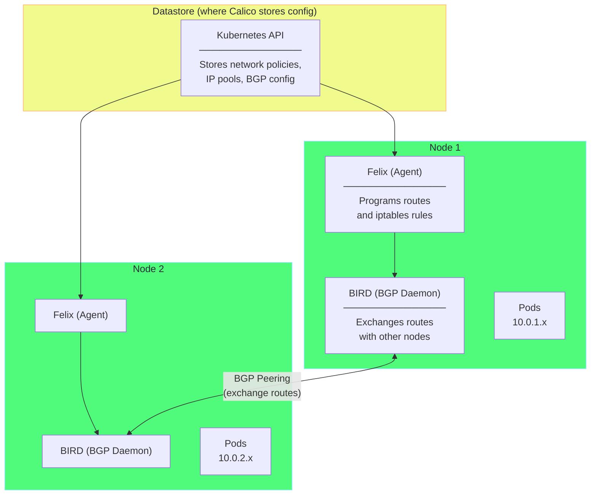
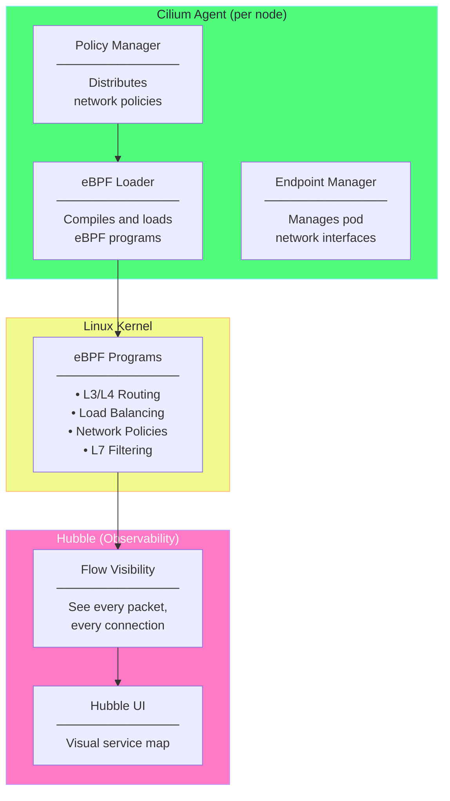
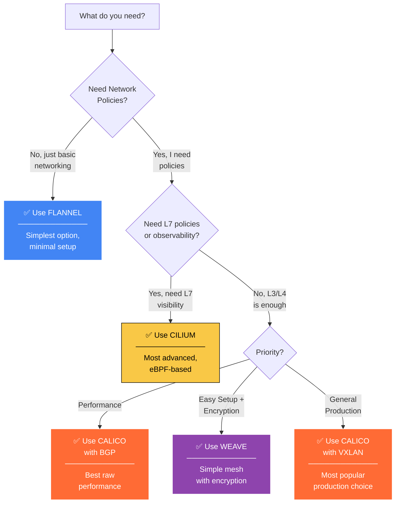

# Chapter 3: CNI Plugins Deep Dive 🔌

## Table of Contents

1. [Introduction](#introduction)
2. [Calico - The Production Standard](#calico---the-production-standard)
3. [Flannel - The Simple Choice](#flannel---the-simple-choice)
4. [Cilium - The eBPF Powerhouse](#cilium---the-ebpf-powerhouse)
5. [Weave Net - The Mesh Network](#weave-net---the-mesh-network)
6. [Comparison and Selection Guide](#comparison-and-selection-guide)
7. [Trying Different CNIs on Minikube](#trying-different-cnis-on-minikube)

---

## Introduction

### What is a CNI Plugin?

A **CNI plugin** is a program that implements the CNI specification to provide networking for containers. While CNI defines the "what" (the interface), plugins define the "how" (the implementation).

### Why So Many Plugins?

Different plugins make different trade-offs:

| Trade-off | One side | Other side |
|-----------|----------|------------|
| **Simplicity vs Features** | Flannel (simple) | Cilium (feature-rich) |
| **Ease of setup vs Performance** | Weave (easy) | Calico BGP (fast) |
| **Compatibility vs Innovation** | Flannel (works everywhere) | Cilium (needs modern kernel) |

### The Major Players

Here's a quick overview of the main CNI plugins you'll encounter:

```
┌─────────────────────────────────────────────────────────────────────┐
│                     CNI PLUGIN LANDSCAPE                             │
├─────────────────────────────────────────────────────────────────────┤
│                                                                      │
│  🐯 CALICO                                                          │
│     The most popular choice for production                          │
│     Uses BGP for routing (like internet routers!)                   │
│     Full network policy support                                      │
│                                                                      │
│  🟦 FLANNEL                                                         │
│     The simplest option                                              │
│     Just works, minimal configuration                                │
│     No network policies (pair with Calico for that)                 │
│                                                                      │
│  🐝 CILIUM                                                          │
│     The most advanced option                                         │
│     Uses eBPF (runs in kernel for speed)                            │
│     L7 (application layer) visibility                               │
│                                                                      │
│  🕸️ WEAVE                                                           │
│     The mesh network option                                          │
│     Built-in encryption                                              │
│     Great for multi-cloud                                           │
│                                                                      │
└─────────────────────────────────────────────────────────────────────┘
```

---

## Calico - The Production Standard

### What is Calico?

**Calico** is the most widely deployed CNI plugin in production Kubernetes clusters. It was created by Tigera and is now a CNCF project.

### Why is Calico Popular?

1. **Performance**: Uses BGP routing (no overlay = no overhead)
2. **Network Policies**: Full support for Kubernetes network policies
3. **Flexibility**: Works in any environment (cloud, on-prem, bare metal)
4. **Enterprise Support**: Commercial support available from Tigera

### How Calico Works

Unlike simpler CNIs that wrap packets in tunnels, Calico prefers to use **real routing** via BGP (Border Gateway Protocol) - the same protocol that powers the internet!

The following diagram shows Calico's architecture and components:



**Explanation of Components:**

| Component | What It Does |
|-----------|--------------|
| **Felix** | The agent on each node. It reads policy from the datastore and programs routes/iptables rules in the Linux kernel. |
| **BIRD** | A BGP daemon that exchanges routes with other nodes. It tells other nodes: "I can reach pods 10.0.1.x, send traffic to me!" |
| **confd** | Watches the datastore and updates BIRD's configuration when things change. |
| **calico-cni** | The actual CNI plugin that creates interfaces when pods are created. |

### Calico Networking Modes

Calico supports multiple networking modes. Here's when to use each:

#### Mode 1: BGP (No Overlay) - Best Performance

```
┌─────────────────────────────────────────────────────────────────────┐
│                    CALICO BGP MODE                                   │
│                                                                      │
│  How it works:                                                       │
│  • Each node advertises its pod CIDR via BGP                        │
│  • Network routers learn routes to pods                              │
│  • Traffic goes directly - no encapsulation!                         │
│                                                                      │
│  Node 1 ──► Router: "I have 10.0.1.0/24, send to me"               │
│  Node 2 ──► Router: "I have 10.0.2.0/24, send to me"               │
│                                                                      │
│  When Pod on Node 1 sends to Pod on Node 2:                         │
│  • Packet goes to router                                             │
│  • Router knows 10.0.2.x is on Node 2                               │
│  • Sends directly to Node 2                                          │
│  • NO WRAPPING, NO OVERHEAD                                          │
│                                                                      │
│  Requirements:                                                       │
│  ✗ Network must support BGP peering                                 │
│  ✗ More complex network setup                                        │
│                                                                      │
│  Benefits:                                                           │
│  ✓ Best possible performance (wire speed)                           │
│  ✓ Easy to debug (packets look normal)                              │
│  ✓ No MTU issues                                                     │
│                                                                      │
└─────────────────────────────────────────────────────────────────────┘
```

#### Mode 2: IPIP (IP-in-IP Overlay) - Default Mode

```
┌─────────────────────────────────────────────────────────────────────┐
│                    CALICO IPIP MODE                                  │
│                                                                      │
│  How it works:                                                       │
│  • Pod packets are wrapped inside another IP packet                  │
│  • Outer packet uses node IPs (which routers understand)            │
│  • Inner packet has pod IPs                                          │
│                                                                      │
│  Original packet:                                                    │
│  [Src: 10.0.1.5] [Dst: 10.0.2.10] [Data]                           │
│                                                                      │
│  After IPIP encapsulation:                                           │
│  ┌─────────────────────────────────────────────────────────────┐   │
│  │ Outer IP: [Src: 192.168.1.10] [Dst: 192.168.1.11]          │   │
│  │ Protocol: 4 (IPIP)                                          │   │
│  │ ┌───────────────────────────────────────────────────────┐  │   │
│  │ │ Inner IP: [Src: 10.0.1.5] [Dst: 10.0.2.10] [Data]    │  │   │
│  │ └───────────────────────────────────────────────────────┘  │   │
│  └─────────────────────────────────────────────────────────────┘   │
│                                                                      │
│  Overhead: 20 bytes (outer IP header)                               │
│                                                                      │
│  Requirements:                                                       │
│  ✓ Works on any network                                              │
│  ✓ No special router configuration                                  │
│                                                                      │
│  Trade-offs:                                                         │
│  ✗ Small performance overhead (20 bytes per packet)                 │
│  ✗ Protocol 4 might be blocked by some firewalls                    │
│                                                                      │
└─────────────────────────────────────────────────────────────────────┘
```

#### Mode 3: VXLAN - Most Compatible

```
┌─────────────────────────────────────────────────────────────────────┐
│                    CALICO VXLAN MODE                                 │
│                                                                      │
│  How it works:                                                       │
│  • Pod packets wrapped in UDP (port 4789)                           │
│  • Works through any network, even NAT                              │
│  • Most compatible option                                            │
│                                                                      │
│  Encapsulation layers:                                               │
│  [Outer Ethernet] [Outer IP] [UDP:4789] [VXLAN] [Inner Eth] [Packet]│
│                                                                      │
│  Overhead: 50 bytes                                                  │
│                                                                      │
│  When to use:                                                        │
│  ✓ Network blocks IPIP (protocol 4)                                 │
│  ✓ Need to traverse NAT                                             │
│  ✓ Cloud environments that limit protocols                          │
│                                                                      │
└─────────────────────────────────────────────────────────────────────┘
```

### Installing Calico on Minikube

```bash
# Start Minikube with Calico
minikube start --cni=calico

# Wait for Calico to be ready
kubectl wait --for=condition=ready pod -l k8s-app=calico-node -n kube-system --timeout=300s

# Verify Calico is running
kubectl get pods -n kube-system -l k8s-app=calico-node

# Check Calico version
kubectl exec -n kube-system -it $(kubectl get pod -n kube-system -l k8s-app=calico-node -o name | head -1) -c calico-node -- calico-node -v
```

---

## Flannel - The Simple Choice

### What is Flannel?

**Flannel** is the simplest and oldest CNI plugin. It was created by CoreOS (now part of Red Hat) and focuses on one thing: basic pod networking.

### Why Choose Flannel?

1. **Simplicity**: Minimal configuration, just works
2. **Lightweight**: Low resource usage
3. **Stability**: Battle-tested, very mature

### What Flannel Doesn't Do

⚠️ **Important Limitation**: Flannel does NOT support Kubernetes Network Policies. If you need policies, you must either:
- Use a different CNI (like Calico)
- Use Canal (Calico + Flannel combined)

### How Flannel Works

Flannel is simpler than Calico. It gives each node a subnet and uses VXLAN to send traffic between nodes:

```
┌─────────────────────────────────────────────────────────────────────┐
│                     HOW FLANNEL WORKS                                │
│                                                                      │
│  Step 1: Subnet Assignment                                           │
│  ─────────────────────────────                                       │
│  When a node joins, it gets a /24 subnet from the cluster CIDR      │
│                                                                      │
│  Cluster CIDR: 10.244.0.0/16                                        │
│    ├── Node 1 gets: 10.244.0.0/24 (256 IPs)                        │
│    ├── Node 2 gets: 10.244.1.0/24 (256 IPs)                        │
│    └── Node 3 gets: 10.244.2.0/24 (256 IPs)                        │
│                                                                      │
│  Step 2: flanneld Daemon                                             │
│  ─────────────────────────                                           │
│  Each node runs flanneld which:                                      │
│    • Watches for new nodes joining                                   │
│    • Updates local routing table                                     │
│    • Manages the VXLAN interface (flannel.1)                        │
│                                                                      │
│  Step 3: VXLAN Tunneling                                             │
│  ─────────────────────────                                           │
│  Cross-node traffic is encapsulated in UDP (port 8472)              │
│                                                                      │
│  Node 1 (192.168.1.10)                Node 2 (192.168.1.11)         │
│  ┌─────────────────────┐              ┌─────────────────────┐       │
│  │ Pod: 10.244.0.5     │              │ Pod: 10.244.1.10    │       │
│  │        │            │              │        ▲            │       │
│  │        ▼            │              │        │            │       │
│  │ flannel.1           │   VXLAN      │ flannel.1           │       │
│  │ (VXLAN interface)   │ ═══════════► │ (decapsulates)      │       │
│  │                     │   UDP:8472   │                     │       │
│  └─────────────────────┘              └─────────────────────┘       │
│                                                                      │
└─────────────────────────────────────────────────────────────────────┘
```

### Flannel Backend Options

Flannel supports different "backends" for cross-node communication:

| Backend | Description | When to Use |
|---------|-------------|-------------|
| **VXLAN** | Encapsulates in UDP (default) | Most environments, works everywhere |
| **host-gw** | Direct routing, no overlay | When all nodes are on same L2 network |
| **UDP** | Userspace encapsulation | Legacy, very slow, avoid |
| **IPIP** | IP-in-IP tunneling | Alternative to VXLAN |

### Installing Flannel on Minikube

```bash
# Start Minikube with Flannel
minikube start --cni=flannel

# Verify Flannel is running
kubectl get pods -n kube-system -l app=flannel

# View Flannel configuration
minikube ssh "cat /run/flannel/subnet.env"

# You'll see something like:
# FLANNEL_NETWORK=10.244.0.0/16
# FLANNEL_SUBNET=10.244.0.1/24
# FLANNEL_MTU=1450
```

---

## Cilium - The eBPF Powerhouse

### What is Cilium?

**Cilium** is the most advanced CNI plugin, using **eBPF** (extended Berkeley Packet Filter) technology. eBPF allows programs to run inside the Linux kernel, providing incredible performance and observability.

### Why Choose Cilium?

1. **Performance**: Bypasses iptables entirely using eBPF
2. **L7 Visibility**: Can see and filter HTTP, gRPC, Kafka, etc.
3. **Observability**: Built-in flow monitoring with Hubble
4. **Security**: Identity-based policies (not just IP-based)

### What is eBPF?

eBPF is a technology that lets you run custom programs inside the Linux kernel:

```
┌─────────────────────────────────────────────────────────────────────┐
│                         WHAT IS eBPF?                                │
│                                                                      │
│  Traditional Approach:                                               │
│  ┌────────────────────────────────────────────────────────────┐    │
│  │  User Space                                                 │    │
│  │  ┌──────────────────────────────────────────────────────┐ │    │
│  │  │  Application                                          │ │    │
│  │  └──────────────────────────────────────────────────────┘ │    │
│  └────────────────────────────────────────────────────────────┘    │
│                              │                                       │
│                    System calls (slow)                               │
│                              ▼                                       │
│  ┌────────────────────────────────────────────────────────────┐    │
│  │  Kernel Space                                               │    │
│  │  • iptables (can be slow with many rules)                  │    │
│  │  • Network stack                                            │    │
│  └────────────────────────────────────────────────────────────┘    │
│                                                                      │
│  eBPF Approach:                                                      │
│  ┌────────────────────────────────────────────────────────────┐    │
│  │  User Space                                                 │    │
│  │  ┌──────────────────────────────────────────────────────┐ │    │
│  │  │  Application                                          │ │    │
│  │  └──────────────────────────────────────────────────────┘ │    │
│  └────────────────────────────────────────────────────────────┘    │
│                              │                                       │
│                              ▼                                       │
│  ┌────────────────────────────────────────────────────────────┐    │
│  │  Kernel Space                                               │    │
│  │  ┌──────────────────────────────────────────────────────┐ │    │
│  │  │  eBPF Programs (custom kernel code!)                 │ │    │
│  │  │  • Routing done in kernel                             │ │    │
│  │  │  • No iptables needed                                 │ │    │
│  │  │  • Incredibly fast                                    │ │    │
│  │  └──────────────────────────────────────────────────────┘ │    │
│  └────────────────────────────────────────────────────────────┘    │
│                                                                      │
│  Benefits:                                                           │
│  ✓ Skip iptables entirely                                           │
│  ✓ Kernel-level performance                                         │
│  ✓ Can inspect L7 protocols (HTTP, gRPC)                            │
│  ✓ Rich observability built-in                                       │
│                                                                      │
└─────────────────────────────────────────────────────────────────────┘
```

### Cilium Architecture



**Component Explanation:**

| Component | What It Does |
|-----------|--------------|
| **Cilium Agent** | Runs on each node, manages eBPF programs and endpoints |
| **eBPF Programs** | Custom code running in kernel for routing/filtering |
| **Hubble** | Optional observability layer for visualizing traffic |
| **Cilium Operator** | Cluster-wide tasks like IP allocation |

### L7 (Application Layer) Visibility

One of Cilium's killer features is seeing inside HTTP, gRPC, and other protocols:

```
┌─────────────────────────────────────────────────────────────────────┐
│                    CILIUM L7 VISIBILITY                              │
│                                                                      │
│  Traditional CNI sees:                                               │
│  ┌───────────────────────────────────────────────────────────────┐ │
│  │  Pod A (10.0.1.5) ──────────► Pod B (10.0.1.6:80)            │ │
│  │                                                                │ │
│  │  That's it! Just IP addresses and ports.                      │ │
│  └───────────────────────────────────────────────────────────────┘ │
│                                                                      │
│  Cilium sees:                                                        │
│  ┌───────────────────────────────────────────────────────────────┐ │
│  │  Pod A ──► Pod B                                               │ │
│  │                                                                │ │
│  │  REQUEST:                                                      │ │
│  │  • HTTP Method: POST                                           │ │
│  │  • URL: /api/v1/users                                         │ │
│  │  • Headers: Authorization: Bearer xxxxx                       │ │
│  │                                                                │ │
│  │  RESPONSE:                                                     │ │
│  │  • Status: 201 Created                                        │ │
│  │  • Latency: 45ms                                              │ │
│  └───────────────────────────────────────────────────────────────┘ │
│                                                                      │
│  This enables:                                                       │
│  ✓ HTTP-aware network policies ("block POST to /admin")            │
│  ✓ API-level observability                                          │
│  ✓ Rate limiting per endpoint                                       │
│                                                                      │
└─────────────────────────────────────────────────────────────────────┘
```

### Installing Cilium on Minikube

```bash
# Start Minikube with Cilium
minikube start --cni=cilium

# Wait for Cilium to be ready
kubectl wait --for=condition=ready pod -l k8s-app=cilium -n kube-system --timeout=300s

# Check Cilium status
kubectl exec -n kube-system -it $(kubectl get pod -n kube-system -l k8s-app=cilium -o name | head -1) -- cilium status

# Enable Hubble for observability
kubectl apply -f https://raw.githubusercontent.com/cilium/cilium/main/install/kubernetes/quick-hubble-install.yaml

# Port-forward Hubble UI
kubectl port-forward -n kube-system svc/hubble-ui 12000:80
# Then open http://localhost:12000
```

---

## Weave Net - The Mesh Network

### What is Weave Net?

**Weave Net** creates a mesh network where every node can talk to every other node directly. It's known for being easy to set up and having built-in encryption.

### Why Choose Weave Net?

1. **Easy Setup**: Just deploy and it works
2. **Built-in Encryption**: Traffic encrypted by default (NaCl crypto)
3. **Multi-cloud**: Works great across different cloud providers
4. **No External Dependencies**: No need for etcd or other databases

### How Weave Works

```
┌─────────────────────────────────────────────────────────────────────┐
│                     WEAVE MESH NETWORK                               │
│                                                                      │
│  Every node connects to every other node (mesh topology):           │
│                                                                      │
│                     ┌──────────┐                                     │
│                     │  Node 1  │                                     │
│                     │  ┌────┐  │                                     │
│                     │  │Pods│  │                                     │
│                     └────┼─────┘                                     │
│                    ╱     │     ╲                                     │
│                   ╱      │      ╲                                    │
│                  ╱       │       ╲                                   │
│      ┌──────────┐        │        ┌──────────┐                      │
│      │  Node 2  │        │        │  Node 3  │                      │
│      │  ┌────┐  │────────┼────────│  ┌────┐  │                      │
│      │  │Pods│  │        │        │  │Pods│  │                      │
│      └──────────┘        │        └──────────┘                      │
│                  ╲       │       ╱                                   │
│                   ╲      │      ╱                                    │
│                    ╲     │     ╱                                     │
│                     ┌────┼─────┐                                     │
│                     │  Node 4  │                                     │
│                     │  ┌────┐  │                                     │
│                     │  │Pods│  │                                     │
│                     └──────────┘                                     │
│                                                                      │
│  Features:                                                           │
│  ✓ Automatic peer discovery                                          │
│  ✓ Encrypted by default                                              │
│  ✓ Works across cloud boundaries                                     │
│  ✓ Self-healing mesh                                                 │
│                                                                      │
└─────────────────────────────────────────────────────────────────────┘
```

---

## Comparison and Selection Guide

### Feature Comparison Table

| Feature | Calico | Flannel | Cilium | Weave |
|---------|--------|---------|--------|-------|
| **Setup Complexity** | Medium | Easy | Hard | Easy |
| **Performance** | ⭐⭐⭐⭐⭐ | ⭐⭐⭐ | ⭐⭐⭐⭐⭐ | ⭐⭐⭐ |
| **Network Policies** | ✅ Full | ❌ No | ✅ L3-L7 | ✅ Basic |
| **L7 Visibility** | ❌ No | ❌ No | ✅ Yes | ❌ No |
| **Encryption** | ✅ WireGuard | ❌ No | ✅ IPsec | ✅ Built-in |
| **Kernel Requirements** | Standard | Standard | 4.9+ (5.x best) | Standard |
| **Enterprise Support** | Tigera | None | Isovalent | Weaveworks |

### Decision Flowchart

This flowchart helps you choose the right CNI based on your needs:



### Quick Recommendations

| Use Case | Recommended CNI | Why |
|----------|-----------------|-----|
| **Learning/Development** | Flannel | Simple, no fuss |
| **Production (General)** | Calico | Proven, full features |
| **High Security** | Cilium | L7 policies, identity-based |
| **Multi-cloud** | Weave | Easy cross-cloud mesh |
| **Maximum Performance** | Calico BGP | No overlay overhead |
| **Observability Focus** | Cilium + Hubble | Built-in flow visibility |

---

## Trying Different CNIs on Minikube

### Test Script

Here's how to try different CNIs on Minikube:

```bash
#!/bin/bash
# Test different CNI plugins on Minikube

# Test Flannel
echo "=== Testing Flannel ==="
minikube delete
minikube start --cni=flannel
kubectl wait --for=condition=ready pod -l app=flannel -n kube-system --timeout=120s
kubectl create deployment nginx --image=nginx
sleep 5
kubectl get pods -o wide

# Test Calico
echo "=== Testing Calico ==="
minikube delete
minikube start --cni=calico
kubectl wait --for=condition=ready pod -l k8s-app=calico-node -n kube-system --timeout=300s
kubectl create deployment nginx --image=nginx
sleep 5
kubectl get pods -o wide

# Test Cilium
echo "=== Testing Cilium ==="
minikube delete
minikube start --cni=cilium
kubectl wait --for=condition=ready pod -l k8s-app=cilium -n kube-system --timeout=300s
kubectl create deployment nginx --image=nginx
sleep 5
kubectl get pods -o wide
```

---

## Key Takeaways

> [!IMPORTANT]
> **Remember these key points about CNI Plugins:**
> 
> 1. **Calico** = Production standard, BGP-based, full network policies
> 2. **Flannel** = Simplest option, no policies, great for learning
> 3. **Cilium** = Most advanced, eBPF, L7 visibility and policies
> 4. **Weave** = Easy mesh network with built-in encryption
> 5. **Match your needs** - Not every cluster needs the most advanced option

---

## What's Next?

Now that you understand the different CNI plugins, let's dive into how pod networking actually works at the Linux level:

**[Chapter 4: Pod Networking Internals →](04-pod-networking-internals.md)**

You'll learn:
- Network namespaces in detail
- How veth pairs work
- Linux bridges and packet flow
- iptables rules for Kubernetes
