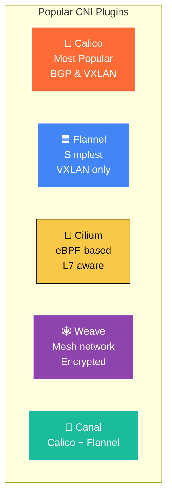
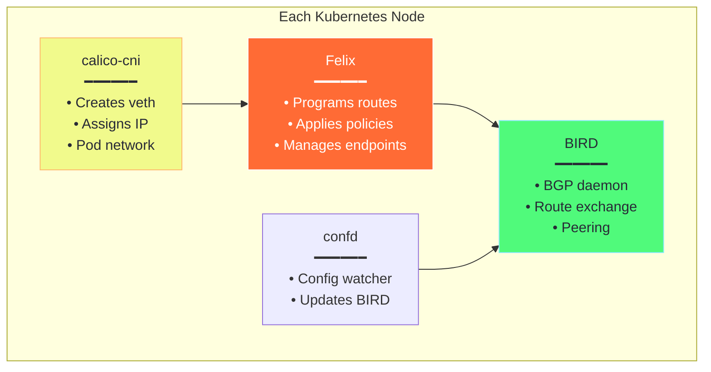
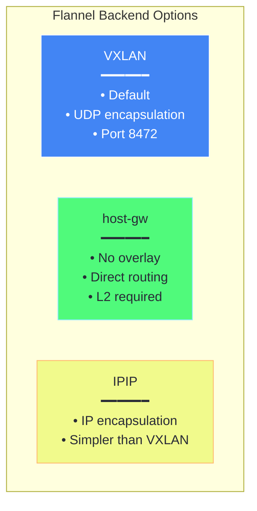
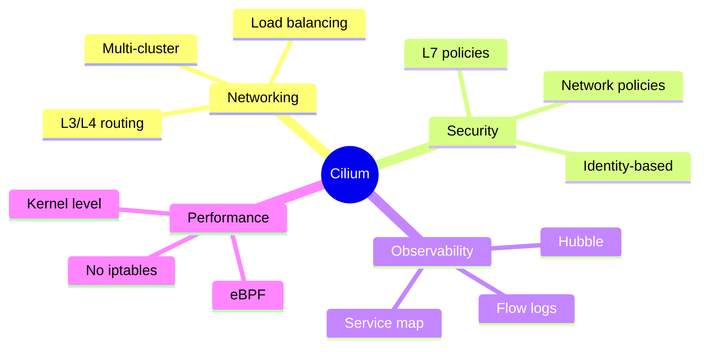
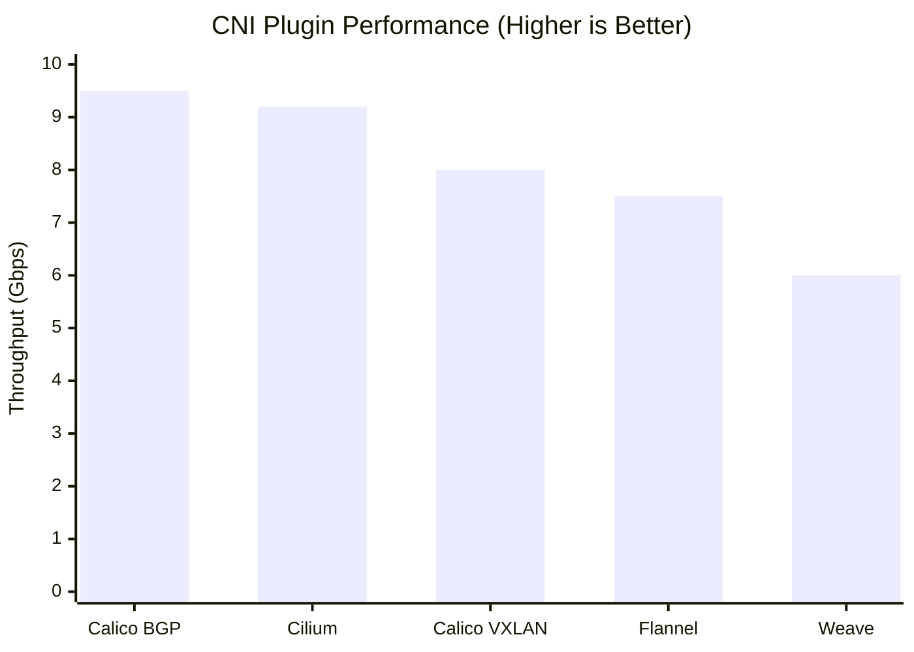
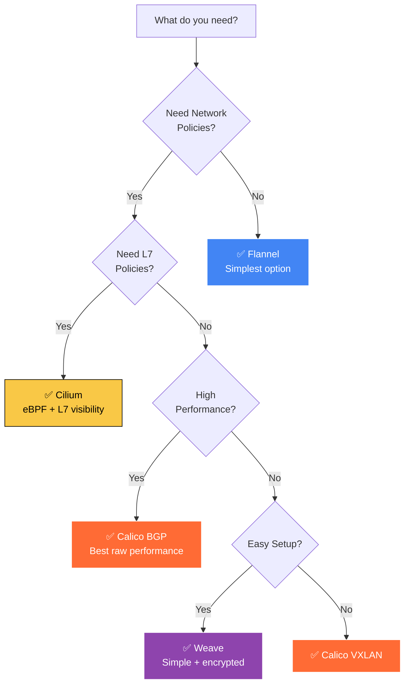

# Chapter 3: CNI Plugins Deep Dive 🔌

## Table of Contents

1. [Plugin Overview](#plugin-overview)
2. [Calico](#calico)
3. [Flannel](#flannel)
4. [Cilium](#cilium)
5. [Weave Net](#weave-net)
6. [Comparison Matrix](#comparison-matrix)
7. [Choosing the Right Plugin](#choosing-the-right-plugin)

---

## Plugin Overview

### CNI Plugin Landscape



---

## Calico

### Overview

Calico is the most widely deployed CNI plugin for production Kubernetes. It uses BGP (Border Gateway Protocol) for routing.

### Architecture

```
┌─────────────────────────────────────────────────────────────────────────┐
│                         CALICO ARCHITECTURE                              │
├─────────────────────────────────────────────────────────────────────────┤
│                                                                          │
│  ┌─────────────────────────────────────────────────────────────────┐   │
│  │                        DATASTORE                                 │   │
│  │         (Kubernetes API Server or etcd)                         │   │
│  │  Stores: Network policies, IP pools, BGP config                 │   │
│  └────────────────────────────┬────────────────────────────────────┘   │
│                               │                                         │
│         ┌─────────────────────┼─────────────────────┐                  │
│         │                     │                     │                  │
│         ▼                     ▼                     ▼                  │
│  ┌──────────────┐     ┌──────────────┐     ┌──────────────┐          │
│  │    Node 1    │     │    Node 2    │     │    Node 3    │          │
│  │  ┌────────┐  │     │  ┌────────┐  │     │  ┌────────┐  │          │
│  │  │ Felix  │  │     │  │ Felix  │  │     │  │ Felix  │  │          │
│  │  │ Agent  │  │     │  │ Agent  │  │     │  │ Agent  │  │          │
│  │  └────┬───┘  │     │  └────┬───┘  │     │  └────┬───┘  │          │
│  │       │      │     │       │      │     │       │      │          │
│  │  ┌────┴───┐  │     │  ┌────┴───┐  │     │  ┌────┴───┐  │          │
│  │  │ BIRD   │  │     │  │ BIRD   │  │     │  │ BIRD   │  │          │
│  │  │ (BGP)  │◄─┼─────┼──┤ (BGP)  │◄─┼─────┼──│ (BGP)  │  │          │
│  │  └────────┘  │     │  └────────┘  │     │  └────────┘  │          │
│  └──────────────┘     └──────────────┘     └──────────────┘          │
│                                                                          │
└─────────────────────────────────────────────────────────────────────────┘

Components:
• Felix: Programs routes, network policies to kernel
• BIRD: BGP daemon, exchanges routes between nodes
• confd: Watches datastore, updates BIRD config
• CNI Plugin: Configures pod network at creation
```

### Calico Components



### Calico Network Modes

| Mode | Description | Use Case |
|------|-------------|----------|
| **BGP** | No overlay, native routing | Best performance, requires L3 fabric |
| **VXLAN** | Encapsulation over UDP | Works anywhere, slight overhead |
| **IPIP** | IP-in-IP tunneling | Simpler than VXLAN, good default |

### Calico YAML Example

```yaml
# Install Calico on Minikube
# minikube start --cni=calico

# Verify Calico is running
# kubectl get pods -n kube-system -l k8s-app=calico-node

---
# Calico IPPool configuration example
apiVersion: projectcalico.org/v3
kind: IPPool
metadata:
  name: default-ipv4-ippool
spec:
  cidr: 10.0.0.0/16
  ipipMode: Always
  natOutgoing: true
  nodeSelector: all()
```

---

## Flannel

### Overview

Flannel is the simplest CNI plugin. It only provides basic connectivity without network policies.

### Architecture

```
┌─────────────────────────────────────────────────────────────────────────┐
│                         FLANNEL ARCHITECTURE                             │
├─────────────────────────────────────────────────────────────────────────┤
│                                                                          │
│  ┌─────────────────────────────────────────────────────────────────┐   │
│  │                 etcd / Kubernetes API                            │   │
│  │    Stores subnet assignments for each node                       │   │
│  └────────────────────────────┬────────────────────────────────────┘   │
│                               │                                         │
│         ┌─────────────────────┼─────────────────────┐                  │
│         ▼                     ▼                     ▼                  │
│  ┌──────────────┐     ┌──────────────┐     ┌──────────────┐          │
│  │    Node 1    │     │    Node 2    │     │    Node 3    │          │
│  │              │     │              │     │              │          │
│  │  Subnet:     │     │  Subnet:     │     │  Subnet:     │          │
│  │  10.0.1.0/24 │     │  10.0.2.0/24 │     │  10.0.3.0/24 │          │
│  │              │     │              │     │              │          │
│  │  ┌────────┐  │     │  ┌────────┐  │     │  ┌────────┐  │          │
│  │  │flanneld│  │     │  │flanneld│  │     │  │flanneld│  │          │
│  │  └────────┘  │     │  └────────┘  │     │  └────────┘  │          │
│  │       │      │     │       │      │     │       │      │          │
│  │  ┌────┴───┐  │     │  ┌────┴───┐  │     │  ┌────┴───┐  │          │
│  │  │flannel.│◄─┼─VXLAN┼─►│flannel.│◄─┼─VXLAN┼─►flannel.│  │          │
│  │  │  1     │  │     │  │  1     │  │     │  │  1     │  │          │
│  │  └────────┘  │     │  └────────┘  │     │  └────────┘  │          │
│  └──────────────┘     └──────────────┘     └──────────────┘          │
│                                                                          │
└─────────────────────────────────────────────────────────────────────────┘

Key Points:
• Each node gets a /24 subnet from the cluster CIDR
• flanneld watches for new nodes, updates routes
• flannel.1 is a VXLAN interface for cross-node traffic
• Simple but no network policy support
```

### Flannel Backends



---

## Cilium

### Overview

Cilium uses eBPF (extended Berkeley Packet Filter) for high-performance networking and observability.

### Architecture

```
┌─────────────────────────────────────────────────────────────────────────┐
│                         CILIUM ARCHITECTURE                              │
├─────────────────────────────────────────────────────────────────────────┤
│                                                                          │
│  ┌─────────────────────────────────────────────────────────────────┐   │
│  │                     LINUX KERNEL                                 │   │
│  │  ┌───────────────────────────────────────────────────────────┐  │   │
│  │  │                    eBPF PROGRAMS                          │  │   │
│  │  │                                                            │  │   │
│  │  │  ┌──────────┐ ┌──────────┐ ┌──────────┐ ┌──────────┐    │  │   │
│  │  │  │ Routing  │ │ Load     │ │ Network  │ │ L7       │    │  │   │
│  │  │  │ L3/L4    │ │ Balancer │ │ Policies │ │ Policies │    │  │   │
│  │  │  └──────────┘ └──────────┘ └──────────┘ └──────────┘    │  │   │
│  │  │                                                            │  │   │
│  │  └───────────────────────────────────────────────────────────┘  │   │
│  └─────────────────────────────────────────────────────────────────┘   │
│                                   ▲                                     │
│                                   │                                     │
│  ┌────────────────────────────────┴────────────────────────────────┐   │
│  │                      CILIUM AGENT                                │   │
│  │                                                                  │   │
│  │  • Compiles and loads eBPF programs                             │   │
│  │  • Manages endpoints (pods)                                     │   │
│  │  • Distributes policies                                          │   │
│  │  • Identity management                                           │   │
│  └──────────────────────────────────────────────────────────────────┘   │
│                                   │                                     │
│  ┌────────────────────────────────┴────────────────────────────────┐   │
│  │                        HUBBLE                                    │   │
│  │           Network observability and flow visibility             │   │
│  └──────────────────────────────────────────────────────────────────┘   │
│                                                                          │
└─────────────────────────────────────────────────────────────────────────┘

Advantages:
• Bypasses iptables entirely (faster)
• L7 protocol visibility (HTTP, gRPC, Kafka)
• Identity-based security (not just IP-based)
• Built-in observability with Hubble
```

### Cilium Features



### Cilium on Minikube

```bash
# Start Minikube with Cilium
minikube start --cni=cilium

# Verify Cilium is running
kubectl get pods -n kube-system -l k8s-app=cilium

# Install Hubble CLI for observability
export HUBBLE_VERSION=$(curl -s https://raw.githubusercontent.com/cilium/hubble/master/stable.txt)
curl -L --remote-name-all https://github.com/cilium/hubble/releases/download/$HUBBLE_VERSION/hubble-linux-amd64.tar.gz
tar xzvf hubble-linux-amd64.tar.gz
sudo mv hubble /usr/local/bin/

# Enable Hubble
cilium hubble enable

# View network flows
hubble observe
```

---

## Weave Net

### Overview

Weave creates a mesh network between all nodes with built-in encryption.

### Architecture

```
┌─────────────────────────────────────────────────────────────────────────┐
│                         WEAVE NET ARCHITECTURE                           │
├─────────────────────────────────────────────────────────────────────────┤
│                                                                          │
│  ┌──────────────┐     ┌──────────────┐     ┌──────────────┐            │
│  │    Node 1    │     │    Node 2    │     │    Node 3    │            │
│  │              │     │              │     │              │            │
│  │  ┌────────┐  │     │  ┌────────┐  │     │  ┌────────┐  │            │
│  │  │ weave  │◄─┼─────┼──│ weave  │◄─┼─────┼──│ weave  │  │            │
│  │  │ router │──┼─────┼──│ router │──┼─────┼──│ router │  │            │
│  │  └────────┘  │     │  └────────┘  │     │  └────────┘  │            │
│  │       │      │     │       │      │     │       │      │            │
│  │  ┌────┴───┐  │     │  ┌────┴───┐  │     │  ┌────┴───┐  │            │
│  │  │ weave  │  │     │  │ weave  │  │     │  │ weave  │  │            │
│  │  │ bridge │  │     │  │ bridge │  │     │  │ bridge │  │            │
│  │  └────────┘  │     │  └────────┘  │     │  └────────┘  │            │
│  │   │ │ │ │    │     │   │ │ │ │    │     │   │ │ │ │    │            │
│  │  Pods...     │     │  Pods...     │     │  Pods...     │            │
│  └──────────────┘     └──────────────┘     └──────────────┘            │
│                                                                          │
│  Full mesh: Every node connects to every other node                      │
│  Built-in encryption using NaCl                                          │
│  Automatic peer discovery                                                │
│                                                                          │
└─────────────────────────────────────────────────────────────────────────┘
```

---

## Comparison Matrix

### Feature Comparison

| Feature | Calico | Flannel | Cilium | Weave |
|---------|--------|---------|--------|-------|
| **Network Policies** | ✅ Full | ❌ No | ✅ L3-L7 | ✅ Basic |
| **Encryption** | ✅ WireGuard | ❌ No | ✅ IPsec/WG | ✅ Built-in |
| **Performance** | ⭐⭐⭐⭐⭐ | ⭐⭐⭐ | ⭐⭐⭐⭐⭐ | ⭐⭐⭐ |
| **Complexity** | Medium | Low | High | Low |
| **Observability** | Good | Basic | Excellent | Good |
| **L7 Policies** | ❌ No | ❌ No | ✅ Yes | ❌ No |
| **Multi-cluster** | ✅ Yes | ❌ No | ✅ Yes | ✅ Yes |

### Performance Comparison



---

## Choosing the Right Plugin

### Decision Flowchart



### Recommendations by Use Case

| Use Case | Recommended CNI |
|----------|-----------------|
| **Development/Learning** | Flannel or Minikube default |
| **Production (General)** | Calico |
| **High Security** | Cilium (L7 policies) |
| **Multi-cloud** | Weave or Calico |
| **High Performance** | Calico with BGP |
| **Observability Focus** | Cilium with Hubble |

---

## Key Takeaways

> [!IMPORTANT]
> 1. **Calico** is the production standard - use for most cases
> 2. **Flannel** is simplest - good for learning, no policies
> 3. **Cilium** is most advanced - eBPF, L7, observability
> 4. **Weave** is easy with encryption - good for multi-cloud
> 5. **Match your needs** - not every cluster needs the most advanced option

---

**[Next: Chapter 4 - Pod Networking Internals →](04-pod-networking-internals.md)**
