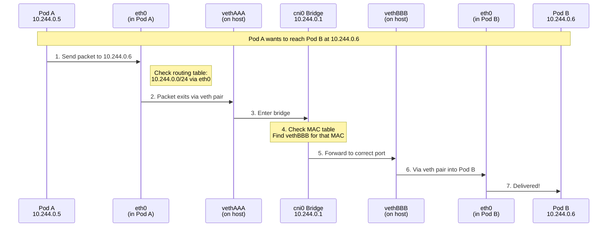

# Chapter 4: Pod Networking Internals 🔧

## Table of Contents

1. [Introduction](#introduction)
2. [Network Namespaces](#network-namespaces)
3. [Virtual Ethernet (veth) Pairs](#virtual-ethernet-veth-pairs)
4. [Linux Bridge Networking](#linux-bridge-networking)
5. [Routing and IP Tables](#routing-and-ip-tables)
6. [Complete Packet Journey](#complete-packet-journey)
7. [Hands-on Exploration](#hands-on-exploration)

---

## Introduction

This chapter takes you inside the Linux networking that makes Kubernetes pod communication work. By the end, you'll understand exactly how a packet travels from one pod to another.

### Why Learn This?

Understanding pod networking internals helps you:
- **Debug network issues** faster
- **Optimize performance** by knowing what's happening
- **Pass CKA/CKAD exams** which test this knowledge
- **Impress in interviews** with deep technical knowledge

### The Building Blocks

Pod networking in Linux uses these key components:

| Component | What It Is | Analogy |
|-----------|------------|---------|
| **Network Namespace** | Isolated network stack | A private apartment |
| **veth Pair** | Virtual cable | A phone line connecting apartments |
| **Bridge** | Virtual switch | The building's phone switchboard |
| **Routes** | Path instructions | An address book |
| **iptables** | Firewall rules | Security guards |

---

## Network Namespaces

### What is a Network Namespace?

A **network namespace** is a Linux feature that creates a completely isolated copy of the network stack. Each namespace has its own:

- Network interfaces (eth0, lo, etc.)
- IP addresses
- Routing tables
- iptables rules
- Port numbers

### Real-World Analogy

Think of network namespaces like apartments in a building:

```
┌─────────────────────────────────────────────────────────────────────┐
│                  NETWORK NAMESPACES EXPLAINED                        │
│                                                                      │
│  Without namespaces (everyone shares one network):                   │
│  ┌───────────────────────────────────────────────────────────────┐ │
│  │  Single shared network                                         │ │
│  │                                                                 │ │
│  │  App A wants port 80  ──┬── CONFLICT! Both can't use 80       │ │
│  │  App B wants port 80  ──┘                                      │ │
│  │                                                                 │ │
│  └───────────────────────────────────────────────────────────────┘ │
│                                                                      │
│  With namespaces (each app gets its own network):                   │
│  ┌────────────────────────┐    ┌────────────────────────┐          │
│  │  Namespace 1 (Pod A)   │    │  Namespace 2 (Pod B)   │          │
│  │                        │    │                        │          │
│  │  eth0: 10.244.0.5     │    │  eth0: 10.244.0.6     │          │
│  │  Port 80: ✓ Available │    │  Port 80: ✓ Available │          │
│  │                        │    │                        │          │
│  │  No conflict! Each    │    │  Each namespace is    │          │
│  │  has its own network! │    │  completely isolated! │          │
│  └────────────────────────┘    └────────────────────────┘          │
│                                                                      │
│  Like apartments - each has its own address and doorbell!           │
│                                                                      │
└─────────────────────────────────────────────────────────────────────┘
```

### What Each Namespace Contains

Every pod's network namespace has these components:

```
┌─────────────────────────────────────────────────────────────────────┐
│              INSIDE A POD'S NETWORK NAMESPACE                        │
│                                                                      │
│  Pod: nginx-abc123                                                   │
│  Namespace: cni-12345-67890-abcde                                   │
│                                                                      │
│  ┌──────────────────────────────────────────────────────────────┐  │
│  │  INTERFACES:                                                  │  │
│  │  ┌──────────────────────────────────────────────────────┐   │  │
│  │  │  lo (loopback): 127.0.0.1                            │   │  │
│  │  │  eth0 (main interface): 10.244.0.5/24               │   │  │
│  │  └──────────────────────────────────────────────────────┘   │  │
│  │                                                               │  │
│  │  ROUTING TABLE:                                               │  │
│  │  ┌──────────────────────────────────────────────────────┐   │  │
│  │  │  default via 10.244.0.1 dev eth0       (gateway)    │   │  │
│  │  │  10.244.0.0/24 dev eth0                (local net)  │   │  │
│  │  └──────────────────────────────────────────────────────┘   │  │
│  │                                                               │  │
│  │  PORTS (example):                                             │  │
│  │  ┌──────────────────────────────────────────────────────┐   │  │
│  │  │  :80 (nginx)                                         │   │  │
│  │  │  :443 (nginx ssl) - if configured                    │   │  │
│  │  └──────────────────────────────────────────────────────┘   │  │
│  │                                                               │  │
│  │  IPTABLES: (own set of firewall rules)                       │  │
│  │                                                               │  │
│  └──────────────────────────────────────────────────────────────┘  │
│                                                                      │
│  Important: These are COMPLETELY SEPARATE from the host's!          │
│  The pod can't see the host's eth0 or other pods' interfaces.      │
│                                                                      │
└─────────────────────────────────────────────────────────────────────┘
```

### Exploring Namespaces in Minikube

Here's how to see network namespaces on a Kubernetes node:

> [!NOTE]
> Modern container runtimes (containerd, CRI-O) don't create named namespaces in `/var/run/netns/`. 
> The command `ip netns list` may return empty even when pods are running. Use the methods below instead.

```bash
# SSH into Minikube
minikube ssh

# Method 1: Use lsns to list all network namespaces (RECOMMENDED)
sudo lsns -t net

# You'll see output like:
#         NS TYPE NPROCS   PID USER    COMMAND
# 4026531992 net     100     1 root    /sbin/init
# 4026532285 net       2  1234 65535   /pause      <-- Pod namespace!
# 4026532356 net       2  5678 65535   /pause      <-- Another pod!

# Method 2: Enter a pod's network namespace using nsenter
# First, find a container's PID
POD_PID=$(sudo crictl inspect $(sudo crictl ps -q | head -1) 2>/dev/null | grep '"pid":' | head -1 | awk '{print $2}' | tr -d ',')

# Enter that namespace and run commands
sudo nsenter -t $POD_PID -n ip addr show
sudo nsenter -t $POD_PID -n ip route show
sudo nsenter -t $POD_PID -n ss -tlnp

# Method 3: Use crictl to find container network info
sudo crictl ps                              # List containers
sudo crictl inspect <container-id>          # Get details including namespace

# Method 4: If ip netns works (some CNIs create named namespaces)
sudo ip netns list
# If this shows namespaces like cni-xxx, you can use:
sudo ip netns exec <namespace-name> ip addr show
```

---

## Virtual Ethernet (veth) Pairs

### What is a veth Pair?

A **veth pair** is a pair of virtual network interfaces connected together like a virtual cable. Whatever goes in one end comes out the other.

### Why veth Pairs Are Needed

The problem: A pod's network namespace is isolated - it can't see anything outside. How do we connect it to the network?

The solution: veth pairs! One end goes in the pod's namespace, the other stays in the host namespace.

```
┌─────────────────────────────────────────────────────────────────────┐
│                      VETH PAIR EXPLAINED                             │
│                                                                      │
│  Think of a veth pair as a virtual network cable:                   │
│                                                                      │
│  ┌────────────────────────────────────────────────────────────────┐│
│  │                                                                 ││
│  │   Pod Namespace              │       Host Namespace             ││
│  │   (isolated)                 │       (connected)               ││
│  │                              │                                  ││
│  │   ┌──────────────┐          │       ┌──────────────┐          ││
│  │   │    eth0      │◄─────────┼───────│   vethXXX   │          ││
│  │   │  10.244.0.5  │  veth    │       │  (no IP)    │          ││
│  │   └──────────────┘  pair    │       └──────┬───────┘          ││
│  │                     (cable) │              │                   ││
│  │                              │              ▼                   ││
│  │                              │       ┌──────────────┐          ││
│  │                              │       │  cni0 bridge │          ││
│  │                              │       │  10.244.0.1  │          ││
│  │                              │       └──────────────┘          ││
│  │                                                                 ││
│  └────────────────────────────────────────────────────────────────┘│
│                                                                      │
│  Key points:                                                         │
│  • eth0 (in pod) and vethXXX (on host) are two ends of same cable │
│  • Traffic entering eth0 exits via vethXXX, and vice versa         │
│  • vethXXX is attached to the cni0 bridge (virtual switch)         │
│                                                                      │
└─────────────────────────────────────────────────────────────────────┘
```

### How veth Pairs Are Created

When CNI creates a pod's network, here's what happens step by step:

```
┌─────────────────────────────────────────────────────────────────────┐
│                    VETH PAIR CREATION PROCESS                        │
│                                                                      │
│  Step 1: Create veth pair (both ends start in host namespace)       │
│  ─────────────────────────────────────────────────────────────────  │
│           Command: ip link add veth0 type veth peer name vethXXX   │
│                                                                      │
│    Host Namespace:                                                   │
│    ┌───────────────────────────────────────────────────────────┐   │
│    │   veth0 ◄──────────────────────────────────► vethXXX      │   │
│    │   (will go to pod)                           (stays here) │   │
│    └───────────────────────────────────────────────────────────┘   │
│                                                                      │
│  Step 2: Move one end into pod's namespace                          │
│  ─────────────────────────────────────────────────────────────────  │
│           Command: ip link set veth0 netns <pod-netns>             │
│                                                                      │
│    Pod Namespace:                     Host Namespace:               │
│    ┌──────────────────┐               ┌──────────────────┐         │
│    │   veth0          │◄──────────────│     vethXXX      │         │
│    └──────────────────┘               └──────────────────┘         │
│                          virtual cable                              │
│                                                                      │
│  Step 3: Rename veth0 to eth0 and configure it                      │
│  ─────────────────────────────────────────────────────────────────  │
│           Inside pod namespace:                                      │
│           ip link set veth0 name eth0                               │
│           ip addr add 10.244.0.5/24 dev eth0                       │
│           ip link set eth0 up                                       │
│                                                                      │
│    Pod Namespace:                     Host Namespace:               │
│    ┌──────────────────┐               ┌──────────────────┐         │
│    │   eth0           │◄──────────────│     vethXXX      │         │
│    │   10.244.0.5     │               │     (no IP)      │         │
│    └──────────────────┘               └──────────────────┘         │
│                                                                      │
│  Step 4: Attach host end to the bridge                              │
│  ─────────────────────────────────────────────────────────────────  │
│           Command: ip link set vethXXX master cni0                 │
│           Command: ip link set vethXXX up                          │
│                                                                      │
│    Pod Namespace:           │       Host Namespace:                 │
│    ┌─────────────┐          │       ┌─────────────┐                │
│    │    eth0     │◄─────────┼───────│   vethXXX   │                │
│    │  10.244.0.5 │          │       └──────┬──────┘                │
│    └─────────────┘          │              │                        │
│                              │              ▼                        │
│                              │       ┌─────────────┐                │
│                              │       │ cni0 bridge │                │
│                              │       │  10.244.0.1 │                │
│                              │       └─────────────┘                │
│                                                                      │
│  Done! Pod can now communicate through the bridge!                  │
│                                                                      │
└─────────────────────────────────────────────────────────────────────┘
```

### Viewing veth Pairs

```bash
# SSH into Minikube
minikube ssh

# List all veth interfaces on the host
ip link show type veth

# You'll see something like:
# 5: vethd8f9e2c7@if2: <BROADCAST,MULTICAST,UP,LOWER_UP> ...
# 7: veth3a4b5c6d@if2: <BROADCAST,MULTICAST,UP,LOWER_UP> ...

# The @if2 shows it's paired with interface index 2 (in a namespace)

# Find which pod a veth belongs to:
# First, get the interface index from inside the pod
kubectl exec <pod-name> -- cat /sys/class/net/eth0/iflink
# This returns a number like "5"

# Then find interface 5 on the host
minikube ssh "ip link | grep ^5:"
```

---

## Linux Bridge Networking

### What is a Linux Bridge?

A **Linux bridge** is a virtual Layer 2 switch. It connects multiple network interfaces together and forwards traffic between them based on MAC addresses.

### Why Bridges Are Used

All pods on a node need to talk to each other. Instead of connecting each pod directly to every other pod (which would be complex), we use a bridge:

```
┌─────────────────────────────────────────────────────────────────────┐
│                      LINUX BRIDGE EXPLAINED                          │
│                                                                      │
│  Without a bridge (messy, doesn't scale):                           │
│  ┌───────────────────────────────────────────────────────────────┐ │
│  │   Pod A  ◄────────────────────────────────────►  Pod B        │ │
│  │     │                                              │          │ │
│  │     └──────────────►  Pod C  ◄─────────────────────┘          │ │
│  │               (n*(n-1)/2 connections needed!)                 │ │
│  └───────────────────────────────────────────────────────────────┘ │
│                                                                      │
│  With a bridge (simple, scales well):                               │
│  ┌───────────────────────────────────────────────────────────────┐ │
│  │                                                                │ │
│  │   Pod A ───────┐                                               │ │
│  │                │                                               │ │
│  │   Pod B ───────┼──────► cni0 bridge ◄────── Host routing      │ │
│  │                │           │                                   │ │
│  │   Pod C ───────┘           │                                   │ │
│  │                            │                                   │ │
│  │                     (just n connections!)                     │ │
│  └───────────────────────────────────────────────────────────────┘ │
│                                                                      │
│  The bridge acts like a switch - it learns which MAC address       │
│  is on which port and forwards traffic efficiently.                │
│                                                                      │
└─────────────────────────────────────────────────────────────────────┘
```

### How the Bridge Works

The bridge maintains a **MAC address table** (also called FDB - Forwarding DataBase):

```
┌─────────────────────────────────────────────────────────────────────┐
│                    BRIDGE MAC LEARNING                               │
│                                                                      │
│  When Pod A sends a packet:                                          │
│                                                                      │
│  Step 1: Packet arrives at bridge with source MAC = AA:AA:AA:..    │
│  Step 2: Bridge records: "AA:AA:AA is on port vethAAA"             │
│  Step 3: Bridge checks destination MAC                              │
│          - If known: forward to that specific port                  │
│          - If unknown: flood to all ports (except source)          │
│                                                                      │
│  Bridge MAC Table (FDB):                                             │
│  ┌────────────────────────────────────────────────────────────────┐│
│  │  MAC Address          │  Port       │  Age                     ││
│  │  ──────────────────────────────────────────────────────────── ││
│  │  AA:AA:AA:11:22:33    │  vethAAA    │  5 seconds               ││
│  │  BB:BB:BB:44:55:66    │  vethBBB    │  12 seconds              ││
│  │  CC:CC:CC:77:88:99    │  vethCCC    │  3 seconds               ││
│  └────────────────────────────────────────────────────────────────┘│
│                                                                      │
│  This allows the bridge to forward traffic efficiently              │
│  without broadcasting every packet.                                 │
│                                                                      │
└─────────────────────────────────────────────────────────────────────┘
```

### The Bridge as Gateway

The cni0 bridge also has an IP address and acts as the default gateway for all pods:

```
┌─────────────────────────────────────────────────────────────────────┐
│                    BRIDGE AS GATEWAY                                 │
│                                                                      │
│  Node:                                                               │
│  ┌────────────────────────────────────────────────────────────────┐│
│  │                                                                 ││
│  │  ┌──────────┐  ┌──────────┐  ┌──────────┐                     ││
│  │  │  Pod A   │  │  Pod B   │  │  Pod C   │                     ││
│  │  │10.244.0.5│  │10.244.0.6│  │10.244.0.7│                     ││
│  │  └────┬─────┘  └────┬─────┘  └────┬─────┘                     ││
│  │       │             │             │        All pods use       ││
│  │       │ vethA       │ vethB       │ vethC  10.244.0.1 as     ││
│  │       │             │             │        their gateway      ││
│  │       └─────────────┼─────────────┘                           ││
│  │                     │                                          ││
│  │              ┌──────┴──────┐                                   ││
│  │              │ cni0 bridge │                                   ││
│  │              │ 10.244.0.1  │ ◄── This is the gateway          ││
│  │              └──────┬──────┘                                   ││
│  │                     │                                          ││
│  │              ┌──────┴──────┐                                   ││
│  │              │ eth0 (host) │                                   ││
│  │              │192.168.49.2 │                                   ││
│  │              └─────────────┘                                   ││
│  │                                                                 ││
│  └────────────────────────────────────────────────────────────────┘│
│                                                                      │
│  Pod routing table:                                                  │
│  ┌────────────────────────────────────────────────────────────────┐│
│  │  default via 10.244.0.1 dev eth0    ◄── All external traffic  ││
│  │  10.244.0.0/24 dev eth0             ◄── Local subnet          ││
│  └────────────────────────────────────────────────────────────────┘│
│                                                                      │
│  When Pod A wants to reach Pod D on another node:                   │
│  1. Pod A sends to default gateway (10.244.0.1 = cni0)             │
│  2. Bridge receives packet, routes via host's routing table        │
│  3. Host knows Pod D's subnet is on Node 2, forwards there         │
│                                                                      │
└─────────────────────────────────────────────────────────────────────┘
```

### Viewing Bridge Configuration

```bash
# SSH into Minikube
minikube ssh

# Show the bridge
ip link show cni0

# Show bridge IP address
ip addr show cni0

# Show which interfaces are attached to the bridge
bridge link show

# Show the MAC address table (FDB)
bridge fdb show br cni0

# Show bridge in detail
ip -d link show cni0
```

---

## Routing and IP Tables

### How Routing Works

When a pod sends a packet, Linux uses routing tables to decide where to send it:

```
┌─────────────────────────────────────────────────────────────────────┐
│                      ROUTING DECISION PROCESS                        │
│                                                                      │
│  Pod A (10.244.0.5) wants to send to 10.244.1.10 (different node)  │
│                                                                      │
│  Step 1: Pod checks its routing table                               │
│  ┌────────────────────────────────────────────────────────────────┐│
│  │  Pod A's Routes:                                                ││
│  │  Destination        Gateway        Interface                   ││
│  │  10.244.0.0/24     0.0.0.0        eth0      (local, no match) ││
│  │  0.0.0.0/0         10.244.0.1     eth0      (default - MATCH) ││
│  └────────────────────────────────────────────────────────────────┘│
│                                                                      │
│  10.244.1.10 doesn't match 10.244.0.0/24, so use default gateway   │
│                                                                      │
│  Step 2: Packet sent to gateway (cni0 bridge at 10.244.0.1)        │
│                                                                      │
│  Step 3: Host routing table takes over                              │
│  ┌────────────────────────────────────────────────────────────────┐│
│  │  Host's Routes (simplified):                                    ││
│  │  Destination        Gateway        Interface                   ││
│  │  10.244.0.0/24     0.0.0.0        cni0       (local pods)     ││
│  │  10.244.1.0/24     10.244.1.1     flannel.1  (node 2) - MATCH ││
│  │  10.244.2.0/24     10.244.2.1     flannel.1  (node 3)         ││
│  │  0.0.0.0/0         192.168.49.1   eth0       (internet)       ││
│  └────────────────────────────────────────────────────────────────┘│
│                                                                      │
│  Host knows 10.244.1.0/24 is on node 2, sends via flannel.1        │
│                                                                      │
│  Step 4: Packet encapsulated (VXLAN) or routed (BGP) to Node 2     │
│                                                                      │
│  Step 5: Node 2 receives, delivers to Pod (10.244.1.10)            │
│                                                                      │
└─────────────────────────────────────────────────────────────────────┘
```

### IP Tables in Kubernetes

iptables is used for several things in Kubernetes:

```
┌─────────────────────────────────────────────────────────────────────┐
│                    IPTABLES IN KUBERNETES                            │
│                                                                      │
│  Purpose 1: Service Load Balancing (kube-proxy)                     │
│  ───────────────────────────────────────────────────────────────── │
│  When a pod calls a Service (like 10.96.0.100:80):                 │
│  • iptables intercepts the packet                                   │
│  • DNAT changes destination to a real pod IP                       │
│  • Load balances across all backend pods                           │
│                                                                      │
│  ClusterIP 10.96.0.100:80  ──iptables──►  Pod 10.244.0.15:8080    │
│                                     or ──►  Pod 10.244.1.20:8080    │
│                                     or ──►  Pod 10.244.2.25:8080    │
│                                                                      │
│  Purpose 2: NAT for External Traffic                                │
│  ───────────────────────────────────────────────────────────────── │
│  When a pod talks to the internet:                                  │
│  • SNAT/Masquerade changes source IP to node IP                    │
│  • So external servers can reply to the node                       │
│                                                                      │
│  Pod 10.244.0.5 ──► Internet as 192.168.49.2 (node IP)             │
│                                                                      │
│  Purpose 3: Network Policies (if using Calico)                      │
│  ───────────────────────────────────────────────────────────────── │
│  • Allow/deny traffic based on labels                               │
│  • Filter by source/destination                                     │
│                                                                      │
└─────────────────────────────────────────────────────────────────────┘
```

### Viewing iptables Rules

```bash
# SSH into Minikube
minikube ssh

# View NAT table (service routing)
sudo iptables -t nat -L -n -v | head -50

# View KUBE-SERVICES chain (ClusterIP handling)
sudo iptables -t nat -L KUBE-SERVICES -n

# View filter table (network policies)
sudo iptables -t filter -L -n

# Count rules (can be thousands in large clusters)
sudo iptables -t nat -L -n | wc -l
```

---

## Complete Packet Journey

### Same-Node Pod to Pod

Let's trace a packet from Pod A to Pod B on the same node:



**Step-by-step explanation:**

1. **Pod A application** sends a packet to 10.244.0.6
2. **Pod A's routing table** says 10.244.0.0/24 is directly connected via eth0
3. **eth0 in Pod A** is one end of a veth pair; packet exits via the other end (vethAAA on host)
4. **vethAAA** is attached to **cni0 bridge**; packet enters the bridge
5. **Bridge** looks up the destination MAC in its FDB (forwarding database)
6. **Bridge** finds that MAC is on **vethBBB** and forwards the packet there
7. **vethBBB** is connected to **eth0 in Pod B**; packet is delivered!

### Cross-Node Pod to Pod

Now let's trace a packet going to a pod on a different node:

```
┌─────────────────────────────────────────────────────────────────────┐
│              CROSS-NODE PACKET JOURNEY (with VXLAN)                  │
│                                                                      │
│  Pod A (10.244.0.5) on Node 1 → Pod C (10.244.1.10) on Node 2      │
│                                                                      │
│  NODE 1 (192.168.49.2)              NODE 2 (192.168.49.3)          │
│  ┌────────────────────┐             ┌────────────────────┐          │
│  │                    │             │                    │          │
│  │  1. Pod A sends    │             │  8. Pod C receives │          │
│  │  ┌──────────┐      │             │  ┌──────────┐      │          │
│  │  │  Pod A   │      │             │  │  Pod C   │      │          │
│  │  │10.244.0.5│      │             │  │10.244.1.10│     │          │
│  │  └────┬─────┘      │             │  └────▲─────┘      │          │
│  │       │            │             │       │            │          │
│  │  2.   │ eth0       │             │  7.   │ eth0       │          │
│  │       │            │             │       │            │          │
│  │       ▼            │             │       │            │          │
│  │  3. vethAAA        │             │  6. vethCCC        │          │
│  │       │            │             │       ▲            │          │
│  │       ▼            │             │       │            │          │
│  │  4. cni0 bridge    │             │  5. cni0 bridge    │          │
│  │       │            │             │       ▲            │          │
│  │       ▼            │             │       │            │          │
│  │  Route decision:   │             │  Decapsulate       │          │
│  │  10.244.1.0/24     │             │  VXLAN             │          │
│  │  via flannel.1     │             │       ▲            │          │
│  │       │            │             │       │            │          │
│  │       ▼            │             │       │            │          │
│  │  VXLAN encaps      │ ═══════════ │  flannel.1         │          │
│  │  flannel.1 ───────────UDP:8472────────►               │          │
│  │                    │             │                    │          │
│  └────────────────────┘             └────────────────────┘          │
│                                                                      │
│  The packet at different stages:                                     │
│                                                                      │
│  At step 1-4 (original packet):                                      │
│  ┌──────────────────────────────────────────────────────────────┐  │
│  │ [Src: 10.244.0.5] [Dst: 10.244.1.10] [Data: HTTP request]   │  │
│  └──────────────────────────────────────────────────────────────┘  │
│                                                                      │
│  At step 5 (after VXLAN encapsulation):                             │
│  ┌──────────────────────────────────────────────────────────────┐  │
│  │ OUTER: [Src: 192.168.49.2] [Dst: 192.168.49.3] [UDP:8472]   │  │
│  │ VXLAN HEADER: [VNI: 1]                                       │  │
│  │ INNER: [Src: 10.244.0.5] [Dst: 10.244.1.10] [Data]          │  │
│  └──────────────────────────────────────────────────────────────┘  │
│                                                                      │
│  At step 6-8 (after decapsulation, back to original):              │
│  ┌──────────────────────────────────────────────────────────────┐  │
│  │ [Src: 10.244.0.5] [Dst: 10.244.1.10] [Data: HTTP request]   │  │
│  └──────────────────────────────────────────────────────────────┘  │
│                                                                      │
└─────────────────────────────────────────────────────────────────────┘
```

---

## Hands-on Exploration

### Exercise 1: Trace a Packet Path

```bash
# Create two pods
kubectl run pod-a --image=nginx
kubectl run pod-b --image=nginx

# Wait for them to be ready
kubectl wait --for=condition=ready pod/pod-a pod/pod-b

# Get their IPs
kubectl get pods -o wide

# Test connectivity
kubectl exec pod-a -- curl -s --max-time 2 http://<pod-b-ip>

# Now let's trace what happened!
# SSH into Minikube
minikube ssh

# Find the veth pair for pod-a
# First, get the interface index from inside pod-a
kubectl exec pod-a -- cat /sys/class/net/eth0/iflink
# Returns something like "5"

# Find interface 5 on the host
minikube ssh "ip link | grep ^5:"

# Check bridge connections
minikube ssh "bridge link show"

# View routing table
minikube ssh "ip route"
```

### Exercise 2: Watch Traffic in Real-Time

```bash
# SSH into Minikube in terminal 1
minikube ssh
sudo tcpdump -i cni0 -n

# In terminal 2, generate traffic
kubectl exec pod-a -- curl -s http://<pod-b-ip>

# Watch the packets appear in terminal 1!
```

### Exercise 3: Explore Network Namespaces

```bash
# SSH into Minikube
minikube ssh

# List all network namespaces (modern method)
sudo lsns -t net

# Find a pod's PID and enter its namespace
# First, get a container PID
POD_PID=$(sudo crictl inspect $(sudo crictl ps -q | head -1) 2>/dev/null | grep '"pid":' | head -1 | awk '{print $2}' | tr -d ',')
echo "Pod PID: $POD_PID"

# See interfaces in that namespace
sudo nsenter -t $POD_PID -n ip addr

# See routes in that namespace
sudo nsenter -t $POD_PID -n ip route

# See ARP cache in that namespace
sudo nsenter -t $POD_PID -n ip neigh
```

---

## Key Takeaways

> [!IMPORTANT]
> **Remember these key points about Pod Networking Internals:**
> 
> 1. **Network Namespaces** provide isolated network stacks per pod
> 2. **veth pairs** are virtual cables connecting pod namespace to host
> 3. **Linux Bridge** (cni0) acts as a switch connecting all pods on a node
> 4. **Routing tables** determine where packets go next
> 5. **iptables** handle NAT, service routing, and network policies

---

## What's Next?

Now that you understand networking within a node, let's look at how traffic crosses between nodes:

**[Chapter 5: Cross-Node Networking →](05-cross-node-networking.md)**

You'll learn:
- Overlay networks in detail
- VXLAN encapsulation
- IPIP tunneling
- BGP routing
- When to use each approach
