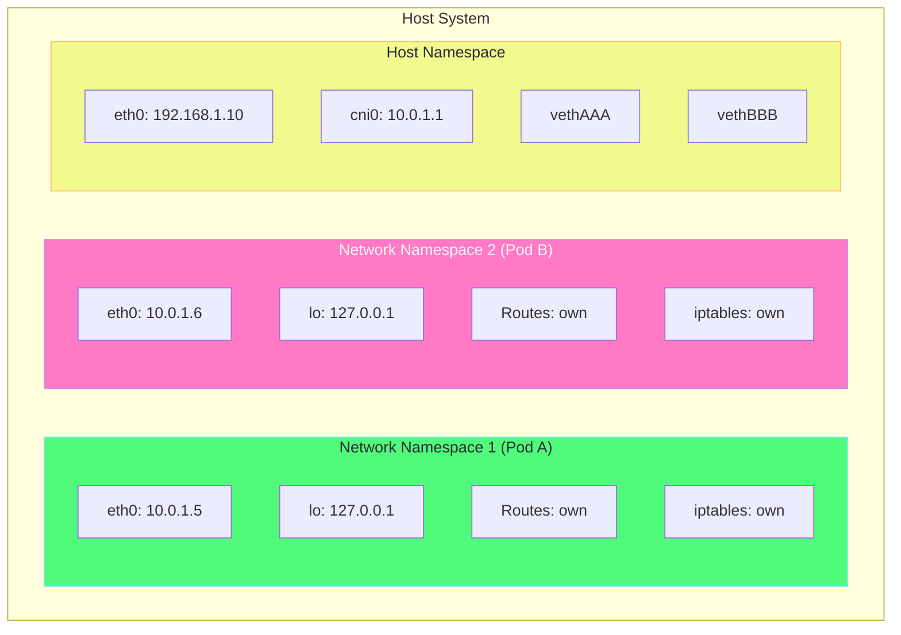
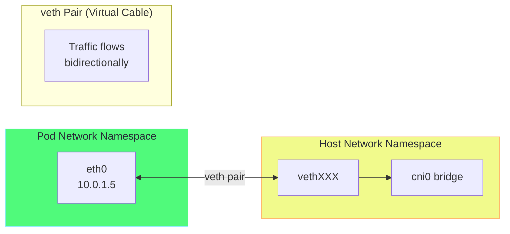
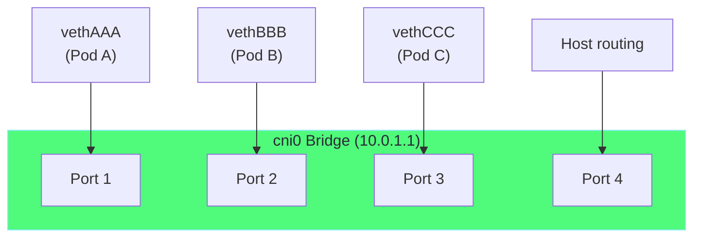
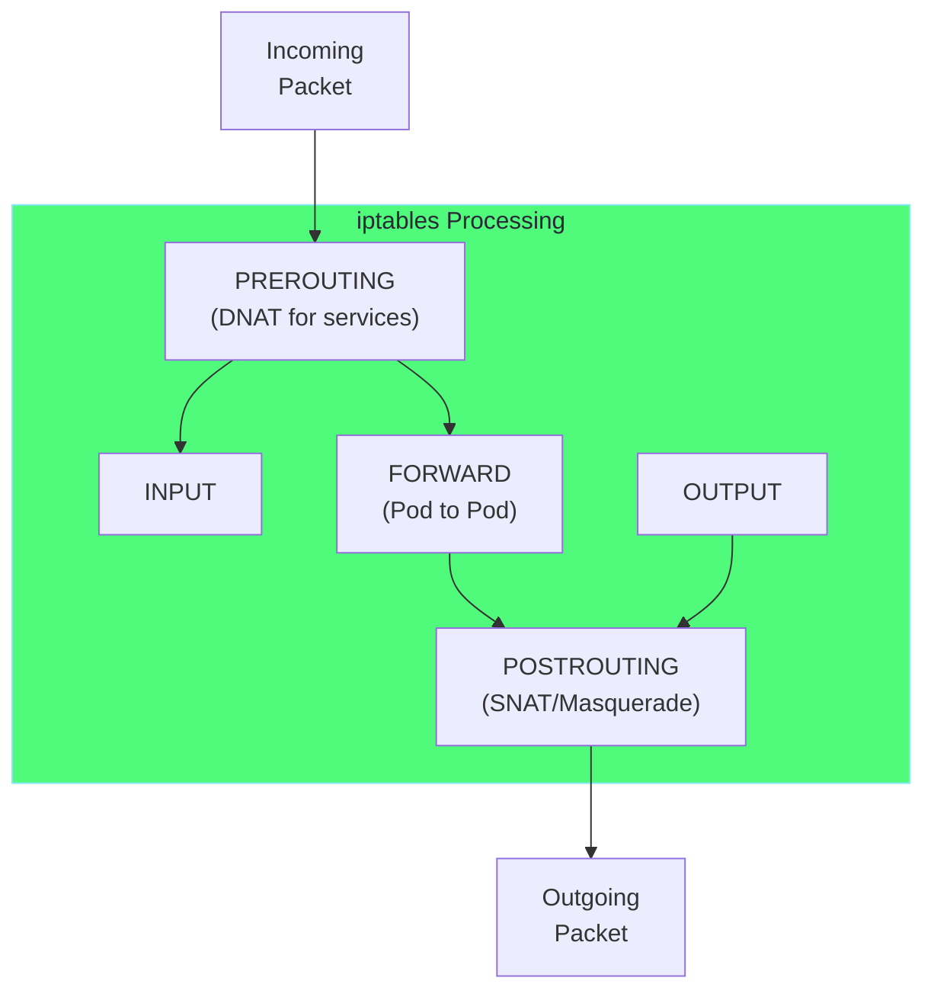
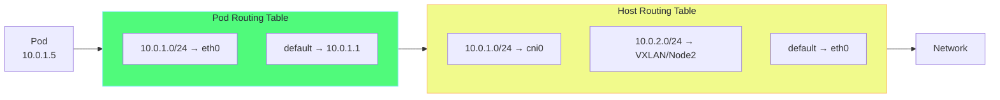
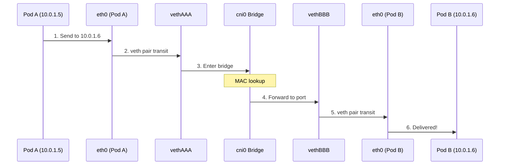
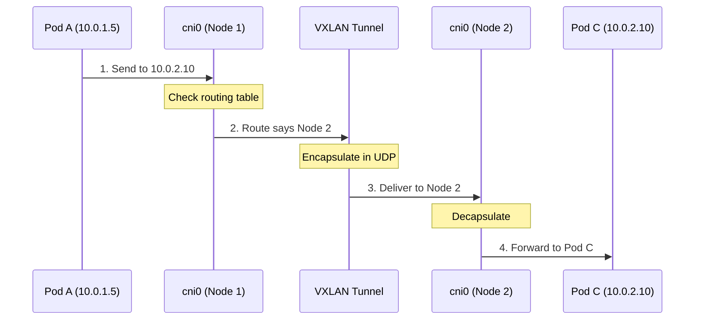

# Chapter 4: Pod Networking Internals 🔧

## Table of Contents

1. [Network Namespaces](#network-namespaces)
2. [Virtual Ethernet (veth) Pairs](#virtual-ethernet-veth-pairs)
3. [Linux Bridge Networking](#linux-bridge-networking)
4. [IP Tables and NAT](#ip-tables-and-nat)
5. [Route Tables](#route-tables)
6. [Packet Flow Walkthrough](#packet-flow-walkthrough)

---

## Network Namespaces

### What is a Network Namespace?

A network namespace provides an isolated network stack with its own:
- Network interfaces
- Routing tables
- iptables rules
- Socket ports



### Namespace Isolation

```
┌─────────────────────────────────────────────────────────────────────────┐
│                     NETWORK NAMESPACE ISOLATION                          │
├─────────────────────────────────────────────────────────────────────────┤
│                                                                          │
│  Each pod gets its own isolated network stack:                          │
│                                                                          │
│  ┌────────────────────────────┐  ┌────────────────────────────┐        │
│  │     Pod A Namespace         │  │     Pod B Namespace         │        │
│  │                             │  │                             │        │
│  │  Interface: eth0            │  │  Interface: eth0            │        │
│  │  IP: 10.0.1.5/24            │  │  IP: 10.0.1.6/24            │        │
│  │                             │  │                             │        │
│  │  Loopback: 127.0.0.1        │  │  Loopback: 127.0.0.1        │        │
│  │                             │  │                             │        │
│  │  Can listen on port 80 ──┐  │  │  Can ALSO listen on 80 ──┐ │        │
│  │  without conflict!       │  │  │  No port conflict!       │ │        │
│  │                          │  │  │                          │ │        │
│  │  Routing table: own      │  │  │  Routing table: own      │ │        │
│  │  iptables: own           │  │  │  iptables: own           │ │        │
│  └──────────────────────────┼──┘  └──────────────────────────┼──┘        │
│                             │                                │           │
│                             ▼                                ▼           │
│  Both pods run nginx on :80 but they're in different namespaces!        │
│                                                                          │
└─────────────────────────────────────────────────────────────────────────┘
```

### Exploring Namespaces in Minikube

```bash
# SSH into Minikube
minikube ssh

# List all network namespaces
sudo ip netns list

# See what's in a namespace
sudo ip netns exec cni-xxx ip addr show

# Compare with host namespace
ip addr show

# See routing in namespace
sudo ip netns exec cni-xxx ip route

# See iptables in namespace
sudo ip netns exec cni-xxx iptables -L -n
```

---

## Virtual Ethernet (veth) Pairs

### What is a veth Pair?

A veth pair is like a virtual cable with two ends. Traffic that goes in one end comes out the other.



### veth Creation Process

```
┌─────────────────────────────────────────────────────────────────────────┐
│                       VETH PAIR CREATION                                 │
├─────────────────────────────────────────────────────────────────────────┤
│                                                                          │
│  Step 1: Create veth pair in host namespace                             │
│  ┌─────────────────────────────────────────────────────────────────┐   │
│  │  # ip link add veth0 type veth peer name vethXXX                 │   │
│  │                                                                  │   │
│  │  Host NS:  veth0 ←──────────────→ vethXXX                       │   │
│  │           (both ends start in host namespace)                   │   │
│  └─────────────────────────────────────────────────────────────────┘   │
│                                                                          │
│  Step 2: Move one end to pod namespace                                  │
│  ┌─────────────────────────────────────────────────────────────────┐   │
│  │  # ip link set veth0 netns <pod-namespace>                       │   │
│  │                                                                  │   │
│  │  Pod NS:   veth0 ←──────── │ ────────→ vethXXX  :Host NS        │   │
│  │                            │                                     │   │
│  │                     Namespace boundary                           │   │
│  └─────────────────────────────────────────────────────────────────┘   │
│                                                                          │
│  Step 3: Rename and configure                                           │
│  ┌─────────────────────────────────────────────────────────────────┐   │
│  │  # In pod namespace:                                             │   │
│  │  # ip link set veth0 name eth0                                   │   │
│  │  # ip addr add 10.0.1.5/24 dev eth0                              │   │
│  │  # ip link set eth0 up                                           │   │
│  │                                                                  │   │
│  │  Pod NS:   eth0 (10.0.1.5) ←─────────→ vethXXX  :Host NS        │   │
│  └─────────────────────────────────────────────────────────────────┘   │
│                                                                          │
│  Step 4: Attach host end to bridge                                      │
│  ┌─────────────────────────────────────────────────────────────────┐   │
│  │  # ip link set vethXXX master cni0                               │   │
│  │  # ip link set vethXXX up                                        │   │
│  │                                                                  │   │
│  │  Pod NS:   eth0 ←─────────→ vethXXX ─────→ cni0 bridge          │   │
│  └─────────────────────────────────────────────────────────────────┘   │
│                                                                          │
└─────────────────────────────────────────────────────────────────────────┘
```

### Viewing veth Pairs

```bash
# SSH into Minikube
minikube ssh

# List all veth interfaces on host
ip link show type veth

# Find which bridge they're connected to
bridge link show

# Match pod interface to host veth
# Get pod's interface index
kubectl exec <pod> -- cat /sys/class/net/eth0/iflink

# Find matching interface on host
ip link | grep <index>:
```

---

## Linux Bridge Networking

### What is a Linux Bridge?

A Linux bridge acts like a virtual Layer 2 switch, connecting multiple interfaces.



### Bridge Operations

```
┌─────────────────────────────────────────────────────────────────────────┐
│                        LINUX BRIDGE OPERATIONS                           │
├─────────────────────────────────────────────────────────────────────────┤
│                                                                          │
│  MAC Learning:                                                           │
│  ┌─────────────────────────────────────────────────────────────────┐   │
│  │  Bridge learns which MAC address is on which port               │   │
│  │                                                                  │   │
│  │  MAC Address Table:                                              │   │
│  │  ┌────────────────┬─────────┬──────────┐                        │   │
│  │  │ MAC Address    │ Port    │ Age      │                        │   │
│  │  ├────────────────┼─────────┼──────────┤                        │   │
│  │  │ aa:bb:cc:11:.. │ vethAAA │ 10 sec   │                        │   │
│  │  │ aa:bb:cc:22:.. │ vethBBB │ 5 sec    │                        │   │
│  │  │ aa:bb:cc:33:.. │ vethCCC │ 15 sec   │                        │   │
│  │  └────────────────┴─────────┴──────────┘                        │   │
│  └─────────────────────────────────────────────────────────────────┘   │
│                                                                          │
│  Frame Forwarding:                                                       │
│  ┌─────────────────────────────────────────────────────────────────┐   │
│  │  1. Frame arrives on port (vethAAA)                              │   │
│  │  2. Bridge looks up destination MAC in table                     │   │
│  │  3. If found: forward to specific port                          │   │
│  │  4. If not found: flood to all ports (except source)            │   │
│  └─────────────────────────────────────────────────────────────────┘   │
│                                                                          │
└─────────────────────────────────────────────────────────────────────────┘
```

### Bridge Commands

```bash
# SSH into Minikube
minikube ssh

# Show bridges
ip link show type bridge

# Show bridge details
bridge link show

# Show bridge FDB (forwarding database)
bridge fdb show br cni0

# Show bridge VLAN info
bridge vlan show
```

---

## IP Tables and NAT

### Pod Network iptables Rules



### Key iptables Chains for Kubernetes

```
┌─────────────────────────────────────────────────────────────────────────┐
│                    KUBERNETES IPTABLES CHAINS                            │
├─────────────────────────────────────────────────────────────────────────┤
│                                                                          │
│  KUBE-SERVICES:                                                          │
│  • Matches traffic to ClusterIP services                                 │
│  • Jumps to KUBE-SVC-xxx chains for load balancing                      │
│                                                                          │
│  KUBE-SVC-xxx (per service):                                             │
│  • Load balances across pod endpoints                                    │
│  • Uses statistic module for random selection                           │
│                                                                          │
│  KUBE-SEP-xxx (per endpoint):                                            │
│  • DNATs to specific pod IP:port                                         │
│                                                                          │
│  KUBE-POSTROUTING:                                                       │
│  • Masquerades traffic leaving the cluster                               │
│  • Handles SNAT for pod-to-external traffic                              │
│                                                                          │
│  KUBE-FORWARD:                                                           │
│  • Allows forwarding traffic in the cluster                              │
│                                                                          │
└─────────────────────────────────────────────────────────────────────────┘
```

### Viewing iptables Rules

```bash
# SSH into Minikube
minikube ssh

# View NAT table (service routing)
sudo iptables -t nat -L -n -v

# View filter table (network policies)
sudo iptables -t filter -L -n -v

# See specific chain
sudo iptables -t nat -L KUBE-SERVICES -n

# Watch iptables changes
watch -n1 'sudo iptables -t nat -L -n | head -50'
```

---

## Route Tables

### Pod Routing



### Route Table Structure

```
┌─────────────────────────────────────────────────────────────────────────┐
│                         ROUTE TABLES                                     │
├─────────────────────────────────────────────────────────────────────────┤
│                                                                          │
│  POD ROUTING TABLE (Inside Pod Namespace):                               │
│  ┌───────────────────────────────────────────────────────────────┐     │
│  │  Destination      Gateway        Interface                     │     │
│  │  ─────────────────────────────────────────────────────────────│     │
│  │  default          10.0.1.1       eth0        ← Bridge gateway │     │
│  │  10.0.1.0/24      0.0.0.0        eth0        ← Local subnet   │     │
│  └───────────────────────────────────────────────────────────────┘     │
│                                                                          │
│  HOST ROUTING TABLE (Node):                                              │
│  ┌───────────────────────────────────────────────────────────────┐     │
│  │  Destination      Gateway        Interface                     │     │
│  │  ─────────────────────────────────────────────────────────────│     │
│  │  default          192.168.1.1    eth0        ← External GW    │     │
│  │  10.0.1.0/24      0.0.0.0        cni0        ← Local pods     │     │
│  │  10.0.2.0/24      192.168.1.11   flannel.1   ← Node 2 pods    │     │
│  │  10.0.3.0/24      192.168.1.12   flannel.1   ← Node 3 pods    │     │
│  │  192.168.1.0/24   0.0.0.0        eth0        ← Node network   │     │
│  └───────────────────────────────────────────────────────────────┘     │
│                                                                          │
└─────────────────────────────────────────────────────────────────────────┘
```

---

## Packet Flow Walkthrough

### Same-Node Pod to Pod



### Cross-Node Pod to Pod



### Detailed Cross-Node Flow

```
┌─────────────────────────────────────────────────────────────────────────┐
│              CROSS-NODE PACKET FLOW (Pod A → Pod C)                      │
├─────────────────────────────────────────────────────────────────────────┤
│                                                                          │
│  NODE 1 (192.168.1.10)                    NODE 2 (192.168.1.11)         │
│  ┌─────────────────────┐                  ┌─────────────────────┐       │
│  │  Pod A (10.0.1.5)   │                  │  Pod C (10.0.2.10)  │       │
│  │         │           │                  │         ▲           │       │
│  │         ▼           │                  │         │           │       │
│  │  1. eth0 (pod)      │                  │  8. eth0 (pod)      │       │
│  │         │           │                  │         │           │       │
│  │         ▼           │                  │         │           │       │
│  │  2. vethAAA         │                  │  7. vethCCC         │       │
│  │         │           │                  │         ▲           │       │
│  │         ▼           │                  │         │           │       │
│  │  3. cni0 bridge     │                  │  6. cni0 bridge     │       │
│  │         │           │                  │         ▲           │       │
│  │         ▼           │                  │         │           │       │
│  │  4. flannel.1       │   VXLAN TUNNEL   │  5. flannel.1       │       │
│  │    (encapsulate)    │────────────────────▶(decapsulate)      │       │
│  │                     │                  │                     │       │
│  └─────────────────────┘                  └─────────────────────┘       │
│                                                                          │
│  Packet at each step:                                                   │
│  ───────────────────────────────────────────────────────────────────   │
│  1-3: [Src: 10.0.1.5] [Dst: 10.0.2.10] [Data...]                       │
│                                                                          │
│  4:   VXLAN Encapsulation:                                              │
│       [Outer IP] [Src: 192.168.1.10] [Dst: 192.168.1.11]               │
│       [VXLAN Header] [VNI: 1]                                           │
│       [Inner: Src: 10.0.1.5] [Dst: 10.0.2.10] [Data...]                │
│                                                                          │
│  5-8: Decapsulated, original packet delivered                           │
│                                                                          │
└─────────────────────────────────────────────────────────────────────────┘
```

---

## Hands-on Lab: Explore Pod Networking

```bash
# Create test pods
kubectl run pod-a --image=nginx
kubectl run pod-b --image=nginx

# Get pod IPs
kubectl get pods -o wide

# SSH into Minikube
minikube ssh

# Find veth interfaces
ip link show type veth

# Show bridge
bridge link show

# Show routes
ip route

# As root, list namespaces
sudo ip netns list

# Trace packet path (install tcpdump first)
sudo apt-get update && sudo apt-get install -y tcpdump

# Capture on bridge
sudo tcpdump -i cni0 -n host 10.0.1.5

# In another terminal, ping from pod-a to pod-b
kubectl exec pod-a -- ping -c 3 <pod-b-ip>
```

---

## Key Takeaways

> [!IMPORTANT]
> 1. **Network namespaces** provide isolation per pod
> 2. **veth pairs** connect pod namespace to host
> 3. **Linux bridge** acts as a virtual switch
> 4. **iptables** handles service routing and NAT
> 5. **Routes** determine cross-node traffic paths

---

**[Next: Chapter 5 - Cross-Node Networking →](05-cross-node-networking.md)**
