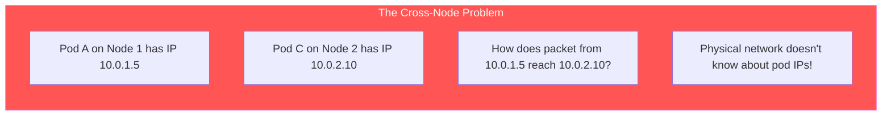
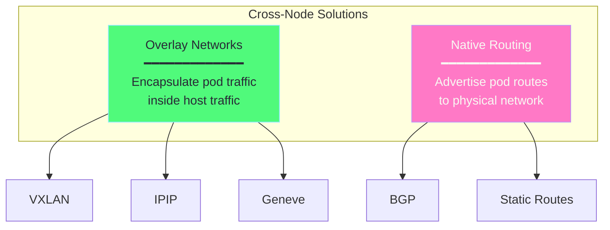
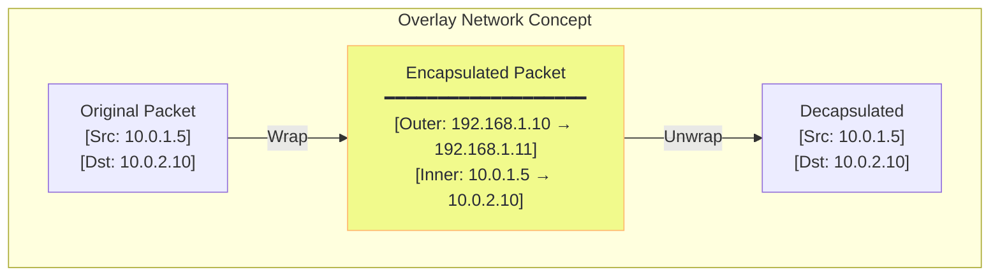
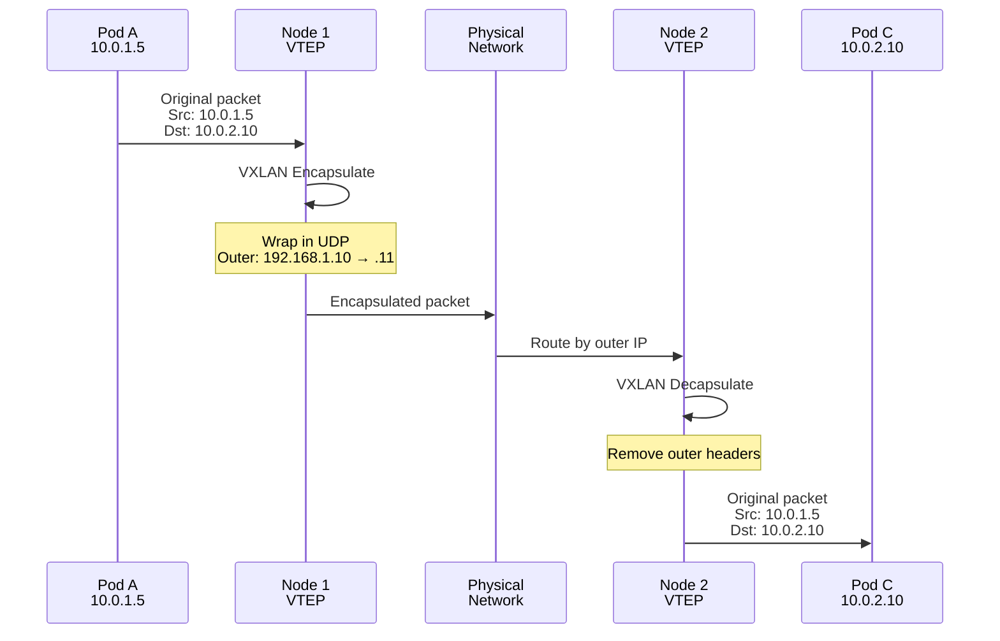
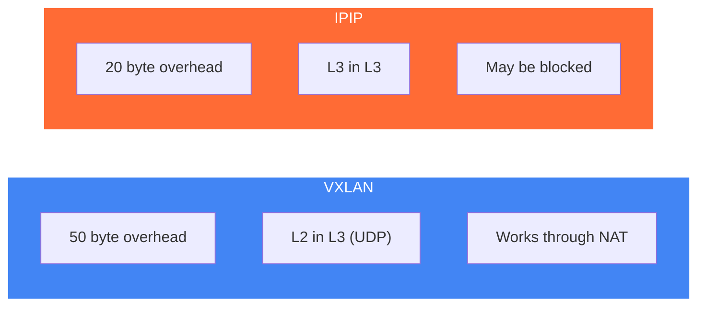
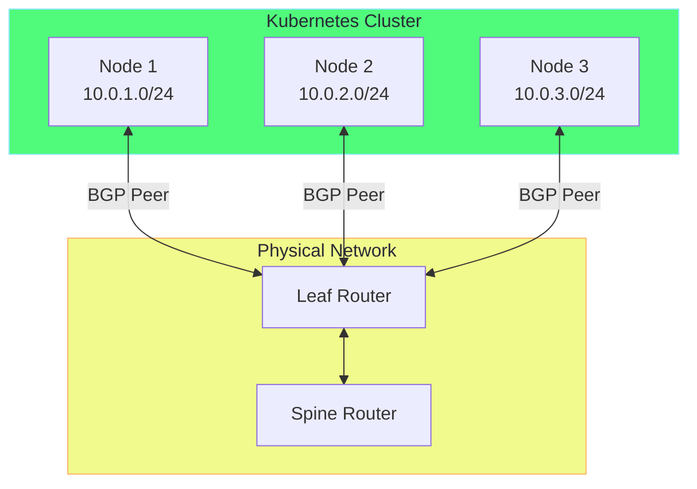
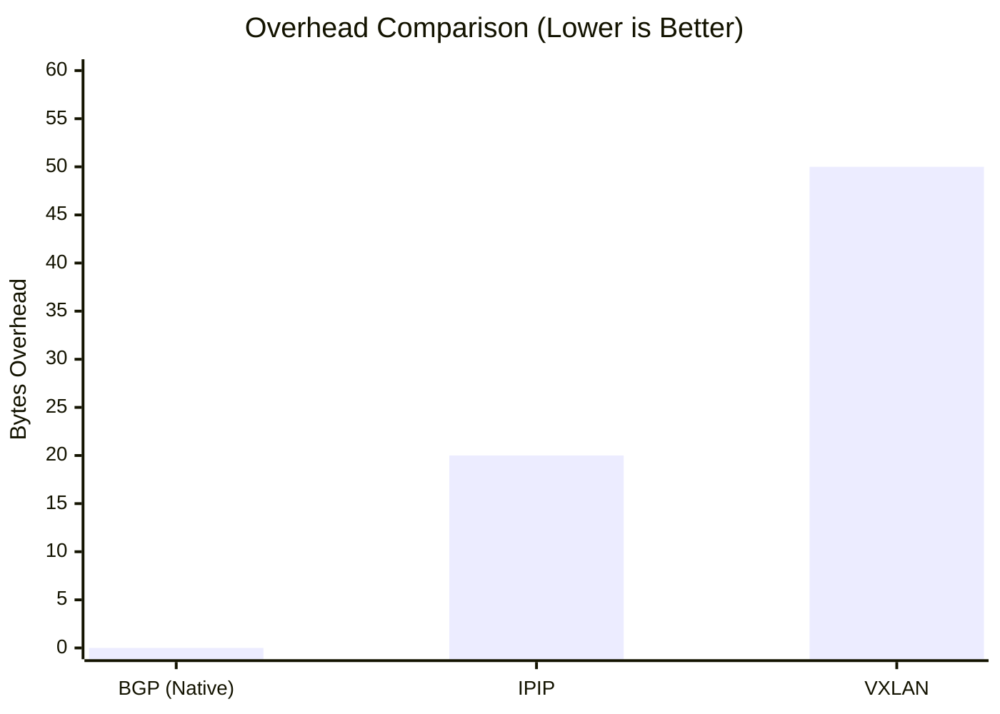
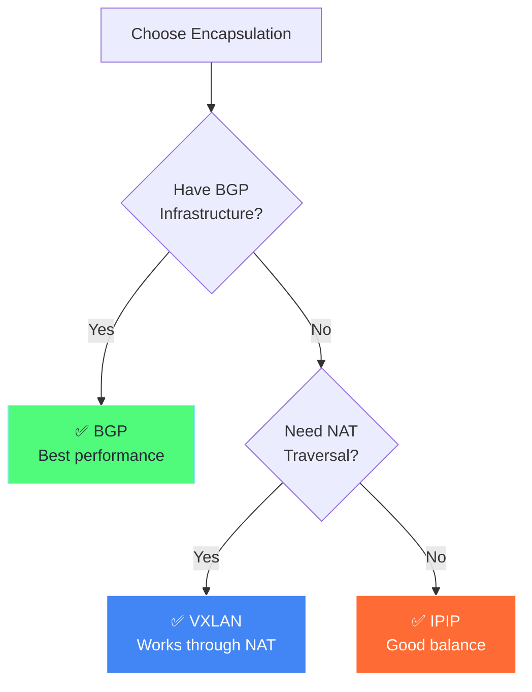

# Chapter 5: Cross-Node Networking 🌍

## Table of Contents

1. [The Challenge](#the-challenge)
2. [Overlay Networks](#overlay-networks)
3. [VXLAN Deep Dive](#vxlan-deep-dive)
4. [IPIP Tunneling](#ipip-tunneling)
5. [BGP Native Routing](#bgp-native-routing)
6. [Comparison](#comparison)
7. [Minikube Multi-Node Lab](#minikube-multi-node-lab)

---

## The Challenge

### Why Cross-Node is Different



### The Network Gap

```
┌─────────────────────────────────────────────────────────────────────────┐
│                     THE CROSS-NODE CHALLENGE                             │
├─────────────────────────────────────────────────────────────────────────┤
│                                                                          │
│  Node 1 (192.168.1.10)              Node 2 (192.168.1.11)               │
│  ┌─────────────────────┐            ┌─────────────────────┐             │
│  │  Pod A: 10.0.1.5    │            │  Pod C: 10.0.2.10   │             │
│  │         │           │            │         ▲           │             │
│  │         ▼           │            │         │           │             │
│  │  cni0: 10.0.1.1     │            │  cni0: 10.0.2.1     │             │
│  │         │           │            │         │           │             │
│  │         ▼           │            │         ▲           │             │
│  │  eth0: 192.168.1.10 │            │  eth0: 192.168.1.11 │             │
│  └─────────┼───────────┘            └─────────┼───────────┘             │
│            │                                  │                          │
│            └─────────────┬────────────────────┘                          │
│                          │                                               │
│            ┌─────────────▼─────────────┐                                │
│            │    Physical Network        │                                │
│            │                            │                                │
│            │  Only knows about:         │                                │
│            │  • 192.168.1.10            │                                │
│            │  • 192.168.1.11            │                                │
│            │                            │                                │
│            │  Does NOT know:            │                                │
│            │  • 10.0.1.5 (Pod A)        │                                │
│            │  • 10.0.2.10 (Pod C)       │                                │
│            └────────────────────────────┘                                │
│                                                                          │
│  Challenge: Route pod traffic across physical network that doesn't      │
│  understand pod IP addresses                                            │
│                                                                          │
└─────────────────────────────────────────────────────────────────────────┘
```

### Solution Approaches



---

## Overlay Networks

### What is an Overlay?

An overlay network creates a virtual network on top of the physical network by encapsulating packets.



### Overlay Benefits & Drawbacks

| Aspect | Benefit | Drawback |
|--------|---------|----------|
| **Compatibility** | Works on any network | Overhead from encapsulation |
| **Setup** | No network changes needed | Slightly lower MTU |
| **Isolation** | Complete virtual network | Debugging complexity |
| **Scale** | Works at any scale | CPU for encap/decap |

---

## VXLAN Deep Dive

### What is VXLAN?

VXLAN (Virtual Extensible LAN) encapsulates Layer 2 frames in UDP packets.

```
┌─────────────────────────────────────────────────────────────────────────┐
│                         VXLAN PACKET STRUCTURE                           │
├─────────────────────────────────────────────────────────────────────────┤
│                                                                          │
│  ┌─────────────────────────────────────────────────────────────────┐   │
│  │  OUTER ETHERNET HEADER                                           │   │
│  │  [Dst MAC: Node 2 MAC] [Src MAC: Node 1 MAC] [Type: IP]         │   │
│  ├─────────────────────────────────────────────────────────────────┤   │
│  │  OUTER IP HEADER                                                 │   │
│  │  [Src: 192.168.1.10] [Dst: 192.168.1.11] [Proto: UDP]           │   │
│  ├─────────────────────────────────────────────────────────────────┤   │
│  │  OUTER UDP HEADER                                                │   │
│  │  [Src Port: ephemeral] [Dst Port: 8472 (Linux) / 4789 (std)]    │   │
│  ├─────────────────────────────────────────────────────────────────┤   │
│  │  VXLAN HEADER (8 bytes)                                          │   │
│  │  [Flags] [Reserved] [VNI: 1] [Reserved]                          │   │
│  │                      └── Virtual Network Identifier              │   │
│  ├─────────────────────────────────────────────────────────────────┤   │
│  │  INNER ETHERNET HEADER                                           │   │
│  │  [Dst MAC: Pod C MAC] [Src MAC: Pod A MAC] [Type: IP]           │   │
│  ├─────────────────────────────────────────────────────────────────┤   │
│  │  INNER IP HEADER (Original Pod Packet)                           │   │
│  │  [Src: 10.0.1.5] [Dst: 10.0.2.10]                               │   │
│  ├─────────────────────────────────────────────────────────────────┤   │
│  │  INNER PAYLOAD (TCP/UDP + Data)                                  │   │
│  └─────────────────────────────────────────────────────────────────┘   │
│                                                                          │
│  Overhead: 50 bytes (14 outer eth + 20 IP + 8 UDP + 8 VXLAN)           │
│  Default MTU: 1500 - 50 = 1450 for inner packet                         │
│                                                                          │
└─────────────────────────────────────────────────────────────────────────┘
```

### VXLAN Flow Diagram



### VXLAN in Flannel

```bash
# View VXLAN interface on Minikube
minikube ssh

# Show the flannel interface
ip -d link show flannel.1

# Output example:
# flannel.1: <BROADCAST,MULTICAST,UP,LOWER_UP> mtu 1450 qdisc noqueue
#     link/ether 5a:46:3a:xx:xx:xx brd ff:ff:ff:ff:ff:ff promiscuity 0
#     vxlan id 1 local 192.168.1.10 dev eth0 srcport 0 0 dstport 8472

# View FDB (forwarding database) - maps pod IPs to node IPs
bridge fdb show dev flannel.1

# Example:
# 5a:46:3a:xx:xx:xx dev flannel.1 dst 192.168.1.11 self permanent
```

---

## IPIP Tunneling

### What is IPIP?

IPIP (IP-in-IP) is simpler than VXLAN - it just wraps IP packets inside other IP packets.

```
┌─────────────────────────────────────────────────────────────────────────┐
│                         IPIP PACKET STRUCTURE                            │
├─────────────────────────────────────────────────────────────────────────┤
│                                                                          │
│  ┌─────────────────────────────────────────────────────────────────┐   │
│  │  OUTER IP HEADER                                                 │   │
│  │  [Src: 192.168.1.10] [Dst: 192.168.1.11] [Proto: 4 (IP-in-IP)]  │   │
│  ├─────────────────────────────────────────────────────────────────┤   │
│  │  INNER IP HEADER (Original)                                      │   │
│  │  [Src: 10.0.1.5] [Dst: 10.0.2.10] [Proto: TCP]                  │   │
│  ├─────────────────────────────────────────────────────────────────┤   │
│  │  INNER PAYLOAD (TCP + Data)                                      │   │
│  └─────────────────────────────────────────────────────────────────┘   │
│                                                                          │
│  Overhead: 20 bytes (outer IP header only)                              │
│  More efficient than VXLAN!                                              │
│                                                                          │
└─────────────────────────────────────────────────────────────────────────┘
```

### IPIP vs VXLAN



### IPIP in Calico

```bash
# Calico uses IPIP by default
# View IPIP tunnel interface

minikube ssh

# Show tunl0 interface
ip -d link show tunl0

# View routes using IPIP
ip route | grep tunl0

# Example output:
# 10.0.2.0/24 via 192.168.1.11 dev tunl0 proto bird onlink
```

---

## BGP Native Routing

### What is BGP Routing?

BGP (Border Gateway Protocol) advertises pod routes to the physical network - no encapsulation needed!



### BGP Flow

```
┌─────────────────────────────────────────────────────────────────────────┐
│                           BGP ROUTING                                    │
├─────────────────────────────────────────────────────────────────────────┤
│                                                                          │
│  Step 1: Route Advertisement                                             │
│  ┌─────────────────────────────────────────────────────────────────┐   │
│  │  Node 1 (BIRD) ──► Router: "I have 10.0.1.0/24, next-hop me"    │   │
│  │  Node 2 (BIRD) ──► Router: "I have 10.0.2.0/24, next-hop me"    │   │
│  │  Node 3 (BIRD) ──► Router: "I have 10.0.3.0/24, next-hop me"    │   │
│  └─────────────────────────────────────────────────────────────────┘   │
│                                                                          │
│  Step 2: Router learns routes                                            │
│  ┌─────────────────────────────────────────────────────────────────┐   │
│  │  Router Table:                                                   │   │
│  │  ┌────────────────┬─────────────────────────────┐               │   │
│  │  │ Destination    │ Next Hop                    │               │   │
│  │  ├────────────────┼─────────────────────────────┤               │   │
│  │  │ 10.0.1.0/24    │ 192.168.1.10 (Node 1)      │               │   │
│  │  │ 10.0.2.0/24    │ 192.168.1.11 (Node 2)      │               │   │
│  │  │ 10.0.3.0/24    │ 192.168.1.12 (Node 3)      │               │   │
│  │  └────────────────┴─────────────────────────────┘               │   │
│  └─────────────────────────────────────────────────────────────────┘   │
│                                                                          │
│  Step 3: Native Routing (No Encapsulation!)                             │
│  ┌─────────────────────────────────────────────────────────────────┐   │
│  │  Pod A (10.0.1.5) sends to Pod C (10.0.2.10)                    │   │
│  │                                                                  │   │
│  │  Packet: [Src: 10.0.1.5] [Dst: 10.0.2.10] [Data]                │   │
│  │          └── No outer header! Native IP packet                  │   │
│  │                                                                  │   │
│  │  Flow: Node 1 → Router (routes to Node 2) → Node 2 → Pod C     │   │
│  └─────────────────────────────────────────────────────────────────┘   │
│                                                                          │
│  Benefits: No overhead, wire-speed performance, simple packet traces    │
│  Requires: Network infrastructure that supports BGP peering             │
│                                                                          │
└─────────────────────────────────────────────────────────────────────────┘
```

---

## Comparison

### Feature Matrix

| Feature | VXLAN | IPIP | BGP |
|---------|-------|------|-----|
| **Encapsulation** | L2 in UDP | IP in IP | None |
| **Overhead** | 50 bytes | 20 bytes | 0 bytes |
| **Performance** | Good | Better | Best |
| **Network Requirements** | Any | Any | BGP support |
| **NAT Traversal** | Yes | Sometimes | No |
| **Debugging** | Harder | Medium | Easiest |

### Performance Comparison



### When to Use Each



---

## Minikube Multi-Node Lab

### Set Up Multi-Node Cluster

```bash
# Create multi-node Minikube cluster
minikube start --nodes 2 --cni=calico

# Verify nodes
kubectl get nodes

# Output:
# NAME           STATUS   ROLES           AGE   VERSION
# minikube       Ready    control-plane   1m    v1.28.0
# minikube-m02   Ready    <none>          30s   v1.28.0
```

### Create Test Pods on Different Nodes

```yaml
# File: cross-node-test.yaml
apiVersion: v1
kind: Pod
metadata:
  name: pod-node1
spec:
  nodeName: minikube
  containers:
  - name: alpine
    image: alpine
    command: ['sleep', '3600']
---
apiVersion: v1
kind: Pod
metadata:
  name: pod-node2
spec:
  nodeName: minikube-m02
  containers:
  - name: alpine
    image: alpine
    command: ['sleep', '3600']
```

### Test Cross-Node Connectivity

```bash
# Apply the test pods
kubectl apply -f cross-node-test.yaml

# Get pod IPs
kubectl get pods -o wide

# Test connectivity
kubectl exec pod-node1 -- ping -c 3 <pod-node2-ip>

# Trace the path
kubectl exec pod-node1 -- traceroute <pod-node2-ip>
```

### Observe Encapsulation

```bash
# SSH to first node
minikube ssh

# Capture IPIP traffic
sudo tcpdump -i eth0 'ip proto 4' -n

# In another terminal, trigger traffic
kubectl exec pod-node1 -- ping -c 5 <pod-node2-ip>

# You'll see encapsulated packets!
```

---

## Key Takeaways

> [!IMPORTANT]
> 1. **Overlay networks** encapsulate pod traffic for cross-node delivery
> 2. **VXLAN** wraps L2 in UDP - works anywhere, 50 byte overhead
> 3. **IPIP** wraps L3 in L3 - simpler, 20 byte overhead
> 4. **BGP** advertises routes - no encapsulation, best performance
> 5. **Choose based on** network infrastructure and requirements

---

**[Next: Chapter 6 - Minikube CNI Lab →](06-minikube-cni-lab.md)**
