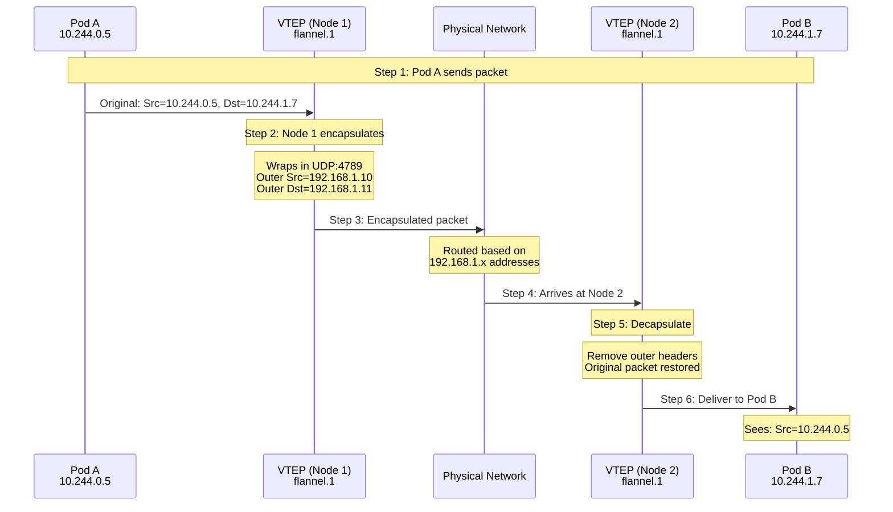
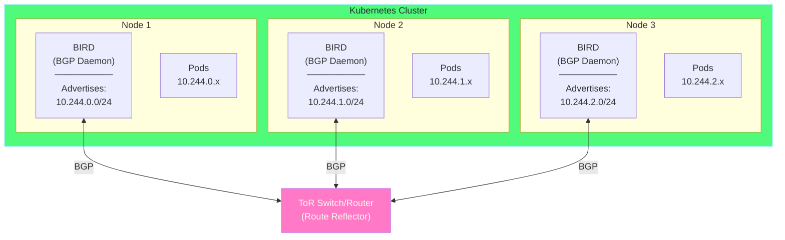

# Chapter 5: Cross-Node Networking 🌍

## Table of Contents

1. [Introduction](#introduction)
2. [The Cross-Node Challenge](#the-cross-node-challenge)
3. [Overlay Networks](#overlay-networks)
4. [VXLAN Deep Dive](#vxlan-deep-dive)
5. [IPIP Tunneling](#ipip-tunneling)
6. [BGP Native Routing](#bgp-native-routing)
7. [Comparison and Use Cases](#comparison-and-use-cases)
8. [Multi-Node Lab with Minikube](#multi-node-lab-with-minikube)

---

## Introduction

In the previous chapter, we learned how pods communicate within a single node. But what happens when Pod A on Node 1 needs to talk to Pod B on Node 2?

This chapter explains the different approaches to **cross-node networking** and when to use each one.

### What You'll Learn

By the end of this chapter, you'll understand:
- Why cross-node networking is challenging
- How overlay networks work (VXLAN, IPIP)
- How native routing works (BGP)
- Which approach to choose for your cluster

---

## The Cross-Node Challenge

### The Problem

Pods use "private" IP addresses from the cluster's CIDR (like 10.244.x.x). These addresses are not routable on the physical network - routers don't know how to reach them.

```
┌─────────────────────────────────────────────────────────────────────┐
│                     THE CROSS-NODE PROBLEM                           │
│                                                                      │
│  Node 1 (192.168.1.10)           Node 2 (192.168.1.11)              │
│  ┌───────────────────┐           ┌───────────────────┐              │
│  │                   │           │                   │              │
│  │  Pod A            │           │  Pod B            │              │
│  │  10.244.0.5       │           │  10.244.1.7       │              │
│  │                   │           │                   │              │
│  └───────────────────┘           └───────────────────┘              │
│                                                                      │
│           Pod A sends: "Dear 10.244.1.7, hello!"                    │
│                              │                                       │
│                              ▼                                       │
│           ┌───────────────────────────────────┐                     │
│           │          Physical Router          │                     │
│           │                                   │                     │
│           │   "10.244.1.7? Never heard of    │                     │
│           │    that address. DROPPED!"        │                     │
│           │                                   │                     │
│           └───────────────────────────────────┘                     │
│                                                                      │
│  The physical network only knows about node IPs (192.168.1.x).     │
│  It has no idea that 10.244.x.x addresses exist!                   │
│                                                                      │
└─────────────────────────────────────────────────────────────────────┘
```

### The Solutions

There are two main approaches to solve this:

| Approach | How It Works | Analogy |
|----------|--------------|---------|
| **Overlay Network** | Wrap pod packets inside regular IP packets that use node IPs | Putting a letter in another envelope |
| **Native Routing** | Teach physical routers about pod network routes | Adding pod addresses to the phone book |

---

## Overlay Networks

### What is an Overlay Network?

An **overlay network** is a virtual network built on top of an existing physical network. It works by **encapsulating** (wrapping) packets inside other packets.

### How Encapsulation Works

Think of it like sending a letter:

```
┌─────────────────────────────────────────────────────────────────────┐
│                      ENCAPSULATION EXPLAINED                         │
│                                                                      │
│  The Letter Analogy:                                                 │
│  ────────────────────                                               │
│                                                                      │
│  You want to send a letter to someone in another building,          │
│  but the postal service doesn't deliver to room numbers,            │
│  only to building addresses.                                         │
│                                                                      │
│  ORIGINAL LETTER:                                                    │
│  ┌─────────────────────────────────────────────────────┐            │
│  │  To: Room 512, Building B                           │            │
│  │  From: Room 101, Building A                         │            │
│  │                                                      │            │
│  │  Dear Friend, ...                                   │            │
│  └─────────────────────────────────────────────────────┘            │
│                                                                      │
│  Post office: "Room 512? I don't know where that is!"              │
│                                                                      │
│  SOLUTION: Put it in an outer envelope with building addresses:     │
│                                                                      │
│  ┌──────────────────────────────────────────────────────────────┐  │
│  │  OUTER ENVELOPE:                                              │  │
│  │  To: Building B, 123 Main St                                  │  │
│  │  From: Building A, 456 Oak Ave                                │  │
│  │  ┌─────────────────────────────────────────────────────────┐ │  │
│  │  │  INNER LETTER:                                          │ │  │
│  │  │  To: Room 512, Building B                               │ │  │
│  │  │  From: Room 101, Building A                             │ │  │
│  │  │  Dear Friend, ...                                       │ │  │
│  │  └─────────────────────────────────────────────────────────┘ │  │
│  └──────────────────────────────────────────────────────────────┘  │
│                                                                      │
│  Now the post office can deliver to Building B.                     │
│  Building B's mailroom opens the outer envelope,                    │
│  sees the inner letter is for Room 512, and delivers it!           │
│                                                                      │
│  In networking terms:                                                │
│  • Inner letter = Original pod-to-pod packet (10.244.x.x)          │
│  • Outer envelope = New packet with node IPs (192.168.x.x)         │
│  • Building mailroom = Node's network stack (decapsulates)         │
│                                                                      │
└─────────────────────────────────────────────────────────────────────┘
```

### Encapsulation in Kubernetes

Here's what encapsulation looks like with real network packets:

```
┌─────────────────────────────────────────────────────────────────────┐
│                    PACKET ENCAPSULATION                              │
│                                                                      │
│  ORIGINAL PACKET (what Pod A sends):                                │
│  ┌───────────────────────────────────────────────────────────────┐ │
│  │ Eth │ IP Header                     │ TCP │ Data               │ │
│  │     │ Src: 10.244.0.5              │     │ "GET /api"        │ │
│  │     │ Dst: 10.244.1.7              │     │                    │ │
│  └───────────────────────────────────────────────────────────────┘ │
│                                                                      │
│  Size: ~1500 bytes (typical MTU)                                    │
│                                                                      │
│  AFTER ENCAPSULATION (what travels between nodes):                  │
│  ┌───────────────────────────────────────────────────────────────┐ │
│  │ Eth │ Outer IP │ UDP  │ VXLAN │ Original Packet              │ │
│  │     │ Header   │      │ Header│                               │ │
│  │     │          │      │       │ IP │ TCP │ Data               │ │
│  │     │Src:      │ Port │ VNI   │    │     │                    │ │
│  │     │192.168   │ 4789 │       │    │     │                    │ │
│  │     │.1.10     │      │       │    │     │                    │ │
│  │     │Dst:      │      │       │    │     │                    │ │
│  │     │192.168   │      │       │    │     │                    │ │
│  │     │.1.11     │      │       │    │     │                    │ │
│  └───────────────────────────────────────────────────────────────┘ │
│                                                                      │
│  Added overhead: ~50 bytes (VXLAN) or ~20 bytes (IPIP)             │
│                                                                      │
│  The physical network sees: 192.168.1.10 → 192.168.1.11            │
│  It can route this normally! The pod IPs are hidden inside.        │
│                                                                      │
└─────────────────────────────────────────────────────────────────────┘
```

---

## VXLAN Deep Dive

### What is VXLAN?

**VXLAN** (Virtual Extensible LAN) is the most common overlay technology. It encapsulates Layer 2 (Ethernet) frames inside UDP packets.

### Why VXLAN?

| Advantage | Explanation |
|-----------|-------------|
| **Works everywhere** | Uses UDP, which traverses firewalls and NAT |
| **Standard protocol** | Widely supported by hardware and software |
| **Scalable** | Supports 16 million virtual networks (24-bit VNI) |
| **Mature** | Well-tested and understood |

### How VXLAN Works Step by Step

Let's trace a packet from Pod A on Node 1 to Pod B on Node 2:



**Explanation of each step:**

1. **Pod A sends packet**: Application in Pod A sends to 10.244.1.7
2. **Routing decision**: Node 1 sees 10.244.1.0/24 is on Node 2, needs encapsulation
3. **VTEP encapsulates**: The VXLAN Tunnel Endpoint (flannel.1 interface) wraps the packet
4. **Physical network**: Packet travels using node IPs (which routers understand)
5. **VTEP decapsulates**: Node 2's VTEP unwraps the outer packet
6. **Delivery**: Original packet delivered to Pod B

### What is a VTEP?

A **VTEP** (VXLAN Tunnel Endpoint) is the interface that handles encapsulation and decapsulation:

```
┌─────────────────────────────────────────────────────────────────────┐
│                         VTEP EXPLAINED                               │
│                                                                      │
│  Node 1                                                              │
│  ┌────────────────────────────────────────────────────────────────┐│
│  │                                                                 ││
│  │  Pod A                                                          ││
│  │  10.244.0.5                                                     ││
│  │      │                                                          ││
│  │      │ Original packet                                          ││
│  │      ▼                                                          ││
│  │                                                                 ││
│  │  ┌───────────────────────────────────────────────────────────┐ ││
│  │  │  flannel.1 (VTEP)                                         │ ││
│  │  │  ─────────────────────────────────────────────────────── │ ││
│  │  │  This is the VXLAN Tunnel Endpoint                       │ ││
│  │  │                                                           │ ││
│  │  │  Jobs:                                                    │ ││
│  │  │  1. Receive packets destined for remote pods             │ ││
│  │  │  2. Look up which node has the destination pod           │ ││
│  │  │  3. Encapsulate: Add outer IP + UDP + VXLAN headers     │ ││
│  │  │  4. Send to the other node's VTEP                        │ ││
│  │  │                                                           │ ││
│  │  │  For incoming packets:                                    │ ││
│  │  │  1. Receive encapsulated packets on UDP:4789             │ ││
│  │  │  2. Decapsulate: Remove outer headers                    │ ││
│  │  │  3. Forward original packet to local pod                 │ ││
│  │  └───────────────────────────────────────────────────────────┘ ││
│  │      │                                                          ││
│  │      │ Encapsulated packet (UDP:4789)                          ││
│  │      ▼                                                          ││
│  │                                                                 ││
│  │  eth0 (192.168.1.10) ──────────► Physical Network              ││
│  │                                                                 ││
│  └────────────────────────────────────────────────────────────────┘│
│                                                                      │
└─────────────────────────────────────────────────────────────────────┘
```

### VXLAN Packet Structure

Here's the detailed structure of a VXLAN packet:

```
┌─────────────────────────────────────────────────────────────────────┐
│                    VXLAN PACKET ANATOMY                              │
│                                                                      │
│  ┌─────────────────────────────────────────────────────────────┐   │
│  │              OUTER ETHERNET HEADER (14 bytes)               │   │
│  │  Dst MAC: Node 2's MAC                                      │   │
│  │  Src MAC: Node 1's MAC                                      │   │
│  │  Type: 0x0800 (IPv4)                                        │   │
│  └─────────────────────────────────────────────────────────────┘   │
│  ┌─────────────────────────────────────────────────────────────┐   │
│  │              OUTER IP HEADER (20 bytes)                     │   │
│  │  Source: 192.168.1.10 (Node 1)                             │   │
│  │  Dest: 192.168.1.11 (Node 2)                               │   │
│  │  Protocol: 17 (UDP)                                          │   │
│  │  TTL: 64                                                     │   │
│  └─────────────────────────────────────────────────────────────┘   │
│  ┌─────────────────────────────────────────────────────────────┐   │
│  │              UDP HEADER (8 bytes)                           │   │
│  │  Source Port: (hash-based, varies)                          │   │
│  │  Dest Port: 4789 (VXLAN standard port)                     │   │
│  │  Length: (size of VXLAN + inner packet)                    │   │
│  │  Checksum: (optional)                                        │   │
│  └─────────────────────────────────────────────────────────────┘   │
│  ┌─────────────────────────────────────────────────────────────┐   │
│  │              VXLAN HEADER (8 bytes)                         │   │
│  │  Flags: 0x08 (VNI valid)                                    │   │
│  │  VNI: 1 (Virtual Network Identifier)                        │   │
│  │  Reserved: 0                                                 │   │
│  └─────────────────────────────────────────────────────────────┘   │
│  ┌─────────────────────────────────────────────────────────────┐   │
│  │              INNER ETHERNET HEADER (14 bytes)               │   │
│  │  (Original pod's ethernet frame)                            │   │
│  └─────────────────────────────────────────────────────────────┘   │
│  ┌─────────────────────────────────────────────────────────────┐   │
│  │              INNER IP HEADER (20 bytes)                     │   │
│  │  Source: 10.244.0.5 (Pod A)                                │   │
│  │  Dest: 10.244.1.7 (Pod B)                                  │   │
│  └─────────────────────────────────────────────────────────────┘   │
│  ┌─────────────────────────────────────────────────────────────┐   │
│  │              TCP/UDP + DATA                                  │   │
│  │  (Original application data)                                 │   │
│  └─────────────────────────────────────────────────────────────┘   │
│                                                                      │
│  Total overhead: 50 bytes (14+20+8+8 = 50)                         │
│  If original MTU is 1500, inner packet must be ≤ 1450             │
│                                                                      │
└─────────────────────────────────────────────────────────────────────┘
```

### MTU Considerations

Because of the encapsulation overhead, the available space for the original packet is reduced. This is called **MTU (Maximum Transmission Unit)** reduction:

```
┌─────────────────────────────────────────────────────────────────────┐
│                       MTU IMPACT                                     │
│                                                                      │
│  Standard Ethernet MTU: 1500 bytes                                  │
│                                                                      │
│  With VXLAN overhead (50 bytes):                                    │
│  Available for inner packet: 1500 - 50 = 1450 bytes                │
│                                                                      │
│  ┌────────────────────────────────────────────────────────────┐    │
│  │        1500 bytes (total frame)                            │    │
│  │ ┌──────────┐ ┌───────────────────────────────────────────┐ │    │
│  │ │ Overhead │ │  Inner packet (max 1450 bytes)            │ │    │
│  │ │ 50 bytes │ │                                           │ │    │
│  │ └──────────┘ └───────────────────────────────────────────┘ │    │
│  └────────────────────────────────────────────────────────────┘    │
│                                                                      │
│  Why this matters:                                                   │
│  • If a pod sends a 1500-byte packet, it won't fit!                │
│  • Either the packet is fragmented (bad for performance)           │
│  • Or the CNI sets pod MTU to 1450 (better solution)               │
│                                                                      │
│  Flannel example:                                                    │
│  Pod's eth0 MTU: 1450 bytes (auto-configured)                      │
│  This ensures packets always fit after encapsulation.              │
│                                                                      │
└─────────────────────────────────────────────────────────────────────┘
```

---

## IPIP Tunneling

### What is IPIP?

**IPIP** (IP-in-IP) is a simpler encapsulation method used by Calico. It wraps an IP packet inside another IP packet (no UDP, no Ethernet).

### IPIP vs VXLAN

| Feature | VXLAN | IPIP |
|---------|-------|------|
| **Encapsulates** | Layer 2 (Ethernet) | Layer 3 (IP only) |
| **Protocol** | UDP (port 4789) | Protocol 4 |
| **Overhead** | 50 bytes | 20 bytes |
| **Firewall** | Usually allowed (UDP) | Sometimes blocked |
| **Use case** | Most environments | When you need less overhead |

### IPIP Packet Structure

IPIP is simpler than VXLAN - it just adds one IP header:

```
┌─────────────────────────────────────────────────────────────────────┐
│                      IPIP PACKET ANATOMY                             │
│                                                                      │
│  Original packet:                                                    │
│  ┌─────────────────────────────────────────────────────────────┐   │
│  │ IP Header: Src=10.244.0.5, Dst=10.244.1.7 │ TCP │ Data     │   │
│  └─────────────────────────────────────────────────────────────┘   │
│                                                                      │
│  After IPIP encapsulation:                                          │
│  ┌─────────────────────────────────────────────────────────────┐   │
│  │         OUTER IP HEADER (20 bytes)                          │   │
│  │  Source: 192.168.1.10 (Node 1)                             │   │
│  │  Dest: 192.168.1.11 (Node 2)                               │   │
│  │  Protocol: 4 (IPIP)  ◄── This tells receiver it's IPIP    │   │
│  │  TTL: 64                                                    │   │
│  └─────────────────────────────────────────────────────────────┘   │
│  ┌─────────────────────────────────────────────────────────────┐   │
│  │         INNER IP HEADER (original)                          │   │
│  │  Source: 10.244.0.5 (Pod A)                                │   │
│  │  Dest: 10.244.1.7 (Pod B)                                  │   │
│  │  Protocol: 6 (TCP)                                          │   │
│  └─────────────────────────────────────────────────────────────┘   │
│  ┌─────────────────────────────────────────────────────────────┐   │
│  │         TCP + DATA (original)                               │   │
│  └─────────────────────────────────────────────────────────────┘   │
│                                                                      │
│  Total overhead: Only 20 bytes (just one extra IP header)          │
│  Much more efficient than VXLAN!                                    │
│                                                                      │
│  But: Some firewalls block protocol 4, while UDP usually works.    │
│                                                                      │
└─────────────────────────────────────────────────────────────────────┘
```

### When to Use IPIP

Use IPIP when:
- Your network allows protocol 4 (IPIP)
- You want lower overhead (20 bytes vs 50 bytes)
- You're using Calico and want best performance without BGP

Avoid IPIP when:
- Firewalls block protocol 4
- You're in a cloud that doesn't support IPIP
- You need VXLAN's Layer 2 features

---

## BGP Native Routing

### What is BGP Native Routing?

Instead of encapsulating packets, **BGP (Border Gateway Protocol)** native routing teaches the physical network how to route pod IPs directly. This eliminates all encapsulation overhead!

### How BGP Works

BGP is the protocol that runs the internet. It lets routers share information about which networks they can reach:

```
┌─────────────────────────────────────────────────────────────────────┐
│                      BGP ROUTING EXPLAINED                           │
│                                                                      │
│  With overlay (VXLAN/IPIP):                                         │
│  ─────────────────────────────                                       │
│  • Routers don't know about pod IPs (10.244.x.x)                   │
│  • We hide pod packets inside node packets                          │
│  • Adds overhead and complexity                                      │
│                                                                      │
│  With BGP:                                                           │
│  ──────────                                                          │
│  • Each node tells routers: "I can reach 10.244.X.0/24"            │
│  • Routers add these routes to their tables                         │
│  • Pod packets travel directly - no encapsulation!                  │
│                                                                      │
│  ┌──────────────────────────────────────────────────────────────┐  │
│  │                         Router                                │  │
│  │                                                               │  │
│  │  Routing Table:                                               │  │
│  │  ┌─────────────────────────────────────────────────────────┐ │  │
│  │  │  Destination      │  Next Hop        │  Interface       │ │  │
│  │  │  10.244.0.0/24   │  192.168.1.10    │  eth0 (Node 1)  │ │  │
│  │  │  10.244.1.0/24   │  192.168.1.11    │  eth0 (Node 2)  │ │  │
│  │  │  10.244.2.0/24   │  192.168.1.12    │  eth0 (Node 3)  │ │  │
│  │  └─────────────────────────────────────────────────────────┘ │  │
│  │                                                               │  │
│  │  "Ah! For 10.244.1.7, send to Node 2 (192.168.1.11)"        │  │
│  │                                                               │  │
│  └──────────────────────────────────────────────────────────────┘  │
│                                                                      │
│  Benefits:                                                           │
│  ✓ Zero encapsulation overhead                                      │
│  ✓ Wire-speed performance                                           │
│  ✓ Standard debugging tools work (tcpdump shows real packets)      │
│                                                                      │
│  Requirements:                                                       │
│  ✗ Network infrastructure must support BGP                         │
│  ✗ More complex network setup                                       │
│                                                                      │
└─────────────────────────────────────────────────────────────────────┘
```

### BGP with Calico

Calico uses BGP by default when possible. Each node runs a BGP daemon (BIRD) that peers with other nodes or with network routers:



**How it works:**

1. **BIRD daemon** on each node advertises its pod CIDR (e.g., "I have 10.244.0.0/24")
2. **BGP peering** shares routes between nodes (or via a route reflector)
3. **Physical routers** learn pod routes and can forward directly
4. **No encapsulation** - packets travel with their original headers

### BGP Peering Options

| Option | Description | Use When |
|--------|-------------|----------|
| **Full Mesh** | Every node peers with every other node | Small clusters (< 100 nodes) |
| **Route Reflector** | Nodes peer with central reflector(s) | Large clusters |
| **ToR Peering** | Nodes peer with Top-of-Rack switch | Data center deployments |

---

## Comparison and Use Cases

### Side-by-Side Comparison

| Feature | VXLAN | IPIP | BGP |
|---------|-------|------|-----|
| **Overhead** | 50 bytes | 20 bytes | 0 bytes |
| **Performance** | Good | Better | Best |
| **Works on any network** | ✅ Yes | ⚠️ Usually | ❌ No |
| **Firewall friendly** | ✅ UDP | ⚠️ Protocol 4 | ⚠️ TCP 179 |
| **Debugging** | Harder | Medium | Easiest |
| **Setup complexity** | Easy | Easy | Complex |
| **Cloud support** | ✅ All | ⚠️ Most | ⚠️ Some |

### Decision Guide

Here's how to choose the right approach:

```
┌─────────────────────────────────────────────────────────────────────┐
│                    CHOOSING YOUR APPROACH                            │
│                                                                      │
│  Question 1: Does your network support BGP?                        │
│  ├── Yes, I control the routers ──────────► Use BGP (best perf)    │
│  └── No / Not sure ─────────────────────────┐                       │
│                                              │                       │
│  Question 2: Does your network allow IPIP (protocol 4)?            │
│  ├── Yes ────────────────────────────────► Use IPIP (low overhead) │
│  └── No / Not sure ─────────────────────────┐                       │
│                                              │                       │
│  Question 3: ────────────────────────────► Use VXLAN (works always)│
│                                                                      │
│                                                                      │
│  Common Scenarios:                                                   │
│  ─────────────────                                                   │
│  • Public cloud (AWS/GCP/Azure) ──────────► VXLAN or cloud CNI     │
│  • On-premises with BGP routers ──────────► BGP native             │
│  • Simple home lab ───────────────────────► VXLAN (Flannel)        │
│  • High performance required ─────────────► BGP or IPIP            │
│  • Mixed/unknown environment ─────────────► VXLAN (safest)         │
│                                                                      │
└─────────────────────────────────────────────────────────────────────┘
```

---

## Multi-Node Lab with Minikube

### Setting Up Multi-Node Cluster

Let's create a multi-node Minikube cluster to explore cross-node networking:

```bash
# Delete any existing cluster
minikube delete

# Create a 2-node cluster with Calico
minikube start --nodes 2 --cni=calico

# Wait for all nodes to be ready
kubectl get nodes
# NAME           STATUS   ROLES           AGE   VERSION
# minikube       Ready    control-plane   2m    v1.28.0
# minikube-m02   Ready    <none>          1m    v1.28.0

# Wait for Calico to be ready on both nodes
kubectl wait --for=condition=ready pod -l k8s-app=calico-node -n kube-system --timeout=300s
```

### Creating Test Pods on Different Nodes

```yaml
# File: cross-node-test.yaml
apiVersion: v1
kind: Pod
metadata:
  name: pod-on-node1
  labels:
    app: test
spec:
  nodeName: minikube  # Force to node 1
  containers:
  - name: netshoot
    image: nicolaka/netshoot
    command: ['sleep', '3600']
---
apiVersion: v1
kind: Pod
metadata:
  name: pod-on-node2
  labels:
    app: test
spec:
  nodeName: minikube-m02  # Force to node 2
  containers:
  - name: netshoot
    image: nicolaka/netshoot
    command: ['sleep', '3600']
```

```bash
# Apply the config
kubectl apply -f cross-node-test.yaml

# Wait for pods
kubectl wait --for=condition=ready pod/pod-on-node1 pod/pod-on-node2

# Get pod IPs
kubectl get pods -o wide
# NAME           READY   IP            NODE
# pod-on-node1   1/1     10.244.0.65   minikube
# pod-on-node2   1/1     10.244.1.10   minikube-m02
```

### Testing Cross-Node Connectivity

```bash
# Test ping from node1 to node2
kubectl exec pod-on-node1 -- ping -c 3 10.244.1.10

# Test ping from node2 to node1
kubectl exec pod-on-node2 -- ping -c 3 10.244.0.65

# Traceroute to see the path
kubectl exec pod-on-node1 -- traceroute 10.244.1.10
```

### Observing Encapsulation

```bash
# SSH into node 1
minikube ssh

# Watch for VXLAN traffic (if using VXLAN)
sudo tcpdump -i eth0 'udp port 4789' -n -c 5

# Or watch for IPIP traffic (if using Calico IPIP)
sudo tcpdump -i eth0 'ip proto 4' -n -c 5

# In another terminal, generate traffic
kubectl exec pod-on-node1 -- ping -c 5 10.244.1.10

# You'll see the encapsulated packets!
```

### Checking Calico's Mode

```bash
# Check which mode Calico is using
kubectl get ippools -o yaml | grep -A5 "ipipMode\|vxlanMode"

# Check from inside Calico node
kubectl exec -n kube-system -it $(kubectl get pod -n kube-system -l k8s-app=calico-node -o name | head -1) -c calico-node -- calico-node -show-status
```

---

## Key Takeaways

> [!IMPORTANT]
> **Remember these key points about Cross-Node Networking:**
> 
> 1. **Overlay networks** (VXLAN, IPIP) wrap pod packets in node packets
> 2. **VXLAN** is most compatible (UDP), **IPIP** has less overhead
> 3. **BGP native routing** gives best performance but requires network support
> 4. **MTU reduction** is important - overlays need smaller inner packets
> 5. **Choose based on your environment** - cloud usually needs overlay, data center can use BGP

---

## What's Next?

Now it's time to put everything together with hands-on labs:

**[Chapter 6: Minikube CNI Lab →](06-minikube-cni-lab.md)**

You'll work through:
- Exploring default CNI configuration
- Installing and comparing different CNIs
- Debugging network issues
- Performance testing
