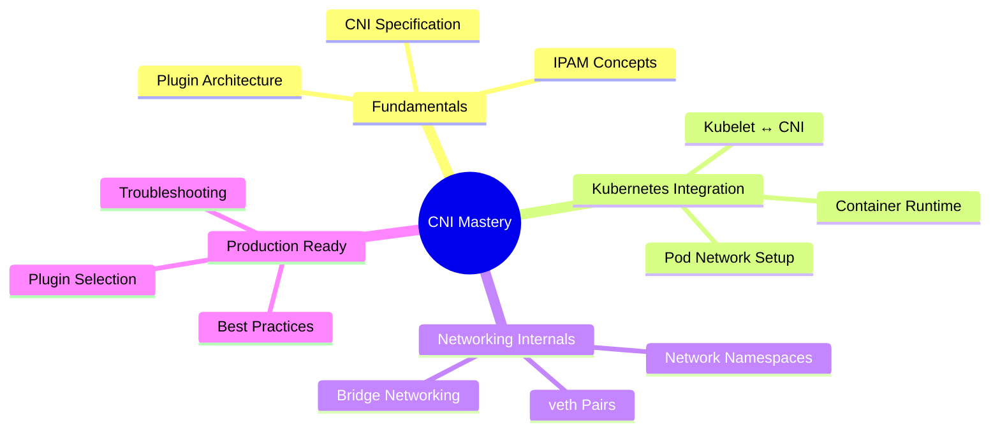

# CNI Networking Mastery for Minikube 🌐

Welcome to the comprehensive guide for understanding **Container Network Interface (CNI)** in Kubernetes with Minikube!

---

## 📚 Table of Contents

| Chapter | Topic | Description |
|---------|-------|-------------|
| [01](01-cni-fundamentals.md) | **CNI Fundamentals** | What is CNI, specifications, and core concepts |
| [02](02-cni-architecture.md) | **CNI Architecture** | How CNI integrates with Kubernetes |
| [03](03-cni-plugins-deep-dive.md) | **CNI Plugins Deep Dive** | Calico, Flannel, Cilium, Weave comparison |
| [04](04-pod-networking-internals.md) | **Pod Networking Internals** | veth pairs, bridges, network namespaces |
| [05](05-cross-node-networking.md) | **Cross-Node Networking** | Overlay networks, VXLAN, IPIP, BGP |
| [06](06-minikube-cni-lab.md) | **Minikube CNI Labs** | Hands-on practical labs |

---

## 🎯 Learning Objectives

After completing this guide, you will:



---

## 🏗️ Architecture Overview

```
┌─────────────────────────────────────────────────────────────────────────────┐
│                         KUBERNETES CLUSTER                                   │
│                                                                              │
│  ┌─────────────────────────────────────────────────────────────────────────┐│
│  │                           CONTROL PLANE                                  ││
│  │  ┌──────────────┐  ┌──────────────┐  ┌──────────────┐                  ││
│  │  │  API Server  │  │  Controller  │  │   Scheduler  │                  ││
│  │  │              │  │   Manager    │  │              │                  ││
│  │  └──────────────┘  └──────────────┘  └──────────────┘                  ││
│  └─────────────────────────────────────────────────────────────────────────┘│
│                                    │                                         │
│                                    ▼                                         │
│  ┌─────────────────────┐    ┌─────────────────────┐                         │
│  │       NODE 1        │    │       NODE 2        │                         │
│  │                     │    │                     │                         │
│  │  ┌───────────────┐  │    │  ┌───────────────┐  │                         │
│  │  │    Kubelet    │  │    │  │    Kubelet    │  │                         │
│  │  └───────┬───────┘  │    │  └───────┬───────┘  │                         │
│  │          │          │    │          │          │                         │
│  │          ▼          │    │          ▼          │                         │
│  │  ┌───────────────┐  │    │  ┌───────────────┐  │                         │
│  │  │  CNI Plugin   │  │    │  │  CNI Plugin   │  │                         │
│  │  │  (Calico/     │  │    │  │  (Calico/     │  │                         │
│  │  │   Flannel)    │  │    │  │   Flannel)    │  │                         │
│  │  └───────┬───────┘  │    │  └───────┬───────┘  │                         │
│  │          │          │    │          │          │                         │
│  │          ▼          │    │          ▼          │                         │
│  │  ┌─────────────────────────────────────────┐  │                         │
│  │  │              Pod Network                 │  │                         │
│  │  │  ┌───────┐ ┌───────┐ ┌───────┐          │  │                         │
│  │  │  │Pod A  │ │Pod B  │ │Pod C  │          │  │                         │
│  │  │  │10.0.1.│ │10.0.1.│ │10.0.2.│          │  │                         │
│  │  │  │  10   │ │  11   │ │  10   │          │  │                         │
│  │  │  └───────┘ └───────┘ └───────┘          │  │                         │
│  │  └─────────────────────────────────────────┘  │                         │
│  └─────────────────────┘    └─────────────────────┘                         │
│                    │              │                                          │
│                    └──────────────┘                                          │
│                           │                                                  │
│                    ┌──────┴──────┐                                          │
│                    │   Overlay   │                                          │
│                    │   Network   │                                          │
│                    │ (VXLAN/BGP) │                                          │
│                    └─────────────┘                                          │
└─────────────────────────────────────────────────────────────────────────────┘
```

---

## 📁 Folder Structure

```
cni_networking/
├── README.md                          # This file
├── 01-cni-fundamentals.md             # CNI basics and specifications
├── 02-cni-architecture.md             # CNI Kubernetes integration
├── 03-cni-plugins-deep-dive.md        # Detailed plugin comparison
├── 04-pod-networking-internals.md     # Network namespaces & veth
├── 05-cross-node-networking.md        # Overlay networking
├── 06-minikube-cni-lab.md             # Hands-on labs
└── examples/
    ├── 00-cni-config-examples.yaml    # CNI configuration examples
    ├── 01-pod-networking-demos.yaml   # Pod networking demos
    ├── 02-network-policies.yaml       # Network policy examples
    └── README.md                      # Examples documentation
```

---

## 🚀 Quick Start

```bash
# Start Minikube with default CNI (kindnet)
minikube start

# Start Minikube with Calico CNI
minikube start --cni=calico

# Start Minikube with Cilium CNI  
minikube start --cni=cilium

# Verify CNI is working
kubectl get pods -A
kubectl get pods -o wide

# View CNI configuration
minikube ssh "cat /etc/cni/net.d/*"
```

---

## 📖 Prerequisites

Before diving in, ensure you have:

- ✅ Basic Kubernetes knowledge (Pods, Services, Deployments)
- ✅ Minikube installed and running
- ✅ kubectl configured
- ✅ Understanding of basic networking (IP, subnets, routing)

---

## 🔗 Related Resources

- [Kubernetes Networking Model](https://kubernetes.io/docs/concepts/cluster-administration/networking/)
- [CNI Specification](https://github.com/containernetworking/cni/blob/master/SPEC.md)
- [Calico Documentation](https://docs.projectcalico.org/)
- [Cilium Documentation](https://docs.cilium.io/)
- [Flannel Documentation](https://github.com/flannel-io/flannel)

---

## 📝 License

This documentation is part of the learning repository for Kubernetes networking concepts.

---

**Let's start with [Chapter 1: CNI Fundamentals →](01-cni-fundamentals.md)**
