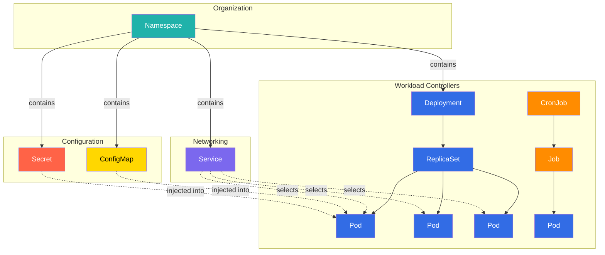
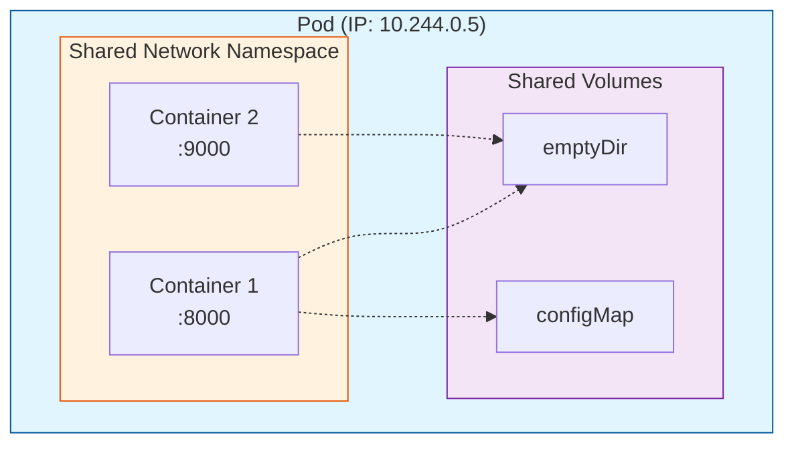
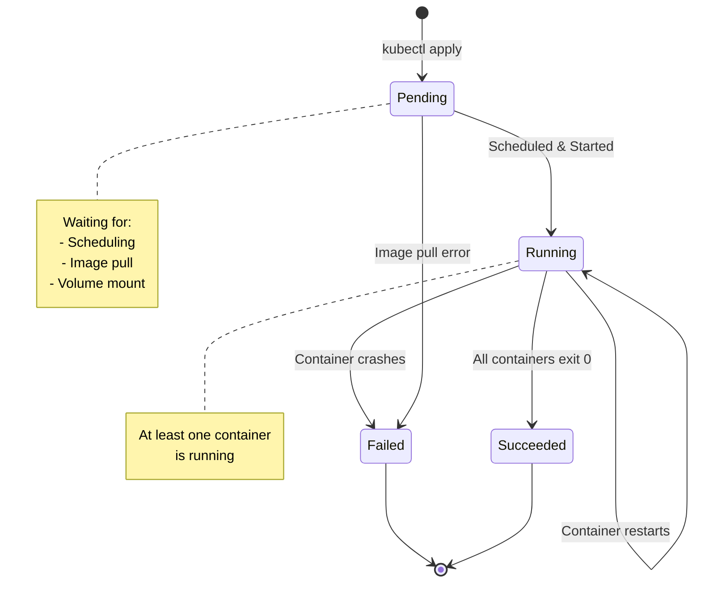
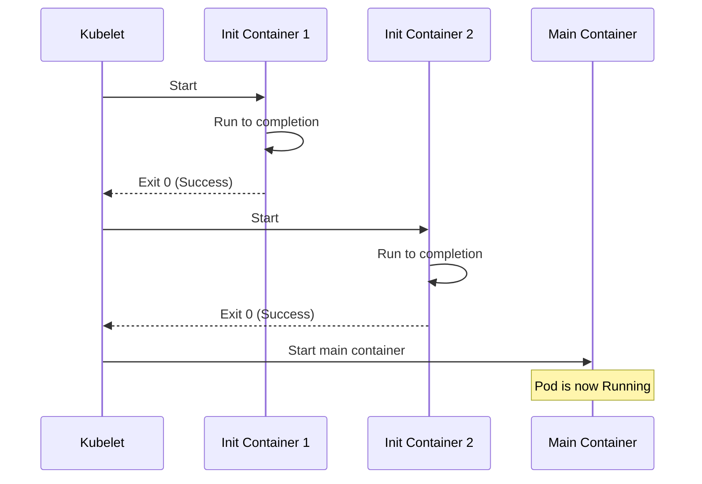
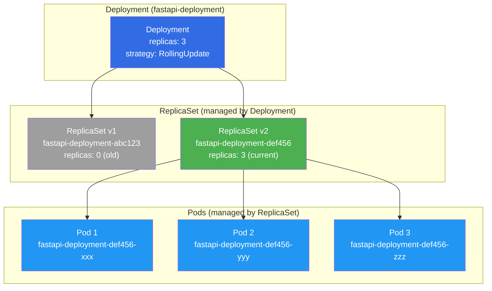
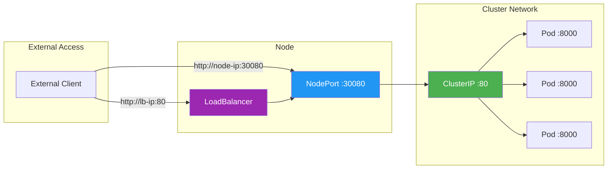
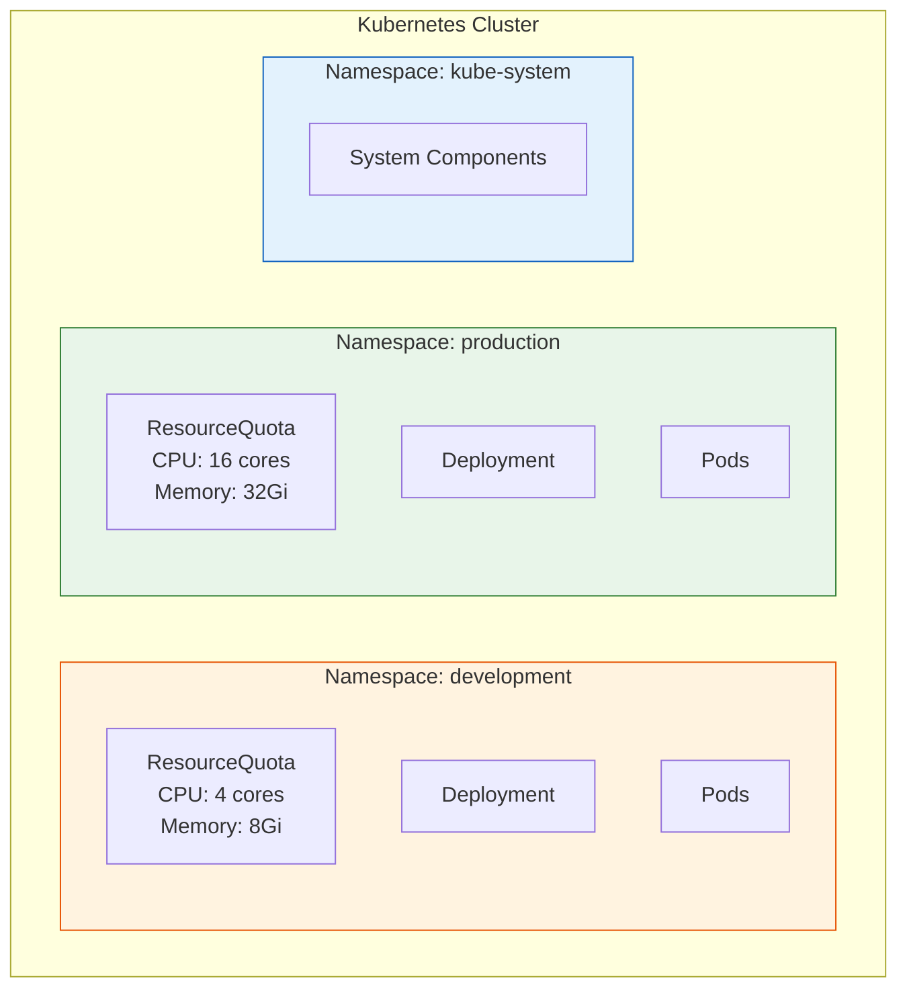
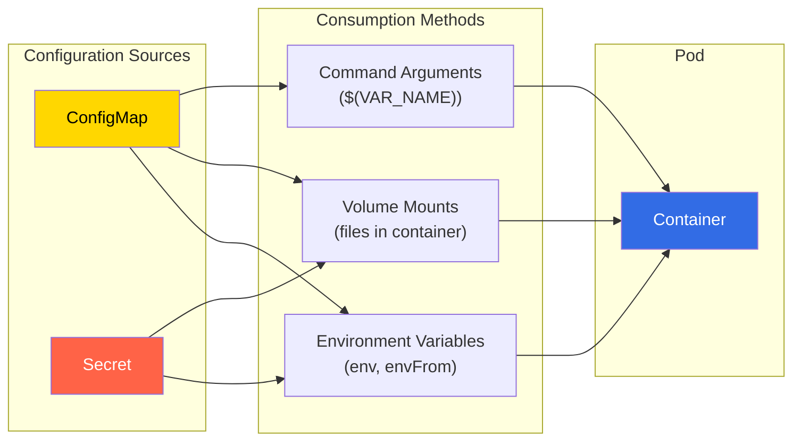
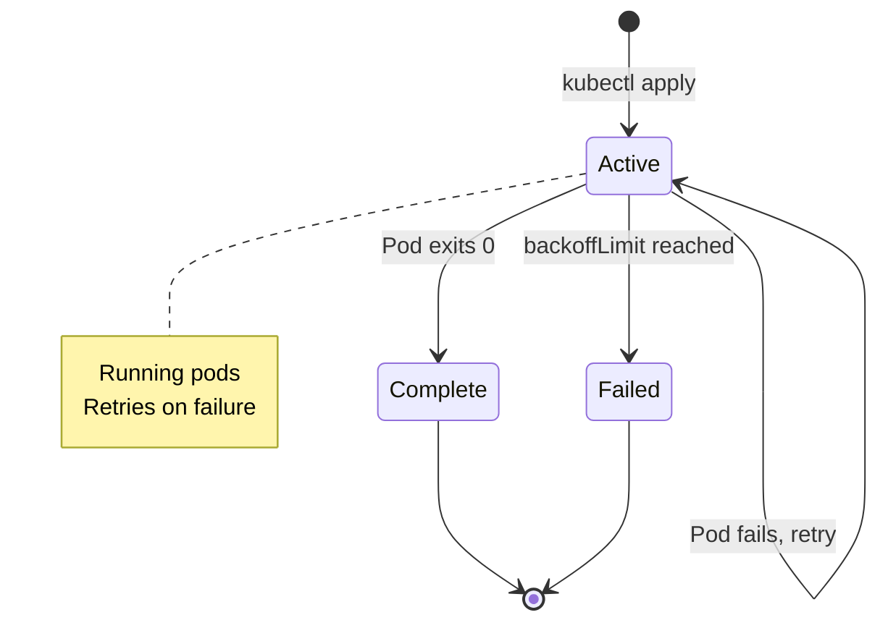
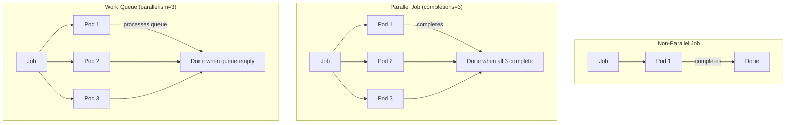

# Kubernetes Core Objects - Complete Hands-On Lab

## Prerequisites
```bash
# Ensure Minikube is running
minikube start --driver=docker

# Load FastAPI image (from previous lab)
minikube image load fastapi-app:v1

# Verify
kubectl cluster-info
```

---

## Core Objects Overview

**📚 The Big Picture - How K8s Objects Relate:**



**📋 Quick Reference:**

| Object | Short | Purpose | Created By |
|--------|-------|---------|------------|
| **Pod** | `po` | Smallest deployable unit, runs containers | User, ReplicaSet, Job |
| **ReplicaSet** | `rs` | Ensures N pod replicas run | Deployment |
| **Deployment** | `deploy` | Manages ReplicaSets, handles updates | User |
| **Service** | `svc` | Stable network endpoint for pods | User |
| **Namespace** | `ns` | Logical cluster partition | User, System |
| **ConfigMap** | `cm` | Non-sensitive configuration | User |
| **Secret** | `secret` | Sensitive configuration | User |
| **Job** | `job` | Run-to-completion workload | User, CronJob |
| **CronJob** | `cj` | Scheduled Job execution | User |

---

## Part 1: Pods - The Smallest Deployable Unit

**📚 What is a Pod?**
- **Smallest unit** in Kubernetes (not containers!)
- **One or more containers** that share resources
- **Shared network namespace** - containers can talk via localhost
- **Shared storage** - volumes accessible to all containers
- **Ephemeral** - pods are disposable and replaceable

**🔍 Pod Architecture:**



**📚 Pod Lifecycle:**




### 1.1 Simple Pod

**simple-pod.yaml**
```yaml
apiVersion: v1
kind: Pod
metadata:
  name: simple-pod
  labels:
    app: demo
    environment: dev
spec:
  containers:
  - name: fastapi
    image: fastapi-app:v1
    imagePullPolicy: Never
    ports:
    - containerPort: 8000
      name: http
```

**🔍 Understanding the Structure:**
```
Pod: simple-pod
│
└─► Container: fastapi
    ├─ Image: fastapi-app:v1
    ├─ Port: 8000
    └─ Network: Pod's IP (e.g., 10.244.0.5)
```

```bash
# Create the pod
kubectl apply -f simple-pod.yaml

# Watch pod creation
kubectl get pods --watch
# Ctrl+C to stop

# Check pod status
kubectl get pod simple-pod
# STATUS: Pending → ContainerCreating → Running

# Detailed information
kubectl describe pod simple-pod
# Shows: Events, IP address, node placement, conditions

# Get pod IP
kubectl get pod simple-pod -o wide
# Note the IP address (e.g., 10.244.0.5)

# Test the pod directly (from another pod)
kubectl run test-pod --rm -i --tty --image=busybox -- sh
# Inside test-pod:
wget -qO- http://10.244.0.5:8000  # Use your pod's IP
exit

# View logs
kubectl logs simple-pod

# Exec into pod
kubectl exec -it simple-pod -- /bin/sh
# Inside pod:
ps aux  # See running processes
env     # See environment variables
exit

# Delete pod
kubectl delete pod simple-pod
# Pod is terminated and removed
```

### 1.2 Multi-Container Pod (Sidecar Pattern)

**📚 Sidecar Pattern:**
- Main container + helper container(s)
- Share network namespace (localhost communication)
- Share volumes (shared file access)
- Common use cases: logging, monitoring, proxies

**multi-container-pod.yaml**
```yaml
apiVersion: v1
kind: Pod
metadata:
  name: multi-container-pod
  labels:
    app: sidecar-demo
spec:
  # Shared volume accessible to both containers
  volumes:
  - name: shared-logs
    emptyDir: {}  # Temporary directory, deleted when pod dies
  
  containers:
  # Main application container
  - name: app
    image: busybox
    command: ["/bin/sh"]
    args:
    - -c
    - >
      while true; do
        echo "$(date): Application log entry" >> /var/log/app.log;
        sleep 5;
      done
    volumeMounts:
    - name: shared-logs
      mountPath: /var/log  # Writes to shared volume
  
  # Sidecar container (log processor)
  - name: log-processor
    image: busybox
    command: ["/bin/sh"]
    args:
    - -c
    - >
      tail -f /var/log/app.log | while read line; do
        echo "[PROCESSED] $line";
      done
    volumeMounts:
    - name: shared-logs
      mountPath: /var/log  # Reads from shared volume
```

**🔍 How Containers Communicate:**
```
Pod: multi-container-pod
│
├─► Container: app
│   ├─ Writes to: /var/log/app.log
│   └─ Network: localhost (shared with log-processor)
│
├─► Container: log-processor
│   ├─ Reads from: /var/log/app.log
│   └─ Network: localhost (shared with app)
│
└─► Shared Volume: shared-logs
    └─ emptyDir mounted at /var/log in both containers
```

```bash
# Create multi-container pod
kubectl apply -f multi-container-pod.yaml

# View logs from specific container
kubectl logs multi-container-pod -c app
# Shows: Raw log entries

kubectl logs multi-container-pod -c log-processor
# Shows: Processed log entries

# Follow logs in real-time
kubectl logs multi-container-pod -c log-processor -f

# Exec into specific container
kubectl exec -it multi-container-pod -c app -- /bin/sh
# Inside container:
ls /var/log
cat /var/log/app.log
exit

# Test localhost communication
kubectl exec -it multi-container-pod -c app -- /bin/sh
# Both containers share network namespace, can communicate via localhost
# (If they had services listening on ports)

# Delete pod
kubectl delete pod multi-container-pod
```

### 1.3 Pod Lifecycle & Probes

**📚 Pod Lifecycle Phases:**
1. **Pending** - Pod accepted, waiting for scheduling/image pull
2. **Running** - Pod bound to node, at least one container running
3. **Succeeded** - All containers terminated successfully (exit 0)
4. **Failed** - All containers terminated, at least one failed (exit ≠ 0)
5. **Unknown** - Pod state cannot be determined

**📚 Probe Types:**
- **Liveness Probe** - "Is the container alive?" (Restart if fails)
- **Readiness Probe** - "Is the container ready for traffic?" (Remove from Service if fails)
- **Startup Probe** - "Has the container started?" (Give slow-starting apps time)

**pod-with-probes.yaml**
```yaml
apiVersion: v1
kind: Pod
metadata:
  name: pod-with-probes
  labels:
    app: probe-demo
spec:
  containers:
  - name: fastapi
    image: fastapi-app:v1
    imagePullPolicy: Never
    ports:
    - containerPort: 8000
    
    # Liveness Probe - Checks if app is alive
    # If fails 3 times, kubelet RESTARTS the container
    livenessProbe:
      httpGet:
        path: /health      # Endpoint to check
        port: 8000
      initialDelaySeconds: 10  # Wait 10s before first check
      periodSeconds: 10        # Check every 10s
      timeoutSeconds: 5        # Timeout after 5s
      failureThreshold: 3      # Restart after 3 failures
      successThreshold: 1      # Consider healthy after 1 success
    
    # Readiness Probe - Checks if app can handle traffic
    # If fails, pod removed from Service endpoints (no traffic sent)
    readinessProbe:
      httpGet:
        path: /health
        port: 8000
      initialDelaySeconds: 5   # Start checking after 5s
      periodSeconds: 5         # Check every 5s
      timeoutSeconds: 3
      failureThreshold: 3
      successThreshold: 1
    
    # Startup Probe (optional) - For slow-starting applications
    # Disables liveness/readiness checks until this succeeds
    startupProbe:
      httpGet:
        path: /health
        port: 8000
      initialDelaySeconds: 0
      periodSeconds: 5
      timeoutSeconds: 3
      failureThreshold: 30     # Give up to 150s (30 * 5s) to start
    
    # Resource limits
    resources:
      requests:
        memory: "64Mi"
        cpu: "100m"
      limits:
        memory: "128Mi"
        cpu: "500m"
```

**🔍 Probe Check Types:**
```yaml
# HTTP GET probe (most common for web apps)
livenessProbe:
  httpGet:
    path: /health
    port: 8000
    httpHeaders:
    - name: Custom-Header
      value: Value

# TCP Socket probe (for non-HTTP services)
livenessProbe:
  tcpSocket:
    port: 8000

# Exec probe (run command in container)
livenessProbe:
  exec:
    command:
    - cat
    - /tmp/healthy
```

```bash
# Create pod with probes
kubectl apply -f pod-with-probes.yaml

# Watch pod events
kubectl get events --watch --field-selector involvedObject.name=pod-with-probes

# Check probe status
kubectl describe pod pod-with-probes
# Look for: Liveness, Readiness, Startup probe results

# View conditions
kubectl get pod pod-with-probes -o jsonpath='{.status.conditions[*].type}'
# Shows: Initialized, Ready, ContainersReady, PodScheduled

# Simulate liveness probe failure
kubectl exec -it pod-with-probes -- /bin/sh
# Inside pod, if app had /health endpoint, we could break it
# For demo, just exit
exit

# Watch pod restarts
kubectl get pod pod-with-probes --watch
# If liveness probe fails, RESTARTS column increases

# Check restart count
kubectl get pod pod-with-probes -o jsonpath='{.status.containerStatuses[0].restartCount}'

# Delete pod
kubectl delete pod pod-with-probes
```

**💡 Probe Best Practices:**

```yaml
# ✅ GOOD: Liveness checks app health, not dependencies
livenessProbe:
  httpGet:
    path: /health  # Returns 200 if app process is running

# ❌ BAD: Liveness checks database (will restart pod unnecessarily)
livenessProbe:
  httpGet:
    path: /db-check  # Returns 500 if DB is down

# ✅ GOOD: Readiness checks app + dependencies
readinessProbe:
  httpGet:
    path: /ready  # Returns 200 only if app AND DB are ready

# ✅ GOOD: Give slow apps time to start
startupProbe:
  httpGet:
    path: /health
  failureThreshold: 30  # 30 * 10s = 5 minutes to start
  periodSeconds: 10
```

### 1.4 Init Containers

**📚 What are Init Containers?**
- Run **before** main containers start
- Run **sequentially** (one after another)
- Must **complete successfully** before main containers start
- Use for: setup tasks, waiting for dependencies, migrations



**pod-with-init.yaml**
```yaml
apiVersion: v1
kind: Pod
metadata:
  name: pod-with-init
spec:
  # Init containers run first, in order
  initContainers:
  - name: wait-for-db
    image: busybox
    command: ['sh', '-c', 'until nslookup db-service; do echo waiting for db; sleep 2; done']
  
  - name: init-config
    image: busybox
    command: ['sh', '-c', 'echo "config=value" > /work-dir/config.txt']
    volumeMounts:
    - name: workdir
      mountPath: /work-dir
  
  # Main containers start after ALL init containers succeed
  containers:
  - name: app
    image: busybox
    command: ['sh', '-c', 'cat /work-dir/config.txt && sleep 3600']
    volumeMounts:
    - name: workdir
      mountPath: /work-dir
  
  volumes:
  - name: workdir
    emptyDir: {}
```

```bash
# Create pod with init containers
kubectl apply -f pod-with-init.yaml

# Watch pod phases
kubectl get pod pod-with-init --watch
# Output: Init:0/2 → Init:1/2 → Init:2/2 → Running

# Check init container status
kubectl describe pod pod-with-init
# Look for: Init Containers section

# View init container logs
kubectl logs pod-with-init -c wait-for-db
kubectl logs pod-with-init -c init-config

# Delete
kubectl delete pod pod-with-init
```

**💡 Common Init Container Use Cases:**
```yaml
# 1. Wait for a service to be available
initContainers:
- name: wait-for-api
  image: busybox
  command: ['sh', '-c', 'until wget -q http://api-service/health; do sleep 2; done']

# 2. Clone a git repo
initContainers:
- name: git-clone
  image: alpine/git
  command: ['git', 'clone', 'https://github.com/user/repo.git', '/app']
  volumeMounts:
  - name: app-code
    mountPath: /app

# 3. Run database migrations
initContainers:
- name: db-migrate
  image: my-app:v1
  command: ['./migrate.sh']
```

---


## Part 2: ReplicaSet & Deployment

**📚 ReplicaSet:**
- Ensures specified number of pod replicas are running
- Replaces pods if they die
- Selector-based (uses labels to find pods)
- **Usually not created directly** - Deployments create them

**📚 Deployment:**
- Higher-level abstraction over ReplicaSets
- Manages rolling updates and rollbacks
- Creates new ReplicaSets for updates
- **This is what you actually use** in production

**🔍 Deployment Hierarchy:**




### 2.1 ReplicaSet (Understanding the Basics)

**replicaset.yaml**
```yaml
apiVersion: apps/v1
kind: ReplicaSet
metadata:
  name: fastapi-replicaset
  labels:
    app: fastapi
spec:
  # Desired number of pod replicas
  replicas: 3
  
  # How to find pods managed by this ReplicaSet
  selector:
    matchLabels:
      app: fastapi
      version: v1
  
  # Template for creating new pods
  template:
    metadata:
      labels:
        app: fastapi  # Must match selector
        version: v1   # Must match selector
    spec:
      containers:
      - name: fastapi
        image: fastapi-app:v1
        imagePullPolicy: Never
        ports:
        - containerPort: 8000
```

**🔍 How ReplicaSet Works:**
```
ReplicaSet: fastapi-replicaset (replicas: 3)
│
├─► Watches for pods with labels: app=fastapi, version=v1
│
├─► Current State: 3 pods running
└─► Desired State: 3 pods

If pod dies → ReplicaSet creates new pod
If you delete pod → ReplicaSet recreates it immediately
If you scale up → ReplicaSet creates more pods
If you scale down → ReplicaSet deletes extra pods
```

```bash
# Create ReplicaSet
kubectl apply -f replicaset.yaml

# View ReplicaSet
kubectl get replicaset
# Shows: DESIRED=3, CURRENT=3, READY=3

# View pods created by ReplicaSet
kubectl get pods -l app=fastapi
# You'll see 3 pods with generated names: fastapi-replicaset-xxxxx

# Describe ReplicaSet
kubectl describe replicaset fastapi-replicaset
# Shows: Pods managed, events

# Test self-healing: Delete a pod
POD_NAME=$(kubectl get pods -l app=fastapi -o jsonpath='{.items[0].metadata.name}')
kubectl delete pod $POD_NAME

# Watch new pod creation
kubectl get pods -l app=fastapi --watch
# ReplicaSet immediately creates new pod!

# Scale ReplicaSet
kubectl scale replicaset fastapi-replicaset --replicas=5
kubectl get pods -l app=fastapi
# Now 5 pods running

# Scale down
kubectl scale replicaset fastapi-replicaset --replicas=2
kubectl get pods -l app=fastapi
# 3 pods terminated, 2 remain

# Delete ReplicaSet (deletes all pods too)
kubectl delete replicaset fastapi-replicaset
```

### 2.2 Deployment - The Right Way

**📚 Why Deployments over ReplicaSets?**
- **Rolling updates** - Zero downtime deployments
- **Rollback** - Revert to previous version
- **Version history** - Keep track of changes
- **Declarative updates** - Change image, replicas, etc. easily

**deployment.yaml**
```yaml
apiVersion: apps/v1
kind: Deployment
metadata:
  name: fastapi-deployment
  labels:
    app: fastapi
  annotations:
    description: "FastAPI application deployment"
    version: "1.0"
spec:
  # Desired number of pods
  replicas: 3
  
  # Rolling update strategy
  strategy:
    type: RollingUpdate  # Can also be: Recreate
    rollingUpdate:
      maxSurge: 1        # Max 1 extra pod during update (25% of replicas)
      maxUnavailable: 0  # No pods unavailable during update (zero downtime)
  
  # How to find pods
  selector:
    matchLabels:
      app: fastapi
  
  # Pod template
  template:
    metadata:
      labels:
        app: fastapi
    spec:
      containers:
      - name: fastapi
        image: fastapi-app:v1  # Initial version
        imagePullPolicy: Never
        ports:
        - containerPort: 8000
          name: http
        
        # Health checks
        livenessProbe:
          httpGet:
            path: /health
            port: 8000
          initialDelaySeconds: 10
          periodSeconds: 10
        
        readinessProbe:
          httpGet:
            path: /health
            port: 8000
          initialDelaySeconds: 5
          periodSeconds: 5
        
        # Resources
        resources:
          requests:
            cpu: "100m"
            memory: "128Mi"
          limits:
            cpu: "500m"
            memory: "256Mi"
```

```bash
# Create Deployment
kubectl apply -f deployment.yaml

# View Deployment
kubectl get deployment
# Shows: READY, UP-TO-DATE, AVAILABLE

# View ReplicaSet created by Deployment
kubectl get replicaset
# Deployment creates a ReplicaSet automatically
# Name format: <deployment-name>-<pod-template-hash>

# View pods
kubectl get pods -l app=fastapi
# 3 pods running

# Describe Deployment
kubectl describe deployment fastapi-deployment
# Shows: Replicas, Strategy, Conditions, Events

# Check rollout status
kubectl rollout status deployment/fastapi-deployment
# Shows: "deployment successfully rolled out"
```

### 2.3 Rolling Updates

**📚 Rolling Update Process:**
```
Initial State: 3 pods running v1
│
├─ Create 1 new pod (v2)     [v1, v1, v1, v2]
├─ Wait for v2 pod to be Ready
├─ Terminate 1 old pod (v1)  [v1, v1, v2]
├─ Create 1 new pod (v2)     [v1, v1, v2, v2]
├─ Wait for v2 pod to be Ready
├─ Terminate 1 old pod (v1)  [v1, v2, v2]
├─ Create 1 new pod (v2)     [v1, v2, v2, v2]
├─ Wait for v2 pod to be Ready
└─ Terminate last old pod    [v2, v2, v2]

Result: Zero downtime! Traffic always served.
```

```bash
# Method 1: Update image using kubectl
kubectl set image deployment/fastapi-deployment fastapi=fastapi-app:v2
# Note: We don't have v2, so use v1 for demo
kubectl set image deployment/fastapi-deployment fastapi=nginx:latest

# Watch rolling update
kubectl rollout status deployment/fastapi-deployment --watch

# Watch pods during update
kubectl get pods -l app=fastapi --watch
# You'll see:
# - New pods created
# - Old pods terminated
# - Gradual replacement

# Method 2: Update via YAML
# Edit deployment.yaml, change image to nginx:latest
kubectl apply -f deployment.yaml

# View rollout history
kubectl rollout history deployment/fastapi-deployment
# Shows: Revision history

# View specific revision details
kubectl rollout history deployment/fastapi-deployment --revision=1
kubectl rollout history deployment/fastapi-deployment --revision=2

# Pause rollout (useful for canary deployments)
kubectl rollout pause deployment/fastapi-deployment

# Resume rollout
kubectl rollout resume deployment/fastapi-deployment
```

### 2.4 Rollbacks

**📚 Why Rollback?**
- New version has bugs
- Performance issues
- Failed health checks
- Quick recovery needed

```bash
# Rollback to previous version
kubectl rollout undo deployment/fastapi-deployment

# Watch rollback
kubectl rollout status deployment/fastapi-deployment

# Rollback to specific revision
kubectl rollout undo deployment/fastapi-deployment --to-revision=1

# Check history after rollback
kubectl rollout history deployment/fastapi-deployment

# View ReplicaSets
kubectl get replicaset
# You'll see:
# - Current ReplicaSet (3 pods)
# - Old ReplicaSet (0 pods, kept for rollback)
```

**🔍 What Happens During Rollback:**
```
Current: 3 pods running v2 (bad version)
│
├─ Deployment switches to old ReplicaSet (v1)
├─ Scales up old ReplicaSet: 0 → 1 → 2 → 3
├─ Scales down new ReplicaSet: 3 → 2 → 1 → 0
└─ Result: Back to v1, zero downtime!
```

### 2.5 Scaling

```bash
# Scale up
kubectl scale deployment fastapi-deployment --replicas=5
kubectl get pods -l app=fastapi
# 5 pods now

# Scale down
kubectl scale deployment fastapi-deployment --replicas=2

# Autoscaling (HorizontalPodAutoscaler)
kubectl autoscale deployment fastapi-deployment --min=2 --max=10 --cpu-percent=80
# Scales based on CPU usage

# View autoscaler
kubectl get hpa

# Delete autoscaler
kubectl delete hpa fastapi-deployment

# Clean up
kubectl delete deployment fastapi-deployment
```

---

## Part 3: Services - Stable Network Endpoints

**📚 Service Types:**
1. **ClusterIP** (default) - Internal only, cluster IP
2. **NodePort** - Exposes on node IP:port (30000-32767)
3. **LoadBalancer** - Cloud load balancer (AWS ELB, GCP LB)
4. **ExternalName** - DNS CNAME record

**🔍 Service Types Comparison:**



| Type | Accessibility | Use Case | Port Range |
|------|---------------|----------|------------|
| **ClusterIP** | Internal only | Service-to-service | Any |
| **NodePort** | External via node IP | Dev/testing, on-prem | 30000-32767 |
| **LoadBalancer** | External via LB IP | Production (cloud) | Any |
| **ExternalName** | DNS alias | External service reference | N/A |


### 3.1 ClusterIP Service (Internal)

**service-clusterip.yaml**
```yaml
apiVersion: apps/v1
kind: Deployment
metadata:
  name: backend
spec:
  replicas: 3
  selector:
    matchLabels:
      app: backend
  template:
    metadata:
      labels:
        app: backend
    spec:
      containers:
      - name: fastapi
        image: fastapi-app:v1
        imagePullPolicy: Never
        ports:
        - containerPort: 8000
---
apiVersion: v1
kind: Service
metadata:
  name: backend-service
spec:
  type: ClusterIP  # Default, can omit
  selector:
    app: backend   # Route to pods with this label
  ports:
  - name: http
    protocol: TCP
    port: 80       # Service port (what clients connect to)
    targetPort: 8000  # Container port (where traffic goes)
  # Optional: specify ClusterIP
  # clusterIP: 10.96.0.50
```

**🔍 How ClusterIP Works:**
```
Client Pod
│
│ curl http://backend-service
│ DNS: backend-service → 10.96.0.50 (ClusterIP)
│
▼
iptables rules (kube-proxy)
│
├─► Pod 1 (10.244.0.5:8000) - 33% traffic
├─► Pod 2 (10.244.0.6:8000) - 33% traffic
└─► Pod 3 (10.244.0.7:8000) - 33% traffic

Load balancing: Round-robin by default
```

```bash
# Create deployment and service
kubectl apply -f service-clusterip.yaml

# View service
kubectl get service backend-service
# Shows: TYPE=ClusterIP, CLUSTER-IP=10.96.x.x, PORT=80

# View endpoints (actual pod IPs)
kubectl get endpoints backend-service
# Shows: 3 pod IPs with port 8000

# Test service from within cluster
kubectl run test-pod --rm -i --tty --image=busybox -- sh
# Inside test-pod:
wget -qO- http://backend-service
# Works! Service name resolved via DNS
exit

# Test DNS resolution
kubectl run test-pod --rm -i --tty --image=busybox -- nslookup backend-service
# Shows: backend-service.default.svc.cluster.local → ClusterIP

# Port forward to access from laptop
kubectl port-forward service/backend-service 8080:80
# Open browser: http://localhost:8080

# Delete
kubectl delete -f service-clusterip.yaml
```

### 3.2 NodePort Service (External Access)

**service-nodeport.yaml**
```yaml
apiVersion: apps/v1
kind: Deployment
metadata:
  name: frontend
spec:
  replicas: 2
  selector:
    matchLabels:
      app: frontend
  template:
    metadata:
      labels:
        app: frontend
    spec:
      containers:
      - name: nginx
        image: nginx:latest
        ports:
        - containerPort: 80
---
apiVersion: v1
kind: Service
metadata:
  name: frontend-service
spec:
  type: NodePort
  selector:
    app: frontend
  ports:
  - name: http
    protocol: TCP
    port: 80          # ClusterIP port
    targetPort: 80    # Container port
    nodePort: 30080   # Node port (optional, auto-assigned if omitted)
                      # Range: 30000-32767
```

**🔍 How NodePort Works:**
```
External Client (Your Browser)
│
│ http://<minikube-ip>:30080
│
▼
Minikube Node (port 30080)
│
▼
iptables (DNAT to ClusterIP)
│
▼
Service: frontend-service (ClusterIP: 10.96.0.x:80)
│
├─► Pod 1 (10.244.0.8:80)
└─► Pod 2 (10.244.0.9:80)
```

```bash
# Create NodePort service
kubectl apply -f service-nodeport.yaml

# View service
kubectl get service frontend-service
# Shows: TYPE=NodePort, PORT=80:30080/TCP

# Get Minikube IP
minikube ip
# Returns: 192.168.49.2 (or similar)

# Access via NodePort
curl http://$(minikube ip):30080
# Or open in browser

# Alternative: Use minikube service command
minikube service frontend-service
# Opens browser automatically

# View service URL
minikube service frontend-service --url
# Shows: http://192.168.49.2:30080

# Delete
kubectl delete -f service-nodeport.yaml
```

### 3.3 LoadBalancer Service (Cloud/Minikube)

**service-loadbalancer.yaml**
```yaml
apiVersion: apps/v1
kind: Deployment
metadata:
  name: web-app
spec:
  replicas: 3
  selector:
    matchLabels:
      app: web
  template:
    metadata:
      labels:
        app: web
    spec:
      containers:
      - name: nginx
        image: nginx:latest
        ports:
        - containerPort: 80
---
apiVersion: v1
kind: Service
metadata:
  name: web-service
spec:
  type: LoadBalancer
  selector:
    app: web
  ports:
  - name: http
    protocol: TCP
    port: 80
    targetPort: 80
  # In cloud: Creates AWS ELB, GCP Load Balancer, etc.
  # In Minikube: Creates NodePort + tunnel
```

**🔍 LoadBalancer in Different Environments:**

```
Cloud (AWS/GCP/Azure):
├─ Creates external load balancer
├─ Assigns public IP
└─ Routes traffic to nodes → pods

Minikube:
├─ Creates NodePort internally
├─ Requires `minikube tunnel` for external IP
└─ Maps localhost → service
```

```bash
# Create LoadBalancer service
kubectl apply -f service-loadbalancer.yaml

# View service
kubectl get service web-service
# EXTERNAL-IP shows: <pending> (in Minikube)

# In another terminal, run tunnel
minikube tunnel
# This creates a route from your machine to Minikube

# Check service again
kubectl get service web-service
# EXTERNAL-IP now shows: 10.x.x.x or 127.0.0.1

# Access service
curl http://$(kubectl get service web-service -o jsonpath='{.status.loadBalancer.ingress[0].ip}')

# Or use minikube service
minikube service web-service

# Delete
kubectl delete -f service-loadbalancer.yaml
# Stop tunnel with Ctrl+C in other terminal
```

### 3.4 Service Discovery via DNS

**📚 DNS Names in Kubernetes:**
```
Service: my-service
Namespace: default
Full DNS: my-service.default.svc.cluster.local

Format: <service-name>.<namespace>.svc.cluster.local
```

**service-dns-demo.yaml**
```yaml
# Backend service in namespace: backend-ns
apiVersion: v1
kind: Namespace
metadata:
  name: backend-ns
---
apiVersion: apps/v1
kind: Deployment
metadata:
  name: api
  namespace: backend-ns
spec:
  replicas: 2
  selector:
    matchLabels:
      app: api
  template:
    metadata:
      labels:
        app: api
    spec:
      containers:
      - name: api
        image: fastapi-app:v1
        imagePullPolicy: Never
        ports:
        - containerPort: 8000
---
apiVersion: v1
kind: Service
metadata:
  name: api-service
  namespace: backend-ns
spec:
  selector:
    app: api
  ports:
  - port: 80
    targetPort: 8000
---
# Frontend pod in namespace: frontend-ns
apiVersion: v1
kind: Namespace
metadata:
  name: frontend-ns
---
apiVersion: v1
kind: Pod
metadata:
  name: frontend-pod
  namespace: frontend-ns
spec:
  containers:
  - name: frontend
    image: busybox
    command: ["sleep", "3600"]
```

```bash
# Create resources
kubectl apply -f service-dns-demo.yaml

# Test DNS from frontend pod
kubectl exec -n frontend-ns frontend-pod -- nslookup api-service.backend-ns
# Returns: IP address of api-service

# Test different DNS formats
kubectl exec -n frontend-ns frontend-pod -- wget -qO- http://api-service.backend-ns
# Short name with namespace

kubectl exec -n frontend-ns frontend-pod -- wget -qO- http://api-service.backend-ns.svc
# With .svc

kubectl exec -n frontend-ns frontend-pod -- wget -qO- http://api-service.backend-ns.svc.cluster.local
# Full DNS name

# View DNS config
kubectl exec -n frontend-ns frontend-pod -- cat /etc/resolv.conf
# Shows:
# nameserver 10.96.0.10 (CoreDNS)
# search frontend-ns.svc.cluster.local svc.cluster.local cluster.local

# Clean up
kubectl delete -f service-dns-demo.yaml
```

**💡 DNS Search Domains:**
```yaml
# Pod in namespace: default
# Can access services as:
- my-service              # Same namespace
- my-service.default      # Explicit namespace
- my-service.other-ns     # Different namespace
- my-service.other-ns.svc.cluster.local  # Full FQDN
```

---

## Part 4: Namespaces - Logical Isolation

**📚 What are Namespaces?**
- **Logical partitions** of a cluster
- **Isolate resources** (not network by default)
- **Resource quotas** per namespace
- **RBAC** per namespace
- **Default namespaces**: default, kube-system, kube-public, kube-node-lease

### 4.1 Creating and Using Namespaces

**namespaces-demo.yaml**
```yaml
# Development namespace
apiVersion: v1
kind: Namespace
metadata:
  name: development
  labels:
    environment: dev
    team: engineering
---
# Production namespace
apiVersion: v1
kind: Namespace
metadata:
  name: production
  labels:
    environment: prod
    team: engineering
---
# Deployment in development
apiVersion: apps/v1
kind: Deployment
metadata:
  name: app
  namespace: development
spec:
  replicas: 1
  selector:
    matchLabels:
      app: myapp
  template:
    metadata:
      labels:
        app: myapp
    spec:
      containers:
      - name: app
        image: nginx:latest
        resources:
          requests:
            memory: "64Mi"
            cpu: "100m"
---
# Deployment in production
apiVersion: apps/v1
kind: Deployment
metadata:
  name: app
  namespace: production
spec:
  replicas: 2
  selector:
    matchLabels:
      app: myapp
  template:
    metadata:
      labels:
        app: myapp
    spec:
      containers:
      - name: app
        image: nginx:latest
        resources:
          requests:
            memory: "128Mi"
            cpu: "200m"
```

```bash
# Create namespaces and resources
kubectl apply -f namespaces-demo.yaml

# View resources in specific namespace
kubectl get pods -n development
# Shows: 1 pod

kubectl get pods -n production
# Shows: 2 pods

kubectl get pods
# Shows: "No resources found" (because defaults to 'default' namespace)

# Get all resources in a namespace
kubectl get all -n development

# Switch default namespace (so you don't have to type -n)
kubectl config set-context --current --namespace=development

# Now this works for development namespace
kubectl get pods

# Reset to default
kubectl config set-context --current --namespace=default

# Delete namespaces (deletes EVERYTHING inside them)
kubectl delete namespace development
kubectl delete namespace production
```

### 4.2 Resource Quotas

**📚 Resource Quotas:**
- Limit total resource consumption per namespace
- Prevent one team from consuming all cluster resources
- Enforce limits on CPU, memory, storage, and object counts

**🔍 Namespace Isolation:**



**resource-quota.yaml**
```yaml
apiVersion: v1
kind: ResourceQuota
metadata:
  name: dev-quota
  namespace: development
spec:
  hard:
    # Compute resources
    requests.cpu: "4"          # Total CPU requests
    requests.memory: 8Gi       # Total memory requests
    limits.cpu: "8"            # Total CPU limits
    limits.memory: 16Gi        # Total memory limits
    
    # Object counts
    pods: "20"                 # Max 20 pods
    services: "10"             # Max 10 services
    secrets: "20"              # Max 20 secrets
    configmaps: "20"           # Max 20 configmaps
    persistentvolumeclaims: "5" # Max 5 PVCs
```

**limit-range.yaml**
```yaml
apiVersion: v1
kind: LimitRange
metadata:
  name: dev-limits
  namespace: development
spec:
  limits:
  - type: Container
    default:           # Default limits if not specified
      cpu: "500m"
      memory: "256Mi"
    defaultRequest:    # Default requests if not specified
      cpu: "100m"
      memory: "128Mi"
    max:               # Maximum allowed
      cpu: "2"
      memory: "2Gi"
    min:               # Minimum required
      cpu: "50m"
      memory: "64Mi"
```

```bash
# Create namespace with quota
kubectl create namespace development
kubectl apply -f resource-quota.yaml
kubectl apply -f limit-range.yaml

# View quota
kubectl get resourcequota -n development
kubectl describe resourcequota dev-quota -n development
# Shows: Used vs Hard limits

# View limit range
kubectl describe limitrange dev-limits -n development

# Try to exceed quota (will fail)
kubectl run test --image=nginx -n development --requests='cpu=10'
# Error: exceeded quota

# Delete
kubectl delete namespace development
```

---


## Part 5: ConfigMap & Secret - Configuration

**📚 ConfigMap:**
- Store non-confidential data in key-value pairs
- Decouple configuration from image content
- Consume as: Environment variables, command-line arguments, or config files in a volume

**📚 Secret:**
- Store confidential data (passwords, OAuth tokens, ssh keys)
- Stored as Base64 encoded strings
- Similar consumption to ConfigMaps (Env vars, Volumes)

**🔍 Consumption Methods:**



**📚 Secret Types:**
| Type | Usage |
|------|-------|
| `Opaque` | Generic secret (default) |
| `kubernetes.io/tls` | TLS certificate + key |
| `kubernetes.io/dockerconfigjson` | Docker registry auth |
| `kubernetes.io/basic-auth` | Username + password |
| `kubernetes.io/ssh-auth` | SSH private key |


### 5.1 Creating Configuration

**app-config.yaml**
```yaml
apiVersion: v1
kind: ConfigMap
metadata:
  name: app-config
data:
  # Key-value pairs
  APP_COLOR: "blue"
  APP_MODE: "production"
  # File-like content
  game.properties: |
    lives=3
    enemies=aliens
    secret.code.lives=30
```

**app-secret.yaml**
```yaml
apiVersion: v1
kind: Secret
metadata:
  name: app-secret
type: Opaque
stringData:
  # stringData allows you to put plain text, k8s converts to base64 automatically
  DB_PASSWORD: "supersecurepassword123"
  API_KEY: "xyz-123-abc"
# data:
  # If using 'data', map values must be base64 encoded manually:
  # echo -n "secret" | base64
```

### 5.2 Consuming Configuration in Pods

**pod-with-config.yaml**
```yaml
apiVersion: v1
kind: Pod
metadata:
  name: config-demo
spec:
  containers:
  - name: dummy-app
    image: busybox
    command: ["/bin/sh", "-c", "env; ls /config; sleep 3600"]
    
    # Method 1: Environment Variables
    env:
      # From ConfigMap
      - name: COLOR
        valueFrom:
          configMapKeyRef:
            name: app-config
            key: APP_COLOR
      
      # From Secret
      - name: DATABASE_PASSWORD
        valueFrom:
          secretKeyRef:
            name: app-secret
            key: DB_PASSWORD
            
    # Method 2: Load all as Env Vars
    envFrom:
      - configMapRef:
          name: app-config
          
    # Method 3: Mount as Volume (Files)
    volumeMounts:
    - name: config-volume
      mountPath: /config
      readOnly: true
      
  volumes:
  - name: config-volume
    configMap:
      name: app-config
```

```bash
# Create ConfigMap and Secret
kubectl apply -f app-config.yaml
kubectl apply -f app-secret.yaml

# Verify creation
kubectl get configmap
kubectl get secret
kubectl describe configmap app-config

# Decode secret manually
kubectl get secret app-secret -o jsonpath='{.data.DB_PASSWORD}' | base64 --decode

# Create Pod
kubectl apply -f pod-with-config.yaml

# Verify Environment Variables
kubectl logs config-demo
# You should see COLOR=blue, DATABASE_PASSWORD=supersecurepassword123

# Verify Volume Mount
kubectl exec config-demo -- ls /config
# Shows: game.properties

kubectl exec config-demo -- cat /config/game.properties

# Cleanup
kubectl delete pod config-demo
kubectl delete configmap app-config
kubectl delete secret app-secret
```

---

## Part 6: Jobs & CronJobs - Batch Workloads

**📚 Job:**
- Creates one or more Pods and ensures they successfully terminate
- Used for: Batch processing, one-off tasks, database migrations
- **RestartPolicy** must be `OnFailure` or `Never`

**📚 CronJob:**
- Runs Jobs on a time-based schedule
- Syntax: Standard Cron format `* * * * *` (Minute Hour Dom Month Dow)

**🔍 Job Lifecycle:**



**🔍 Job Parallelism Patterns:**



| Pattern | completions | parallelism | Use Case |
|---------|-------------|-------------|----------|
| Single Pod | 1 | 1 | One-off task |
| Fixed Completion | N | M | Process N items, M at a time |
| Work Queue | unset | M | Process queue until empty |


### 6.1 Job (One-off Task)

**batch-job.yaml**
```yaml
apiVersion: batch/v1
kind: Job
metadata:
  name: pi-calculation
spec:
  # Retries before marking job as failed
  backoffLimit: 4
  
  # Clean up finished job after 100 seconds
  ttlSecondsAfterFinished: 100
  
  template:
    spec:
      containers:
      - name: pi
        image: perl
        command: ["perl",  "-Mbignum=bpi", "-wle", "print bpi(2000)"]
      restartPolicy: Never
```

### 6.2 CronJob (Scheduled Task)

**cronjob.yaml**
```yaml
apiVersion: batch/v1
kind: CronJob
metadata:
  name: hello-cron
spec:
  schedule: "*/1 * * * *"  # Runs every minute
  jobTemplate:
    spec:
      template:
        spec:
          containers:
          - name: hello
            image: busybox
            imagePullPolicy: IfNotPresent
            command:
            - /bin/sh
            - -c
            - date; echo Hello from Kubernetes CronJob
          restartPolicy: OnFailure
```

```bash
# Create Job
kubectl apply -f batch-job.yaml

# Check Job status
kubectl get jobs
# Shows: COMPLETIONS 0/1 -> 1/1

# View Pod created by Job
kubectl get pods
# Name: pi-calculation-xxxxx

# View logs (the result of calculation)
kubectl logs job/pi-calculation

# Create CronJob
kubectl apply -f cronjob.yaml

# Check CronJob
kubectl get cronjob
# Shows schedule and last schedule time

# Watch jobs being created (Wait 1 minute)
kubectl get jobs --watch

# View logs of a specific execution
# Get the pod name first
kubectl get pods --selector=job-name=<job-name-from-previous-step>
kubectl logs <pod-name>

# Delete
kubectl delete job pi-calculation
kubectl delete cronjob hello-cron
```

---

## Summary of Core Objects

| Object | Abbreviation | Purpose |
|--------|--------------|---------|
| `Pod` | `po` | Single atomic unit, one or more containers |
| `ReplicaSet` | `rs` | Ensures N copies of a pod run |
| `Deployment` | `deploy` | Manages updates to applications (ReplicaSets) |
| `Service` | `svc` | Network endpoint (internal or external) |
| `Namespace` | `ns` | Resource isolation boundary |
| `ConfigMap` | `cm` | Plain-text configuration |
| `Secret` | `secret` | Encrypted/Obfuscated configuration |
| `Job` | `job` | Run-to-completion task |
| `CronJob` | `cj` | Scheduled task |

**🎉 Lab Completed!**
