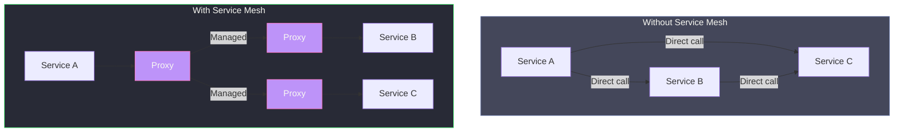
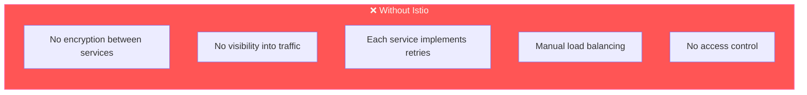
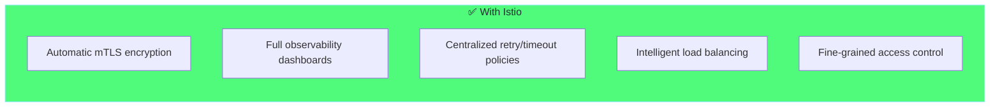
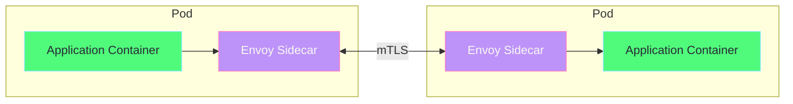
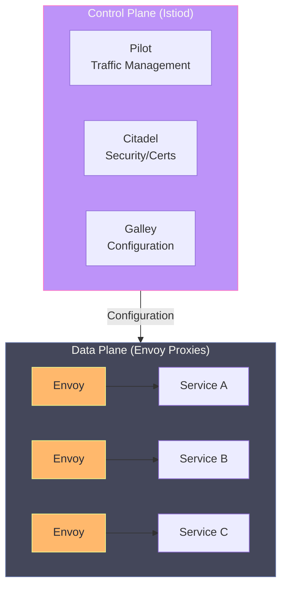

# Introduction to Istio Service Mesh

## What is a Service Mesh?

A **service mesh** is a dedicated infrastructure layer for handling service-to-service communication. It makes communication between services **secure, fast, and reliable**.



---

## What is Istio?

**Istio** is the most popular open-source service mesh that runs on Kubernetes. It provides:

| Feature | Description |
|---------|-------------|
| **Traffic Management** | Route traffic, load balance, canary deployments |
| **Security** | mTLS encryption, authentication, authorization |
| **Observability** | Metrics, distributed tracing, logging |
| **Resiliency** | Retries, timeouts, circuit breakers |

---

## Why Use Istio?

### Without Istio (Problems)



### With Istio (Solutions)



---

## Key Concepts

### 1. Sidecar Proxy Pattern

Istio uses the **sidecar pattern** - a proxy runs alongside each service:



**Benefits of Sidecar:**
- Application code doesn't change
- All traffic goes through the proxy
- Proxy handles security, retries, metrics
- Centralized configuration

---

### 2. Data Plane vs Control Plane



| Component | Description |
|-----------|-------------|
| **Control Plane** | Brain of Istio - manages configuration, certificates |
| **Data Plane** | Envoy proxies that handle actual traffic |
| **Istiod** | Single binary containing Pilot, Citadel, Galley |

---

## Istio vs Other Service Meshes

| Feature | Istio | Linkerd | Consul Connect |
|---------|-------|---------|----------------|
| **Proxy** | Envoy | linkerd2-proxy | Envoy |
| **Complexity** | High | Low | Medium |
| **Features** | Most complete | Lightweight | Good |
| **Performance** | Good | Best | Good |
| **Community** | Largest | Growing | Enterprise |

---

## Installation on Minikube

### Prerequisites

```bash
# Start Minikube with enough resources
minikube start --memory=8192 --cpus=4

# Verify cluster is running
kubectl get nodes
```

### Install Istio

```bash
# Download Istio
curl -L https://istio.io/downloadIstio | sh -

# Move to Istio directory
cd istio-*

# Add istioctl to PATH
export PATH=$PWD/bin:$PATH

# Install Istio with demo profile (includes all features)
istioctl install --set profile=demo -y

# Verify installation
kubectl get pods -n istio-system
```

### Enable Sidecar Injection

```bash
# Automatic sidecar injection for default namespace
kubectl label namespace default istio-injection=enabled

# Verify label
kubectl get namespace default --show-labels
```

### Verify Installation

```bash
# Check Istio pods are running
kubectl get pods -n istio-system

# Analyze configuration
istioctl analyze

# Expected output:
# NAME                                    READY   STATUS
# istiod-xxxxxxxxxx-xxxxx                 1/1     Running
# istio-ingressgateway-xxxxxxxxxx-xxxxx   1/1     Running
# istio-egressgateway-xxxxxxxxxx-xxxxx    1/1     Running
```

---

## What's Next?

Now that you understand what Istio is, continue to:

1. **[Architecture](02-architecture.md)** - Deep dive into Istio components
2. **[Traffic Management](03-traffic-management.md)** - Route and control traffic
3. **[Security](04-security.md)** - Secure service-to-service communication
