# Istio Architecture

## High-Level Architecture

Istio consists of two main planes:


---

## Control Plane Components

### Istiod (The Brain)

Istiod is a single binary that combines all control plane functions:

```mermaid
flowchart TB
    subgraph Istiod["Istiod"]
        Pilot["Pilot<br/>🚀 Traffic Management"]
        Citadel["Citadel<br/>🔐 Security & Certs"]
        Galley["Galley<br/>⚙️ Configuration"]
    end
    
    VirtualService[VirtualService] --> Galley
    DestinationRule[DestinationRule] --> Galley
    Gateway[Gateway] --> Galley
    
    Galley --> Pilot
    Pilot -->|"xDS API"| Envoy[Envoy Proxies]
    Citadel -->|"Certificates"| Envoy
    
    style Istiod fill:#282a36,stroke:#bd93f9,color:#f8f8f2
    style Pilot fill:#50fa7b,stroke:#8be9fd,color:#282a36
    style Citadel fill:#ff79c6,stroke:#bd93f9,color:#f8f8f2
    style Galley fill:#ffb86c,stroke:#f1fa8c,color:#282a36
```



| Component | Function |
|-----------|----------|
| **Pilot** | Converts Istio rules → Envoy configuration, service discovery |
| **Citadel** | Manages certificates for mTLS, handles identity |
| **Galley** | Validates and processes configuration |

---

## Data Plane Components

### Envoy Proxy

Envoy is a high-performance proxy that handles all traffic:

```mermaid
flowchart LR
    subgraph EnvoyProxy["Envoy Proxy Features"]
        LB["⚖️ Load Balancing"]
        mTLS["🔒 mTLS Encryption"]
        Retry["🔄 Retries"]
        CB["⛔ Circuit Breaker"]
        Metrics["📊 Metrics"]
        Trace["🔍 Tracing"]
    end
    
    style EnvoyProxy fill:#ffb86c,stroke:#f1fa8c,color:#282a36
```



**What Envoy Does:**
- Intercepts all incoming/outgoing traffic
- Encrypts traffic with mTLS
- Collects metrics and traces
- Applies routing rules, retries, timeouts
- Reports to control plane

---

## Request Flow

### How a Request Travels Through Istio


---

## Sidecar Injection

### How Sidecars Are Added to Pods

```mermaid
flowchart TB
    subgraph Before["Before Injection"]
        P1["Pod Spec<br/>(1 container)"]
    end
    
    subgraph Injection["Injection Process"]
        Webhook["Mutating Webhook"]
    end
    
    subgraph After["After Injection"]
        P2["Pod<br/>(2 containers)"]
        subgraph Containers[""]
            App["App Container"]
            Envoy["Envoy Sidecar"]
            Init["istio-init<br/>(iptables setup)"]
        end
    end
    
    P1 --> Webhook
    Webhook --> P2
    
    style Before fill:#6272a4,stroke:#bd93f9,color:#f8f8f2
    style Injection fill:#ff79c6,stroke:#bd93f9,color:#f8f8f2
    style After fill:#50fa7b,stroke:#8be9fd,color:#282a36
```

### Enable Automatic Injection

```bash
# Label namespace for automatic injection
kubectl label namespace default istio-injection=enabled

# Verify
kubectl get namespace default --show-labels

# Check pods have sidecar (2/2 READY)
kubectl get pods
# NAME          READY   STATUS
# my-app-xxx    2/2     Running    ← 2 containers = sidecar injected!
```

### Manual Injection

```bash
# Inject sidecar into existing deployment
istioctl kube-inject -f deployment.yaml | kubectl apply -f -
```

---

## Istio Installation Profiles

| Profile | Use Case | Components |
|---------|----------|------------|
| **demo** | Learning/testing | All features, high resource usage |
| **default** | Production | Balanced features |
| **minimal** | Custom setup | Only Istiod |
| **empty** | Custom setup | Nothing installed |

```bash
# Install with demo profile (recommended for learning)
istioctl install --set profile=demo -y

# Install minimal
istioctl install --set profile=minimal -y

# Check current profile
istioctl profile dump
```

---

## Istio Components in Kubernetes

```bash
# View all Istio pods
kubectl get pods -n istio-system

# Expected output:
# NAME                                    READY   STATUS
# istiod-xxxxxxxxxx-xxxxx                 1/1     Running   ← Control Plane
# istio-ingressgateway-xxxxxxxxxx-xxxxx   1/1     Running   ← Ingress
# istio-egressgateway-xxxxxxxxxx-xxxxx    1/1     Running   ← Egress
```

### Component Details


---

## Verify Installation

```bash
# 1. Check Istio pods
kubectl get pods -n istio-system

# 2. Check Istio services
kubectl get svc -n istio-system

# 3. Analyze configuration for issues
istioctl analyze

# 4. Check proxy status
istioctl proxy-status

# 5. Verify version
istioctl version
```

---

## What's Next?

Now that you understand the architecture:

1. **[Traffic Management](03-traffic-management.md)** - Control how traffic flows
2. **[Security](04-security.md)** - Secure your services with mTLS
3. **[Observability](05-observability.md)** - Monitor your mesh
