# Traffic Management in Istio

## Overview

Traffic management is Istio's core feature. It allows you to control how traffic flows between services.

```mermaid
flowchart LR
    subgraph TrafficManagement["Traffic Management"]
        VS[VirtualService<br/>🚦 Routing Rules]
        DR[DestinationRule<br/>⚙️ Traffic Policies]
        GW[Gateway<br/>🚪 Entry Point]
        SE[ServiceEntry<br/>🌐 External Services]
    end
    
    style TrafficManagement fill:#282a36,stroke:#bd93f9,color:#f8f8f2
    style VS fill:#50fa7b,stroke:#8be9fd,color:#282a36
    style DR fill:#ff79c6,stroke:#bd93f9,color:#f8f8f2
    style GW fill:#ffb86c,stroke:#f1fa8c,color:#282a36
    style SE fill:#8be9fd,stroke:#50fa7b,color:#282a36
```



---

## Gateway

A **Gateway** describes a load balancer at the edge of the mesh that receives incoming or outgoing connections.

```mermaid
flowchart LR
    Internet[🌐 Internet] --> GW[Gateway<br/>Port 80/443]
    GW --> VS[VirtualService]
    VS --> Svc[Your Services]
    
    style GW fill:#ffb86c,stroke:#f1fa8c,color:#282a36
    style VS fill:#50fa7b,stroke:#8be9fd,color:#282a36
```



### Gateway Example

```yaml
apiVersion: networking.istio.io/v1beta1
kind: Gateway
metadata:
  name: my-gateway
spec:
  # Which gateway pods to use
  selector:
    istio: ingressgateway   # Use Istio's default ingress gateway
  
  servers:
    - port:
        number: 80
        name: http
        protocol: HTTP
      hosts:
        - "myapp.example.com"    # Host header to match
        - "*.example.com"        # Wildcard also works
    
    # HTTPS configuration
    - port:
        number: 443
        name: https
        protocol: HTTPS
      hosts:
        - "myapp.example.com"
      tls:
        mode: SIMPLE
        credentialName: my-tls-secret  # TLS certificate secret
```

---

## VirtualService

A **VirtualService** defines routing rules that control how requests are routed to services.


### VirtualService Example

```yaml
apiVersion: networking.istio.io/v1beta1
kind: VirtualService
metadata:
  name: reviews-routing
spec:
  # Which hosts this applies to
  hosts:
    - reviews   # Kubernetes service name
  
  # Attach to gateway for external traffic
  gateways:
    - my-gateway
    - mesh        # Also applies to internal mesh traffic
  
  # Routing rules (evaluated in order)
  http:
    # Rule 1: Route test users to v2
    - match:
        - headers:
            end-user:
              exact: "jason"   # Header match
      route:
        - destination:
            host: reviews
            subset: v2         # Defined in DestinationRule

    # Rule 2: Route 80% to v1, 20% to v2
    - route:
        - destination:
            host: reviews
            subset: v1
          weight: 80
        - destination:
            host: reviews
            subset: v2
          weight: 20
```

---

## DestinationRule

A **DestinationRule** configures what happens to traffic AFTER routing (load balancing, connection pool, etc.)


### DestinationRule Example

```yaml
apiVersion: networking.istio.io/v1beta1
kind: DestinationRule
metadata:
  name: reviews-destination
spec:
  host: reviews   # Service this applies to
  
  # Traffic policy for all subsets
  trafficPolicy:
    loadBalancer:
      simple: ROUND_ROBIN    # Options: ROUND_ROBIN, LEAST_CONN, RANDOM
    
    connectionPool:
      tcp:
        maxConnections: 100
      http:
        h2UpgradePolicy: UPGRADE
        http1MaxPendingRequests: 100
        http2MaxRequests: 1000
  
  # Define subsets (used by VirtualService)
  subsets:
    - name: v1
      labels:
        version: v1          # Pods with label version=v1
    
    - name: v2
      labels:
        version: v2
      trafficPolicy:         # Override policy for this subset
        loadBalancer:
          simple: LEAST_CONN
```

---

## Traffic Splitting (Canary / Blue-Green)

### Canary Deployment (Gradual Rollout)


```yaml
# Canary: 10% traffic to new version
apiVersion: networking.istio.io/v1beta1
kind: VirtualService
metadata:
  name: my-app-canary
spec:
  hosts:
    - my-app
  http:
    - route:
        - destination:
            host: my-app
            subset: v1
          weight: 90
        - destination:
            host: my-app
            subset: v2
          weight: 10
```

### Blue-Green Deployment (Instant Switch)


```yaml
# Blue-Green: 100% to one version, switch instantly
apiVersion: networking.istio.io/v1beta1
kind: VirtualService
metadata:
  name: my-app-blue-green
spec:
  hosts:
    - my-app
  http:
    - route:
        - destination:
            host: my-app
            subset: green      # Change to 'blue' to switch back
          weight: 100
```

---

## Header-Based Routing

Route specific users to different versions:


```yaml
apiVersion: networking.istio.io/v1beta1
kind: VirtualService
metadata:
  name: header-routing
spec:
  hosts:
    - my-app
  http:
    # Beta users
    - match:
        - headers:
            x-version:
              exact: "beta"
      route:
        - destination:
            host: my-app
            subset: beta
    
    # Premium users
    - match:
        - headers:
            x-user-type:
              prefix: "premium"
      route:
        - destination:
            host: my-app
            subset: premium
    
    # Default route
    - route:
        - destination:
            host: my-app
            subset: stable
```

---

## Fault Injection (Testing Resiliency)

Inject failures to test how your app handles errors:

```yaml
apiVersion: networking.istio.io/v1beta1
kind: VirtualService
metadata:
  name: fault-injection
spec:
  hosts:
    - ratings
  http:
    - fault:
        # Add 5-second delay to 50% of requests
        delay:
          percentage:
            value: 50.0
          fixedDelay: 5s
        
        # Return HTTP 500 for 10% of requests
        abort:
          percentage:
            value: 10.0
          httpStatus: 500
      
      route:
        - destination:
            host: ratings
```

---

## ServiceEntry (External Services)

Allow mesh services to access external APIs:


```yaml
apiVersion: networking.istio.io/v1beta1
kind: ServiceEntry
metadata:
  name: external-api
spec:
  hosts:
    - api.external.com
  ports:
    - number: 443
      name: https
      protocol: HTTPS
  resolution: DNS
  location: MESH_EXTERNAL   # Outside the mesh
```

---

## Complete Flow Diagram


---

## Quick Reference Commands

```bash
# View all VirtualServices
kubectl get virtualservices

# View all DestinationRules
kubectl get destinationrules

# View all Gateways
kubectl get gateways

# Describe a VirtualService
kubectl describe vs my-virtualservice

# Check Envoy proxy config
istioctl proxy-config routes deploy/my-app
```

---

## What's Next?

1. **[Security](04-security.md)** - Secure traffic with mTLS
2. **[Observability](05-observability.md)** - Monitor traffic
3. **[Resiliency](06-resiliency.md)** - Handle failures gracefully
