# Istio Security

## Overview

Istio provides comprehensive security features without code changes:

```mermaid
flowchart LR
    subgraph Security["🔐 Istio Security"]
        mTLS["mTLS<br/>Encryption"]
        AuthN["Authentication<br/>Who are you?"]
        AuthZ["Authorization<br/>What can you do?"]
    end
    
    style Security fill:#282a36,stroke:#ff79c6,color:#f8f8f2
    style mTLS fill:#50fa7b,stroke:#8be9fd,color:#282a36
    style AuthN fill:#ff79c6,stroke:#bd93f9,color:#f8f8f2
    style AuthZ fill:#ffb86c,stroke:#f1fa8c,color:#282a36
```



---

## Mutual TLS (mTLS)

mTLS encrypts all traffic between services AND verifies identity of both parties.

```mermaid
sequenceDiagram
    participant ServiceA as Service A (Client)
    participant EnvoyA as Envoy A
    participant EnvoyB as Envoy B
    participant ServiceB as Service B (Server)
    
    ServiceA->>EnvoyA: Plain HTTP
    Note over EnvoyA,EnvoyB: mTLS Handshake
    EnvoyA->>EnvoyB: 🔒 Encrypted + Verified
    EnvoyB->>ServiceB: Plain HTTP
```



### mTLS Modes

| Mode | Description |
|------|-------------|
| **DISABLE** | No mTLS, plain text |
| **PERMISSIVE** | Accept both mTLS and plain text (migration) |
| **STRICT** | Only mTLS allowed |

### PeerAuthentication (Enable mTLS)

```yaml
# Enable STRICT mTLS for entire mesh
apiVersion: security.istio.io/v1beta1
kind: PeerAuthentication
metadata:
  name: default
  namespace: istio-system   # Applies to entire mesh
spec:
  mtls:
    mode: STRICT

---
# Enable STRICT mTLS for specific namespace
apiVersion: security.istio.io/v1beta1
kind: PeerAuthentication
metadata:
  name: default
  namespace: production     # Only this namespace
spec:
  mtls:
    mode: STRICT

---
# PERMISSIVE mode for migration
apiVersion: security.istio.io/v1beta1
kind: PeerAuthentication
metadata:
  name: default
  namespace: default
spec:
  mtls:
    mode: PERMISSIVE        # Accept both encrypted and plain
```

### DestinationRule for mTLS

```yaml
# Require mTLS when calling a service
apiVersion: networking.istio.io/v1beta1
kind: DestinationRule
metadata:
  name: require-mtls
spec:
  host: "*.default.svc.cluster.local"
  trafficPolicy:
    tls:
      mode: ISTIO_MUTUAL    # Use Istio's mTLS
```

---

## Authorization (Access Control)

Control which services can access other services.

```mermaid
flowchart TB
    Request[Request from Service A] --> AuthZ{AuthorizationPolicy}
    AuthZ -->|"ALLOW"| Target[Target Service]
    AuthZ -->|"DENY"| Reject["❌ 403 Forbidden"]
    
    style AuthZ fill:#ff79c6,stroke:#bd93f9,color:#f8f8f2
    style Target fill:#50fa7b,stroke:#8be9fd,color:#282a36
    style Reject fill:#ff5555,stroke:#ff79c6,color:#f8f8f2
```



### AuthorizationPolicy Actions

| Action | Description |
|--------|-------------|
| **ALLOW** | Allow matching requests |
| **DENY** | Deny matching requests |
| **CUSTOM** | Use external authorization |

### Example: Allow Specific Services

```yaml
# Only allow frontend to access backend
apiVersion: security.istio.io/v1beta1
kind: AuthorizationPolicy
metadata:
  name: backend-allow-frontend
  namespace: default
spec:
  selector:
    matchLabels:
      app: backend           # Apply to backend pods
  action: ALLOW
  rules:
    - from:
        - source:
            principals:
              - cluster.local/ns/default/sa/frontend   # Frontend service account
      to:
        - operation:
            methods: ["GET", "POST"]
            paths: ["/api/*"]
```

### Example: Deny All (Default Deny)

```yaml
# Deny all traffic to a namespace (then whitelist)
apiVersion: security.istio.io/v1beta1
kind: AuthorizationPolicy
metadata:
  name: deny-all
  namespace: production
spec:
  {}   # Empty spec = deny all
```

### Example: Allow from Specific Namespace

```yaml
apiVersion: security.istio.io/v1beta1
kind: AuthorizationPolicy
metadata:
  name: allow-from-frontend-ns
  namespace: backend-ns
spec:
  action: ALLOW
  rules:
    - from:
        - source:
            namespaces: ["frontend-ns"]
```

### Example: JWT-Based Authorization

```yaml
apiVersion: security.istio.io/v1beta1
kind: AuthorizationPolicy
metadata:
  name: require-jwt-claims
  namespace: default
spec:
  selector:
    matchLabels:
      app: my-api
  action: ALLOW
  rules:
    - from:
        - source:
            requestPrincipals: ["https://auth.example.com/*"]
      when:
        - key: request.auth.claims[role]
          values: ["admin", "editor"]
```

---

## Request Authentication (JWT)

Validate JWT tokens at the mesh edge.


### RequestAuthentication Example

```yaml
apiVersion: security.istio.io/v1beta1
kind: RequestAuthentication
metadata:
  name: jwt-auth
  namespace: default
spec:
  selector:
    matchLabels:
      app: my-api
  jwtRules:
    - issuer: "https://auth.example.com"
      jwksUri: "https://auth.example.com/.well-known/jwks.json"
      audiences:
        - "my-api"
      forwardOriginalToken: true   # Pass JWT to app
```

---

## Security Best Practices

### 1. Enable Strict mTLS

```yaml
apiVersion: security.istio.io/v1beta1
kind: PeerAuthentication
metadata:
  name: default
  namespace: istio-system
spec:
  mtls:
    mode: STRICT
```

### 2. Default Deny, Then Allow

```yaml
# Step 1: Deny all
apiVersion: security.istio.io/v1beta1
kind: AuthorizationPolicy
metadata:
  name: deny-all
  namespace: default
spec: {}

---
# Step 2: Allow specific paths
apiVersion: security.istio.io/v1beta1
kind: AuthorizationPolicy
metadata:
  name: allow-health-checks
  namespace: default
spec:
  action: ALLOW
  rules:
    - to:
        - operation:
            paths: ["/health", "/ready"]
```

### 3. Use Service Accounts

```yaml
# In your Deployment
spec:
  template:
    spec:
      serviceAccountName: my-app-sa   # Use specific SA

---
# In AuthorizationPolicy
spec:
  rules:
    - from:
        - source:
            principals:
              - cluster.local/ns/default/sa/my-app-sa
```

---

## Complete Security Flow

```mermaid
flowchart TB
    Client["🌐 Client + JWT"] --> GW["Gateway"]
    
    GW --> RA{"RequestAuthentication<br/>Validate JWT"}
    RA -->|"Invalid"| Reject1["❌ 401"]
    RA -->|"Valid"| Envoy1["Envoy Sidecar"]
    
    Envoy1 --> mTLS{"PeerAuthentication<br/>mTLS Check"}
    mTLS -->|"Fail"| Reject2["❌ Connection Refused"]
    mTLS -->|"Pass"| Envoy2["Envoy Sidecar"]
    
    Envoy2 --> AuthZ{"AuthorizationPolicy<br/>Access Check"}
    AuthZ -->|"Deny"| Reject3["❌ 403"]
    AuthZ -->|"Allow"| App["✅ Application"]
    
    style RA fill:#ff79c6,stroke:#bd93f9,color:#f8f8f2
    style mTLS fill:#50fa7b,stroke:#8be9fd,color:#282a36
    style AuthZ fill:#ffb86c,stroke:#f1fa8c,color:#282a36
    style App fill:#50fa7b,stroke:#8be9fd,color:#282a36
```



---

## Verification Commands

```bash
# Check mTLS status
istioctl x authz check deploy/my-app

# View PeerAuthentication
kubectl get peerauthentication --all-namespaces

# View AuthorizationPolicies
kubectl get authorizationpolicies --all-namespaces

# Check if mTLS is working
istioctl proxy-config secret deploy/my-app

# Test authorization
kubectl exec deploy/frontend -- curl -s http://backend:8080/api
```

---

## What's Next?

1. **[Observability](05-observability.md)** - Monitor and trace traffic
2. **[Resiliency](06-resiliency.md)** - Handle failures with retries and circuit breakers
