# Istio Observability

## Overview

Istio provides comprehensive observability without modifying application code:


---

## Kiali - Service Mesh Visualization

Kiali provides a visual dashboard for your service mesh.

```mermaid
flowchart TB
    subgraph Kiali["Kiali Dashboard"]
        Graph["📊 Service Graph"]
        Health["❤️ Health Status"]
        Config["⚙️ Configuration"]
        Traces["🔍 Traces"]
    end
    
    Envoys["All Envoy Proxies"] -->|"Metrics"| Prometheus
    Prometheus --> Kiali
    
    style Kiali fill:#ffb86c,stroke:#f1fa8c,color:#282a36
```



### Install Kiali

```bash
# Install Kiali with Istio demo profile
istioctl install --set profile=demo -y

# Or install separately
kubectl apply -f https://raw.githubusercontent.com/istio/istio/release-1.20/samples/addons/kiali.yaml

# Access Kiali dashboard
istioctl dashboard kiali
```

### Kiali Features

| Feature | Description |
|---------|-------------|
| **Service Graph** | Visual map of all services and traffic |
| **Health** | Real-time health of services |
| **Traffic** | Request rates, errors, latency |
| **Config** | View and validate Istio configurations |
| **Traces** | Distributed tracing visualization |

---

## Prometheus - Metrics

Prometheus collects and stores metrics from all Envoy proxies.

### Install Prometheus

```bash
kubectl apply -f https://raw.githubusercontent.com/istio/istio/release-1.20/samples/addons/prometheus.yaml

# Access Prometheus
istioctl dashboard prometheus
```

### Key Metrics


### Important Istio Metrics

| Metric | Description |
|--------|-------------|
| `istio_requests_total` | Total HTTP requests |
| `istio_request_duration_milliseconds` | Request latency |
| `istio_request_bytes_total` | Request size |
| `istio_response_bytes_total` | Response size |
| `istio_tcp_connections_opened_total` | TCP connections opened |

### Example Prometheus Queries

```promql
# Request rate per service
sum(rate(istio_requests_total{reporter="destination"}[5m])) by (destination_service_name)

# 99th percentile latency
histogram_quantile(0.99, sum(rate(istio_request_duration_milliseconds_bucket[5m])) by (le, destination_service_name))

# Error rate
sum(rate(istio_requests_total{response_code=~"5.."}[5m])) / sum(rate(istio_requests_total[5m]))

# Requests by response code
sum(istio_requests_total) by (response_code)
```

---

## Grafana - Dashboards

Grafana visualizes Prometheus metrics with pre-built Istio dashboards.


### Install Grafana

```bash
kubectl apply -f https://raw.githubusercontent.com/istio/istio/release-1.20/samples/addons/grafana.yaml

# Access Grafana
istioctl dashboard grafana
```

### Pre-built Dashboards

| Dashboard | Description |
|-----------|-------------|
| **Mesh Dashboard** | Overview of entire mesh |
| **Service Dashboard** | Metrics for specific service |
| **Workload Dashboard** | Metrics per workload (deployment) |
| **Performance Dashboard** | Latency and throughput |

---

## Jaeger - Distributed Tracing

Jaeger traces requests across multiple services.


### Install Jaeger

```bash
kubectl apply -f https://raw.githubusercontent.com/istio/istio/release-1.20/samples/addons/jaeger.yaml

# Access Jaeger
istioctl dashboard jaeger
```

### Trace Propagation

Istio automatically propagates these headers:

| Header | Description |
|--------|-------------|
| `x-request-id` | Unique request ID |
| `x-b3-traceid` | Trace ID |
| `x-b3-spanid` | Span ID |
| `x-b3-parentspanid` | Parent span ID |
| `x-b3-sampled` | Sampling flag |

> [!IMPORTANT]
> Your application must propagate these headers when making outbound calls!

### Application Header Propagation

```python
# Python example - propagate headers
import requests

def call_service(incoming_headers):
    # Headers to propagate
    headers_to_propagate = [
        'x-request-id',
        'x-b3-traceid',
        'x-b3-spanid',
        'x-b3-parentspanid',
        'x-b3-sampled',
        'x-b3-flags',
    ]
    
    outgoing_headers = {
        h: incoming_headers.get(h)
        for h in headers_to_propagate
        if incoming_headers.get(h)
    }
    
    response = requests.get(
        'http://other-service:8080/api',
        headers=outgoing_headers
    )
    return response
```

---

## Access Log

Enable access logging for debugging:

### Enable Access Logs

```yaml
apiVersion: networking.istio.io/v1alpha3
kind: EnvoyFilter
metadata:
  name: enable-access-log
  namespace: istio-system
spec:
  configPatches:
    - applyTo: NETWORK_FILTER
      match:
        context: ANY
        listener:
          filterChain:
            filter:
              name: envoy.filters.network.http_connection_manager
      patch:
        operation: MERGE
        value:
          typed_config:
            "@type": type.googleapis.com/envoy.extensions.filters.network.http_connection_manager.v3.HttpConnectionManager
            access_log:
              - name: envoy.access_loggers.file
                typed_config:
                  "@type": type.googleapis.com/envoy.extensions.access_loggers.file.v3.FileAccessLog
                  path: /dev/stdout
```

### View Access Logs

```bash
# View Envoy access logs for a pod
kubectl logs deploy/my-app -c istio-proxy -f

# Example log entry:
# [2024-01-01T00:00:00.000Z] "GET /api HTTP/1.1" 200 - "-" 0 1234 15 14 "-" "curl/7.68.0" "abc-123" "my-service:8080" "10.0.0.1:8080" ...
```

---

## Observability Stack Setup

### Install All Addons

```bash
# Install all observability tools at once
kubectl apply -f https://raw.githubusercontent.com/istio/istio/release-1.20/samples/addons/prometheus.yaml
kubectl apply -f https://raw.githubusercontent.com/istio/istio/release-1.20/samples/addons/grafana.yaml
kubectl apply -f https://raw.githubusercontent.com/istio/istio/release-1.20/samples/addons/jaeger.yaml
kubectl apply -f https://raw.githubusercontent.com/istio/istio/release-1.20/samples/addons/kiali.yaml

# Verify all pods are running
kubectl get pods -n istio-system
```

### Access Dashboards

```bash
# Kiali - Service mesh visualization
istioctl dashboard kiali

# Grafana - Metrics dashboards
istioctl dashboard grafana

# Jaeger - Distributed tracing
istioctl dashboard jaeger

# Prometheus - Raw metrics
istioctl dashboard prometheus

# Envoy admin (for specific pod)
istioctl dashboard envoy deploy/my-app
```

---

## Complete Observability Flow

```mermaid
flowchart TB
    subgraph DataPlane["Data Plane"]
        E1[Envoy] --> S1[Service A]
        E2[Envoy] --> S2[Service B]
    end
    
    E1 -->|"Metrics"| Prometheus
    E2 -->|"Metrics"| Prometheus
    E1 -->|"Traces"| Jaeger
    E2 -->|"Traces"| Jaeger
    
    Prometheus --> Grafana["📊 Grafana"]
    Prometheus --> Kiali["🗺️ Kiali"]
    Jaeger --> Kiali
    
    style Prometheus fill:#ff79c6,stroke:#bd93f9,color:#f8f8f2
    style Grafana fill:#bd93f9,stroke:#ff79c6,color:#f8f8f2
    style Jaeger fill:#50fa7b,stroke:#8be9fd,color:#282a36
    style Kiali fill:#ffb86c,stroke:#f1fa8c,color:#282a36
```



---

## Quick Reference Commands

```bash
# Open dashboards
istioctl dashboard kiali
istioctl dashboard grafana
istioctl dashboard jaeger
istioctl dashboard prometheus

# Check proxy metrics
kubectl exec deploy/my-app -c istio-proxy -- pilot-agent request GET stats

# View Envoy config
istioctl proxy-config all deploy/my-app

# Analyze mesh configuration
istioctl analyze

# Check proxy status
istioctl proxy-status
```

---

## What's Next?

1. **[Resiliency](06-resiliency.md)** - Handle failures with retries, timeouts, circuit breakers
