# Istio Resiliency

## Overview

Istio provides powerful resiliency features to handle failures gracefully:

```mermaid
flowchart LR
    subgraph Resiliency["🛡️ Resiliency Features"]
        Retry["🔄 Retries"]
        Timeout["⏱️ Timeouts"]
        CB["⛔ Circuit Breaker"]
        Rate["🚦 Rate Limiting"]
    end
    
    style Resiliency fill:#282a36,stroke:#50fa7b,color:#f8f8f2
    style Retry fill:#50fa7b,stroke:#8be9fd,color:#282a36
    style Timeout fill:#ffb86c,stroke:#f1fa8c,color:#282a36
    style CB fill:#ff5555,stroke:#ff79c6,color:#f8f8f2
    style Rate fill:#8be9fd,stroke:#50fa7b,color:#282a36
```



---

## Retries

Automatically retry failed requests.

```mermaid
sequenceDiagram
    participant Client
    participant Envoy
    participant Service
    
    Client->>Envoy: Request
    Envoy->>Service: Attempt 1
    Service-->>Envoy: ❌ 503 Error
    Note over Envoy: Wait, then retry
    Envoy->>Service: Attempt 2
    Service-->>Envoy: ❌ 503 Error
    Note over Envoy: Wait, then retry
    Envoy->>Service: Attempt 3
    Service-->>Envoy: ✅ 200 OK
    Envoy-->>Client: ✅ 200 OK
```



### Retry Configuration

```yaml
apiVersion: networking.istio.io/v1beta1
kind: VirtualService
metadata:
  name: my-service-retry
spec:
  hosts:
    - my-service
  http:
    - route:
        - destination:
            host: my-service
      retries:
        attempts: 3              # Number of retries
        perTryTimeout: 2s        # Timeout per attempt
        retryOn: 5xx,reset,connect-failure,retriable-4xx
        retryRemoteLocalities: true   # Retry on different zones
```

### Retry Conditions (`retryOn`)

| Condition | Description |
|-----------|-------------|
| `5xx` | Retry on 5xx errors |
| `gateway-error` | 502, 503, 504 |
| `reset` | Connection reset |
| `connect-failure` | Connection failed |
| `retriable-4xx` | 409 conflict |
| `refused-stream` | HTTP/2 refused stream |

---

## Timeouts

Prevent requests from hanging forever.

```mermaid
sequenceDiagram
    participant Client
    participant Envoy
    participant Service
    
    Client->>Envoy: Request
    Envoy->>Service: Forward
    Note over Service: Processing...<br/>Taking too long
    Note over Envoy: ⏱️ Timeout (10s)
    Envoy-->>Client: ❌ 504 Gateway Timeout
```



### Timeout Configuration

```yaml
apiVersion: networking.istio.io/v1beta1
kind: VirtualService
metadata:
  name: my-service-timeout
spec:
  hosts:
    - my-service
  http:
    - route:
        - destination:
            host: my-service
      timeout: 10s              # Overall request timeout
      retries:
        attempts: 3
        perTryTimeout: 3s       # Timeout per retry attempt
```

### Timeout Best Practices


> [!TIP]
> Set shorter timeouts for downstream services. Gateway timeout should be longer than sum of downstream timeouts.

---

## Circuit Breaker

Prevent cascading failures by stopping requests to failing services.

```mermaid
flowchart TB
    subgraph States["Circuit Breaker States"]
        Closed["🟢 CLOSED<br/>Normal operation"]
        Open["🔴 OPEN<br/>Requests blocked"]
        HalfOpen["🟡 HALF-OPEN<br/>Testing recovery"]
    end
    
    Closed -->|"Too many failures"| Open
    Open -->|"After timeout"| HalfOpen
    HalfOpen -->|"Success"| Closed
    HalfOpen -->|"Failure"| Open
    
    style Closed fill:#50fa7b,stroke:#8be9fd,color:#282a36
    style Open fill:#ff5555,stroke:#ff79c6,color:#f8f8f2
    style HalfOpen fill:#f1fa8c,stroke:#ffb86c,color:#282a36
```



### Circuit Breaker in DestinationRule

```yaml
apiVersion: networking.istio.io/v1beta1
kind: DestinationRule
metadata:
  name: circuit-breaker
spec:
  host: my-service
  trafficPolicy:
    connectionPool:
      tcp:
        maxConnections: 100          # Max TCP connections
      http:
        h2UpgradePolicy: UPGRADE
        http1MaxPendingRequests: 100 # Max pending HTTP/1.1 requests
        http2MaxRequests: 1000       # Max concurrent HTTP/2 requests
        maxRequestsPerConnection: 10 # Requests before connection recycled
        maxRetries: 3                # Max concurrent retries
    
    outlierDetection:
      consecutive5xxErrors: 5        # Errors before ejection
      interval: 30s                  # Check interval
      baseEjectionTime: 30s          # Initial ejection duration
      maxEjectionPercent: 50         # Max % of hosts ejected
      minHealthPercent: 30           # Min healthy before ejection stops
```

### Circuit Breaker Flow

```mermaid
sequenceDiagram
    participant Client
    participant Envoy
    participant Service
    
    Note over Envoy: Circuit: CLOSED
    Client->>Envoy: Request 1
    Envoy->>Service: Forward
    Service-->>Envoy: ❌ 500 Error
    
    Client->>Envoy: Request 2
    Envoy->>Service: Forward
    Service-->>Envoy: ❌ 500 Error
    
    Note over Envoy: 5 consecutive errors
    Note over Envoy: Circuit: OPEN 🔴
    
    Client->>Envoy: Request 6
    Envoy-->>Client: ❌ 503 (Circuit Open)
    
    Note over Envoy: After 30s
    Note over Envoy: Circuit: HALF-OPEN 🟡
    
    Client->>Envoy: Request 7
    Envoy->>Service: Test request
    Service-->>Envoy: ✅ 200 OK
    
    Note over Envoy: Circuit: CLOSED 🟢
```



---

## Connection Pool

Limit connections to prevent overwhelming services.

```yaml
apiVersion: networking.istio.io/v1beta1
kind: DestinationRule
metadata:
  name: connection-pool
spec:
  host: my-service
  trafficPolicy:
    connectionPool:
      tcp:
        maxConnections: 100           # Max concurrent connections
        connectTimeout: 10s           # Connection timeout
        tcpKeepalive:
          time: 7200s                 # Keepalive time
          interval: 75s               # Keepalive interval
      http:
        http1MaxPendingRequests: 100  # Queue size for HTTP/1.1
        http2MaxRequests: 1000        # Max concurrent HTTP/2 requests
        maxRequestsPerConnection: 10  # Requests before recycling
        idleTimeout: 60s              # Idle connection timeout
```

---

## Rate Limiting

Control request rate to services.

### Local Rate Limiting (Per Envoy)

```yaml
apiVersion: networking.istio.io/v1alpha3
kind: EnvoyFilter
metadata:
  name: rate-limit
  namespace: default
spec:
  workloadSelector:
    labels:
      app: my-service
  configPatches:
    - applyTo: HTTP_FILTER
      match:
        context: SIDECAR_INBOUND
        listener:
          filterChain:
            filter:
              name: envoy.filters.network.http_connection_manager
              subFilter:
                name: envoy.filters.http.router
      patch:
        operation: INSERT_BEFORE
        value:
          name: envoy.filters.http.local_ratelimit
          typed_config:
            "@type": type.googleapis.com/udpa.type.v1.TypedStruct
            type_url: type.googleapis.com/envoy.extensions.filters.http.local_ratelimit.v3.LocalRateLimit
            value:
              stat_prefix: http_local_rate_limiter
              token_bucket:
                max_tokens: 100        # Max burst
                tokens_per_fill: 10    # Tokens added per interval
                fill_interval: 1s      # Refill interval
              filter_enabled:
                runtime_key: local_rate_limit_enabled
                default_value:
                  numerator: 100
                  denominator: HUNDRED
              filter_enforced:
                runtime_key: local_rate_limit_enforced
                default_value:
                  numerator: 100
                  denominator: HUNDRED
              response_headers_to_add:
                - append: false
                  header:
                    key: x-rate-limited
                    value: "true"
```

---

## Complete Resiliency Example

```yaml
apiVersion: networking.istio.io/v1beta1
kind: VirtualService
metadata:
  name: resilient-service
spec:
  hosts:
    - my-service
  http:
    - route:
        - destination:
            host: my-service
      
      # Timeout for entire request
      timeout: 30s
      
      # Retry configuration
      retries:
        attempts: 3
        perTryTimeout: 10s
        retryOn: 5xx,reset,connect-failure

---
apiVersion: networking.istio.io/v1beta1
kind: DestinationRule
metadata:
  name: resilient-service-dr
spec:
  host: my-service
  trafficPolicy:
    # Connection limits
    connectionPool:
      tcp:
        maxConnections: 100
      http:
        http1MaxPendingRequests: 100
        http2MaxRequests: 1000
        maxRetries: 3
    
    # Circuit breaker
    outlierDetection:
      consecutive5xxErrors: 5
      interval: 30s
      baseEjectionTime: 30s
      maxEjectionPercent: 50
```

---

## Resiliency Patterns Comparison

```mermaid
flowchart TB
    Request[Request] --> Timeout{Timeout?}
    Timeout -->|"Exceeded"| TimeoutErr["❌ 504 Timeout"]
    Timeout -->|"OK"| Retry{Retry?}
    
    Retry -->|"Failed, attempts left"| Retry
    Retry -->|"Failed, no attempts"| RetryErr["❌ 5xx Error"]
    Retry -->|"Success"| CB{Circuit Breaker?}
    
    CB -->|"Open"| CBErr["❌ 503 Circuit Open"]
    CB -->|"Closed"| Pool{Connection Pool?}
    
    Pool -->|"Full"| PoolErr["❌ 503 Pool Full"]
    Pool -->|"Available"| Success["✅ Success"]
    
    style Timeout fill:#ffb86c,stroke:#f1fa8c,color:#282a36
    style Retry fill:#50fa7b,stroke:#8be9fd,color:#282a36
    style CB fill:#ff5555,stroke:#ff79c6,color:#f8f8f2
    style Pool fill:#8be9fd,stroke:#50fa7b,color:#282a36
    style Success fill:#50fa7b,stroke:#8be9fd,color:#282a36
```



---

## Best Practices

### 1. Set Timeouts on Every Service

```yaml
http:
  - timeout: 10s
    route:
      - destination:
          host: my-service
```

### 2. Use Retries with Backoff

```yaml
retries:
  attempts: 3
  perTryTimeout: 2s
  retryOn: 5xx,reset,connect-failure
```

### 3. Configure Circuit Breakers

```yaml
outlierDetection:
  consecutive5xxErrors: 5
  interval: 10s
  baseEjectionTime: 30s
  maxEjectionPercent: 25
```

### 4. Limit Connection Pools

```yaml
connectionPool:
  tcp:
    maxConnections: 100
  http:
    http2MaxRequests: 1000
```

---

## Verification Commands

```bash
# Check connection pool stats
kubectl exec deploy/my-app -c istio-proxy -- pilot-agent request GET stats | grep upstream_cx

# Check circuit breaker stats
kubectl exec deploy/my-app -c istio-proxy -- pilot-agent request GET stats | grep outlier

# View retry stats
kubectl exec deploy/my-app -c istio-proxy -- pilot-agent request GET stats | grep retry

# Check cluster health
kubectl exec deploy/my-app -c istio-proxy -- pilot-agent request GET clusters | grep health
```

---

## Summary

| Feature | Purpose | Configured In |
|---------|---------|---------------|
| **Timeout** | Prevent hanging requests | VirtualService |
| **Retry** | Handle transient failures | VirtualService |
| **Circuit Breaker** | Prevent cascading failures | DestinationRule |
| **Connection Pool** | Limit resource usage | DestinationRule |
| **Rate Limit** | Control request rate | EnvoyFilter |

---

## What's Next?

You've completed the Istio mastering guide! 🎉

- Return to [README](README.md) for quick reference
- Check the [examples](examples/) folder for practical YAML files
