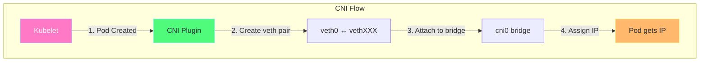
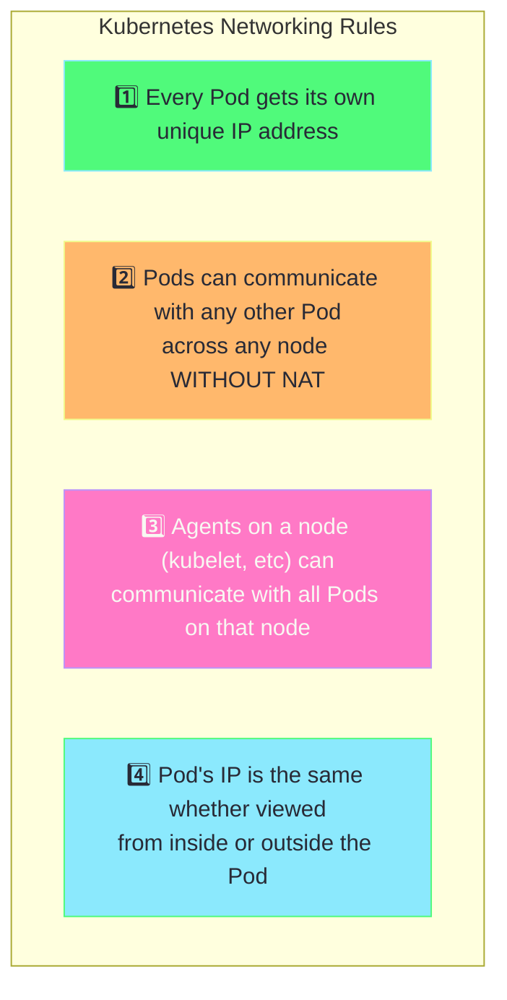
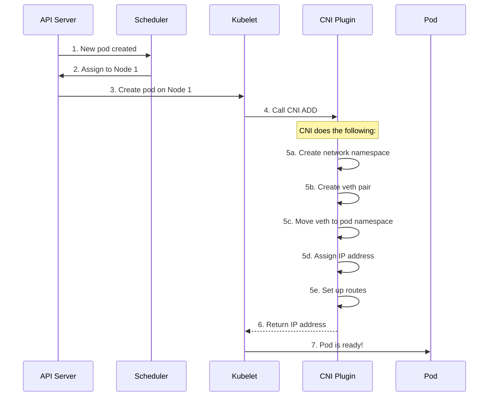
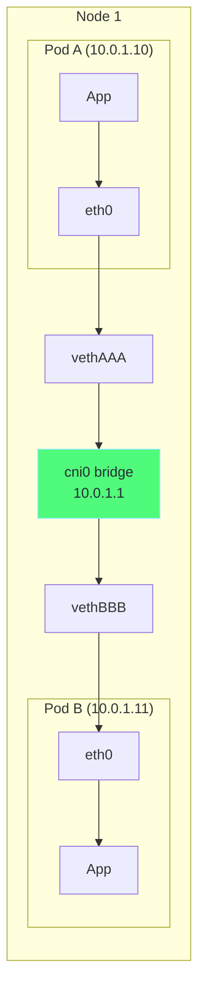
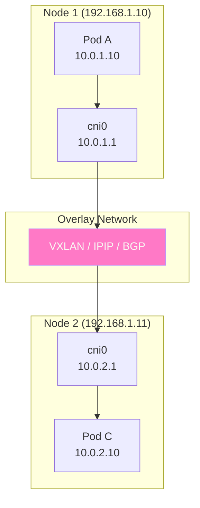
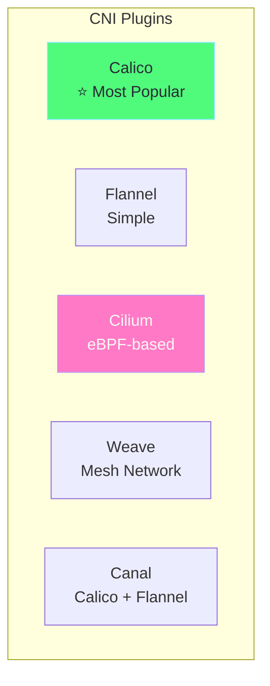

# Chapter 1: CNI & Pod-to-Pod Networking

## Table of Contents

1. [What is CNI?](#what-is-cni)
2. [Kubernetes Networking Model](#kubernetes-networking-model)
3. [How Pod Networking Works](#how-pod-networking-works)
4. [CNI Plugins Comparison](#cni-plugins-comparison)
5. [Network Namespaces](#network-namespaces)
6. [Hands-on Labs](#hands-on-labs)

---

## What is CNI?

### Definition

**CNI (Container Network Interface)** is a specification and a set of libraries for configuring network interfaces in Linux containers. It's the standard way Kubernetes sets up networking for pods.



### CNI Responsibilities

| Responsibility | Description |
|----------------|-------------|
| **IP Assignment** | Assign unique IP to each pod |
| **Network Interface** | Create network interface inside pod |
| **Routing** | Set up routes so pods can communicate |
| **Cleanup** | Remove network config when pod deleted |

---

## Kubernetes Networking Model

### The Four Fundamental Rules

Kubernetes networking is built on these rules:



### What This Means

```
┌─────────────────────────────────────────────────────────────┐
│                     Kubernetes Cluster                       │
│                                                              │
│  ┌─────────────────────┐    ┌─────────────────────┐         │
│  │      Node 1         │    │      Node 2         │         │
│  │                     │    │                     │         │
│  │  ┌─────┐  ┌─────┐  │    │  ┌─────┐  ┌─────┐  │         │
│  │  │Pod A│  │Pod B│  │    │  │Pod C│  │Pod D│  │         │
│  │  │10.0.│  │10.0.│  │    │  │10.0.│  │10.0.│  │         │
│  │  │1.10 │  │1.11 │  │    │  │2.10 │  │2.11 │  │         │
│  │  └─────┘  └─────┘  │    │  └─────┘  └─────┘  │         │
│  │         ↕          │    │         ↕          │         │
│  │   ┌──────────┐    │    │   ┌──────────┐    │         │
│  │   │cni0 bridge│    │    │   │cni0 bridge│    │         │
│  │   │ 10.0.1.1 │    │    │   │ 10.0.2.1 │    │         │
│  │   └──────────┘    │    │   └──────────┘    │         │
│  │         ↕          │    │         ↕          │         │
│  │   Node: 192.168.1.10    │   Node: 192.168.1.11         │
│  └─────────────────────┘    └─────────────────────┘         │
│                    ↕                   ↕                     │
│               ┌────────────────────────────┐                │
│               │     Overlay Network /      │                │
│               │     Physical Network       │                │
│               └────────────────────────────┘                │
└─────────────────────────────────────────────────────────────┘

Pod A (10.0.1.10) can directly reach Pod C (10.0.2.10)
No NAT required - just routing!
```

---

## How Pod Networking Works

### Step-by-Step Pod Network Creation

When a pod is created, here's what happens:



### Virtual Ethernet (veth) Pairs

A veth pair is like a virtual network cable with two ends:

```
┌─────────────────────────────────────────────────────────────┐
│                          Node                                │
│                                                              │
│  ┌────────────────────────────┐                             │
│  │     Pod Network Namespace   │                             │
│  │                             │                             │
│  │   ┌─────────────────────┐  │                             │
│  │   │    eth0 (10.0.1.10) │  │  ← Pod sees this as eth0   │
│  │   └─────────┬───────────┘  │                             │
│  │             │               │                             │
│  └─────────────│───────────────┘                             │
│                │                                              │
│                │  veth pair (virtual cable)                   │
│                │                                              │
│  ┌─────────────│───────────────┐                             │
│  │     Host Network Namespace   │                             │
│  │             │               │                             │
│  │   ┌─────────┴───────────┐  │                             │
│  │   │  vethXXXX          │  │  ← Host end of veth         │
│  │   └─────────┬───────────┘  │                             │
│  │             │               │                             │
│  │   ┌─────────┴───────────┐  │                             │
│  │   │   cni0 bridge       │  │  ← All pod veths connect   │
│  │   │   10.0.1.1          │  │    to this bridge          │
│  │   └─────────────────────┘  │                             │
│  │                             │                             │
│  └─────────────────────────────┘                             │
│                                                              │
└─────────────────────────────────────────────────────────────┘
```

### Same Node Communication

When Pod A talks to Pod B on the same node:



**Flow:**
1. Pod A sends packet to 10.0.1.11
2. Packet goes through eth0 → vethAAA
3. vethAAA is connected to cni0 bridge
4. Bridge sees destination is also connected (vethBBB)
5. Packet forwarded to vethBBB → eth0 in Pod B

### Cross-Node Communication

When Pod A on Node 1 talks to Pod C on Node 2:



**Flow:**
1. Pod A sends packet to 10.0.2.10 (Pod C)
2. Packet reaches cni0 bridge on Node 1
3. Bridge checks routing table - 10.0.2.0/24 is on Node 2
4. Packet encapsulated (VXLAN/IPIP) or routed (BGP)
5. Packet arrives at Node 2
6. Decapsulated and delivered to cni0 on Node 2
7. Bridge forwards to Pod C

---

## CNI Plugins Comparison

### Popular CNI Plugins



### Detailed Comparison

| Feature | Calico | Flannel | Cilium | Weave |
|---------|--------|---------|--------|-------|
| **Network Policies** | ✅ Full | ❌ No | ✅ L3-L7 | ✅ Basic |
| **Encryption** | ✅ WireGuard | ❌ No | ✅ IPsec/WireGuard | ✅ Built-in |
| **Performance** | ⭐⭐⭐⭐⭐ | ⭐⭐⭐ | ⭐⭐⭐⭐⭐ | ⭐⭐⭐ |
| **Complexity** | Medium | Low | High | Low |
| **Observability** | Good | Basic | Excellent | Good |
| **Best For** | Production | Dev/Simple | High perf/Security | Multi-cloud |

### Calico Deep Dive

Calico is the most popular CNI for production:

```yaml
# Calico uses these modes:
# 1. IPIP (IP-in-IP tunneling) - Default
# 2. VXLAN (Virtual Extensible LAN)
# 3. BGP (Border Gateway Protocol) - No overlay

# Calico Architecture:
# 
# ┌─────────────────────────────────────────────┐
# │                  Node                        │
# │                                              │
# │  ┌─────────────────────────────────────┐   │
# │  │         calico-node DaemonSet        │   │
# │  │                                       │   │
# │  │  ┌─────────┐  ┌─────────┐           │   │
# │  │  │ Felix   │  │ BIRD    │           │   │
# │  │  │ (Agent) │  │ (BGP)   │           │   │
# │  │  └─────────┘  └─────────┘           │   │
# │  └─────────────────────────────────────┘   │
# │                                              │
# │  Pods...                                     │
# └─────────────────────────────────────────────┘
#
# Felix: Programs routes and network policies
# BIRD: Distributes routes via BGP
```

### Cilium Deep Dive

Cilium uses eBPF for high performance:

```
┌─────────────────────────────────────────────────────────────┐
│                     Cilium Architecture                      │
│                                                              │
│  ┌───────────────────────────────────────────────────────┐ │
│  │                    Linux Kernel                        │ │
│  │                                                        │ │
│  │   ┌─────────────────────────────────────────────────┐ │ │
│  │   │              eBPF Programs                       │ │ │
│  │   │                                                  │ │ │
│  │   │  ┌──────────┐ ┌──────────┐ ┌──────────┐        │ │ │
│  │   │  │ L3/L4    │ │Load      │ │Network   │        │ │ │
│  │   │  │ Routing  │ │Balancing │ │Policies  │        │ │ │
│  │   │  └──────────┘ └──────────┘ └──────────┘        │ │ │
│  │   └─────────────────────────────────────────────────┘ │ │
│  │                                                        │ │
│  └───────────────────────────────────────────────────────┘ │
│                                                              │
│  Benefits:                                                   │
│  - No iptables (uses eBPF)                                  │
│  - L7 visibility (HTTP, gRPC, Kafka)                        │
│  - Identity-based policies                                   │
│  - Hubble for observability                                  │
└─────────────────────────────────────────────────────────────┘
```

---

## Network Namespaces

### What is a Network Namespace?

A network namespace is an isolated network stack with its own:
- Network interfaces
- Routing tables
- iptables rules
- Socket ports

```bash
# Each pod runs in its own network namespace
# You can see namespaces on the node:

# SSH into Minikube
minikube ssh

# List network namespaces
ip netns list

# Each pod has a namespace like: cni-xxxxx-xxxx-xxxx
```

### How Pods Get Isolated Networks

```
┌─────────────────────────────────────────────────────────────┐
│                        Host                                  │
│                                                              │
│  ┌─────────────────────┐  ┌─────────────────────┐          │
│  │ Network Namespace 1 │  │ Network Namespace 2 │          │
│  │     (Pod A)         │  │     (Pod B)         │          │
│  │                     │  │                     │          │
│  │  Interfaces:        │  │  Interfaces:        │          │
│  │  - eth0: 10.0.1.10  │  │  - eth0: 10.0.1.11  │          │
│  │  - lo: 127.0.0.1    │  │  - lo: 127.0.0.1    │          │
│  │                     │  │                     │          │
│  │  Routing table:     │  │  Routing table:     │          │
│  │  - default via      │  │  - default via      │          │
│  │    10.0.1.1         │  │    10.0.1.1         │          │
│  │                     │  │                     │          │
│  │  iptables: (own)    │  │  iptables: (own)    │          │
│  │  Ports: (own)       │  │  Ports: (own)       │          │
│  └─────────────────────┘  └─────────────────────┘          │
│                                                              │
│  Each pod thinks it has its own dedicated network!          │
└─────────────────────────────────────────────────────────────┘
```

---

## Hands-on Labs

### Lab 1: View Pod IPs

```bash
# Create multiple pods
kubectl create deployment web --image=nginx --replicas=3

# View pods with their IPs
kubectl get pods -o wide

# Output:
# NAME                   READY   STATUS    IP           NODE
# web-xxx-aaa           1/1     Running   10.0.1.10    minikube
# web-xxx-bbb           1/1     Running   10.0.1.11    minikube
# web-xxx-ccc           1/1     Running   10.0.1.12    minikube
```

### Lab 2: Test Pod-to-Pod Communication

```bash
# Create two pods
kubectl run sender --image=busybox --command -- sleep 3600
kubectl run receiver --image=nginx

# Get receiver's IP
RECEIVER_IP=$(kubectl get pod receiver -o jsonpath='{.status.podIP}')
echo "Receiver IP: $RECEIVER_IP"

# Test connectivity from sender to receiver
kubectl exec sender -- wget -qO- http://$RECEIVER_IP

# You should see nginx HTML!
```

### Lab 3: Explore CNI on Minikube

```bash
# SSH into Minikube
minikube ssh

# View bridges
ip link show type bridge

# View CNI config
cat /etc/cni/net.d/*

# View pod network interfaces
ip link show | grep veth

# View routing table
ip route

# Exit Minikube
exit
```

### Lab 4: View Network Namespaces

```bash
# SSH into Minikube
minikube ssh

# As root
sudo -i

# List network namespaces
ip netns list

# Pick a namespace (cni-xxxx-xxxx)
# View interfaces in that namespace
ip netns exec cni-xxxx-xxxx ip addr

# View routing in that namespace
ip netns exec cni-xxxx-xxxx ip route

exit
exit
```

### Lab 5: Use Different CNI

```bash
# Delete current Minikube
minikube delete

# Start with Calico
minikube start --cni=calico

# Verify Calico is running
kubectl get pods -n kube-system -l k8s-app=calico-node

# Check Calico logs
kubectl logs -n kube-system -l k8s-app=calico-node -c calico-node --tail=20
```

---

## Key Takeaways

> [!IMPORTANT]
> 1. **Every pod gets a unique IP** - No port conflicts
> 2. **Pods communicate without NAT** - Direct routing
> 3. **CNI handles all setup** - Creates interfaces, assigns IPs
> 4. **veth pairs connect pods to bridge** - Virtual network cables
> 5. **Overlay networks handle cross-node** - VXLAN, IPIP, or BGP

---

## Next: [Chapter 2 - Services Deep Dive →](02-services-deep-dive.md)
