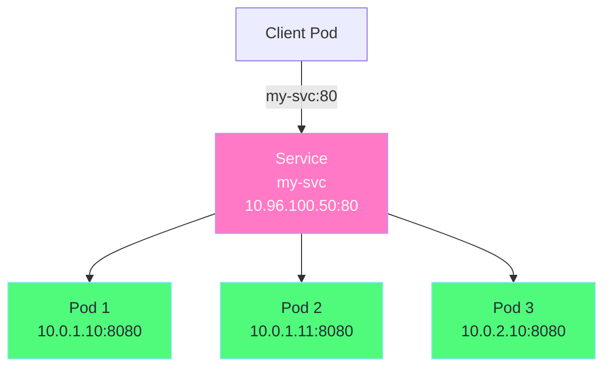
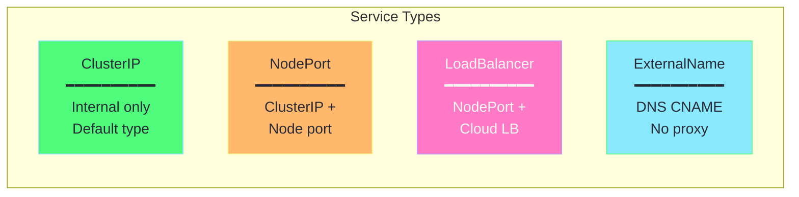
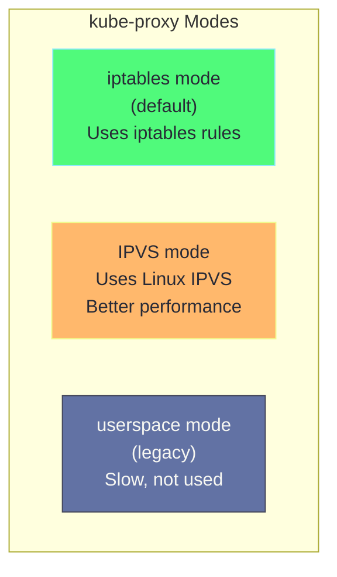
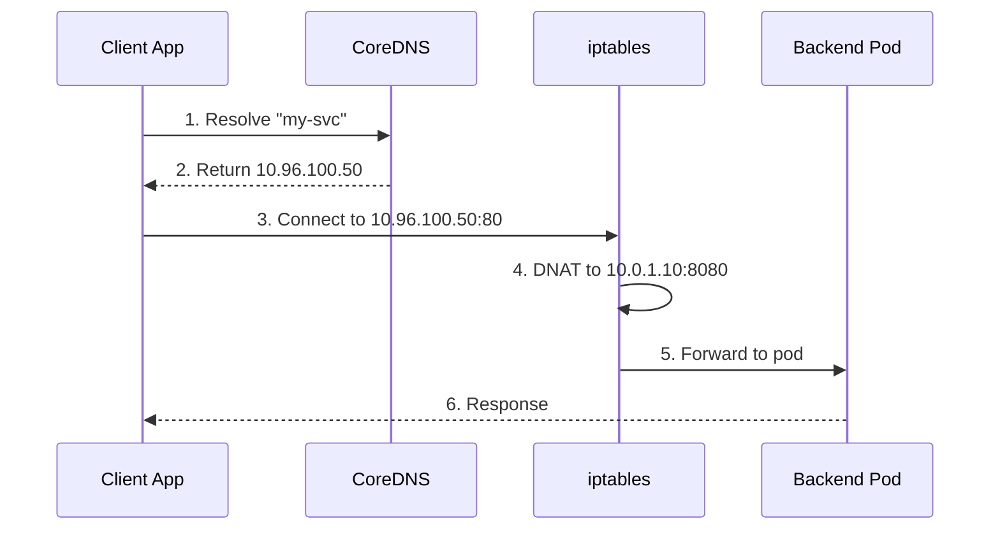
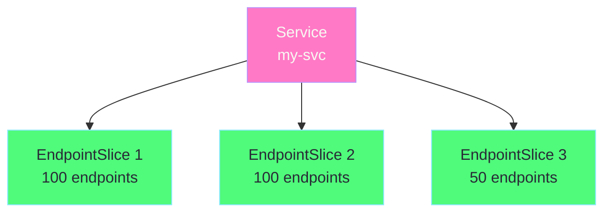

# Chapter 2: Services Deep Dive

## Table of Contents

1. [What is a Service?](#what-is-a-service)
2. [Why We Need Services](#why-we-need-services)
3. [Service Types](#service-types)
4. [How Services Work](#how-services-work)
5. [Endpoints & EndpointSlices](#endpoints--endpointslices)
6. [YAML Explained](#yaml-explained)
7. [Hands-on Labs](#hands-on-labs)

---

## What is a Service?

A **Service** is a Kubernetes resource that provides a stable endpoint to access a set of pods. It acts as an internal load balancer.



### Key Properties

| Property | Description |
|----------|-------------|
| **Stable IP** | ClusterIP doesn't change even if pods restart |
| **Stable DNS** | `service-name.namespace.svc.cluster.local` |
| **Load Balancing** | Distributes traffic across pods |
| **Service Discovery** | Pods find services by name |

---

## Why We Need Services

### The Problem: Pod IPs Are Ephemeral

```
Timeline:
─────────────────────────────────────────────────────────────►

t=0:  Pod A (10.0.1.10) is running
t=1:  Client connects to 10.0.1.10 ✓
t=2:  Pod A crashes and restarts
t=3:  Pod A now has IP 10.0.1.15 (different!)
t=4:  Client tries 10.0.1.10 → FAILS ✗

Problem: Client hardcoded the IP, but pod got new IP!
```

### The Solution: Services

```
Timeline with Service:
─────────────────────────────────────────────────────────────►

t=0:  Service my-svc (10.96.100.50) → Pod A (10.0.1.10)
t=1:  Client connects to my-svc (10.96.100.50) ✓
t=2:  Pod A crashes and restarts
t=3:  Pod A now has IP 10.0.1.15
t=4:  Service updates: my-svc → Pod A (10.0.1.15)
t=5:  Client connects to my-svc (10.96.100.50) ✓

Solution: Client uses stable service IP/name!
```

---

## Service Types

### Overview



### 1. ClusterIP (Default)

Internal-only access. Perfect for services that don't need external access.

```
┌─────────────────────────────────────────────────────────────┐
│                     Kubernetes Cluster                       │
│                                                              │
│   ┌──────────────┐         ┌──────────────┐                 │
│   │  Client Pod  │─────────│   Service    │                 │
│   │              │         │  ClusterIP   │                 │
│   └──────────────┘         │ 10.96.100.50 │                 │
│                            └──────┬───────┘                 │
│                                   │                          │
│                    ┌──────────────┼──────────────┐          │
│                    ▼              ▼              ▼          │
│              ┌─────────┐   ┌─────────┐   ┌─────────┐       │
│              │  Pod 1  │   │  Pod 2  │   │  Pod 3  │       │
│              └─────────┘   └─────────┘   └─────────┘       │
│                                                              │
└─────────────────────────────────────────────────────────────┘
                              │
                     ❌ External access blocked
```

### 2. NodePort

Exposes service on each node's IP at a static port (30000-32767).

```
┌─────────────────────────────────────────────────────────────┐
│                                                              │
│   External Client                                            │
│        │                                                     │
│        │ http://192.168.1.10:30080                          │
│        ▼                                                     │
├─────────────────────────────────────────────────────────────┤
│                     Kubernetes Cluster                       │
│                                                              │
│   ┌───────────────────────┐   ┌───────────────────────┐    │
│   │       Node 1          │   │       Node 2          │    │
│   │   192.168.1.10:30080  │   │   192.168.1.11:30080  │    │
│   └───────────┬───────────┘   └───────────┬───────────┘    │
│               │                           │                  │
│               └──────────┬────────────────┘                 │
│                          ▼                                   │
│                   ┌────────────┐                            │
│                   │  Service   │                            │
│                   │  NodePort  │                            │
│                   │ ClusterIP  │                            │
│                   └─────┬──────┘                            │
│                         │                                    │
│              ┌──────────┼──────────┐                        │
│              ▼          ▼          ▼                        │
│         ┌─────────┐ ┌─────────┐ ┌─────────┐                │
│         │  Pod 1  │ │  Pod 2  │ │  Pod 3  │                │
│         └─────────┘ └─────────┘ └─────────┘                │
│                                                              │
└─────────────────────────────────────────────────────────────┘
```

### 3. LoadBalancer

Gets an external IP from cloud provider's load balancer.

```
┌─────────────────────────────────────────────────────────────┐
│                                                              │
│   External Client                                            │
│        │                                                     │
│        │ http://35.192.100.50                               │
│        ▼                                                     │
│   ┌─────────────────────────────────────────────────────┐   │
│   │           Cloud Load Balancer                        │   │
│   │           External IP: 35.192.100.50                 │   │
│   └───────────────────────┬─────────────────────────────┘   │
│                           │                                  │
├───────────────────────────│─────────────────────────────────┤
│                     Kubernetes Cluster                       │
│                           ▼                                  │
│                   ┌────────────────┐                        │
│                   │    Service     │                        │
│                   │  LoadBalancer  │                        │
│                   │   NodePort     │                        │
│                   │   ClusterIP    │                        │
│                   └───────┬────────┘                        │
│                           │                                  │
│                ┌──────────┼──────────┐                      │
│                ▼          ▼          ▼                      │
│           ┌─────────┐ ┌─────────┐ ┌─────────┐              │
│           │  Pod 1  │ │  Pod 2  │ │  Pod 3  │              │
│           └─────────┘ └─────────┘ └─────────┘              │
│                                                              │
└─────────────────────────────────────────────────────────────┘
```

### 4. ExternalName

Maps service to an external DNS name (no proxying).


---

## How Services Work

### kube-proxy Modes

kube-proxy runs on every node and implements service networking:



### iptables Mode (Default)

```
┌─────────────────────────────────────────────────────────────┐
│                          Node                                │
│                                                              │
│   ┌────────────────────────────────────────────────────┐   │
│   │                 iptables rules                      │   │
│   │                                                     │   │
│   │  Chain KUBE-SERVICES:                               │   │
│   │  ┌─────────────────────────────────────────────┐   │   │
│   │  │ -d 10.96.100.50/32 -p tcp --dport 80        │   │   │
│   │  │   → jump to KUBE-SVC-XXXX                    │   │   │
│   │  └─────────────────────────────────────────────┘   │   │
│   │                                                     │   │
│   │  Chain KUBE-SVC-XXXX (service):                     │   │
│   │  ┌─────────────────────────────────────────────┐   │   │
│   │  │ --probability 0.333 → KUBE-SEP-AAA (pod1)   │   │   │
│   │  │ --probability 0.500 → KUBE-SEP-BBB (pod2)   │   │   │
│   │  │                     → KUBE-SEP-CCC (pod3)   │   │   │
│   │  └─────────────────────────────────────────────┘   │   │
│   │                                                     │   │
│   │  Chain KUBE-SEP-AAA (endpoint):                     │   │
│   │  ┌─────────────────────────────────────────────┐   │   │
│   │  │ DNAT to 10.0.1.10:8080                       │   │   │
│   │  └─────────────────────────────────────────────┘   │   │
│   │                                                     │   │
│   └────────────────────────────────────────────────────┘   │
│                                                              │
└─────────────────────────────────────────────────────────────┘

Traffic flow:
1. Packet destined for 10.96.100.50:80
2. iptables matches KUBE-SERVICES chain
3. Randomly selects one endpoint (1/3 probability each)
4. DNAT changes destination to pod IP:port
5. Packet routed to pod
```

### Service Discovery Flow



---

## Endpoints & EndpointSlices

### What are Endpoints?

Endpoints track which pod IPs are ready to receive traffic:

```
Service: my-svc (10.96.100.50:80)
          │
          ▼
    Endpoints: my-svc
    ┌─────────────────────────────────────┐
    │  Subsets:                           │
    │    Addresses:                       │
    │      - 10.0.1.10 (Pod 1) ✓ Ready   │
    │      - 10.0.1.11 (Pod 2) ✓ Ready   │
    │      - 10.0.2.10 (Pod 3) ✓ Ready   │
    │    NotReadyAddresses:               │
    │      - 10.0.1.12 (Pod 4) ✗ Failing │
    │    Ports:                           │
    │      - port: 8080                   │
    └─────────────────────────────────────┘
```

### EndpointSlices (Kubernetes 1.21+)

More scalable version of Endpoints:



---

## YAML Explained

### ClusterIP Service

```yaml
# ============================================================================
# ClusterIP Service - Internal Only
# ============================================================================
apiVersion: v1               # Core API version for Service
kind: Service                # Resource type
metadata:
  name: my-service           # Service name (used for DNS)
  namespace: default         # Namespace (default if omitted)
  labels:                    # Labels for organizing resources
    app: my-app
    tier: backend
spec:
  # ---------------------------------------------------------------------------
  # TYPE: ClusterIP (default)
  # ---------------------------------------------------------------------------
  # ClusterIP = Internal only, no external access
  # This is the default if you don't specify type
  type: ClusterIP
  
  # ---------------------------------------------------------------------------
  # SELECTOR: Which pods to target
  # ---------------------------------------------------------------------------
  # Pods with these labels will receive traffic
  # This creates the connection: Service → Pods
  selector:
    app: my-app              # Must match pod labels!
    tier: backend
  
  # ---------------------------------------------------------------------------
  # PORTS: How to route traffic
  # ---------------------------------------------------------------------------
  ports:
    - name: http             # Optional name for the port
      protocol: TCP          # TCP (default) or UDP
      port: 80               # Port the SERVICE listens on
      targetPort: 8080       # Port the POD listens on
                             # Can also be a named port like "http"
    
    - name: https            # Multiple ports supported
      protocol: TCP
      port: 443
      targetPort: 8443
  
  # ---------------------------------------------------------------------------
  # OPTIONAL: Specific ClusterIP
  # ---------------------------------------------------------------------------
  # clusterIP: 10.96.100.50  # Specific IP (usually auto-assigned)
  # clusterIP: None          # Headless service (no load balancing)
  
  # ---------------------------------------------------------------------------
  # SESSION AFFINITY
  # ---------------------------------------------------------------------------
  # sessionAffinity: ClientIP  # Same client → same pod
  # sessionAffinityConfig:
  #   clientIP:
  #     timeoutSeconds: 10800  # 3 hours
```

### NodePort Service

```yaml
# ============================================================================
# NodePort Service - External Access via Node Port
# ============================================================================
apiVersion: v1
kind: Service
metadata:
  name: my-nodeport-service
spec:
  # ---------------------------------------------------------------------------
  # TYPE: NodePort
  # ---------------------------------------------------------------------------
  # Exposes service on each Node's IP at a static port
  # Creates: ClusterIP (internal) + NodePort (external)
  type: NodePort
  
  selector:
    app: my-app
  
  ports:
    - name: http
      protocol: TCP
      port: 80               # ClusterIP port (internal)
      targetPort: 8080       # Pod port
      nodePort: 30080        # Node port (external)
                             # Range: 30000-32767
                             # If omitted, auto-assigned
  
  # ---------------------------------------------------------------------------
  # EXTERNAL TRAFFIC POLICY
  # ---------------------------------------------------------------------------
  # Cluster (default): May route to pods on other nodes
  # Local: Only route to pods on the same node as the request
  externalTrafficPolicy: Cluster
  
  # ---------------------------------------------------------------------------
  # When to use Local?
  # ---------------------------------------------------------------------------
  # - Preserves client source IP
  # - Better performance (no extra hop)
  # - But may cause uneven load if pods not on all nodes
```

### LoadBalancer Service

```yaml
# ============================================================================
# LoadBalancer Service - Cloud Load Balancer
# ============================================================================
apiVersion: v1
kind: Service
metadata:
  name: my-loadbalancer
  annotations:
    # Cloud-specific annotations:
    # AWS:
    # service.beta.kubernetes.io/aws-load-balancer-type: "nlb"
    # service.beta.kubernetes.io/aws-load-balancer-internal: "true"
    
    # GCP:
    # cloud.google.com/load-balancer-type: "Internal"
    
    # Azure:
    # service.beta.kubernetes.io/azure-load-balancer-internal: "true"
spec:
  type: LoadBalancer
  
  selector:
    app: my-app
  
  ports:
    - name: http
      port: 80
      targetPort: 8080
  
  # ---------------------------------------------------------------------------
  # LOAD BALANCER OPTIONS
  # ---------------------------------------------------------------------------
  # Specific external IP (if supported by cloud)
  # loadBalancerIP: 35.192.100.50
  
  # Restrict access to specific IPs
  # loadBalancerSourceRanges:
  #   - 10.0.0.0/8
  #   - 192.168.1.0/24
  
  externalTrafficPolicy: Local  # Preserve client IP
```

### Headless Service

```yaml
# ============================================================================
# Headless Service - No Load Balancing
# ============================================================================
# Used when you want to:
# - Get individual pod IPs via DNS
# - Implement your own load balancing
# - Use with StatefulSets

apiVersion: v1
kind: Service
metadata:
  name: my-headless-service
spec:
  # ---------------------------------------------------------------------------
  # HEADLESS: clusterIP = None
  # ---------------------------------------------------------------------------
  clusterIP: None            # This makes it headless!
  
  selector:
    app: my-stateful-app
  
  ports:
    - port: 5432
      targetPort: 5432

# DNS returns ALL pod IPs instead of service IP:
# 
# Normal Service:
#   nslookup my-service → 10.96.100.50 (single IP)
#
# Headless Service:
#   nslookup my-headless-service →
#     10.0.1.10
#     10.0.1.11
#     10.0.2.10
#   (returns all pod IPs!)
```

### ExternalName Service

```yaml
# ============================================================================
# ExternalName Service - DNS Alias
# ============================================================================
# Maps a service to an external DNS name
# No proxying, just DNS CNAME

apiVersion: v1
kind: Service
metadata:
  name: external-db
spec:
  type: ExternalName
  
  # ---------------------------------------------------------------------------
  # EXTERNAL NAME: The external DNS to map to
  # ---------------------------------------------------------------------------
  externalName: database.external-company.com
  
  # No selector needed - not pointing to pods
  # No ports needed - no proxying

# Usage:
# Pods can access "external-db" and it resolves to 
# "database.external-company.com"
#
# Good for:
# - Migrating to Kubernetes (point to existing external DBs)
# - Accessing external services with consistent naming
```

---

## Hands-on Labs

### Lab 1: Create ClusterIP Service

```bash
# Create a deployment
kubectl create deployment web --image=nginx --replicas=3

# Expose as ClusterIP service
kubectl expose deployment web --port=80 --target-port=80

# View service
kubectl get svc web
# NAME   TYPE        CLUSTER-IP      EXTERNAL-IP   PORT(S)   AGE
# web    ClusterIP   10.96.100.50    <none>        80/TCP    10s

# View endpoints
kubectl get endpoints web
# NAME   ENDPOINTS                               AGE
# web    10.0.1.10:80,10.0.1.11:80,10.0.1.12:80

# Test from another pod
kubectl run curl --image=curlimages/curl --rm -it -- curl http://web
```

### Lab 2: Create NodePort Service

```bash
# Expose existing deployment as NodePort
kubectl expose deployment web --type=NodePort --port=80 --target-port=80 --name=web-nodeport

# View service
kubectl get svc web-nodeport
# NAME           TYPE       CLUSTER-IP     EXTERNAL-IP   PORT(S)        AGE
# web-nodeport   NodePort   10.96.55.100   <none>        80:31234/TCP   5s

# Get Minikube URL
minikube service web-nodeport --url
# http://192.168.49.2:31234

# Access from host
curl $(minikube service web-nodeport --url)
```

### Lab 3: LoadBalancer with Minikube Tunnel

```bash
# Create LoadBalancer service
kubectl expose deployment web --type=LoadBalancer --port=80 --name=web-lb

# Check - EXTERNAL-IP will be <pending>
kubectl get svc web-lb
# NAME     TYPE           CLUSTER-IP    EXTERNAL-IP   PORT(S)        AGE
# web-lb   LoadBalancer   10.96.88.10   <pending>     80:30123/TCP   5s

# In another terminal, start tunnel
minikube tunnel

# Now check again
kubectl get svc web-lb
# NAME     TYPE           CLUSTER-IP    EXTERNAL-IP   PORT(S)        AGE
# web-lb   LoadBalancer   10.96.88.10   10.96.88.10   80:30123/TCP   1m

# Access via external IP
curl 10.96.88.10
```

### Lab 4: Headless Service

```bash
# Create headless service
cat <<EOF | kubectl apply -f -
apiVersion: v1
kind: Service
metadata:
  name: web-headless
spec:
  clusterIP: None
  selector:
    app: web
  ports:
    - port: 80
EOF

# DNS lookup - should return all pod IPs
kubectl run dnstest --image=busybox --rm -it -- nslookup web-headless
# Server:    10.96.0.10
# Address 1: 10.96.0.10 kube-dns.kube-system.svc.cluster.local
#
# Name:      web-headless
# Address 1: 10.0.1.10
# Address 2: 10.0.1.11
# Address 3: 10.0.1.12
```

### Lab 5: View iptables Rules

```bash
# SSH into Minikube
minikube ssh

# View service iptables rules
sudo iptables -t nat -L KUBE-SERVICES -n -v

# View specific service chain
sudo iptables -t nat -L KUBE-SVC-XXXX -n -v

exit
```

---

## Summary

| Service Type | Use Case | External Access |
|--------------|----------|-----------------|
| **ClusterIP** | Internal services | ❌ No |
| **NodePort** | Dev/testing, bare metal | ✅ Via node IP:port |
| **LoadBalancer** | Production, cloud | ✅ Via external IP |
| **ExternalName** | External services | N/A (DNS only) |
| **Headless** | StatefulSets, custom LB | ❌ No |

---

## Next: [Chapter 3 - Ingress Controllers →](03-ingress-controllers.md)
