# Chapter 3: Ingress & Ingress Controllers

## Table of Contents

1. [What is Ingress?](#what-is-ingress)
2. [Ingress vs Service](#ingress-vs-service)
3. [Ingress Controllers](#ingress-controllers)
4. [Ingress Resources](#ingress-resources)
5. [YAML Explained](#yaml-explained)
6. [TLS/HTTPS Setup](#tlshttps-setup)
7. [Hands-on Labs](#hands-on-labs)

---

## What is Ingress?

**Ingress** is a Kubernetes resource that manages external HTTP/HTTPS access to services. It provides:
- URL-based routing
- SSL/TLS termination
- Virtual hosting (multiple domains)
- Path-based routing

```mermaid
flowchart TB
    Internet["🌐 Internet<br/>Users"]
    
    subgraph Cluster["Kubernetes Cluster"]
        Ingress["Ingress Controller<br/>(NGINX/Traefik)"]
        
        subgraph Services["Services"]
            SvcAPI["api-service"]
            SvcWeb["web-service"]
            SvcAdmin["admin-service"]
        end
        
        subgraph Pods["Pods"]
            PodAPI["API Pods"]
            PodWeb["Web Pods"]
            PodAdmin["Admin Pods"]
        end
    end
    
    Internet -->|"*.example.com"| Ingress
    Ingress -->|"/api/*"| SvcAPI
    Ingress -->|"/web/*"| SvcWeb
    Ingress -->|"admin.example.com"| SvcAdmin
    
    SvcAPI --> PodAPI
    SvcWeb --> PodWeb
    SvcAdmin --> PodAdmin
    
    style Ingress fill:#50fa7b,stroke:#8be9fd,color:#282a36
    style Internet fill:#ff79c6,stroke:#bd93f9,color:#f8f8f2
```



### Key Concepts

| Concept | Description |
|---------|-------------|
| **Ingress Resource** | YAML that defines routing rules |
| **Ingress Controller** | Pod that implements the rules (NGINX, Traefik) |
| **IngressClass** | Specifies which controller to use |
| **Backend** | Service + port that receives traffic |

---

## Ingress vs Service

### Comparison

```
┌─────────────────────────────────────────────────────────────┐
│                    Without Ingress                          │
│                                                              │
│   User 1 ──► LoadBalancer 1 ──► Service 1 ──► Pods         │
│   User 2 ──► LoadBalancer 2 ──► Service 2 ──► Pods         │
│   User 3 ──► LoadBalancer 3 ──► Service 3 ──► Pods         │
│                                                              │
│   Problem: Each service needs its own LoadBalancer!         │
│            (Expensive in cloud, complex to manage)          │
└─────────────────────────────────────────────────────────────┘

┌─────────────────────────────────────────────────────────────┐
│                     With Ingress                            │
│                                                              │
│                    ┌──► Service 1 ──► Pods                  │
│   All Users ──► Ingress ──► Service 2 ──► Pods             │
│                    └──► Service 3 ──► Pods                  │
│                                                              │
│   Solution: Single entry point, routes by URL/host!         │
│             (Cost effective, centralized config)            │
└─────────────────────────────────────────────────────────────┘
```

| Feature | Service (LoadBalancer) | Ingress |
|---------|------------------------|---------|
| Layer | L4 (TCP/UDP) | L7 (HTTP/HTTPS) |
| Cost | 1 LB per service | 1 LB for all services |
| URL routing | ❌ No | ✅ Yes |
| SSL termination | ❌ No (needs extra) | ✅ Yes |
| Multiple domains | ❌ No | ✅ Yes |

---

## Ingress Controllers

### What is an Ingress Controller?

An Ingress Controller is a pod that:
1. Watches for Ingress resources
2. Updates its config when Ingress changes
3. Routes incoming HTTP/HTTPS traffic


### Popular Ingress Controllers

```mermaid
flowchart TB
    subgraph Controllers["Ingress Controllers"]
        NGINX["NGINX Ingress<br/>⭐ Most Popular"]
        Traefik["Traefik<br/>Auto-discovery"]
        HAProxy["HAProxy<br/>High Performance"]
        Contour["Contour<br/>Envoy-based"]
        ALB["AWS ALB<br/>AWS Native"]
    end
    
    style NGINX fill:#50fa7b,stroke:#8be9fd,color:#282a36
    style Traefik fill:#ffb86c,stroke:#f1fa8c,color:#282a36
```



### Detailed Comparison

| Controller | Pros | Cons | Best For |
|------------|------|------|----------|
| **NGINX** | Mature, widely used, many annotations | Config can be complex | General purpose |
| **Traefik** | Auto-discovery, Let's Encrypt, dashboard | Less documented | Dynamic environments |
| **HAProxy** | Very fast, TCP/UDP support | Complex config | High traffic |
| **Contour** | Envoy-based, modern, CRDs | Newer, smaller community | Service mesh prep |
| **AWS ALB** | Native AWS integration | AWS only | EKS |

### Enable NGINX Ingress in Minikube

```bash
# Enable the ingress addon
minikube addons enable ingress

# Verify installation
kubectl get pods -n ingress-nginx
# NAME                                        READY   STATUS      
# ingress-nginx-controller-xxxx               1/1     Running     

# Check the controller service
kubectl get svc -n ingress-nginx
# NAME                       TYPE        CLUSTER-IP     PORT(S)
# ingress-nginx-controller   NodePort    10.96.100.50   80:30080/TCP,443:30443/TCP
```

---

## Ingress Resources

### Ingress Architecture

```
┌─────────────────────────────────────────────────────────────┐
│                    Ingress Flow                              │
│                                                              │
│   1. User requests: https://api.example.com/users           │
│                           │                                  │
│   2. DNS resolves to Ingress Controller IP                  │
│                           │                                  │
│   3. Ingress Controller receives request                    │
│                           │                                  │
│   4. Matches rule: host=api.example.com, path=/users        │
│                           │                                  │
│   5. Forwards to backend: api-service:80                    │
│                           │                                  │
│   6. Service load balances to pod                           │
│                           │                                  │
│   7. Response returns same path                             │
│                                                              │
└─────────────────────────────────────────────────────────────┘
```

### Rule Matching Flow

```mermaid
flowchart TB
    Request["Incoming Request<br/>Host: api.example.com<br/>Path: /users/123"]
    
    Check1{"Match Host?"}
    Check2{"Match Path?"}
    
    Request --> Check1
    Check1 -->|"api.example.com ✓"| Check2
    Check1 -->|"No match"| Default["Default Backend<br/>or 404"]
    Check2 -->|"/users ✓"| Backend["api-service:80"]
    Check2 -->|"No match"| Default
    
    style Backend fill:#50fa7b,stroke:#8be9fd,color:#282a36
    style Default fill:#ff5555,stroke:#ff79c6,color:#f8f8f2
```



---

## YAML Explained

### Simple Path-Based Ingress

```yaml
# ============================================================================
# INGRESS - Path-Based Routing
# ============================================================================
# Routes different URL paths to different services

apiVersion: networking.k8s.io/v1  # Networking API group
kind: Ingress                      # Resource type
metadata:
  name: my-ingress                 # Ingress name
  namespace: default
  
  # ---------------------------------------------------------------------------
  # ANNOTATIONS - Controller-specific settings
  # ---------------------------------------------------------------------------
  annotations:
    # Rewrite /api/users → /users when forwarding to backend
    nginx.ingress.kubernetes.io/rewrite-target: /$1
    
    # Other useful annotations:
    # nginx.ingress.kubernetes.io/ssl-redirect: "true"
    # nginx.ingress.kubernetes.io/proxy-body-size: "10m"
    # nginx.ingress.kubernetes.io/proxy-read-timeout: "60"

spec:
  # ---------------------------------------------------------------------------
  # INGRESS CLASS - Which controller handles this
  # ---------------------------------------------------------------------------
  ingressClassName: nginx          # Use NGINX controller
  
  # ---------------------------------------------------------------------------
  # RULES - Define routing
  # ---------------------------------------------------------------------------
  rules:
    # Rule 1: Route by host + path
    - host: myapp.example.com      # Match this hostname
      http:
        paths:
          # Path 1: /api/* → api-service
          - path: /api/(.*)        # Regex path matching
            pathType: Prefix       # Prefix or Exact
            backend:
              service:
                name: api-service  # Target service name
                port:
                  number: 80       # Target service port
          
          # Path 2: /web/* → web-service
          - path: /web/(.*)
            pathType: Prefix
            backend:
              service:
                name: web-service
                port:
                  number: 80
          
          # Path 3: Default backend for unmatched paths
          - path: /
            pathType: Prefix
            backend:
              service:
                name: frontend-service
                port:
                  number: 80
```

### Multi-Host Ingress

```yaml
# ============================================================================
# INGRESS - Multiple Hosts (Virtual Hosting)
# ============================================================================
# Different domains route to different services

apiVersion: networking.k8s.io/v1
kind: Ingress
metadata:
  name: multi-host-ingress
spec:
  ingressClassName: nginx
  
  rules:
    # ---------------------------------------------------------------------------
    # Host 1: api.example.com
    # ---------------------------------------------------------------------------
    - host: api.example.com
      http:
        paths:
          - path: /
            pathType: Prefix
            backend:
              service:
                name: api-service
                port:
                  number: 80
    
    # ---------------------------------------------------------------------------
    # Host 2: www.example.com
    # ---------------------------------------------------------------------------
    - host: www.example.com
      http:
        paths:
          - path: /
            pathType: Prefix
            backend:
              service:
                name: web-service
                port:
                  number: 80
    
    # ---------------------------------------------------------------------------
    # Host 3: admin.example.com
    # ---------------------------------------------------------------------------
    - host: admin.example.com
      http:
        paths:
          - path: /
            pathType: Prefix
            backend:
              service:
                name: admin-service
                port:
                  number: 80

# Diagram of this ingress:
#
#   api.example.com ──────► api-service
#                          │
#   www.example.com ──────► web-service    (All through same Ingress!)
#                          │
#   admin.example.com ────► admin-service
```

### Path Types Explained

```yaml
# ============================================================================
# PATH TYPES
# ============================================================================

# 1. Prefix - Matches URL path prefix
#    /api matches: /api, /api/, /api/users, /api/users/123
- path: /api
  pathType: Prefix

# 2. Exact - Matches exact URL path only
#    /api matches only: /api (not /api/ or /api/users)
- path: /api
  pathType: Exact

# 3. ImplementationSpecific - Controller decides
#    Behavior depends on IngressClass
- path: /api
  pathType: ImplementationSpecific

# Matching precedence:
# 1. Exact paths (highest priority)
# 2. Longest Prefix path
# 3. Shorter Prefix path

# Example:
# Request: /api/users/123
# Rules:
#   - path: /api/users (Prefix) ← Matches! Longest prefix wins
#   - path: /api (Prefix)
#   - path: / (Prefix)
```

---

## TLS/HTTPS Setup

### TLS Ingress

```yaml
# ============================================================================
# INGRESS WITH TLS
# ============================================================================

apiVersion: networking.k8s.io/v1
kind: Ingress
metadata:
  name: tls-ingress
  annotations:
    # Force HTTPS redirect
    nginx.ingress.kubernetes.io/ssl-redirect: "true"
spec:
  ingressClassName: nginx
  
  # ---------------------------------------------------------------------------
  # TLS CONFIGURATION
  # ---------------------------------------------------------------------------
  tls:
    - hosts:
        - secure.example.com       # Hostname for this cert
        - api.example.com          # Can include multiple hosts
      secretName: tls-secret       # Secret containing cert+key
  
  rules:
    - host: secure.example.com
      http:
        paths:
          - path: /
            pathType: Prefix
            backend:
              service:
                name: secure-app
                port:
                  number: 80
```

### Create TLS Secret

```bash
# Option 1: Generate self-signed certificate
openssl req -x509 -nodes -days 365 -newkey rsa:2048 \
  -keyout tls.key \
  -out tls.crt \
  -subj "/CN=secure.example.com"

# Create secret from files
kubectl create secret tls tls-secret \
  --cert=tls.crt \
  --key=tls.key

# View secret
kubectl get secret tls-secret -o yaml
```

### TLS Secret YAML

```yaml
# ============================================================================
# TLS SECRET
# ============================================================================
apiVersion: v1
kind: Secret
metadata:
  name: tls-secret
  namespace: default
type: kubernetes.io/tls        # Special type for TLS
data:
  # Base64 encoded certificate
  tls.crt: LS0tLS1CRUdJTi... (base64)
  # Base64 encoded private key
  tls.key: LS0tLS1CRUdJTi... (base64)
```

### TLS Flow


---

## Hands-on Labs

### Lab 1: Enable Ingress Controller

```bash
# Enable NGINX ingress in Minikube
minikube addons enable ingress

# Wait for controller to be ready
kubectl wait --namespace ingress-nginx \
  --for=condition=ready pod \
  --selector=app.kubernetes.io/component=controller \
  --timeout=120s

# Verify
kubectl get pods -n ingress-nginx
```

### Lab 2: Create Simple Ingress

```bash
# Create two deployments
kubectl create deployment web1 --image=nginxdemos/hello
kubectl create deployment web2 --image=hashicorp/http-echo -- -text="Hello from web2"

# Expose as services
kubectl expose deployment web1 --port=80
kubectl expose deployment web2 --port=5678

# Create ingress
cat <<EOF | kubectl apply -f -
apiVersion: networking.k8s.io/v1
kind: Ingress
metadata:
  name: demo-ingress
  annotations:
    nginx.ingress.kubernetes.io/rewrite-target: /
spec:
  ingressClassName: nginx
  rules:
    - host: demo.local
      http:
        paths:
          - path: /web1
            pathType: Prefix
            backend:
              service:
                name: web1
                port:
                  number: 80
          - path: /web2
            pathType: Prefix
            backend:
              service:
                name: web2
                port:
                  number: 5678
EOF

# Add to /etc/hosts
echo "$(minikube ip) demo.local" | sudo tee -a /etc/hosts

# Test
curl http://demo.local/web1
curl http://demo.local/web2
```

### Lab 3: Multi-Host Ingress

```bash
# Create ingress for multiple hosts
cat <<EOF | kubectl apply -f -
apiVersion: networking.k8s.io/v1
kind: Ingress
metadata:
  name: multi-host-demo
spec:
  ingressClassName: nginx
  rules:
    - host: web1.local
      http:
        paths:
          - path: /
            pathType: Prefix
            backend:
              service:
                name: web1
                port:
                  number: 80
    - host: web2.local
      http:
        paths:
          - path: /
            pathType: Prefix
            backend:
              service:
                name: web2
                port:
                  number: 5678
EOF

# Add hosts
echo "$(minikube ip) web1.local web2.local" | sudo tee -a /etc/hosts

# Test different hosts
curl http://web1.local
curl http://web2.local
```

### Lab 4: TLS Ingress

```bash
# Generate self-signed certificate
openssl req -x509 -nodes -days 365 -newkey rsa:2048 \
  -keyout tls.key -out tls.crt \
  -subj "/CN=secure.local"

# Create TLS secret
kubectl create secret tls tls-secret --cert=tls.crt --key=tls.key

# Create TLS ingress
cat <<EOF | kubectl apply -f -
apiVersion: networking.k8s.io/v1
kind: Ingress
metadata:
  name: tls-demo
  annotations:
    nginx.ingress.kubernetes.io/ssl-redirect: "true"
spec:
  ingressClassName: nginx
  tls:
    - hosts:
        - secure.local
      secretName: tls-secret
  rules:
    - host: secure.local
      http:
        paths:
          - path: /
            pathType: Prefix
            backend:
              service:
                name: web1
                port:
                  number: 80
EOF

# Add host
echo "$(minikube ip) secure.local" | sudo tee -a /etc/hosts

# Test HTTPS (use -k to ignore self-signed cert warning)
curl -k https://secure.local
```

### Lab 5: Ingress Debugging

```bash
# View ingress
kubectl get ingress
kubectl describe ingress demo-ingress

# View ingress controller logs
kubectl logs -n ingress-nginx -l app.kubernetes.io/name=ingress-nginx

# Check NGINX config inside controller
POD=$(kubectl get pods -n ingress-nginx -l app.kubernetes.io/name=ingress-nginx -o jsonpath='{.items[0].metadata.name}')
kubectl exec -n ingress-nginx $POD -- cat /etc/nginx/nginx.conf | grep -A20 "location"
```

---

## Summary

```mermaid
flowchart TB
    Internet["🌐 Internet"] --> IC["Ingress Controller"]
    
    subgraph Rules["Ingress Rules"]
        Rule1["Host: api.example.com<br/>Path: /users"]
        Rule2["Host: www.example.com<br/>Path: /"]
    end
    
    IC --> Rule1 --> Svc1["api-service"]
    IC --> Rule2 --> Svc2["web-service"]
    
    style IC fill:#50fa7b,stroke:#8be9fd,color:#282a36
```



| Feature | Description |
|---------|-------------|
| **Ingress Resource** | Defines routing rules |
| **Ingress Controller** | Implements rules (NGINX, Traefik) |
| **Path Routing** | Route by URL path |
| **Host Routing** | Route by hostname |
| **TLS** | HTTPS termination |

---

## Next: [Chapter 4 - Network Policies →](04-network-policies.md)
