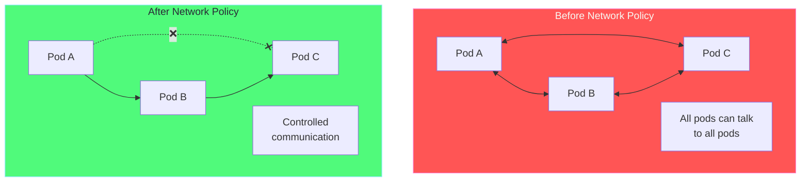
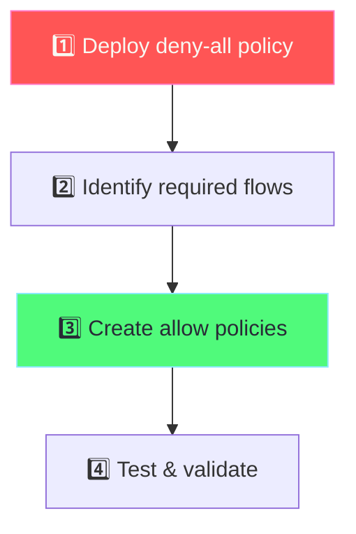
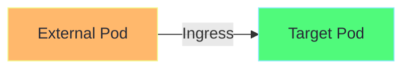
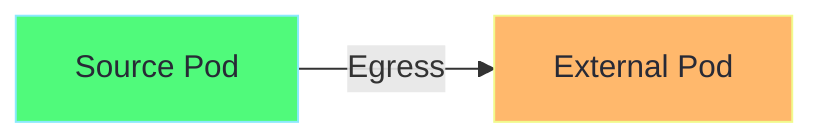
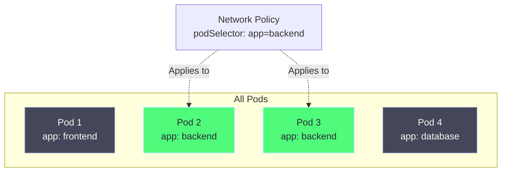
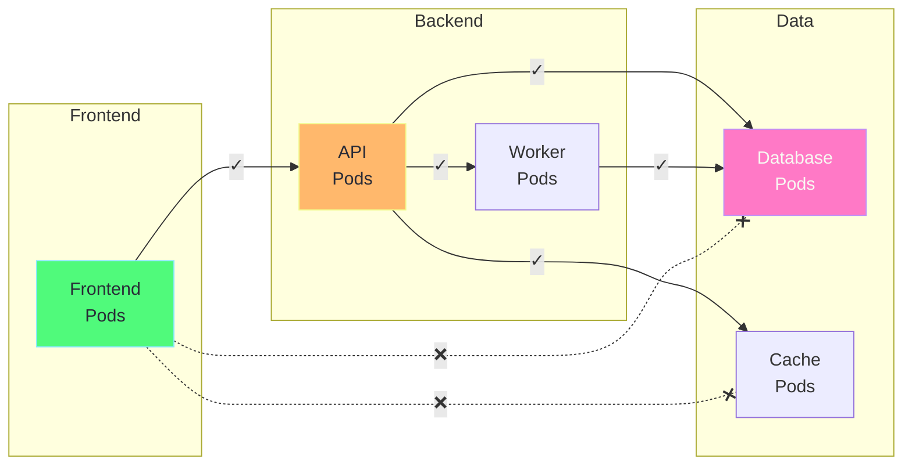
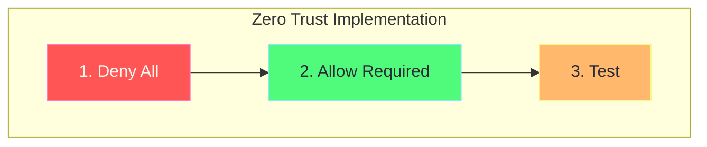

# Chapter 4: Network Policies (Zero Trust)

## Table of Contents

1. [What are Network Policies?](#what-are-network-policies)
2. [Zero Trust Networking](#zero-trust-networking)
3. [Policy Types](#policy-types)
4. [Selectors](#selectors)
5. [YAML Explained](#yaml-explained)
6. [Common Patterns](#common-patterns)
7. [Hands-on Labs](#hands-on-labs)

---

## What are Network Policies?

**Network Policies** are firewall rules for pod-to-pod communication. They control which pods can communicate with each other.



### Key Points

| Point | Description |
|-------|-------------|
| **Default** | Without policies, all pods can communicate |
| **Additive** | Policies are additive (allow-based) |
| **Namespace** | Policies are namespaced |
| **CNI Required** | Needs CNI that supports policies (Calico, Cilium) |

---

## Zero Trust Networking

### Concept

Zero Trust means: **"Never trust, always verify"**

```
Traditional Model:
┌─────────────────────────────────────────────────────────────┐
│                     Trust Boundary                          │
│                                                              │
│   "If you're inside the network, you're trusted"            │
│                                                              │
│   Pod A ◄───────────────────────► Pod B                     │
│     │                               │                        │
│     └───────────────┬───────────────┘                        │
│                     │                                        │
│                     ▼                                        │
│                   Pod C                                      │
│                                                              │
│   Problem: Compromised pod can access everything!           │
└─────────────────────────────────────────────────────────────┘

Zero Trust Model:
┌─────────────────────────────────────────────────────────────┐
│                    No Trust Boundary                        │
│                                                              │
│   "Every connection is verified"                            │
│                                                              │
│   Pod A ──────✓──────► Pod B                                │
│     │                   │                                    │
│     ✗                   ✓                                    │
│     │                   │                                    │
│     ▼                   ▼                                    │
│   Pod C ◄─────✓─────── Pod C                                │
│                                                              │
│   Solution: Each connection explicitly allowed!              │
└─────────────────────────────────────────────────────────────┘
```

### Implementing Zero Trust

1. **Deny all traffic** by default
2. **Allow only required** connections
3. **Principle of least privilege**



---

## Policy Types

### Ingress (Incoming Traffic)

Controls **incoming** traffic to pods:



### Egress (Outgoing Traffic)

Controls **outgoing** traffic from pods:



### Combined

```yaml
spec:
  policyTypes:
    - Ingress    # Control incoming
    - Egress     # Control outgoing
```

---

## Selectors

### Pod Selector

Select which pods the policy applies to:

```yaml
spec:
  podSelector:
    matchLabels:
      app: backend    # Policy applies to pods with app=backend
```



### Namespace Selector

Allow traffic from specific namespaces:

```yaml
spec:
  ingress:
    - from:
        - namespaceSelector:
            matchLabels:
              name: monitoring    # Allow from monitoring namespace
```

### IP Block

Allow traffic from specific IP ranges:

```yaml
spec:
  ingress:
    - from:
        - ipBlock:
            cidr: 10.0.0.0/8      # Allow from this range
            except:
              - 10.0.1.0/24       # But not this range
```

---

## YAML Explained

### Deny All Ingress (Zero Trust Baseline)

```yaml
# ============================================================================
# DENY ALL INGRESS POLICY
# ============================================================================
# This is the foundation of Zero Trust:
# Start by denying all incoming traffic, then selectively allow

apiVersion: networking.k8s.io/v1  # Networking API
kind: NetworkPolicy                # Resource type
metadata:
  name: deny-all-ingress           # Policy name
  namespace: production            # Namespace this applies to
spec:
  # ---------------------------------------------------------------------------
  # POD SELECTOR: Which pods this policy applies to
  # ---------------------------------------------------------------------------
  # Empty selector {} means ALL pods in the namespace
  podSelector: {}
  
  # ---------------------------------------------------------------------------
  # POLICY TYPES: What traffic to control
  # ---------------------------------------------------------------------------
  policyTypes:
    - Ingress                      # Control incoming traffic
  
  # ---------------------------------------------------------------------------
  # INGRESS RULES: What incoming traffic to allow
  # ---------------------------------------------------------------------------
  # Empty ingress [] means NO traffic is allowed
  ingress: []
  
# Result:
# ┌──────────────────────────────────────────────────┐
# │                 production namespace              │
# │                                                   │
# │   ❌ ──────────────► Pod A                       │
# │                                                   │
# │   ❌ ──────────────► Pod B                       │
# │                                                   │
# │   All incoming traffic blocked!                   │
# └──────────────────────────────────────────────────┘
```

### Allow Specific Pod-to-Pod

```yaml
# ============================================================================
# ALLOW FRONTEND TO BACKEND
# ============================================================================
# Only allow frontend pods to access backend pods

apiVersion: networking.k8s.io/v1
kind: NetworkPolicy
metadata:
  name: allow-frontend-to-backend
  namespace: default
spec:
  # ---------------------------------------------------------------------------
  # APPLY TO: Backend pods
  # ---------------------------------------------------------------------------
  podSelector:
    matchLabels:
      app: backend                 # Policy applies to backend pods
  
  policyTypes:
    - Ingress
  
  # ---------------------------------------------------------------------------
  # ALLOW FROM: Frontend pods only
  # ---------------------------------------------------------------------------
  ingress:
    - from:
        # Who can send traffic
        - podSelector:
            matchLabels:
              app: frontend        # Only from pods with app=frontend
      
      # On which ports
      ports:
        - protocol: TCP
          port: 8080               # Only on port 8080

# Result:
# 
#   ┌──────────┐                    ┌──────────┐
#   │ frontend │──────✓────────────►│ backend  │
#   │ app:     │                    │ app:     │
#   │ frontend │                    │ backend  │
#   └──────────┘                    └──────────┘
#                                         ▲
#   ┌──────────┐                         │
#   │ other    │──────❌─────────────────┘
#   │ pod      │
#   └──────────┘
```

### Allow From Namespace

```yaml
# ============================================================================
# ALLOW FROM MONITORING NAMESPACE
# ============================================================================
# Allow monitoring tools (Prometheus) to scrape metrics from all pods

apiVersion: networking.k8s.io/v1
kind: NetworkPolicy
metadata:
  name: allow-monitoring
  namespace: production
spec:
  # ---------------------------------------------------------------------------
  # APPLY TO: All pods in production namespace
  # ---------------------------------------------------------------------------
  podSelector: {}                  # All pods
  
  policyTypes:
    - Ingress
  
  # ---------------------------------------------------------------------------
  # ALLOW FROM: Monitoring namespace
  # ---------------------------------------------------------------------------
  ingress:
    - from:
        - namespaceSelector:
            matchLabels:
              name: monitoring     # Namespace must have this label!
      ports:
        - protocol: TCP
          port: 9090              # Metrics port

# IMPORTANT: The namespace must have the label!
# kubectl label namespace monitoring name=monitoring
#
# Result:
#
#   monitoring namespace          production namespace
#   ┌──────────────────┐         ┌──────────────────┐
#   │   Prometheus     │───✓────►│   Any Pod        │
#   │                  │   9090  │                  │
#   └──────────────────┘         └──────────────────┘
```

### Egress Policy

```yaml
# ============================================================================
# EGRESS POLICY - RESTRICT OUTGOING TRAFFIC
# ============================================================================
# Pods can only talk to DNS and database

apiVersion: networking.k8s.io/v1
kind: NetworkPolicy
metadata:
  name: restrict-egress
  namespace: production
spec:
  # ---------------------------------------------------------------------------
  # APPLY TO: Secure app pods
  # ---------------------------------------------------------------------------
  podSelector:
    matchLabels:
      app: secure-app
  
  policyTypes:
    - Egress                       # Control outgoing traffic
  
  # ---------------------------------------------------------------------------
  # ALLOW TO: Only DNS and database
  # ---------------------------------------------------------------------------
  egress:
    # Rule 1: Allow DNS (required for service discovery)
    - to:
        - namespaceSelector: {}    # Any namespace
          podSelector:
            matchLabels:
              k8s-app: kube-dns    # CoreDNS pods
      ports:
        - protocol: UDP
          port: 53                 # DNS port
        - protocol: TCP
          port: 53
    
    # Rule 2: Allow database
    - to:
        - podSelector:
            matchLabels:
              app: database
      ports:
        - protocol: TCP
          port: 5432               # PostgreSQL port

# Result:
#
#   ┌────────────┐
#   │ secure-app │──────✓───────► CoreDNS (port 53)
#   │            │
#   │            │──────✓───────► database (port 5432)
#   │            │
#   │            │──────❌───────► Internet
#   │            │──────❌───────► Other pods
#   └────────────┘
```

### Combined Ingress + Egress

```yaml
# ============================================================================
# FULL NETWORK POLICY
# ============================================================================
# Complete policy controlling both incoming and outgoing traffic

apiVersion: networking.k8s.io/v1
kind: NetworkPolicy
metadata:
  name: backend-policy
  namespace: production
spec:
  podSelector:
    matchLabels:
      app: backend
  
  policyTypes:
    - Ingress
    - Egress
  
  # ---------------------------------------------------------------------------
  # INGRESS: What can reach backend
  # ---------------------------------------------------------------------------
  ingress:
    # Allow from frontend pods in same namespace
    - from:
        - podSelector:
            matchLabels:
              app: frontend
      ports:
        - protocol: TCP
          port: 8080
    
    # Allow from monitoring namespace
    - from:
        - namespaceSelector:
            matchLabels:
              name: monitoring
      ports:
        - protocol: TCP
          port: 9090
  
  # ---------------------------------------------------------------------------
  # EGRESS: What backend can reach
  # ---------------------------------------------------------------------------
  egress:
    # Allow DNS
    - to:
        - namespaceSelector: {}
          podSelector:
            matchLabels:
              k8s-app: kube-dns
      ports:
        - protocol: UDP
          port: 53
    
    # Allow database
    - to:
        - podSelector:
            matchLabels:
              app: database
      ports:
        - protocol: TCP
          port: 5432
    
    # Allow Redis cache
    - to:
        - podSelector:
            matchLabels:
              app: redis
      ports:
        - protocol: TCP
          port: 6379
```

---

## Common Patterns

### Pattern 1: Microservices Architecture



### Pattern 2: Multi-Tenant Isolation

```yaml
# Each tenant namespace is isolated
# Only allow traffic within same namespace

apiVersion: networking.k8s.io/v1
kind: NetworkPolicy
metadata:
  name: namespace-isolation
  namespace: tenant-a
spec:
  podSelector: {}
  policyTypes:
    - Ingress
    - Egress
  ingress:
    - from:
        - podSelector: {}          # Same namespace only
  egress:
    - to:
        - podSelector: {}          # Same namespace only
    - to:                          # Allow DNS
        - namespaceSelector: {}
          podSelector:
            matchLabels:
              k8s-app: kube-dns
      ports:
        - port: 53
          protocol: UDP
```

### Pattern 3: Database Access Control

```yaml
# Only specific services can access database
apiVersion: networking.k8s.io/v1
kind: NetworkPolicy
metadata:
  name: database-access
  namespace: production
spec:
  podSelector:
    matchLabels:
      app: postgresql
  policyTypes:
    - Ingress
  ingress:
    # Only allow from specific services
    - from:
        - podSelector:
            matchExpressions:
              - key: app
                operator: In
                values:
                  - api-service
                  - worker-service
                  - migration-job
      ports:
        - protocol: TCP
          port: 5432
```

---

## Hands-on Labs

### Lab 0: Enable Network Policies

```bash
# Delete existing Minikube (if using kindnet)
minikube delete

# Start with Calico CNI (supports network policies)
minikube start --cni=calico

# Wait for Calico to be ready
kubectl wait --for=condition=ready pod -l k8s-app=calico-node -n kube-system --timeout=120s

# Verify
kubectl get pods -n kube-system -l k8s-app=calico-node
```

### Lab 1: Test Default Behavior (No Policies)

```bash
# Create test namespace
kubectl create namespace netpol-demo

# Create pods
kubectl run frontend -n netpol-demo --image=nginx --labels="app=frontend"
kubectl run backend -n netpol-demo --image=nginx --labels="app=backend"
kubectl run database -n netpol-demo --image=nginx --labels="app=database"

# Wait for pods
kubectl wait --for=condition=ready pod --all -n netpol-demo --timeout=60s

# Get backend IP
BACKEND_IP=$(kubectl get pod backend -n netpol-demo -o jsonpath='{.status.podIP}')

# Test: frontend can reach backend (should work)
kubectl exec -n netpol-demo frontend -- curl -s --max-time 3 http://$BACKEND_IP
# Output: nginx welcome page

# Test: database can reach backend (should work)
kubectl exec -n netpol-demo database -- curl -s --max-time 3 http://$BACKEND_IP
# Output: nginx welcome page
```

### Lab 2: Apply Deny-All Policy

```bash
# Apply deny-all ingress policy
cat <<EOF | kubectl apply -f -
apiVersion: networking.k8s.io/v1
kind: NetworkPolicy
metadata:
  name: deny-all
  namespace: netpol-demo
spec:
  podSelector: {}
  policyTypes:
    - Ingress
EOF

# Test again: frontend to backend (should FAIL now)
kubectl exec -n netpol-demo frontend -- curl -s --max-time 3 http://$BACKEND_IP
# Output: curl: (28) Connection timed out

echo "All ingress blocked!"
```

### Lab 3: Allow Specific Traffic

```bash
# Allow only frontend to reach backend
cat <<EOF | kubectl apply -f -
apiVersion: networking.k8s.io/v1
kind: NetworkPolicy
metadata:
  name: allow-frontend-to-backend
  namespace: netpol-demo
spec:
  podSelector:
    matchLabels:
      app: backend
  policyTypes:
    - Ingress
  ingress:
    - from:
        - podSelector:
            matchLabels:
              app: frontend
      ports:
        - protocol: TCP
          port: 80
EOF

# Test: frontend to backend (should work now)
kubectl exec -n netpol-demo frontend -- curl -s --max-time 3 http://$BACKEND_IP
# Output: nginx welcome page ✓

# Test: database to backend (should still fail)
kubectl exec -n netpol-demo database -- curl -s --max-time 3 http://$BACKEND_IP
# Output: curl: (28) Connection timed out ✗

echo "Only frontend can reach backend!"
```

### Lab 4: Egress Control

```bash
# Create egress policy - backend can only reach database
cat <<EOF | kubectl apply -f -
apiVersion: networking.k8s.io/v1
kind: NetworkPolicy
metadata:
  name: backend-egress
  namespace: netpol-demo
spec:
  podSelector:
    matchLabels:
      app: backend
  policyTypes:
    - Egress
  egress:
    # Allow DNS
    - to:
        - namespaceSelector: {}
      ports:
        - protocol: UDP
          port: 53
    # Allow database
    - to:
        - podSelector:
            matchLabels:
              app: database
      ports:
        - protocol: TCP
          port: 80
EOF

# Get database IP
DATABASE_IP=$(kubectl get pod database -n netpol-demo -o jsonpath='{.status.podIP}')

# Test: backend to database (should work)
kubectl exec -n netpol-demo backend -- curl -s --max-time 3 http://$DATABASE_IP

# Test: backend to frontend (should fail)
FRONTEND_IP=$(kubectl get pod frontend -n netpol-demo -o jsonpath='{.status.podIP}')
kubectl exec -n netpol-demo backend -- curl -s --max-time 3 http://$FRONTEND_IP
# Should timeout - backend can only reach database
```

### Lab 5: Visualize Network Policies

```bash
# List all network policies
kubectl get networkpolicies -n netpol-demo

# Describe policy details
kubectl describe networkpolicy allow-frontend-to-backend -n netpol-demo

# View in YAML
kubectl get networkpolicy allow-frontend-to-backend -n netpol-demo -o yaml
```

### Lab 6: Cleanup

```bash
# Delete namespace (removes all resources)
kubectl delete namespace netpol-demo
```

---

## Troubleshooting

### Common Issues

| Issue | Cause | Solution |
|-------|-------|----------|
| Policies not working | CNI doesn't support policies | Use Calico or Cilium |
| Can't reach DNS | Egress blocks DNS | Add DNS allow rule |
| Namespace selector not matching | Namespace missing label | `kubectl label namespace name=value` |
| Timeout on all traffic | Deny-all without allows | Add specific allow policies |

### Debug Commands

```bash
# Check CNI
kubectl get pods -n kube-system | grep -E "calico|cilium"

# List policies
kubectl get networkpolicies -A

# Describe policy
kubectl describe networkpolicy <name> -n <namespace>

# Check pod labels
kubectl get pods --show-labels

# Check namespace labels
kubectl get namespaces --show-labels

# Test connectivity
kubectl exec <pod> -- curl -s --max-time 3 http://<target-ip>
```

---

## Summary



| Selector Type | Use Case |
|---------------|----------|
| **podSelector** | Select pods by labels |
| **namespaceSelector** | Allow from specific namespace |
| **ipBlock** | Allow from IP ranges |

---

## Next: [Chapter 5 - DNS & CoreDNS →](05-dns-coredns.md)
