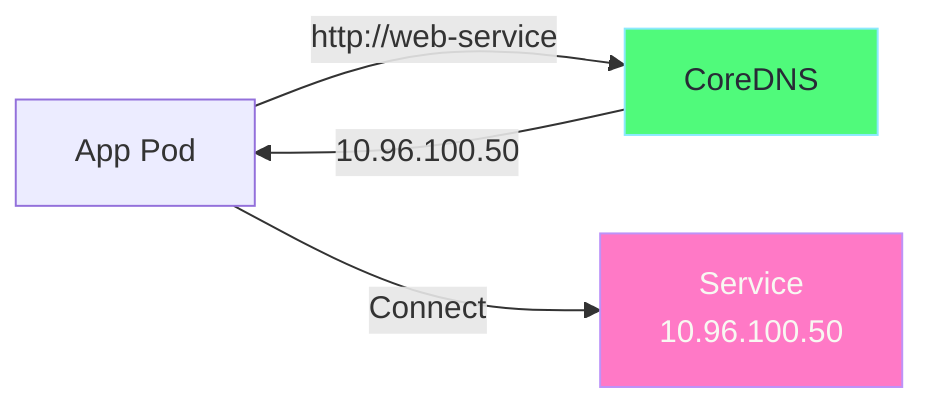
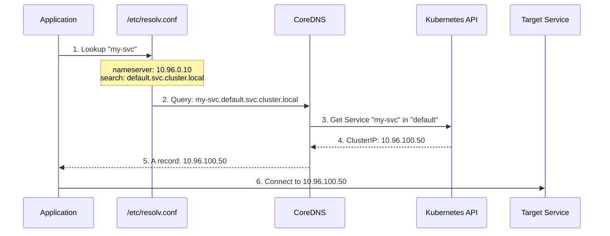
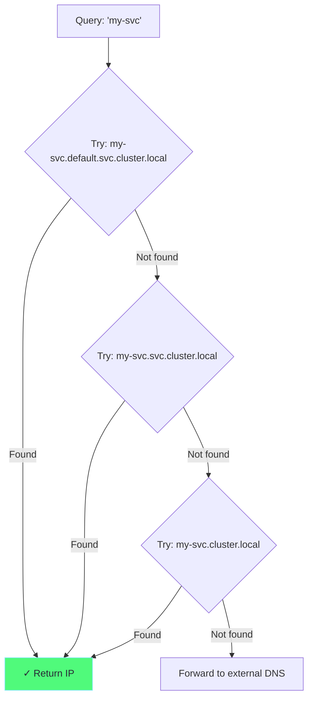
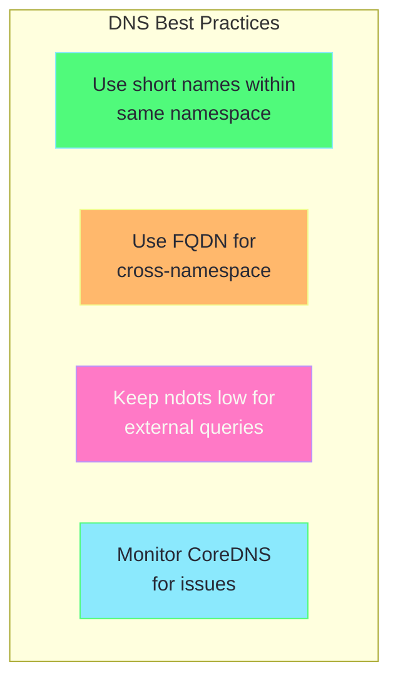

# Chapter 5: DNS & CoreDNS

## Table of Contents

1. [What is Kubernetes DNS?](#what-is-kubernetes-dns)
2. [How CoreDNS Works](#how-coredns-works)
3. [DNS Name Resolution](#dns-name-resolution)
4. [Pod DNS Configuration](#pod-dns-configuration)
5. [CoreDNS Configuration](#coredns-configuration)
6. [Troubleshooting DNS](#troubleshooting-dns)
7. [Hands-on Labs](#hands-on-labs)

---

## What is Kubernetes DNS?

Kubernetes DNS enables **service discovery** - pods can find services by name instead of IP.



### Why DNS in Kubernetes?

```
Without DNS:
─────────────────────────────────────────────────────────────
App code: connect to "10.96.100.50"

Problem: What if Service IP changes?
         What if deploying to different cluster?
         Hard to read and maintain!
─────────────────────────────────────────────────────────────

With DNS:
─────────────────────────────────────────────────────────────
App code: connect to "my-service"

Benefit: DNS resolves to Service IP automatically!
         Works across clusters with same service name
         Human-readable!
─────────────────────────────────────────────────────────────
```

---

## How CoreDNS Works

### Architecture

```
┌─────────────────────────────────────────────────────────────┐
│                    Kubernetes Cluster                        │
│                                                              │
│  ┌────────────────────────────────────────────────────────┐ │
│  │                    kube-system namespace                │ │
│  │                                                         │ │
│  │   ┌──────────────────────────────────────────────┐    │ │
│  │   │              CoreDNS Deployment               │    │ │
│  │   │                                               │    │ │
│  │   │   ┌─────────────┐    ┌─────────────┐        │    │ │
│  │   │   │ CoreDNS Pod │    │ CoreDNS Pod │        │    │ │
│  │   │   │  (replica)  │    │  (replica)  │        │    │ │
│  │   │   └─────────────┘    └─────────────┘        │    │ │
│  │   └──────────────────────────────────────────────┘    │ │
│  │                          ↑                             │ │
│  │                          │                             │ │
│  │   ┌──────────────────────────────────────────────┐    │ │
│  │   │       kube-dns Service (ClusterIP)           │    │ │
│  │   │           10.96.0.10:53                       │    │ │
│  │   └──────────────────────────────────────────────┘    │ │
│  │                                                         │ │
│  └────────────────────────────────────────────────────────┘ │
│                          ↑                                   │
│                          │                                   │
│  ┌────────────────────────────────────────────────────────┐ │
│  │                    All Pods                             │ │
│  │                                                         │ │
│  │   /etc/resolv.conf:                                     │ │
│  │   nameserver 10.96.0.10                                 │ │
│  │   search default.svc.cluster.local svc.cluster.local    │ │
│  │                                                         │ │
│  └────────────────────────────────────────────────────────┘ │
│                                                              │
└─────────────────────────────────────────────────────────────┘
```

### DNS Resolution Flow



---

## DNS Name Resolution

### DNS Name Formats

```
┌─────────────────────────────────────────────────────────────┐
│                    DNS Name Formats                          │
│                                                              │
│  SERVICES:                                                   │
│  ─────────                                                   │
│  Short:     my-svc                                          │
│  With NS:   my-svc.prod                                     │
│  Full FQDN: my-svc.prod.svc.cluster.local                   │
│                                                              │
│  Breakdown:                                                  │
│  ┌─────────┬──────┬─────┬─────────────────┐                │
│  │ my-svc  │ prod │ svc │ cluster.local   │                │
│  └────┬────┴───┬──┴──┬──┴───────┬─────────┘                │
│       │        │     │          │                           │
│  Service   Namespace Type    Cluster Domain                │
│                                                              │
├─────────────────────────────────────────────────────────────┤
│  PODS (for headless services or direct pod access):         │
│  ────                                                        │
│  10-0-1-50.default.pod.cluster.local                        │
│  ┌─────────┬────────┬─────┬─────────────────┐              │
│  │10-0-1-50│ default│ pod │ cluster.local   │              │
│  └────┬────┴───┬────┴──┬──┴───────┬─────────┘              │
│       │        │       │          │                         │
│  Pod IP    Namespace  Type    Cluster Domain               │
│  (dashed)                                                    │
│                                                              │
└─────────────────────────────────────────────────────────────┘
```

### Resolution Examples

| From Pod in | Query | Resolves To |
|-------------|-------|-------------|
| `default` ns | `my-svc` | `my-svc.default.svc.cluster.local` |
| `default` ns | `my-svc.prod` | `my-svc.prod.svc.cluster.local` |
| Any ns | `my-svc.prod.svc.cluster.local` | Full FQDN (always works) |

### Search Domains

When you query `my-svc`, Kubernetes tries these in order:

```
1. my-svc.default.svc.cluster.local   ← Same namespace
2. my-svc.svc.cluster.local           ← Service domain
3. my-svc.cluster.local               ← Cluster domain
4. my-svc                              ← External DNS (if not found)
```



---

## Pod DNS Configuration

### Default Configuration

Every pod gets these DNS settings:

```bash
# Inside any pod:
cat /etc/resolv.conf

# Output:
nameserver 10.96.0.10
search default.svc.cluster.local svc.cluster.local cluster.local
options ndots:5
```

### Understanding resolv.conf

```yaml
# ============================================================================
# POD DNS CONFIGURATION (/etc/resolv.conf)
# ============================================================================

nameserver 10.96.0.10
# ─────────────────────
# IP address of CoreDNS service
# All DNS queries go to this IP

search default.svc.cluster.local svc.cluster.local cluster.local
# ────────────────────────────────────────────────────────────────
# Search domains - appended to non-FQDN queries
# Query "my-svc" becomes "my-svc.default.svc.cluster.local"

options ndots:5
# ──────────────
# If query has fewer than 5 dots, use search domains first
# "my-svc" (0 dots) → use search domains
# "google.com" (1 dot) → use search domains
# "my-svc.prod.svc.cluster.local" (4 dots) → use search domains!
# "www.google.com" (2 dots) → still use search domains
# 
# IMPORTANT: This can cause extra DNS queries!
```

### DNS Policies

```yaml
# ============================================================================
# DNS POLICY OPTIONS
# ============================================================================

apiVersion: v1
kind: Pod
metadata:
  name: dns-example
spec:
  containers:
    - name: app
      image: nginx
  
  # ---------------------------------------------------------------------------
  # DNS POLICY
  # ---------------------------------------------------------------------------
  # Options:
  #   Default:         Inherit from node (not for pods!)
  #   ClusterFirst:    Use CoreDNS for cluster names, forward others (DEFAULT)
  #   ClusterFirstWithHostNet: ClusterFirst but for hostNetwork pods
  #   None:            Ignore inheriting; use dnsConfig only
  
  dnsPolicy: "ClusterFirst"  # Default for pods
```

### Custom DNS Configuration

```yaml
# ============================================================================
# CUSTOM DNS CONFIG
# ============================================================================

apiVersion: v1
kind: Pod
metadata:
  name: custom-dns-pod
spec:
  containers:
    - name: app
      image: nginx
  
  # ---------------------------------------------------------------------------
  # Use custom DNS (ignore cluster DNS)
  # ---------------------------------------------------------------------------
  dnsPolicy: "None"
  
  # ---------------------------------------------------------------------------
  # Custom DNS settings
  # ---------------------------------------------------------------------------
  dnsConfig:
    # Custom nameservers
    nameservers:
      - 10.96.0.10        # CoreDNS
      - 8.8.8.8           # Google DNS
      - 1.1.1.1           # Cloudflare DNS
    
    # Custom search domains
    searches:
      - default.svc.cluster.local
      - svc.cluster.local
      - mycompany.com      # Add company domain
    
    # Custom options
    options:
      - name: ndots
        value: "2"         # Reduce ndots for faster external lookups
      - name: timeout
        value: "3"         # DNS timeout in seconds
      - name: attempts
        value: "2"         # Number of retry attempts
```

---

## CoreDNS Configuration

### View CoreDNS Config

```bash
# View CoreDNS ConfigMap
kubectl get configmap coredns -n kube-system -o yaml
```

### CoreDNS Corefile

```
# ============================================================================
# COREDNS COREFILE (ConfigMap)
# ============================================================================

.:53 {
    # -------------------------------------------------------------------------
    # ERRORS: Log errors
    # -------------------------------------------------------------------------
    errors
    
    # -------------------------------------------------------------------------
    # HEALTH: Health check endpoint
    # -------------------------------------------------------------------------
    health {
       lameduck 5s
    }
    
    # -------------------------------------------------------------------------
    # READY: Readiness check endpoint
    # -------------------------------------------------------------------------
    ready
    
    # -------------------------------------------------------------------------
    # KUBERNETES: Handle cluster DNS
    # -------------------------------------------------------------------------
    kubernetes cluster.local in-addr.arpa ip6.arpa {
       pods insecure
       fallthrough in-addr.arpa ip6.arpa
       ttl 30
    }
    
    # -------------------------------------------------------------------------
    # PROMETHEUS: Metrics endpoint
    # -------------------------------------------------------------------------
    prometheus :9153
    
    # -------------------------------------------------------------------------
    # FORWARD: Forward non-cluster queries
    # -------------------------------------------------------------------------
    forward . /etc/resolv.conf {
       max_concurrent 1000
    }
    
    # -------------------------------------------------------------------------
    # CACHE: Cache DNS responses
    # -------------------------------------------------------------------------
    cache 30
    
    # -------------------------------------------------------------------------
    # LOOP: Detect forwarding loops
    # -------------------------------------------------------------------------
    loop
    
    # -------------------------------------------------------------------------
    # RELOAD: Auto-reload config
    # -------------------------------------------------------------------------
    reload
    
    # -------------------------------------------------------------------------
    # LOADBALANCE: Round-robin DNS
    # -------------------------------------------------------------------------
    loadbalance
}
```

### Custom CoreDNS Configuration

```yaml
# ============================================================================
# CUSTOMIZE COREDNS
# ============================================================================

apiVersion: v1
kind: ConfigMap
metadata:
  name: coredns
  namespace: kube-system
data:
  Corefile: |
    .:53 {
        errors
        health {
            lameduck 5s
        }
        ready
        kubernetes cluster.local in-addr.arpa ip6.arpa {
            pods insecure
            fallthrough in-addr.arpa ip6.arpa
            ttl 30
        }
        prometheus :9153
        
        # Custom: Forward specific domain to custom DNS
        forward mycompany.com 10.0.0.53 {
            max_concurrent 1000
        }
        
        # Forward everything else to upstream
        forward . 8.8.8.8 8.8.4.4 {
            max_concurrent 1000
        }
        
        cache 30
        loop
        reload
        loadbalance
    }
    
    # Custom zone for internal services
    company.local:53 {
        errors
        cache 30
        forward . 10.0.0.53
    }
```

---

## Troubleshooting DNS

### Common Issues

```
┌─────────────────────────────────────────────────────────────┐
│                    DNS Issues                                │
│                                                              │
│  Issue 1: "Name does not resolve"                           │
│  ─────────────────────────────────                          │
│  Causes:                                                     │
│    - Service doesn't exist                                   │
│    - Wrong namespace                                         │
│    - Wrong service name spelling                             │
│                                                              │
│  Issue 2: "Connection timed out"                            │
│  ───────────────────────────────                            │
│  Causes:                                                     │
│    - CoreDNS pods not running                                │
│    - Network policy blocking DNS                             │
│    - CoreDNS service IP changed                              │
│                                                              │
│  Issue 3: Slow DNS resolution                               │
│  ────────────────────────────                               │
│  Causes:                                                     │
│    - High ndots value causing many queries                   │
│    - External DNS slow                                       │
│    - CoreDNS overloaded                                      │
│                                                              │
└─────────────────────────────────────────────────────────────┘
```

### Debugging Commands

```bash
# ============================================================================
# DNS DEBUGGING COMMANDS
# ============================================================================

# 1. Check CoreDNS pods are running
kubectl get pods -n kube-system -l k8s-app=kube-dns
# Should show Running, not CrashLoopBackOff

# 2. Check CoreDNS service
kubectl get svc -n kube-system kube-dns
# Should show ClusterIP (usually 10.96.0.10)

# 3. Check CoreDNS logs
kubectl logs -n kube-system -l k8s-app=kube-dns

# 4. Test DNS from a pod
kubectl run dnstest --image=busybox --rm -it -- nslookup kubernetes
# Should return the kubernetes API server service IP

# 5. Test full FQDN
kubectl run dnstest --image=busybox --rm -it -- nslookup kubernetes.default.svc.cluster.local

# 6. Test external DNS
kubectl run dnstest --image=busybox --rm -it -- nslookup google.com

# 7. Check pod's resolv.conf
kubectl exec <pod-name> -- cat /etc/resolv.conf

# 8. Debug with dig (more detailed)
kubectl run dnstest --image=tutum/dnsutils --rm -it -- dig kubernetes.default.svc.cluster.local

# 9. Check CoreDNS config
kubectl get configmap coredns -n kube-system -o yaml
```

### DNS Debug Pod

```yaml
# ============================================================================
# DNS DEBUG POD
# ============================================================================
# Deploy this for extended DNS debugging

apiVersion: v1
kind: Pod
metadata:
  name: dnsutils
  namespace: default
spec:
  containers:
    - name: dnsutils
      image: registry.k8s.io/e2e-test-images/jessie-dnsutils:1.3
      command:
        - sleep
        - "infinity"
      imagePullPolicy: IfNotPresent
  restartPolicy: Always

# Usage:
# kubectl exec -it dnsutils -- nslookup kubernetes
# kubectl exec -it dnsutils -- dig +short my-service.default.svc.cluster.local
# kubectl exec -it dnsutils -- host -t A my-service
```

---

## Hands-on Labs

### Lab 1: Basic DNS Resolution

```bash
# Create a service
kubectl create deployment web --image=nginx
kubectl expose deployment web --port=80

# Test DNS resolution
kubectl run dnstest --image=busybox --rm -it -- nslookup web
# Output:
# Server:    10.96.0.10
# Address 1: 10.96.0.10 kube-dns.kube-system.svc.cluster.local
# 
# Name:      web
# Address 1: 10.96.xxx.xxx web.default.svc.cluster.local

# Test with full FQDN
kubectl run dnstest --image=busybox --rm -it -- nslookup web.default.svc.cluster.local
```

### Lab 2: Cross-Namespace DNS

```bash
# Create service in different namespace
kubectl create namespace prod
kubectl create deployment web-prod --image=nginx -n prod
kubectl expose deployment web-prod --port=80 -n prod

# From default namespace, access prod namespace service
kubectl run dnstest --image=busybox --rm -it -- nslookup web-prod.prod
# Note: Uses namespace.svc.cluster.local format

# Verify with full FQDN
kubectl run dnstest --image=busybox --rm -it -- nslookup web-prod.prod.svc.cluster.local
```

### Lab 3: Headless Service DNS

```bash
# Create headless service
kubectl create deployment headless-demo --image=nginx --replicas=3

cat <<EOF | kubectl apply -f -
apiVersion: v1
kind: Service
metadata:
  name: headless-demo
spec:
  clusterIP: None
  selector:
    app: headless-demo
  ports:
    - port: 80
EOF

# DNS returns ALL pod IPs (not service IP)
kubectl run dnstest --image=busybox --rm -it -- nslookup headless-demo
# Returns multiple A records - one per pod!
```

### Lab 4: View DNS Configuration

```bash
# View CoreDNS ConfigMap
kubectl get configmap coredns -n kube-system -o yaml

# View CoreDNS pods
kubectl get pods -n kube-system -l k8s-app=kube-dns -o wide

# View CoreDNS logs
kubectl logs -n kube-system -l k8s-app=kube-dns --tail=20

# Check metrics
kubectl get --raw "/api/v1/namespaces/kube-system/services/kube-dns:metrics/proxy/metrics"
```

### Lab 5: Custom DNS Pod

```bash
# Create pod with custom DNS
cat <<EOF | kubectl apply -f -
apiVersion: v1
kind: Pod
metadata:
  name: custom-dns
spec:
  containers:
    - name: app
      image: busybox
      command: ["sleep", "3600"]
  dnsPolicy: "None"
  dnsConfig:
    nameservers:
      - 10.96.0.10
      - 8.8.8.8
    searches:
      - default.svc.cluster.local
      - mycompany.internal
    options:
      - name: ndots
        value: "2"
EOF

# Verify custom config
kubectl exec custom-dns -- cat /etc/resolv.conf
# Should show custom nameservers and search domains
```

---

## Best Practices



| Practice | Description |
|----------|-------------|
| **Use short names** | `my-svc` works in same namespace |
| **Use FQDN for cross-ns** | `my-svc.prod.svc.cluster.local` |
| **Lower ndots for external** | Reduces unnecessary DNS queries |
| **Monitor CoreDNS** | Check logs and metrics |
| **Scale CoreDNS** | Add replicas for large clusters |

---

## Next: [Chapter 6 - Service Mesh →](06-service-mesh.md)
