# Chapter 6: Service Mesh (Istio)

## Table of Contents

1. [What is a Service Mesh?](#what-is-a-service-mesh)
2. [Istio Architecture](#istio-architecture)
3. [Installing Istio](#installing-istio)
4. [Traffic Management](#traffic-management)
5. [Security (mTLS)](#security-mtls)
6. [Observability](#observability)
7. [YAML Explained](#yaml-explained)
8. [Hands-on Labs](#hands-on-labs)

---

## What is a Service Mesh?

A **Service Mesh** is an infrastructure layer that handles service-to-service communication. It adds a sidecar proxy to every pod.

```mermaid
flowchart LR
    subgraph PodA["Pod A"]
        AppA["App"] --> ProxyA["Envoy<br/>Proxy"]
    end
    
    subgraph PodB["Pod B"]
        ProxyB["Envoy<br/>Proxy"] --> AppB["App"]
    end
    
    ProxyA <-->|"🔒 mTLS"| ProxyB
    
    style ProxyA fill:#50fa7b,stroke:#8be9fd,color:#282a36
    style ProxyB fill:#50fa7b,stroke:#8be9fd,color:#282a36
```



### What Service Mesh Provides

```
┌─────────────────────────────────────────────────────────────┐
│                  Service Mesh Features                       │
│                                                              │
│  ┌─────────────────────────────────────────────────────┐   │
│  │  TRAFFIC MANAGEMENT                                  │   │
│  │  • Load balancing                                    │   │
│  │  • Traffic splitting (canary, A/B testing)          │   │
│  │  • Retries, timeouts, circuit breaking               │   │
│  │  • Rate limiting                                     │   │
│  └─────────────────────────────────────────────────────┘   │
│                                                              │
│  ┌─────────────────────────────────────────────────────┐   │
│  │  SECURITY                                            │   │
│  │  • Mutual TLS (mTLS) - encryption in transit        │   │
│  │  • Authentication (identity verification)            │   │
│  │  • Authorization (access control)                    │   │
│  └─────────────────────────────────────────────────────┘   │
│                                                              │
│  ┌─────────────────────────────────────────────────────┐   │
│  │  OBSERVABILITY                                       │   │
│  │  • Distributed tracing (Jaeger, Zipkin)             │   │
│  │  • Metrics (Prometheus, Grafana)                     │   │
│  │  • Access logging                                    │   │
│  │  • Service topology (Kiali)                          │   │
│  └─────────────────────────────────────────────────────┘   │
│                                                              │
└─────────────────────────────────────────────────────────────┘
```

### Without vs With Service Mesh


---

## Istio Architecture

### Components


### Component Details

| Component | Description |
|-----------|-------------|
| **istiod** | Control plane - manages config, certs, discovery |
| **Envoy** | Sidecar proxy - handles all traffic |
| **Ingress Gateway** | Entry point for external traffic |
| **Egress Gateway** | Exit point for outbound traffic |

### Request Flow


---

## Installing Istio

### Prerequisites

```bash
# Start Minikube with enough resources
minikube start --cpus=4 --memory=8192

# Verify cluster is ready
kubectl get nodes
```

### Install Istio

```bash
# Download Istio
curl -L https://istio.io/downloadIstio | sh -

# Navigate to Istio directory
cd istio-*

# Add istioctl to PATH
export PATH=$PWD/bin:$PATH

# Install Istio with demo profile
istioctl install --set profile=demo -y

# Verify installation
kubectl get pods -n istio-system
# NAME                                    READY   STATUS
# istio-ingressgateway-xxx                1/1     Running
# istiod-xxx                              1/1     Running
```

### Enable Sidecar Injection

```bash
# Enable auto-injection for default namespace
kubectl label namespace default istio-injection=enabled

# Verify label
kubectl get namespace default --show-labels

# Now any new pod will get Envoy sidecar!
```

### Manual Sidecar Injection

```bash
# If not using auto-injection:
kubectl apply -f <(istioctl kube-inject -f deployment.yaml)
```

---

## Traffic Management

### Core Resources


### Gateway

Entry point for external traffic:

```yaml
# ============================================================================
# ISTIO GATEWAY
# ============================================================================
# Configures the Istio ingress gateway to accept traffic

apiVersion: networking.istio.io/v1beta1
kind: Gateway
metadata:
  name: my-gateway
spec:
  # ---------------------------------------------------------------------------
  # SELECTOR: Which gateway pods to configure
  # ---------------------------------------------------------------------------
  selector:
    istio: ingressgateway  # Use default Istio gateway
  
  # ---------------------------------------------------------------------------
  # SERVERS: Ports and protocols to listen on
  # ---------------------------------------------------------------------------
  servers:
    # HTTP server
    - port:
        number: 80
        name: http
        protocol: HTTP
      hosts:
        - "myapp.example.com"
        - "*.example.com"      # Wildcard
    
    # HTTPS server
    - port:
        number: 443
        name: https
        protocol: HTTPS
      tls:
        mode: SIMPLE           # TLS termination
        credentialName: tls-secret  # K8s secret with cert
      hosts:
        - "secure.example.com"
```

### VirtualService

Routing rules for traffic:

```yaml
# ============================================================================
# ISTIO VIRTUALSERVICE
# ============================================================================
# Defines how requests are routed to services

apiVersion: networking.istio.io/v1beta1
kind: VirtualService
metadata:
  name: my-vs
spec:
  # ---------------------------------------------------------------------------
  # HOSTS: Which hostnames this applies to
  # ---------------------------------------------------------------------------
  hosts:
    - "myapp.example.com"
    - my-service              # Internal service
  
  # ---------------------------------------------------------------------------
  # GATEWAYS: Which gateways to attach to
  # ---------------------------------------------------------------------------
  gateways:
    - my-gateway              # External traffic
    - mesh                    # Internal mesh traffic
  
  # ---------------------------------------------------------------------------
  # HTTP ROUTING RULES
  # ---------------------------------------------------------------------------
  http:
    # Rule 1: Route by header (canary)
    - match:
        - headers:
            x-version:
              exact: "v2"     # If header x-version: v2
      route:
        - destination:
            host: my-service
            subset: v2        # Route to v2 pods
    
    # Rule 2: Traffic splitting (90/10)
    - route:
        - destination:
            host: my-service
            subset: v1
          weight: 90          # 90% to v1
        - destination:
            host: my-service
            subset: v2
          weight: 10          # 10% to v2
    
    # ---------------------------------------------------------------------------
    # RETRIES
    # ---------------------------------------------------------------------------
    retries:
      attempts: 3
      perTryTimeout: 2s
      retryOn: gateway-error,connect-failure,refused-stream
    
    # ---------------------------------------------------------------------------
    # TIMEOUT
    # ---------------------------------------------------------------------------
    timeout: 10s
```

### DestinationRule

Policies for traffic to a destination:

```yaml
# ============================================================================
# ISTIO DESTINATIONRULE
# ============================================================================
# Configures what happens AFTER routing

apiVersion: networking.istio.io/v1beta1
kind: DestinationRule
metadata:
  name: my-dr
spec:
  host: my-service
  
  # ---------------------------------------------------------------------------
  # TRAFFIC POLICY: Default for all subsets
  # ---------------------------------------------------------------------------
  trafficPolicy:
    # Connection pool settings
    connectionPool:
      tcp:
        maxConnections: 100
      http:
        h2UpgradePolicy: UPGRADE
        http1MaxPendingRequests: 100
        http2MaxRequests: 1000
    
    # Load balancing
    loadBalancer:
      simple: ROUND_ROBIN     # or LEAST_CONN, RANDOM, PASSTHROUGH
    
    # Outlier detection (circuit breaker)
    outlierDetection:
      consecutive5xxErrors: 5
      interval: 30s
      baseEjectionTime: 30s
      maxEjectionPercent: 100
  
  # ---------------------------------------------------------------------------
  # SUBSETS: Define versions
  # ---------------------------------------------------------------------------
  subsets:
    - name: v1
      labels:
        version: v1           # Pods with version=v1 label
    - name: v2
      labels:
        version: v2
```

### Traffic Flow Diagram


---

## Security (mTLS)

### What is mTLS?

**Mutual TLS (mTLS)** means both client and server verify each other's identity:

```
Regular TLS:
Client ──────────────────────► Server
        Server proves identity
        (Client trusts server)

Mutual TLS:
Client ◄────────────────────► Server
        Both prove identity
        (Both trust each other)
```

### PeerAuthentication

```yaml
# ============================================================================
# PEER AUTHENTICATION - Enable mTLS
# ============================================================================

apiVersion: security.istio.io/v1beta1
kind: PeerAuthentication
metadata:
  name: default
  namespace: default
spec:
  # ---------------------------------------------------------------------------
  # MTLS MODE
  # ---------------------------------------------------------------------------
  # STRICT:     Only accept mTLS traffic
  # PERMISSIVE: Accept both mTLS and plain text (migration mode)
  # DISABLE:    No mTLS
  
  mtls:
    mode: STRICT

# Apply to entire mesh:
# metadata:
#   name: default
#   namespace: istio-system  # Applies to all namespaces
```

### Authorization Policy

```yaml
# ============================================================================
# AUTHORIZATION POLICY
# ============================================================================
# Control who can access what

apiVersion: security.istio.io/v1beta1
kind: AuthorizationPolicy
metadata:
  name: allow-frontend
  namespace: default
spec:
  # ---------------------------------------------------------------------------
  # SELECTOR: Which workloads this applies to
  # ---------------------------------------------------------------------------
  selector:
    matchLabels:
      app: backend
  
  # ---------------------------------------------------------------------------
  # ACTION: ALLOW, DENY, or CUSTOM
  # ---------------------------------------------------------------------------
  action: ALLOW
  
  # ---------------------------------------------------------------------------
  # RULES: When to allow
  # ---------------------------------------------------------------------------
  rules:
    - from:
        # Source: Only from frontend service account
        - source:
            principals:
              - "cluster.local/ns/default/sa/frontend"
      to:
        # Destination: Only these methods/paths
        - operation:
            methods: ["GET", "POST"]
            paths: ["/api/*"]
```

---

## Observability

### Kiali - Service Mesh Dashboard

```bash
# Install Kiali
kubectl apply -f samples/addons/kiali.yaml

# Access Kiali
istioctl dashboard kiali
```

### Prometheus & Grafana

```bash
# Install Prometheus
kubectl apply -f samples/addons/prometheus.yaml

# Install Grafana
kubectl apply -f samples/addons/grafana.yaml

# Access Grafana
istioctl dashboard grafana
```

### Jaeger - Distributed Tracing

```bash
# Install Jaeger
kubectl apply -f samples/addons/jaeger.yaml

# Access Jaeger
istioctl dashboard jaeger
```

---

## YAML Explained

### Complete Canary Deployment

```yaml
# ============================================================================
# CANARY DEPLOYMENT EXAMPLE
# ============================================================================
# Deploy v2 gradually: 10% → 25% → 50% → 100%

# Step 1: Deploy both versions
---
apiVersion: apps/v1
kind: Deployment
metadata:
  name: my-app-v1
spec:
  replicas: 3
  selector:
    matchLabels:
      app: my-app
      version: v1
  template:
    metadata:
      labels:
        app: my-app
        version: v1           # Version label!
    spec:
      containers:
        - name: my-app
          image: my-app:1.0
---
apiVersion: apps/v1
kind: Deployment
metadata:
  name: my-app-v2
spec:
  replicas: 1
  selector:
    matchLabels:
      app: my-app
      version: v2
  template:
    metadata:
      labels:
        app: my-app
        version: v2           # Version label!
    spec:
      containers:
        - name: my-app
          image: my-app:2.0

# Step 2: Service (selects both versions)
---
apiVersion: v1
kind: Service
metadata:
  name: my-app
spec:
  selector:
    app: my-app               # Matches BOTH v1 and v2
  ports:
    - port: 80

# Step 3: DestinationRule (define subsets)
---
apiVersion: networking.istio.io/v1beta1
kind: DestinationRule
metadata:
  name: my-app-dr
spec:
  host: my-app
  subsets:
    - name: v1
      labels:
        version: v1
    - name: v2
      labels:
        version: v2

# Step 4: VirtualService (traffic split)
---
apiVersion: networking.istio.io/v1beta1
kind: VirtualService
metadata:
  name: my-app-vs
spec:
  hosts:
    - my-app
  http:
    - route:
        - destination:
            host: my-app
            subset: v1
          weight: 90          # 90% to v1
        - destination:
            host: my-app
            subset: v2
          weight: 10          # 10% to v2 (canary)

# To increase canary traffic:
# Change weights to 75/25, then 50/50, then 0/100
```

### Circuit Breaker

```yaml
# ============================================================================
# CIRCUIT BREAKER
# ============================================================================

apiVersion: networking.istio.io/v1beta1
kind: DestinationRule
metadata:
  name: circuit-breaker
spec:
  host: my-service
  trafficPolicy:
    # ---------------------------------------------------------------------------
    # CONNECTION LIMITS
    # ---------------------------------------------------------------------------
    connectionPool:
      tcp:
        maxConnections: 100           # Max TCP connections
      http:
        http1MaxPendingRequests: 100  # Max pending HTTP/1.1 requests
        http2MaxRequests: 1000        # Max HTTP/2 requests
        maxRequestsPerConnection: 10  # Requests before closing connection
    
    # ---------------------------------------------------------------------------
    # OUTLIER DETECTION (Circuit Breaker)
    # ---------------------------------------------------------------------------
    outlierDetection:
      consecutive5xxErrors: 5         # 5 errors to trigger
      interval: 30s                   # Detection interval
      baseEjectionTime: 30s           # How long to eject
      maxEjectionPercent: 50          # Max % of hosts to eject
      minHealthPercent: 30            # Min healthy hosts required
```

---

## Hands-on Labs

### Lab 1: Install Istio

```bash
# Start Minikube
minikube start --cpus=4 --memory=8192

# Download Istio
curl -L https://istio.io/downloadIstio | sh -
cd istio-*
export PATH=$PWD/bin:$PATH

# Install
istioctl install --set profile=demo -y

# Enable injection
kubectl label namespace default istio-injection=enabled

# Verify
kubectl get pods -n istio-system
```

### Lab 2: Deploy Sample App

```bash
# Deploy Bookinfo sample
kubectl apply -f samples/bookinfo/platform/kube/bookinfo.yaml

# Wait for pods
kubectl wait --for=condition=ready pod --all --timeout=120s

# Expose via Gateway
kubectl apply -f samples/bookinfo/networking/bookinfo-gateway.yaml

# Get ingress URL
export INGRESS_HOST=$(minikube ip)
export INGRESS_PORT=$(kubectl -n istio-system get service istio-ingressgateway -o jsonpath='{.spec.ports[?(@.name=="http2")].nodePort}')
echo "http://$INGRESS_HOST:$INGRESS_PORT/productpage"

# Test
curl http://$INGRESS_HOST:$INGRESS_PORT/productpage
```

### Lab 3: Traffic Splitting

```bash
# Apply destination rule (defines subsets)
kubectl apply -f samples/bookinfo/networking/destination-rule-all.yaml

# Route all traffic to v1
kubectl apply -f samples/bookinfo/networking/virtual-service-all-v1.yaml

# Test - should always show reviews v1 (no stars)
for i in {1..10}; do
  curl -s http://$INGRESS_HOST:$INGRESS_PORT/productpage | grep -o 'reviews-v[0-9]'
done

# Split traffic 50/50 between v1 and v3
cat <<EOF | kubectl apply -f -
apiVersion: networking.istio.io/v1beta1
kind: VirtualService
metadata:
  name: reviews
spec:
  hosts:
    - reviews
  http:
    - route:
        - destination:
            host: reviews
            subset: v1
          weight: 50
        - destination:
            host: reviews
            subset: v3
          weight: 50
EOF

# Test - should show mix of v1 (no stars) and v3 (red stars)
for i in {1..10}; do
  curl -s http://$INGRESS_HOST:$INGRESS_PORT/productpage | grep -o 'reviews-v[0-9]' || echo "v1"
done
```

### Lab 4: Enable mTLS

```bash
# Enable strict mTLS for default namespace
cat <<EOF | kubectl apply -f -
apiVersion: security.istio.io/v1beta1
kind: PeerAuthentication
metadata:
  name: default
  namespace: default
spec:
  mtls:
    mode: STRICT
EOF

# Verify mTLS is working
istioctl x authz check deployment/productpage

# Test - should still work (mTLS enabled transparently)
curl http://$INGRESS_HOST:$INGRESS_PORT/productpage
```

### Lab 5: Observability

```bash
# Install addons
kubectl apply -f samples/addons

# Wait for addons
kubectl wait --for=condition=ready pod --all -n istio-system --timeout=120s

# Access Kiali dashboard
istioctl dashboard kiali

# Access Grafana
istioctl dashboard grafana

# Access Jaeger
istioctl dashboard jaeger

# Generate traffic for visualization
for i in {1..100}; do
  curl -s http://$INGRESS_HOST:$INGRESS_PORT/productpage > /dev/null
  sleep 0.5
done
```

### Lab 6: Cleanup

```bash
# Delete Bookinfo
kubectl delete -f samples/bookinfo/platform/kube/bookinfo.yaml
kubectl delete -f samples/bookinfo/networking/bookinfo-gateway.yaml

# Delete addons
kubectl delete -f samples/addons

# Uninstall Istio
istioctl uninstall --purge -y
kubectl delete namespace istio-system

# Remove injection label
kubectl label namespace default istio-injection-
```

---

## Summary


| Resource | Purpose |
|----------|---------|
| **Gateway** | External traffic entry |
| **VirtualService** | Routing rules |
| **DestinationRule** | Policies, subsets |
| **PeerAuthentication** | mTLS settings |
| **AuthorizationPolicy** | Access control |

---

## 🎉 Congratulations!

You've completed the Kubernetes Networking Mastery Guide!

### What You've Learned:

1. ✅ CNI & Pod Networking
2. ✅ Services & Load Balancing
3. ✅ Ingress & Controllers
4. ✅ Network Policies
5. ✅ DNS & CoreDNS
6. ✅ Service Mesh (Istio)

### Next Steps:

- Practice the labs multiple times
- Experiment with different configurations
- Try breaking things to understand failure modes
- Explore advanced Istio features
- Check out [istio_mastering/](../istio_mastering/) for more Istio content
