# Chapter 7: Gateway API - The Future of Kubernetes Ingress

## Table of Contents

1. [What is Gateway API?](#what-is-gateway-api)
2. [Why Gateway API over Ingress?](#why-gateway-api-over-ingress)
3. [Core Resources](#core-resources)
4. [Role-Oriented Design](#role-oriented-design)
5. [YAML Explained](#yaml-explained)
6. [Advanced Routing](#advanced-routing)
7. [TLS/HTTPS Setup](#tlshttps-setup)
8. [Hands-on Labs](#hands-on-labs)
9. [Migration from Ingress](#migration-from-ingress)

---

## What is Gateway API?

**Gateway API** is the next-generation Kubernetes API for traffic routing. It's the evolution of Ingress, designed to be more expressive, extensible, and role-oriented.


### Key Points

| Aspect | Description |
|--------|-------------|
| **Status** | v1.0 GA (HTTP routing), v1.2 latest |
| **API Group** | `gateway.networking.k8s.io` |
| **Replaces** | Ingress (`networking.k8s.io/v1`) |
| **Maintained by** | Kubernetes SIG-Network |

### Why Was Gateway API Created?

```
┌─────────────────────────────────────────────────────────────┐
│                  Problems with Ingress                       │
├─────────────────────────────────────────────────────────────┤
│                                                              │
│  1. Limited expressiveness                                   │
│     - Only host/path routing                                 │
│     - No header/method matching                              │
│                                                              │
│  2. Controller-specific annotations                          │
│     - nginx.ingress.kubernetes.io/...                       │
│     - traefik.ingress.kubernetes.io/...                     │
│     - Not portable across controllers!                       │
│                                                              │
│  3. No role separation                                       │
│     - Infrastructure and app config mixed                    │
│     - Security concerns                                      │
│                                                              │
│  4. Single resource does everything                          │
│     - Difficult to manage at scale                           │
│                                                              │
└─────────────────────────────────────────────────────────────┘
```

---

## Why Gateway API over Ingress?

### Feature Comparison

| Feature | Ingress | Gateway API |
|---------|---------|-------------|
| **Host-based routing** | ✅ Yes | ✅ Yes |
| **Path-based routing** | ✅ Yes | ✅ Yes |
| **Header-based routing** | ❌ Annotation | ✅ Native |
| **Method-based routing** | ❌ No | ✅ Native |
| **Traffic splitting** | ❌ Annotation | ✅ Native |
| **Request/Response modification** | ❌ Annotation | ✅ Native |
| **Cross-namespace routing** | ❌ Limited | ✅ ReferenceGrant |
| **Role separation** | ❌ No | ✅ Yes |
| **Portability** | ❌ Annotations differ | ✅ Standard API |
| **TCP/UDP routing** | ❌ No | ✅ TCPRoute/UDPRoute |
| **gRPC routing** | ❌ Annotation | ✅ GRPCRoute |

### Visual Comparison

```mermaid
flowchart TB
    subgraph Ingress["Ingress Approach"]
        IngressRes["Single Ingress Resource<br/>- host/path rules<br/>- controller annotations<br/>- TLS config"]
        IngressCtrl["Ingress Controller"]
        IngressRes --> IngressCtrl
    end
    
    subgraph GatewayApproach["Gateway API Approach"]
        GWClass["GatewayClass<br/>🔧 Infrastructure"]
        GW["Gateway<br/>🌐 Entry Point"]
        Route["HTTPRoute/GRPCRoute<br/>📍 App Routing"]
        
        GWClass --> GW --> Route
    end
    
    style GatewayApproach fill:#50fa7b,stroke:#8be9fd,color:#282a36
    style Ingress fill:#ffb86c,stroke:#f1fa8c,color:#282a36
```



---

## Core Resources

### Resource Hierarchy

```mermaid
flowchart TB
    GWClass["GatewayClass<br/>━━━━━━━━━━━<br/>• Defines implementation<br/>• Cluster-scoped<br/>• Set by platform team"]
    
    GW["Gateway<br/>━━━━━━━━━━━<br/>• Defines listeners (ports)<br/>• Namespace-scoped<br/>• Set by cluster operators"]
    
    Routes["Routes<br/>━━━━━━━━━━━<br/>• HTTPRoute (L7 HTTP)<br/>• GRPCRoute (gRPC)<br/>• TCPRoute (L4 TCP)<br/>• TLSRoute (L4 TLS)<br/>• UDPRoute (L4 UDP)"]
    
    Backend["Backend Services<br/>━━━━━━━━━━━<br/>• Kubernetes Services<br/>• Application pods"]
    
    GWClass --> GW --> Routes --> Backend
    
    style GWClass fill:#ff79c6,stroke:#bd93f9,color:#f8f8f2
    style GW fill:#8be9fd,stroke:#50fa7b,color:#282a36
    style Routes fill:#50fa7b,stroke:#8be9fd,color:#282a36
    style Backend fill:#ffb86c,stroke:#f1fa8c,color:#282a36
```



### Resource Overview

| Resource | Scope | Purpose | Managed By |
|----------|-------|---------|------------|
| **GatewayClass** | Cluster | Defines the controller implementation | Platform Team |
| **Gateway** | Namespace | Defines listeners (ports, protocols, TLS) | Cluster Operator |
| **HTTPRoute** | Namespace | HTTP routing rules | App Developer |
| **GRPCRoute** | Namespace | gRPC routing rules | App Developer |
| **TCPRoute** | Namespace | TCP routing rules | App Developer |
| **TLSRoute** | Namespace | TLS passthrough routing | App Developer |
| **ReferenceGrant** | Namespace | Cross-namespace permissions | Namespace Owner |

---

## Role-Oriented Design

### Separation of Concerns

Gateway API separates infrastructure from application configuration:

```mermaid
flowchart TB
    subgraph Platform["👷 Platform Team"]
        GWClass["GatewayClass<br/>━━━━━━━━━━━<br/>• Which controller to use<br/>• Controller parameters<br/>• Infrastructure policies"]
    end
    
    subgraph Operator["🔧 Cluster Operator"]
        Gateway["Gateway<br/>━━━━━━━━━━━<br/>• Which ports to open<br/>• TLS certificates<br/>• Allowed namespaces"]
    end
    
    subgraph Developer["💻 App Developer"]
        HTTPRoute["HTTPRoute<br/>━━━━━━━━━━━<br/>• Route my app traffic<br/>• Path/header matching<br/>• Traffic splitting"]
    end
    
    GWClass --> Gateway --> HTTPRoute
    
    style Platform fill:#ff79c6,stroke:#bd93f9,color:#f8f8f2
    style Operator fill:#8be9fd,stroke:#50fa7b,color:#282a36
    style Developer fill:#50fa7b,stroke:#8be9fd,color:#282a36
```



### Why This Matters

```
┌─────────────────────────────────────────────────────────────┐
│                    With Ingress                              │
├─────────────────────────────────────────────────────────────┤
│                                                              │
│  App Developer creates Ingress:                              │
│  ├── Defines host/path (app concern) ✓                      │
│  ├── Chooses controller (platform concern) ✗                │
│  ├── Sets TLS certs (security concern) ✗                    │
│  └── Configures rate limits (infra concern) ✗               │
│                                                              │
│  Problem: Too much power, security risk, config drift!       │
└─────────────────────────────────────────────────────────────┘

┌─────────────────────────────────────────────────────────────┐
│                  With Gateway API                            │
├─────────────────────────────────────────────────────────────┤
│                                                              │
│  Platform Team → GatewayClass (controller choice)            │
│  Cluster Operator → Gateway (ports, TLS, policies)           │
│  App Developer → HTTPRoute (just app routing!) ✓             │
│                                                              │
│  Solution: Clear boundaries, better security!                │
└─────────────────────────────────────────────────────────────┘
```

---

## YAML Explained

### GatewayClass

```yaml
# ============================================================================
# GATEWAYCLASS - Defines the Controller Implementation
# ============================================================================
# This is like IngressClass - specifies which controller handles Gateways
# Usually created by platform/infrastructure team

apiVersion: gateway.networking.k8s.io/v1
kind: GatewayClass
metadata:
  name: nginx                    # Name to reference in Gateway
  # Note: GatewayClass is cluster-scoped (no namespace)
spec:
  # ---------------------------------------------------------------------------
  # controllerName: Which controller implements this GatewayClass
  # ---------------------------------------------------------------------------
  # Common controllers:
  # - gateway.nginx.org/nginx-gateway-controller     (NGINX Gateway Fabric)
  # - gateway.envoyproxy.io/gatewayclass-controller  (Envoy Gateway)
  # - istio.io/gateway-controller                    (Istio)
  # - traefik.io/gateway-controller                  (Traefik)
  controllerName: gateway.nginx.org/nginx-gateway-controller
  
  # ---------------------------------------------------------------------------
  # parametersRef: Optional controller-specific config
  # ---------------------------------------------------------------------------
  # parametersRef:
  #   group: gateway.nginx.org
  #   kind: NginxGatewayConfig
  #   name: nginx-gateway-config
```

### Gateway

```yaml
# ============================================================================
# GATEWAY - Defines Entry Point (Listeners)
# ============================================================================
# The Gateway is like a load balancer that listens on specific ports
# Usually created by cluster operators

apiVersion: gateway.networking.k8s.io/v1
kind: Gateway
metadata:
  name: my-gateway
  namespace: default             # Gateway is namespace-scoped
spec:
  # ---------------------------------------------------------------------------
  # gatewayClassName: Which GatewayClass to use
  # ---------------------------------------------------------------------------
  gatewayClassName: nginx        # Reference to GatewayClass
  
  # ---------------------------------------------------------------------------
  # listeners: Define ports, protocols, and hostnames
  # ---------------------------------------------------------------------------
  listeners:
    # Listener 1: HTTP on port 80
    - name: http
      protocol: HTTP
      port: 80
      # Which hostnames this listener accepts
      hostname: "*.example.com"  # Wildcard matching
      
      # ---------------------------------------------------------------------------
      # allowedRoutes: Control which Routes can attach
      # ---------------------------------------------------------------------------
      allowedRoutes:
        namespaces:
          from: All              # All, Same, or Selector
          # from: Selector
          # selector:
          #   matchLabels:
          #     gateway-access: "true"
    
    # Listener 2: HTTPS on port 443
    - name: https
      protocol: HTTPS
      port: 443
      hostname: "secure.example.com"
      
      # ---------------------------------------------------------------------------
      # tls: TLS configuration for HTTPS listeners
      # ---------------------------------------------------------------------------
      tls:
        mode: Terminate          # Terminate (decrypt) or Passthrough
        certificateRefs:
          - name: tls-secret     # Secret with tls.crt and tls.key
            kind: Secret
      
      allowedRoutes:
        namespaces:
          from: Same             # Only routes from same namespace
```

### HTTPRoute

```yaml
# ============================================================================
# HTTPROUTE - Defines Application Routing Rules
# ============================================================================
# This is what app developers create to route traffic to their services
# Much more expressive than Ingress!

apiVersion: gateway.networking.k8s.io/v1
kind: HTTPRoute
metadata:
  name: my-app-route
  namespace: default
spec:
  # ---------------------------------------------------------------------------
  # parentRefs: Which Gateway(s) this route attaches to
  # ---------------------------------------------------------------------------
  parentRefs:
    - name: my-gateway
      namespace: default         # Optional if same namespace
      sectionName: http          # Optional: specific listener name
  
  # ---------------------------------------------------------------------------
  # hostnames: Match these hostnames (optional, inherits from Gateway)
  # ---------------------------------------------------------------------------
  hostnames:
    - "api.example.com"
    - "www.example.com"
  
  # ---------------------------------------------------------------------------
  # rules: Define matching and routing
  # ---------------------------------------------------------------------------
  rules:
    # Rule 1: Route /api/* to api-service
    - matches:
        - path:
            type: PathPrefix
            value: /api
          # Optional: Also match specific headers
          headers:
            - name: version
              value: v2
          # Optional: Match HTTP methods
          method: GET
      
      # ---------------------------------------------------------------------------
      # backendRefs: Where to send matched traffic
      # ---------------------------------------------------------------------------
      backendRefs:
        - name: api-service
          port: 80
          weight: 100            # For traffic splitting
    
    # Rule 2: Route everything else to web-service
    - matches:
        - path:
            type: PathPrefix
            value: /
      backendRefs:
        - name: web-service
          port: 80
```

### Complete Example Flow


---

## Advanced Routing

### Header-Based Routing

```yaml
# ============================================================================
# HEADER-BASED ROUTING
# ============================================================================
# Route based on HTTP headers - great for A/B testing, versioning

apiVersion: gateway.networking.k8s.io/v1
kind: HTTPRoute
metadata:
  name: header-routing
spec:
  parentRefs:
    - name: my-gateway
  hostnames:
    - "api.example.com"
  rules:
    # Route requests with "X-Version: v2" header to v2 service
    - matches:
        - headers:
            - name: X-Version
              value: v2
      backendRefs:
        - name: api-v2-service
          port: 80
    
    # Route requests with "X-Canary: true" header to canary
    - matches:
        - headers:
            - name: X-Canary
              value: "true"
      backendRefs:
        - name: api-canary-service
          port: 80
    
    # Default: route to stable v1
    - matches:
        - path:
            type: PathPrefix
            value: /
      backendRefs:
        - name: api-v1-service
          port: 80
```

### Traffic Splitting (Canary Deployments)

```yaml
# ============================================================================
# TRAFFIC SPLITTING
# ============================================================================
# Split traffic between services - perfect for canary deployments

apiVersion: gateway.networking.k8s.io/v1
kind: HTTPRoute
metadata:
  name: canary-route
spec:
  parentRefs:
    - name: my-gateway
  hostnames:
    - "api.example.com"
  rules:
    - matches:
        - path:
            type: PathPrefix
            value: /
      backendRefs:
        # 90% to stable version
        - name: api-stable
          port: 80
          weight: 90
        # 10% to canary version
        - name: api-canary
          port: 80
          weight: 10
```


### Request/Response Modification

```yaml
# ============================================================================
# REQUEST/RESPONSE MODIFICATION
# ============================================================================
# Add, modify, or remove headers - no annotations needed!

apiVersion: gateway.networking.k8s.io/v1
kind: HTTPRoute
metadata:
  name: header-modification
spec:
  parentRefs:
    - name: my-gateway
  rules:
    - matches:
        - path:
            type: PathPrefix
            value: /api
      
      # ---------------------------------------------------------------------------
      # filters: Modify request/response
      # ---------------------------------------------------------------------------
      filters:
        # Add request headers (sent to backend)
        - type: RequestHeaderModifier
          requestHeaderModifier:
            add:
              - name: X-Request-ID
                value: "generated-id-123"
              - name: X-Forwarded-Proto
                value: https
            set:
              - name: Host
                value: internal-api.svc
            remove:
              - X-Internal-Header
        
        # Add response headers (sent to client)
        - type: ResponseHeaderModifier
          responseHeaderModifier:
            add:
              - name: X-Response-Time
                value: "measured"
            set:
              - name: X-Frame-Options
                value: DENY
      
      backendRefs:
        - name: api-service
          port: 80
```

### URL Rewriting

```yaml
# ============================================================================
# URL REWRITING
# ============================================================================
# Rewrite paths and hostnames

apiVersion: gateway.networking.k8s.io/v1
kind: HTTPRoute
metadata:
  name: url-rewrite
spec:
  parentRefs:
    - name: my-gateway
  hostnames:
    - "api.example.com"
  rules:
    # Rewrite /v1/users/* to /users/*
    - matches:
        - path:
            type: PathPrefix
            value: /v1
      filters:
        - type: URLRewrite
          urlRewrite:
            path:
              type: ReplacePrefixMatch
              replacePrefixMatch: /
      backendRefs:
        - name: api-service
          port: 80
    
    # Redirect old URLs to new
    - matches:
        - path:
            type: Exact
            value: /old-path
      filters:
        - type: RequestRedirect
          requestRedirect:
            scheme: https
            hostname: new.example.com
            path:
              type: ReplaceFullPath
              replaceFullPath: /new-path
            statusCode: 301     # Permanent redirect
```

### Timeouts and Retries

```yaml
# ============================================================================
# TIMEOUTS AND RETRIES
# ============================================================================
# Configure request timeouts (extended feature, controller-dependent)

apiVersion: gateway.networking.k8s.io/v1
kind: HTTPRoute
metadata:
  name: timeout-route
spec:
  parentRefs:
    - name: my-gateway
  rules:
    - matches:
        - path:
            type: PathPrefix
            value: /slow-api
      
      # ---------------------------------------------------------------------------
      # timeouts: Request timeout configuration
      # ---------------------------------------------------------------------------
      timeouts:
        request: 30s           # Total request timeout
        backendRequest: 20s    # Timeout for backend response
      
      backendRefs:
        - name: slow-api-service
          port: 80
```

---

## TLS/HTTPS Setup

### TLS Termination

```yaml
# ============================================================================
# TLS TERMINATION
# ============================================================================
# Gateway decrypts HTTPS, forwards HTTP to backends

# Step 1: Create TLS Secret
---
apiVersion: v1
kind: Secret
metadata:
  name: tls-secret
  namespace: default
type: kubernetes.io/tls
data:
  tls.crt: <base64-encoded-cert>
  tls.key: <base64-encoded-key>

# Step 2: Configure Gateway with TLS
---
apiVersion: gateway.networking.k8s.io/v1
kind: Gateway
metadata:
  name: secure-gateway
spec:
  gatewayClassName: nginx
  listeners:
    # HTTP listener (optional: redirect to HTTPS)
    - name: http
      protocol: HTTP
      port: 80
      allowedRoutes:
        namespaces:
          from: Same
    
    # HTTPS listener with TLS termination
    - name: https
      protocol: HTTPS
      port: 443
      hostname: "secure.example.com"
      tls:
        mode: Terminate
        certificateRefs:
          - name: tls-secret
            kind: Secret
      allowedRoutes:
        namespaces:
          from: Same

# Step 3: HTTPRoute attaches to HTTPS listener
---
apiVersion: gateway.networking.k8s.io/v1
kind: HTTPRoute
metadata:
  name: secure-route
spec:
  parentRefs:
    - name: secure-gateway
      sectionName: https         # Attach to HTTPS listener only
  hostnames:
    - "secure.example.com"
  rules:
    - matches:
        - path:
            type: PathPrefix
            value: /
      backendRefs:
        - name: secure-app
          port: 80
```

### HTTP to HTTPS Redirect

```yaml
# ============================================================================
# HTTP TO HTTPS REDIRECT
# ============================================================================
# Redirect all HTTP traffic to HTTPS

apiVersion: gateway.networking.k8s.io/v1
kind: HTTPRoute
metadata:
  name: http-redirect
spec:
  parentRefs:
    - name: secure-gateway
      sectionName: http          # Attach to HTTP listener
  hostnames:
    - "secure.example.com"
  rules:
    - filters:
        - type: RequestRedirect
          requestRedirect:
            scheme: https
            statusCode: 301
```

### TLS Flow


---

## Hands-on Labs

### Lab 1: Install Gateway API in Minikube

```bash
# ============================================================================
# INSTALL GATEWAY API CRDs
# ============================================================================

# Install Gateway API CRDs (Standard channel - stable features)
kubectl apply -f https://github.com/kubernetes-sigs/gateway-api/releases/download/v1.2.0/standard-install.yaml

# Verify CRDs installed
kubectl get crd | grep gateway
# Expected output:
# gatewayclasses.gateway.networking.k8s.io
# gateways.gateway.networking.k8s.io
# httproutes.gateway.networking.k8s.io
# referencegrants.gateway.networking.k8s.io

# ============================================================================
# INSTALL NGINX GATEWAY FABRIC (Controller)
# ============================================================================

# Option 1: Using kubectl (recommended for learning)
kubectl apply -f https://github.com/nginx/nginx-gateway-fabric/releases/download/v1.5.0/crds.yaml
kubectl apply -f https://github.com/nginx/nginx-gateway-fabric/releases/download/v1.5.0/nginx-gateway.yaml

# Wait for controller to be ready
kubectl wait --namespace nginx-gateway \
  --for=condition=Available deployment/nginx-gateway \
  --timeout=120s

# Verify
kubectl get pods -n nginx-gateway
kubectl get gatewayclass
```

### Lab 2: Create Your First Gateway and Route

```bash
# ============================================================================
# CREATE BACKEND SERVICES
# ============================================================================

# Create test applications
kubectl create deployment web-app --image=hashicorp/http-echo -- -text="Hello from Web App!"
kubectl create deployment api-app --image=hashicorp/http-echo -- -text="Hello from API App!"

# Expose as services
kubectl expose deployment web-app --port=80 --target-port=5678
kubectl expose deployment api-app --port=80 --target-port=5678

# ============================================================================
# CREATE GATEWAY
# ============================================================================

cat <<EOF | kubectl apply -f -
apiVersion: gateway.networking.k8s.io/v1
kind: Gateway
metadata:
  name: demo-gateway
  namespace: default
spec:
  gatewayClassName: nginx
  listeners:
    - name: http
      protocol: HTTP
      port: 80
      allowedRoutes:
        namespaces:
          from: Same
EOF

# ============================================================================
# CREATE HTTPROUTE
# ============================================================================

cat <<EOF | kubectl apply -f -
apiVersion: gateway.networking.k8s.io/v1
kind: HTTPRoute
metadata:
  name: demo-route
  namespace: default
spec:
  parentRefs:
    - name: demo-gateway
  rules:
    - matches:
        - path:
            type: PathPrefix
            value: /api
      backendRefs:
        - name: api-app
          port: 80
    - matches:
        - path:
            type: PathPrefix
            value: /
      backendRefs:
        - name: web-app
          port: 80
EOF

# ============================================================================
# TEST THE ROUTES
# ============================================================================

# Get Gateway address
kubectl get gateway demo-gateway

# For Minikube, use tunnel or NodePort
minikube tunnel  # In separate terminal

# Test routes
GATEWAY_IP=$(kubectl get gateway demo-gateway -o jsonpath='{.status.addresses[0].value}')
curl http://$GATEWAY_IP/          # Should return: Hello from Web App!
curl http://$GATEWAY_IP/api       # Should return: Hello from API App!
```

### Lab 3: Traffic Splitting

```bash
# ============================================================================
# CANARY DEPLOYMENT EXAMPLE
# ============================================================================

# Create stable and canary versions
kubectl create deployment app-stable --image=hashicorp/http-echo -- -text="Stable v1.0"
kubectl create deployment app-canary --image=hashicorp/http-echo -- -text="Canary v1.1"

kubectl expose deployment app-stable --port=80 --target-port=5678
kubectl expose deployment app-canary --port=80 --target-port=5678

# Create traffic splitting route (90/10)
cat <<EOF | kubectl apply -f -
apiVersion: gateway.networking.k8s.io/v1
kind: HTTPRoute
metadata:
  name: canary-route
spec:
  parentRefs:
    - name: demo-gateway
  hostnames:
    - "canary.local"
  rules:
    - matches:
        - path:
            type: PathPrefix
            value: /
      backendRefs:
        - name: app-stable
          port: 80
          weight: 90
        - name: app-canary
          port: 80
          weight: 10
EOF

# Add to /etc/hosts
echo "$(kubectl get gateway demo-gateway -o jsonpath='{.status.addresses[0].value}') canary.local" | sudo tee -a /etc/hosts

# Test multiple times - should see ~90% stable, ~10% canary
for i in {1..20}; do curl -s http://canary.local/; done | sort | uniq -c
```

### Lab 4: Header-Based Routing

```bash
# ============================================================================
# VERSION ROUTING BY HEADER
# ============================================================================

# Create v1 and v2 apps
kubectl create deployment api-v1 --image=hashicorp/http-echo -- -text="API Version 1"
kubectl create deployment api-v2 --image=hashicorp/http-echo -- -text="API Version 2"

kubectl expose deployment api-v1 --port=80 --target-port=5678
kubectl expose deployment api-v2 --port=80 --target-port=5678

# Create header-based route
cat <<EOF | kubectl apply -f -
apiVersion: gateway.networking.k8s.io/v1
kind: HTTPRoute
metadata:
  name: version-route
spec:
  parentRefs:
    - name: demo-gateway
  hostnames:
    - "api.local"
  rules:
    # Route v2 requests
    - matches:
        - headers:
            - name: X-Version
              value: v2
      backendRefs:
        - name: api-v2
          port: 80
    
    # Default to v1
    - matches:
        - path:
            type: PathPrefix
            value: /
      backendRefs:
        - name: api-v1
          port: 80
EOF

# Test
echo "$(kubectl get gateway demo-gateway -o jsonpath='{.status.addresses[0].value}') api.local" | sudo tee -a /etc/hosts

curl http://api.local/                    # API Version 1
curl -H "X-Version: v2" http://api.local/ # API Version 2
```

### Lab 5: Debugging Gateway API

```bash
# ============================================================================
# DEBUGGING COMMANDS
# ============================================================================

# Check GatewayClass status
kubectl describe gatewayclass nginx

# Check Gateway status
kubectl get gateway demo-gateway -o yaml
kubectl describe gateway demo-gateway

# Check HTTPRoute status
kubectl get httproute demo-route -o yaml
kubectl describe httproute demo-route

# Check if route is accepted
kubectl get httproute demo-route -o jsonpath='{.status.parents[*].conditions}' | jq

# View controller logs
kubectl logs -n nginx-gateway -l app.kubernetes.io/name=nginx-gateway -f

# Check controller config
kubectl get pods -n nginx-gateway -o jsonpath='{.items[0].metadata.name}' | \
  xargs -I{} kubectl exec -n nginx-gateway {} -- nginx -T
```

---

## Migration from Ingress

### Migration Strategy

```mermaid
flowchart TB
    subgraph Phase1["Phase 1: Preparation"]
        Install["Install Gateway API CRDs"]
        Deploy["Deploy Gateway Controller"]
        Verify["Verify controller works"]
    end
    
    subgraph Phase2["Phase 2: Parallel Run"]
        CreateGW["Create Gateway"]
        ConvertRoutes["Convert Ingress → HTTPRoute"]
        Test["Test new routes"]
        Monitor["Monitor both"]
    end
    
    subgraph Phase3["Phase 3: Cutover"]
        Switch["Switch DNS/LB to Gateway"]
        RemoveIngress["Remove old Ingress"]
        Cleanup["Cleanup"]
    end
    
    Phase1 --> Phase2 --> Phase3
    
    style Phase1 fill:#ffb86c,stroke:#f1fa8c,color:#282a36
    style Phase2 fill:#8be9fd,stroke:#50fa7b,color:#282a36
    style Phase3 fill:#50fa7b,stroke:#8be9fd,color:#282a36
```



### Conversion Examples

**Ingress → Gateway API:**

```yaml
# BEFORE: Ingress
apiVersion: networking.k8s.io/v1
kind: Ingress
metadata:
  name: my-ingress
  annotations:
    nginx.ingress.kubernetes.io/rewrite-target: /
spec:
  ingressClassName: nginx
  rules:
    - host: api.example.com
      http:
        paths:
          - path: /api
            pathType: Prefix
            backend:
              service:
                name: api-service
                port:
                  number: 80
```

```yaml
# AFTER: Gateway API
---
apiVersion: gateway.networking.k8s.io/v1
kind: Gateway
metadata:
  name: my-gateway
spec:
  gatewayClassName: nginx
  listeners:
    - name: http
      protocol: HTTP
      port: 80
      allowedRoutes:
        namespaces:
          from: Same
---
apiVersion: gateway.networking.k8s.io/v1
kind: HTTPRoute
metadata:
  name: api-route
spec:
  parentRefs:
    - name: my-gateway
  hostnames:
    - "api.example.com"
  rules:
    - matches:
        - path:
            type: PathPrefix
            value: /api
      filters:
        - type: URLRewrite
          urlRewrite:
            path:
              type: ReplacePrefixMatch
              replacePrefixMatch: /
      backendRefs:
        - name: api-service
          port: 80
```

### Annotation Conversion Table

| Ingress Annotation | Gateway API Equivalent |
|--------------------|------------------------|
| `rewrite-target: /` | `URLRewrite` filter |
| `ssl-redirect: "true"` | `RequestRedirect` filter with `scheme: https` |
| `proxy-body-size: "10m"` | Controller-specific (Policy) |
| `limit-rps: "10"` | Controller-specific (Policy) |
| `enable-cors: "true"` | `ResponseHeaderModifier` filter |

---

## Summary

```mermaid
flowchart TB
    subgraph GatewayAPI["Gateway API"]
        GWClass["GatewayClass<br/>Platform choice"]
        GW["Gateway<br/>Entry point config"]
        HTTPRoute["HTTPRoute<br/>App routing"]
    end
    
    Features["Native Features:<br/>• Header routing<br/>• Traffic splitting<br/>• URL rewriting<br/>• Request modification<br/>• Cross-namespace refs"]
    
    Benefits["Benefits:<br/>• Role separation<br/>• Portability<br/>• Expressiveness<br/>• Future-proof"]
    
    GWClass --> GW --> HTTPRoute
    GatewayAPI --> Features
    GatewayAPI --> Benefits
    
    style GatewayAPI fill:#50fa7b,stroke:#8be9fd,color:#282a36
```



| Concept | Description |
|---------|-------------|
| **GatewayClass** | Defines which controller to use (platform team) |
| **Gateway** | Configures listeners/ports (cluster operator) |
| **HTTPRoute** | Defines app routing rules (app developer) |
| **Traffic Splitting** | Native canary/blue-green deployments |
| **Header Matching** | Route by headers without annotations |
| **Portability** | Standard API across controllers |

---

## Next Steps

- **Already using Istio?** Gateway API is integrated - use `istio.io/gateway-controller`
- **Production migration?** Run Gateway API alongside Ingress first
- **Need TCP/gRPC?** Explore TCPRoute and GRPCRoute resources

---

## ← [Chapter 6 - Service Mesh](06-service-mesh.md)
