# Kubernetes Networking Mastery - Complete Guide

> **The ultimate guide to mastering Kubernetes networking with Minikube**

---

## 📚 Guide Structure

This guide is split into focused chapters:

| Chapter | File | Topic |
|---------|------|-------|
| 1 | [01-cni-pod-networking.md](01-cni-pod-networking.md) | CNI & Pod-to-Pod Communication |
| 2 | [02-services-deep-dive.md](02-services-deep-dive.md) | Services & Load Balancing |
| 3 | [03-ingress-controllers.md](03-ingress-controllers.md) | Ingress & Controllers |
| 4 | [04-network-policies.md](04-network-policies.md) | Network Policies (Zero Trust) |
| 5 | [05-dns-coredns.md](05-dns-coredns.md) | DNS & CoreDNS |
| 6 | [06-service-mesh.md](06-service-mesh.md) | Service Mesh (Istio) |
| 7 | [07-gateway-api.md](07-gateway-api.md) | Gateway API (Modern Ingress) |

---

## Quick Start

```bash
# Start Minikube with networking capabilities
minikube start --cpus=4 --memory=8192 --cni=calico

# Enable required addons
minikube addons enable ingress
minikube addons enable metrics-server

# For Gateway API (Chapter 7)
kubectl apply -f https://github.com/kubernetes-sigs/gateway-api/releases/download/v1.2.0/standard-install.yaml
```

---

## Learning Path

```mermaid
flowchart TB
    Start["🎯 Start Here"] --> CNI["1. CNI Concepts<br/>Pod Networking"]
    CNI --> Services["2. Services<br/>Load Balancing"]
    Services --> Ingress["3. Ingress<br/>HTTP Routing"]
    Ingress --> GatewayAPI["7. Gateway API<br/>Modern Ingress"]
    Ingress --> NetPol["4. Network Policies<br/>Security"]
    NetPol --> DNS["5. DNS<br/>Service Discovery"]
    DNS --> Mesh["6. Service Mesh<br/>Advanced Traffic"]
    Mesh --> Master["🏆 Networking Master!"]
    
    style Start fill:#50fa7b,stroke:#8be9fd,color:#282a36
    style Master fill:#ff79c6,stroke:#bd93f9,color:#f8f8f2
    style GatewayAPI fill:#8be9fd,stroke:#50fa7b,color:#282a36
```



---

## Prerequisites

- Minikube installed
- kubectl configured
- Basic Kubernetes knowledge (Pods, Deployments)
- 8GB+ RAM recommended

---

## Next: [Chapter 1 - CNI & Pod Networking →](01-cni-pod-networking.md)
