# Ingress Path-Based Routing Explained

This document provides a comprehensive explanation of path-based routing with Kubernetes Ingress, as demonstrated in [01_path_based.yaml](01_path_based.yaml).

## Overview

**Path-based routing** allows you to route incoming HTTP requests to different backend services based on the URL path. This is one of the most common Ingress patterns, enabling you to host multiple services behind a single domain.


---

## How Path-Based Routing Works

### Request Flow

```
┌────────────────────────────────────────────────────────────────────┐
│                         REQUEST FLOW                               │
├────────────────────────────────────────────────────────────────────┤
│                                                                    │
│   Step 1: Client Request                                           │
│   ──────────────────────                                           │
│   curl http://myapp.example.com/api/users                          │
│                           │                                        │
│                           ▼                                        │
│   Step 2: DNS Resolution                                           │
│   ──────────────────────                                           │
│   myapp.example.com → Ingress Controller IP (minikube ip)          │
│                           │                                        │
│                           ▼                                        │
│   Step 3: Ingress Controller Receives Request                      │
│   ──────────────────────────────────────────                       │
│   - Reads Host header: "myapp.example.com" ✓                       │
│   - Reads Path: "/api/users"                                       │
│                           │                                        │
│                           ▼                                        │
│   Step 4: Path Matching                                            │
│   ──────────────────────                                           │
│   /api/(.*) → Matches! Captured group: "users"                     │
│                           │                                        │
│                           ▼                                        │
│   Step 5: URL Rewrite                                              │
│   ──────────────────────                                           │
│   /api/users → /users (using rewrite-target annotation)            │
│                           │                                        │
│                           ▼                                        │
│   Step 6: Forward to Backend                                       │
│   ──────────────────────────                                       │
│   api-service:80/users → API Pod                                   │
│                           │                                        │
│                           ▼                                        │
│   Step 7: Response Returns                                         │
│   ──────────────────────────                                       │
│   Pod → Service → Ingress → Client                                 │
│                                                                    │
└────────────────────────────────────────────────────────────────────┘
```

---

## Components Breakdown

### 1. Backend Deployments

The example creates three backend deployments, each handling different path prefixes:

| Deployment | Service | Path | Replicas |
|------------|---------|------|----------|
| `api-service` | `api-service` | `/api/*` | 2 |
| `web-service` | `web-service` | `/web/*` | 2 |
| `frontend-service` | `frontend-service` | `/` (default) | 2 |

```yaml
# Each deployment uses hashicorp/http-echo for demo purposes
containers:
  - name: api
    image: hashicorp/http-echo
    args:
      - "-text=Hello from API Service! Path: /api/*"
    ports:
      - containerPort: 5678
```

### 2. Services

Services expose the deployments internally using ClusterIP (default):

```yaml
apiVersion: v1
kind: Service
metadata:
  name: api-service
spec:
  selector:
    app: api-service
  ports:
    - port: 80          # Service listens on port 80
      targetPort: 5678  # Pods listen on port 5678
```

### 3. Ingress Resource

The Ingress ties everything together with routing rules:

```yaml
apiVersion: networking.k8s.io/v1
kind: Ingress
metadata:
  name: path-based-ingress
  annotations:
    nginx.ingress.kubernetes.io/rewrite-target: /$1
spec:
  ingressClassName: nginx
  rules:
    - host: myapp.example.com
      http:
        paths:
          - path: /api/(.*)
            pathType: ImplementationSpecific
            backend:
              service:
                name: api-service
                port:
                  number: 80
```

---

## Path Types Explained

Kubernetes Ingress supports three path types:

```mermaid
graph TD
    subgraph PathTypes["Path Type Comparison"]
        direction TB

        subgraph Exact["<b>Exact</b>"]
            E1["path: /foo"]
            E2["✓ Matches: /foo"]
            E3["✗ No match: /foo/"]
            E4["✗ No match: /foo/bar"]
        end

        subgraph Prefix["<b>Prefix</b>"]
            P1["path: /foo"]
            P2["✓ Matches: /foo"]
            P3["✓ Matches: /foo/"]
            P4["✓ Matches: /foo/bar"]
            P5["✗ No match: /foobar"]
        end

        subgraph ImplSpec["<b>ImplementationSpecific</b>"]
            I1["path: /api/(.*)"]
            I2["Regex patterns allowed"]
            I3["Capture groups: $1"]
            I4["Controller-dependent"]
        end
    end

    style Exact fill:#e74c3c,stroke:#fff,color:#fff
    style Prefix fill:#27ae60,stroke:#fff,color:#fff
    style ImplSpec fill:#3498db,stroke:#fff,color:#fff
```



| Path Type | Description | Use Case |
|-----------|-------------|----------|
| **Exact** | Matches the URL path exactly | Static routes like `/health` |
| **Prefix** | Matches based on URL path prefix | Simple prefixes like `/api` |
| **ImplementationSpecific** | Controller-specific behavior (regex support) | Complex patterns with capture groups |

---

## URL Rewriting

The `rewrite-target` annotation is crucial for path manipulation:

```
┌───────────────────────────────────────────────────────────────────┐
│                        REWRITE EXAMPLE                            │
├───────────────────────────────────────────────────────────────────┤
│                                                                   │
│  Annotation:                                                      │
│    nginx.ingress.kubernetes.io/rewrite-target: /$1                │
│                                                                   │
│  Path Pattern:                                                    │
│    /api/(.*)     ← (.*) is capture group $1                       │
│                                                                   │
│  Request:                                                         │
│    /api/users/123                                                 │
│         └────┬────┘                                               │
│              └── Captured as $1 = "users/123"                     │
│                                                                   │
│  Rewritten URL:                                                   │
│    /$1 = /users/123                                               │
│                                                                   │
│  Sent to backend:                                                 │
│    api-service:80/users/123                                       │
│                                                                   │
└───────────────────────────────────────────────────────────────────┘
```

> [!IMPORTANT]
> Without rewriting, the backend would receive `/api/users` instead of `/users`. Most backend applications don't expect the `/api` prefix in their routes.

---

## Rule Evaluation Order

Rules are evaluated **top-to-bottom**. More specific paths should come before less specific ones:

```yaml
paths:
  - path: /api/(.*)       # First: Most specific
    pathType: ImplementationSpecific
    backend:
      service:
        name: api-service

  - path: /web/(.*)       # Second: Also specific
    pathType: ImplementationSpecific
    backend:
      service:
        name: web-service

  - path: /(.*)           # Last: Catch-all (default)
    pathType: ImplementationSpecific
    backend:
      service:
        name: frontend-service
```

> [!CAUTION]
> If you place the catch-all `/(.*)` pattern first, it will match ALL requests and other rules will never be evaluated!

---

## Common Annotations

| Annotation | Description | Example |
|------------|-------------|---------|
| `rewrite-target` | Rewrite URL before forwarding | `/$1` |
| `ssl-redirect` | Force HTTPS | `"true"` |
| `proxy-body-size` | Max request body size | `"10m"` |
| `proxy-read-timeout` | Backend read timeout | `"60"` |
| `enable-cors` | Enable CORS headers | `"true"` |

---

## Quick Start

### Prerequisites

```bash
# 1. Enable Ingress addon in Minikube
minikube addons enable ingress

# 2. Wait for the Ingress Controller to be ready
kubectl wait --namespace ingress-nginx \
  --for=condition=Ready pod \
  --selector=app.kubernetes.io/component=controller \
  --timeout=120s
```

### Deploy and Test

```bash
# 1. Apply the configuration
kubectl apply -f 01_path_based.yaml

# 2. Get Minikube IP
minikube ip

# 3. Add to /etc/hosts
echo "$(minikube ip) myapp.example.com" | sudo tee -a /etc/hosts

# 4. Test each path
curl http://myapp.example.com/api/users
# Output: Hello from API Service! Path: /api/*

curl http://myapp.example.com/web/home
# Output: Hello from Web Service! Path: /web/*

curl http://myapp.example.com/
# Output: Hello from Frontend Service! Path: /
```

### Verification Commands

```bash
# Check Ingress status
kubectl get ingress path-based-ingress

# Detailed Ingress info
kubectl describe ingress path-based-ingress

# Check backend pods
kubectl get pods -l app=api-service
kubectl get pods -l app=web-service
kubectl get pods -l app=frontend-service

# Check Ingress Controller logs (if something doesn't work)
kubectl logs -n ingress-nginx -l app.kubernetes.io/component=controller
```

---

## Cleanup

```bash
kubectl delete -f 01_path_based.yaml
```

---

## Real-World Use Cases

| Pattern | Example | Use Case |
|---------|---------|----------|
| `/api/*` | `/api/v1/users` | REST API endpoints |
| `/static/*` | `/static/images/logo.png` | Static file serving |
| `/admin/*` | `/admin/dashboard` | Admin panel |
| `/` | `/` | Main frontend application |

---

## Troubleshooting

| Issue | Solution |
|-------|----------|
| 404 Not Found | Check path patterns and pathType |
| 503 Service Unavailable | Verify backend pods are running |
| Request goes to wrong service | Check rule order (more specific first) |
| Path not rewritten correctly | Verify `rewrite-target` annotation |

---

## Related Examples

- [02_host_based.yaml](02_host_based.yaml) - Route by hostname instead of path
- [03_tls_ingress.yaml](03_tls_ingress.yaml) - Add HTTPS/TLS to your Ingress
- [04_rate_limiting.yaml](04_rate_limiting.yaml) - Protect with rate limits
