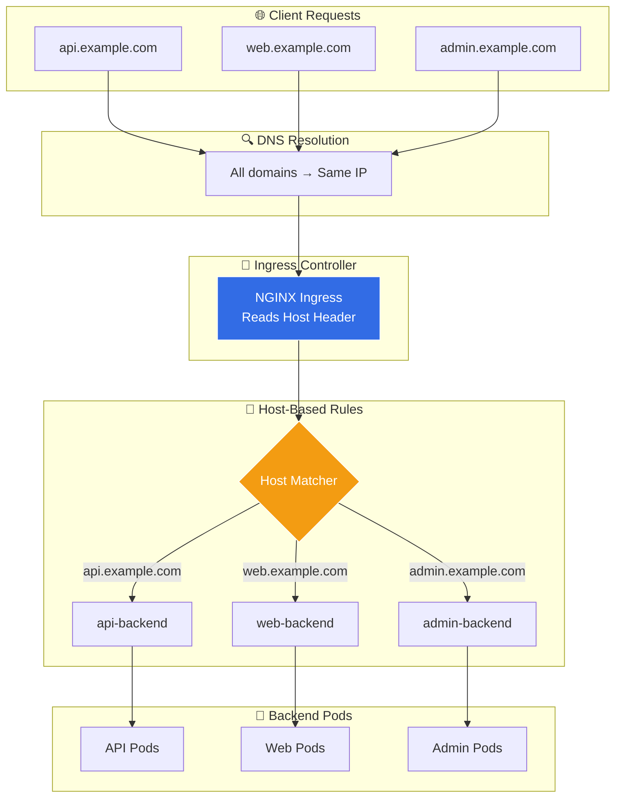
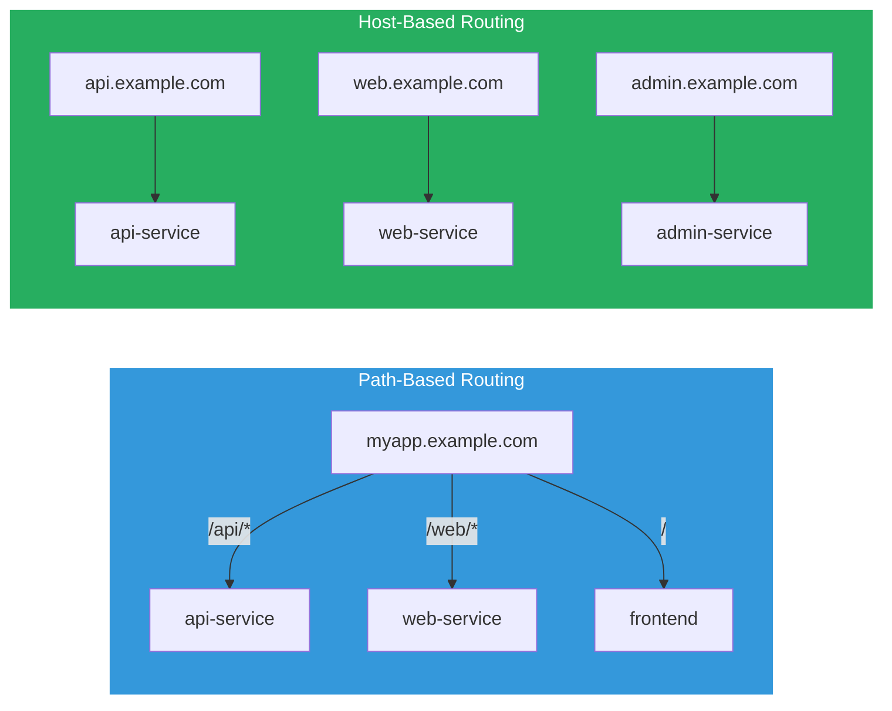
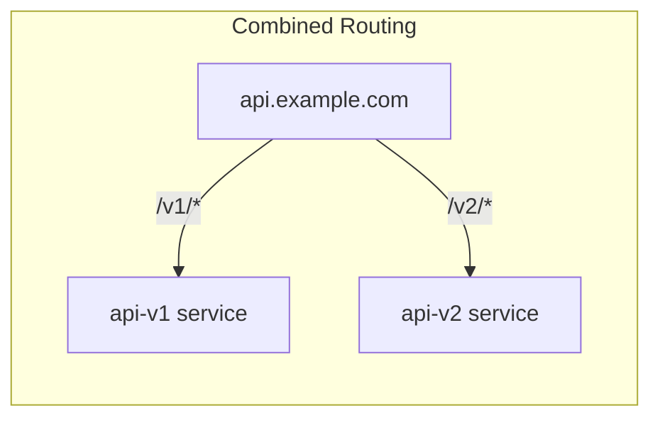
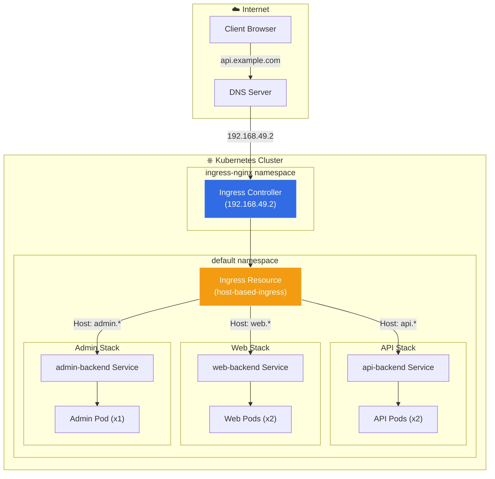

# Ingress Host-Based Routing (Virtual Hosting) Explained

This document provides a comprehensive explanation of host-based routing with Kubernetes Ingress, as demonstrated in [02_host_based.yaml](02_host_based.yaml).

## Overview

**Host-based routing** (also known as **virtual hosting** or **name-based virtual hosting**) routes incoming HTTP requests to different backend services based on the `Host` header in the request. This allows you to host multiple applications on a single IP address, each accessible via its own domain name.



---

## How Host-Based Routing Works

### The Host Header

When a browser or client makes an HTTP request, it includes a `Host` header that specifies which domain the request is for:

```
GET /users HTTP/1.1
Host: api.example.com    ← This determines routing
Accept: application/json
```

The Ingress Controller reads this header and routes the request to the appropriate backend service.

### Request Flow

```
┌────────────────────────────────────────────────────────────────────┐
│                         REQUEST FLOW                               │
├────────────────────────────────────────────────────────────────────┤
│                                                                    │
│   Step 1: Client Request                                           │
│   ──────────────────────                                           │
│   curl http://api.example.com/users                                │
│                           │                                        │
│                           ▼                                        │
│   Step 2: DNS Resolution                                           │
│   ──────────────────────                                           │
│   api.example.com → Ingress Controller IP                          │
│   (All hostnames resolve to the same IP!)                          │
│                           │                                        │
│                           ▼                                        │
│   Step 3: HTTP Request with Host Header                            │
│   ─────────────────────────────────────                            │
│   GET /users HTTP/1.1                                              │
│   Host: api.example.com                                            │
│                           │                                        │
│                           ▼                                        │
│   Step 4: Ingress Controller Matches Host                          │
│   ──────────────────────────────────────                           │
│   Host: api.example.com → Rule matches → api-backend               │
│                           │                                        │
│                           ▼                                        │
│   Step 5: Forward to Backend                                       │
│   ──────────────────────────                                       │
│   api-backend:80/users → API Pod                                   │
│                           │                                        │
│                           ▼                                        │
│   Step 6: Response Returns                                         │
│   ──────────────────────────                                       │
│   Pod → Service → Ingress → Client                                 │
│                                                                    │
└────────────────────────────────────────────────────────────────────┘
```

---

## Path-Based vs Host-Based Routing



| Aspect | Path-Based | Host-Based |
|--------|-----------|------------|
| **URL Structure** | `app.com/api`, `app.com/web` | `api.app.com`, `web.app.com` |
| **DNS Records** | 1 record | Multiple records |
| **SSL Certificates** | 1 certificate | 1 cert per domain (or wildcard) |
| **Use Case** | Single app, multiple paths | Multiple apps, same cluster |
| **Isolation** | Shared domain | Separate domains |

---

## Components Breakdown

### 1. Backend Deployments

Three separate deployments for different subdomains:

| Deployment | Domain | Replicas | Purpose |
|------------|--------|----------|---------|
| `api-backend` | api.example.com | 2 | REST API |
| `web-backend` | web.example.com | 2 | Web Application |
| `admin-backend` | admin.example.com | 1 | Admin Panel |

### 2. Ingress Rules

Each rule matches a specific hostname:

```yaml
apiVersion: networking.k8s.io/v1
kind: Ingress
metadata:
  name: host-based-ingress
spec:
  ingressClassName: nginx
  rules:
    # Rule 1: api.example.com → api-backend
    - host: api.example.com
      http:
        paths:
          - path: /
            pathType: Prefix
            backend:
              service:
                name: api-backend
                port:
                  number: 80

    # Rule 2: web.example.com → web-backend
    - host: web.example.com
      http:
        paths:
          - path: /
            pathType: Prefix
            backend:
              service:
                name: web-backend
                port:
                  number: 80

    # Rule 3: admin.example.com → admin-backend
    - host: admin.example.com
      http:
        paths:
          - path: /
            pathType: Prefix
            backend:
              service:
                name: admin-backend
                port:
                  number: 80
```

---

## Wildcard Hostnames

You can use wildcard hostnames to match multiple subdomains with a single rule:

```yaml
rules:
  - host: "*.example.com"    # Matches ANY subdomain
    http:
      paths:
        - path: /
          pathType: Prefix
          backend:
            service:
              name: wildcard-backend
              port:
                number: 80
```

### Wildcard Matching Examples

| Pattern | Matches | Does NOT Match |
|---------|---------|----------------|
| `*.example.com` | `api.example.com`, `web.example.com` | `example.com`, `sub.api.example.com` |
| `*.*.example.com` | ❌ Not supported | - |

> [!WARNING]
> Wildcards only match one level of subdomain. `*.example.com` will NOT match `sub.api.example.com`.

---

## Combining Host-Based and Path-Based Routing

You can combine both routing strategies:

```yaml
rules:
  - host: api.example.com
    http:
      paths:
        - path: /v1     # api.example.com/v1/* → api-v1
          pathType: Prefix
          backend:
            service:
              name: api-v1
              port:
                number: 80
        - path: /v2     # api.example.com/v2/* → api-v2
          pathType: Prefix
          backend:
            service:
              name: api-v2
              port:
                number: 80
```



---

## Default Backend

When no host rule matches, you can configure a default backend:

```yaml
spec:
  defaultBackend:
    service:
      name: default-service
      port:
        number: 80
  rules:
    - host: api.example.com
      # ... specific rules
```

The default backend handles:
- Requests without a matching Host header
- Requests to IP address directly
- Unrecognized hostnames

---

## Common Annotations for Host-Based Routing

| Annotation | Purpose | Example |
|------------|---------|---------|
| `affinity: cookie` | Sticky sessions | Session persistence |
| `limit-rps` | Rate limiting per host | Protect services |
| `whitelist-source-range` | IP restrictions | Security |
| `custom-http-errors` | Custom error pages | User experience |

```yaml
annotations:
  # Sticky sessions (for stateful applications)
  nginx.ingress.kubernetes.io/affinity: "cookie"
  nginx.ingress.kubernetes.io/session-cookie-name: "route"

  # Rate limiting per host
  nginx.ingress.kubernetes.io/limit-rps: "10"
```

---

## Quick Start

### Prerequisites

```bash
# 1. Enable Ingress addon in Minikube
minikube addons enable ingress

# 2. Verify Ingress Controller is running
kubectl get pods -n ingress-nginx
```

### Deploy and Test

```bash
# 1. Apply the configuration
kubectl apply -f 02_host_based.yaml

# 2. Get Minikube IP
MINIKUBE_IP=$(minikube ip)

# 3. Add all hostnames to /etc/hosts
echo "$MINIKUBE_IP api.example.com web.example.com admin.example.com" | sudo tee -a /etc/hosts

# 4. Test each host
curl http://api.example.com
# Output: Welcome to API Service! Host: api.example.com

curl http://web.example.com
# Output: Welcome to Web Service! Host: web.example.com

curl http://admin.example.com
# Output: Welcome to Admin Panel! Host: admin.example.com
```

### Testing Without /etc/hosts

You can use the `-H` flag to set the Host header manually:

```bash
# Test without modifying /etc/hosts
curl -H "Host: api.example.com" http://$(minikube ip)
curl -H "Host: web.example.com" http://$(minikube ip)
curl -H "Host: admin.example.com" http://$(minikube ip)
```

---

## Verification Commands

```bash
# Check Ingress status
kubectl get ingress host-based-ingress

# Detailed Ingress info
kubectl describe ingress host-based-ingress

# Check all backend services
kubectl get services

# Check all pods
kubectl get pods
```

### Expected Output

```
$ kubectl get ingress host-based-ingress
NAME                 CLASS   HOSTS                                           ADDRESS        PORTS   AGE
host-based-ingress   nginx   api.example.com,web.example.com,admin.example.com   192.168.49.2   80      5m
```

---

## DNS Configuration

### Local Development (Minikube)

Edit `/etc/hosts`:
```
192.168.49.2  api.example.com web.example.com admin.example.com
```

### Production Environment

Create DNS A records or CNAME records pointing to your load balancer:

```
api.example.com.    A    203.0.113.50
web.example.com.    A    203.0.113.50
admin.example.com.  A    203.0.113.50
```

Or use a wildcard:
```
*.example.com.      A    203.0.113.50
```

---

## Cleanup

```bash
kubectl delete -f 02_host_based.yaml
```

---

## Real-World Use Cases

| Subdomain | Purpose | Example |
|-----------|---------|---------|
| `api.` | REST API endpoints | `api.company.com` |
| `app.` | Main web application | `app.company.com` |
| `admin.` | Admin dashboard | `admin.company.com` |
| `docs.` | Documentation | `docs.company.com` |
| `status.` | Status page | `status.company.com` |
| `staging.` | Staging environment | `staging.company.com` |

---

## Architecture Diagram



---

## Troubleshooting

| Issue | Cause | Solution |
|-------|-------|----------|
| 404 Not Found | Host header doesn't match any rule | Check hostname in request matches Ingress rule |
| Connection Refused | DNS not resolving correctly | Verify /etc/hosts or DNS configuration |
| Wrong service responds | Host header typo | Double-check Host header in request |
| 503 Service Unavailable | Backend pods not running | Check `kubectl get pods` |

---

## Related Examples

- [01_path_based.yaml](01_path_based.yaml) - Route by URL path instead of hostname
- [03_tls_ingress.yaml](03_tls_ingress.yaml) - Add HTTPS/TLS for secure connections
- [04_rate_limiting.yaml](04_rate_limiting.yaml) - Protect services with rate limiting
