# Ingress TLS/HTTPS (SSL Termination) Explained

This document explains TLS/HTTPS configuration with Kubernetes Ingress, as shown in [03_tls_ingress.yaml](03_tls_ingress.yaml).

## Overview

**TLS Ingress** enables secure HTTPS connections. The Ingress Controller performs **SSL/TLS termination** - it handles encryption so your backend services don't need to.

```mermaid
flowchart LR
    Client["🔒 Client"] -->|"HTTPS"| IC["Ingress Controller"]
    IC -->|"HTTP"| Pod["Backend Pod"]
    
    style IC fill:#326ce5,stroke:#fff,color:#fff
```



---

## TLS Termination Flow

```
Client ──HTTPS──► Ingress Controller ──HTTP──► Backend Pod
         🔒            🔓→📝                      📝
```

**Benefits:**
- Backend pods don't need TLS certificates
- Centralized certificate management
- Reduced CPU overhead on application pods

---

## Components

### 1. TLS Secret

Stores your certificate and private key:

```bash
# Create self-signed certificate
openssl req -x509 -nodes -days 365 -newkey rsa:2048 \
  -keyout tls.key -out tls.crt \
  -subj "/CN=secure.example.com/O=MyOrg"

# Create Kubernetes secret
kubectl create secret tls tls-secret --cert=tls.crt --key=tls.key
```

### 2. Ingress with TLS

```yaml
apiVersion: networking.k8s.io/v1
kind: Ingress
metadata:
  name: tls-ingress
  annotations:
    nginx.ingress.kubernetes.io/ssl-redirect: "true"
spec:
  ingressClassName: nginx
  tls:
    - hosts:
        - secure.example.com
      secretName: tls-secret
  rules:
    - host: secure.example.com
      http:
        paths:
          - path: /
            pathType: Prefix
            backend:
              service:
                name: secure-app
                port:
                  number: 80
```

---

## HTTP to HTTPS Redirect

### Method 1: Annotation
```yaml
annotations:
  nginx.ingress.kubernetes.io/ssl-redirect: "true"
```

### Method 2: Permanent Redirect
```yaml
annotations:
  nginx.ingress.kubernetes.io/permanent-redirect: https://secure.example.com$request_uri
  nginx.ingress.kubernetes.io/permanent-redirect-code: "301"
```

---

## HSTS (HTTP Strict Transport Security)

Tells browsers to always use HTTPS:

```yaml
annotations:
  nginx.ingress.kubernetes.io/configuration-snippet: |
    add_header Strict-Transport-Security "max-age=31536000; includeSubDomains" always;
```

---

## Certificate Options

| Option | Use Case | Command |
|--------|----------|---------|
| **Self-signed** | Development | `openssl req -x509 ...` |
| **cert-manager** | Production (Let's Encrypt) | Install cert-manager |
| **Enterprise CA** | Corporate environments | Import existing certs |

### cert-manager (Recommended for Production)

```bash
# Install cert-manager
kubectl apply -f https://github.com/cert-manager/cert-manager/releases/download/v1.14.0/cert-manager.yaml
```

Add annotation to Ingress:
```yaml
annotations:
  cert-manager.io/cluster-issuer: "letsencrypt-prod"
```

---

## Quick Start

```bash
# 1. Create certificate
openssl req -x509 -nodes -days 365 -newkey rsa:2048 \
  -keyout tls.key -out tls.crt \
  -subj "/CN=secure.example.com/O=MyOrg"

# 2. Create secret
kubectl create secret tls tls-secret --cert=tls.crt --key=tls.key

# 3. Apply
kubectl apply -f 03_tls_ingress.yaml

# 4. Add to /etc/hosts
echo "$(minikube ip) secure.example.com" | sudo tee -a /etc/hosts

# 5. Test (-k skips cert validation for self-signed)
curl -k https://secure.example.com
```

---

## Key Annotations

| Annotation | Purpose |
|------------|---------|
| `ssl-redirect: "true"` | Redirect HTTP→HTTPS |
| `backend-protocol: "HTTPS"` | End-to-end encryption |
| `ssl-passthrough: "true"` | Pass TLS to backend |

---

## Troubleshooting

| Issue | Solution |
|-------|----------|
| Certificate not trusted | Use cert-manager for real certs |
| Domain mismatch | Check certificate CN matches hostname |
| Connection refused | Verify `kubectl describe ingress` |

```bash
# Debug commands
kubectl describe ingress tls-ingress
kubectl get secret tls-secret
kubectl logs -n ingress-nginx -l app.kubernetes.io/component=controller
```

---

## Cleanup

```bash
kubectl delete -f 03_tls_ingress.yaml
kubectl delete secret tls-secret
```
