# Ingress Rate Limiting & Security Explained

This document explains rate limiting and security features with Kubernetes Ingress, as shown in [04_rate_limiting.yaml](04_rate_limiting.yaml).

## Overview

Ingress can protect your services with:
- **Rate Limiting** - Limit requests per second/minute
- **IP Whitelisting** - Allow only specific IPs
- **Basic Auth** - Username/password protection
- **Custom Headers** - Security headers

```mermaid
flowchart LR
    subgraph Security["🛡️ Security Layers"]
        RL["Rate Limit"]
        IP["IP Whitelist"]
        Auth["Basic Auth"]
        Headers["Security Headers"]
    end
    
    Client["Client"] --> RL
    RL --> IP
    IP --> Auth
    Auth --> Headers
    Headers --> Pod["Backend Pod"]
    
    style Security fill:#e74c3c,stroke:#fff,color:#fff
```



---

## Rate Limiting

Protects against abuse by limiting requests per client IP.

```
┌────────────────────────────────────────────────────┐
│                  RATE LIMITING                     │
├────────────────────────────────────────────────────┤
│                                                    │
│   Request 1: 200 OK ✓                              │
│   Request 2: 200 OK ✓                              │
│   Request 3: 200 OK ✓                              │
│   Request 4: 200 OK ✓                              │
│   Request 5: 200 OK ✓                              │
│   Request 6: 503 Service Unavailable ✗ (Limited!) │
│                                                    │
└────────────────────────────────────────────────────┘
```

### Configuration

```yaml
annotations:
  # Requests per second per client IP
  nginx.ingress.kubernetes.io/limit-rps: "5"
  
  # Requests per minute (alternative)
  # nginx.ingress.kubernetes.io/limit-rpm: "100"
  
  # Max concurrent connections per IP
  nginx.ingress.kubernetes.io/limit-connections: "10"
```

### Rate Limit Annotations

| Annotation | Description | Example |
|------------|-------------|---------|
| `limit-rps` | Requests per second | `"5"` |
| `limit-rpm` | Requests per minute | `"100"` |
| `limit-connections` | Concurrent connections | `"10"` |
| `limit-burst-multiplier` | Allow burst | `"5"` |

---

## Timeouts

Protect against slow clients/backends:

```yaml
annotations:
  # Client read timeout
  nginx.ingress.kubernetes.io/proxy-read-timeout: "60"
  
  # Backend connect timeout
  nginx.ingress.kubernetes.io/proxy-connect-timeout: "10"
  
  # Backend send timeout
  nginx.ingress.kubernetes.io/proxy-send-timeout: "60"
  
  # Max request body size (for uploads)
  nginx.ingress.kubernetes.io/proxy-body-size: "10m"
```

---

## IP Whitelisting

Only allow specific IPs or CIDR ranges:

```yaml
annotations:
  nginx.ingress.kubernetes.io/whitelist-source-range: "10.0.0.0/8,192.168.0.0/16"
```

### Block Specific IPs

```yaml
annotations:
  nginx.ingress.kubernetes.io/configuration-snippet: |
    deny 192.168.1.100;
    deny 10.0.0.50;
    allow all;
```

---

## Basic Authentication

Protect with username/password:

### Create Auth Secret

```bash
# 1. Create htpasswd file
htpasswd -c auth admin

# 2. Create Kubernetes secret
kubectl create secret generic basic-auth --from-file=auth
```

### Configure Ingress

```yaml
annotations:
  nginx.ingress.kubernetes.io/auth-type: basic
  nginx.ingress.kubernetes.io/auth-secret: basic-auth
  nginx.ingress.kubernetes.io/auth-realm: "Authentication Required"
```

### Test

```bash
curl -u admin:password http://protected.example.com
```

---

## Security Headers

Add security headers to responses:

```yaml
annotations:
  nginx.ingress.kubernetes.io/configuration-snippet: |
    add_header X-Frame-Options "SAMEORIGIN" always;
    add_header X-Content-Type-Options "nosniff" always;
    add_header X-XSS-Protection "1; mode=block" always;
    add_header Referrer-Policy "strict-origin-when-cross-origin" always;
```

| Header | Purpose |
|--------|---------|
| `X-Frame-Options` | Prevent clickjacking |
| `X-Content-Type-Options` | Prevent MIME sniffing |
| `X-XSS-Protection` | XSS filter |
| `Referrer-Policy` | Control referrer info |

---

## Quick Start

```bash
# 1. Apply configuration
kubectl apply -f 04_rate_limiting.yaml

# 2. Add to /etc/hosts
echo "$(minikube ip) ratelimit.example.com" | sudo tee -a /etc/hosts

# 3. Test rate limiting
for i in {1..10}; do
  curl -s -o /dev/null -w "Request $i: %{http_code}\n" http://ratelimit.example.com
done
```

### Expected Output

```
Request 1: 200
Request 2: 200
Request 3: 200
Request 4: 200
Request 5: 200
Request 6: 503  ← Rate limited!
Request 7: 503
...
```

---

## Complete Security Example

```yaml
apiVersion: networking.k8s.io/v1
kind: Ingress
metadata:
  name: secure-ingress
  annotations:
    # Rate limiting
    nginx.ingress.kubernetes.io/limit-rps: "10"
    nginx.ingress.kubernetes.io/limit-connections: "20"
    
    # Timeouts
    nginx.ingress.kubernetes.io/proxy-read-timeout: "60"
    nginx.ingress.kubernetes.io/proxy-connect-timeout: "10"
    nginx.ingress.kubernetes.io/proxy-body-size: "10m"
    
    # IP whitelist (optional)
    # nginx.ingress.kubernetes.io/whitelist-source-range: "10.0.0.0/8"
    
    # Security headers
    nginx.ingress.kubernetes.io/configuration-snippet: |
      add_header X-Frame-Options "SAMEORIGIN" always;
      add_header X-Content-Type-Options "nosniff" always;
spec:
  ingressClassName: nginx
  rules:
    - host: secure.example.com
      http:
        paths:
          - path: /
            pathType: Prefix
            backend:
              service:
                name: my-app
                port:
                  number: 80
```

---

## Troubleshooting

| Issue | Solution |
|-------|----------|
| 503 immediately | Rate limit too low |
| 403 Forbidden | Check IP whitelist |
| 401 Unauthorized | Verify auth credentials |

```bash
# Check Ingress configuration
kubectl describe ingress rate-limited-ingress

# Check controller logs
kubectl logs -n ingress-nginx -l app.kubernetes.io/component=controller
```

---

## Cleanup

```bash
kubectl delete -f 04_rate_limiting.yaml
kubectl delete secret basic-auth  # If created
```
