# Kubernetes Networking Mastery Guide

> **Complete guide to mastering Kubernetes networking with Minikube**

---

## Table of Contents

1. [Overview - Kubernetes Networking Model](#overview---kubernetes-networking-model)
2. [CNI Concepts - Pod-to-Pod Communication](#1-cni-concepts---pod-to-pod-communication)
3. [Services - Internal Load Balancing](#2-services---internal-load-balancing)
4. [Ingress & Ingress Controllers](#3-ingress--ingress-controllers)
5. [Network Policies - Zero Trust](#4-network-policies---zero-trust)
6. [DNS & CoreDNS](#5-dns--coredns)
7. [Service Mesh (Istio)](#6-service-mesh-istio)
8. [Hands-on Labs](#7-hands-on-labs)

---

## Overview - Kubernetes Networking Model

Kubernetes has a flat network model with these fundamental rules:

```mermaid
flowchart TB
    subgraph NetworkRules["Kubernetes Networking Rules"]
        R1["1️⃣ Every Pod gets its own IP address"]
        R2["2️⃣ Pods can communicate with any other Pod<br/>without NAT"]
        R3["3️⃣ Nodes can communicate with Pods<br/>without NAT"]
        R4["4️⃣ Pod sees its own IP same as<br/>others see it"]
    end
    
    style R1 fill:#50fa7b,stroke:#8be9fd,color:#282a36
    style R2 fill:#ffb86c,stroke:#f1fa8c,color:#282a36
    style R3 fill:#ff79c6,stroke:#bd93f9,color:#f8f8f2
    style R4 fill:#8be9fd,stroke:#50fa7b,color:#282a36
```



### Network Layers


---

## 1. CNI Concepts - Pod-to-Pod Communication

### What is CNI?

**Container Network Interface (CNI)** is a specification for configuring network interfaces in Linux containers. Kubernetes uses CNI plugins to set up pod networking.

```mermaid
flowchart LR
    subgraph Node1["Node 1 (10.0.1.0/24)"]
        P1["Pod A<br/>10.0.1.10"]
        P2["Pod B<br/>10.0.1.11"]
        BR1["veth0 → cni0 bridge"]
    end
    
    subgraph Node2["Node 2 (10.0.2.0/24)"]
        P3["Pod C<br/>10.0.2.10"]
        BR2["veth0 → cni0 bridge"]
    end
    
    P1 --> BR1
    P2 --> BR1
    P3 --> BR2
    BR1 <-->|"Overlay/Routing"| BR2
    
    style P1 fill:#50fa7b,stroke:#8be9fd,color:#282a36
    style P2 fill:#50fa7b,stroke:#8be9fd,color:#282a36
    style P3 fill:#50fa7b,stroke:#8be9fd,color:#282a36
```



### Popular CNI Plugins

| CNI Plugin | Features | Best For |
|------------|----------|----------|
| **Calico** | Network policies, BGP, IPIP | Production, security focus |
| **Flannel** | Simple overlay (VXLAN) | Simple clusters |
| **Cilium** | eBPF, L7 policies | High performance, observability |
| **Weave** | Mesh network, encryption | Multi-cloud |
| **Kindnet** | Simple, no policies | Minikube/Kind |

### Pod Communication Flow


### Minikube CNI Setup

```bash
# Start Minikube with specific CNI
minikube start --cni=calico      # Calico with network policies
minikube start --cni=cilium      # Cilium with eBPF
minikube start --cni=flannel     # Simple Flannel

# Check current CNI
kubectl get pods -n kube-system | grep -E "calico|cilium|flannel"

# View pod IPs
kubectl get pods -o wide
```

---

## 2. Services - Internal Load Balancing

Services provide stable endpoints for pods and load balance traffic.

### Service Types


### Service Discovery Flow


### Service YAML Examples

```yaml
# ClusterIP Service (default)
apiVersion: v1
kind: Service
metadata:
  name: my-service
spec:
  type: ClusterIP
  selector:
    app: my-app
  ports:
    - port: 80        # Service port
      targetPort: 8080 # Container port
---
# NodePort Service
apiVersion: v1
kind: Service
metadata:
  name: my-nodeport
spec:
  type: NodePort
  selector:
    app: my-app
  ports:
    - port: 80
      targetPort: 8080
      nodePort: 30080  # Accessible on node:30080
---
# LoadBalancer Service
apiVersion: v1
kind: Service
metadata:
  name: my-lb
spec:
  type: LoadBalancer
  selector:
    app: my-app
  ports:
    - port: 80
      targetPort: 8080
```

### Minikube Service Access

```bash
# Access LoadBalancer services in Minikube
minikube tunnel   # Opens a tunnel for LoadBalancer IPs

# Get NodePort URL
minikube service my-nodeport --url

# List all services
kubectl get svc
```

---

## 3. Ingress & Ingress Controllers

### What is Ingress?

Ingress manages external HTTP/HTTPS access to services, providing:
- URL-based routing
- SSL/TLS termination
- Virtual hosting
- Path-based routing

```mermaid
flowchart TB
    Internet["🌐 Internet"] --> Ingress["Ingress Controller<br/>(NGINX, Traefik)"]
    
    subgraph Cluster["Kubernetes Cluster"]
        Ingress -->|"/api"| SvcAPI["api-service"]
        Ingress -->|"/web"| SvcWeb["web-service"]
        Ingress -->|"shop.example.com"| SvcShop["shop-service"]
        
        SvcAPI --> PodAPI["API Pods"]
        SvcWeb --> PodWeb["Web Pods"]
        SvcShop --> PodShop["Shop Pods"]
    end
    
    style Internet fill:#ff79c6,stroke:#bd93f9,color:#f8f8f2
    style Ingress fill:#50fa7b,stroke:#8be9fd,color:#282a36
```



### Ingress Controllers Comparison

| Controller | Features | Best For |
|------------|----------|----------|
| **NGINX** | Mature, annotations, rate limiting | General purpose |
| **Traefik** | Auto-discovery, Let's Encrypt | Dynamic environments |
| **HAProxy** | High performance, TCP/UDP | High traffic |
| **AWS ALB** | Native AWS integration | EKS |
| **Contour** | Envoy-based, CRDs | Modern apps |

### Enable NGINX Ingress in Minikube

```bash
# Enable ingress addon
minikube addons enable ingress

# Verify ingress controller
kubectl get pods -n ingress-nginx

# Check ingress controller is running
kubectl get svc -n ingress-nginx
```

### Ingress YAML Examples

```yaml
# Simple Ingress - Path-based routing
apiVersion: networking.k8s.io/v1
kind: Ingress
metadata:
  name: simple-ingress
  annotations:
    nginx.ingress.kubernetes.io/rewrite-target: /
spec:
  ingressClassName: nginx
  rules:
    - host: myapp.local
      http:
        paths:
          # Route /api to api-service
          - path: /api
            pathType: Prefix
            backend:
              service:
                name: api-service
                port:
                  number: 80
          # Route /web to web-service
          - path: /web
            pathType: Prefix
            backend:
              service:
                name: web-service
                port:
                  number: 80
---
# Ingress with TLS
apiVersion: networking.k8s.io/v1
kind: Ingress
metadata:
  name: tls-ingress
spec:
  ingressClassName: nginx
  tls:
    - hosts:
        - secure.example.com
      secretName: tls-secret   # Contains TLS cert/key
  rules:
    - host: secure.example.com
      http:
        paths:
          - path: /
            pathType: Prefix
            backend:
              service:
                name: secure-app
                port:
                  number: 443
```

### Ingress Flow Diagram


### Test Ingress in Minikube

```bash
# Get Minikube IP
minikube ip

# Add to /etc/hosts
echo "$(minikube ip) myapp.local" | sudo tee -a /etc/hosts

# Apply ingress
kubectl apply -f my-ingress.yaml

# Test
curl http://myapp.local/api
curl http://myapp.local/web
```

---

## 4. Network Policies - Zero Trust

### What are Network Policies?

Network Policies control traffic flow between pods at the IP/port level. Without policies, all pods can communicate with all other pods.


### Network Policy Types


### Enable Network Policies in Minikube

```bash
# Start with Calico CNI (supports network policies)
minikube start --cni=calico

# Verify Calico is running
kubectl get pods -n kube-system -l k8s-app=calico-node
```

### Network Policy YAML Examples

```yaml
# Deny all ingress traffic (zero trust baseline)
apiVersion: networking.k8s.io/v1
kind: NetworkPolicy
metadata:
  name: deny-all-ingress
  namespace: production
spec:
  podSelector: {}   # Apply to all pods
  policyTypes:
    - Ingress       # Control incoming traffic
  ingress: []       # Empty = deny all
---
# Allow traffic only from specific pods
apiVersion: networking.k8s.io/v1
kind: NetworkPolicy
metadata:
  name: allow-frontend-to-backend
spec:
  podSelector:
    matchLabels:
      app: backend          # Apply to backend pods
  policyTypes:
    - Ingress
  ingress:
    - from:
        - podSelector:
            matchLabels:
              app: frontend  # Only from frontend pods
      ports:
        - protocol: TCP
          port: 8080
---
# Allow traffic from specific namespace
apiVersion: networking.k8s.io/v1
kind: NetworkPolicy
metadata:
  name: allow-from-monitoring
  namespace: production
spec:
  podSelector: {}
  policyTypes:
    - Ingress
  ingress:
    - from:
        - namespaceSelector:
            matchLabels:
              name: monitoring
---
# Egress - Allow only DNS and specific service
apiVersion: networking.k8s.io/v1
kind: NetworkPolicy
metadata:
  name: restrict-egress
spec:
  podSelector:
    matchLabels:
      app: secure-app
  policyTypes:
    - Egress
  egress:
    # Allow DNS
    - to:
        - namespaceSelector: {}
          podSelector:
            matchLabels:
              k8s-app: kube-dns
      ports:
        - protocol: UDP
          port: 53
    # Allow specific service
    - to:
        - podSelector:
            matchLabels:
              app: database
      ports:
        - protocol: TCP
          port: 5432
```

### Network Policy Flow


---

## 5. DNS & CoreDNS

### How DNS Works in Kubernetes

CoreDNS is the default DNS server in Kubernetes. It resolves service names to ClusterIPs.


### DNS Name Resolution

| Short Name | Full FQDN | Resolves To |
|------------|-----------|-------------|
| `my-svc` | `my-svc.default.svc.cluster.local` | Service ClusterIP |
| `my-svc.prod` | `my-svc.prod.svc.cluster.local` | Service in prod namespace |
| `pod-ip.ns.pod` | `10-0-1-10.default.pod.cluster.local` | Pod IP |

### DNS Resolution Flow


### Check DNS in Minikube

```bash
# View CoreDNS pods
kubectl get pods -n kube-system -l k8s-app=kube-dns

# View CoreDNS ConfigMap
kubectl get configmap coredns -n kube-system -o yaml

# Test DNS resolution from a pod
kubectl run dnstest --image=busybox --rm -it -- nslookup kubernetes

# Test service DNS
kubectl run dnstest --image=busybox --rm -it -- nslookup my-svc.default.svc.cluster.local

# View pod's DNS config
kubectl exec -it my-pod -- cat /etc/resolv.conf
```

### Pod DNS Configuration

```yaml
# Custom DNS settings for a pod
apiVersion: v1
kind: Pod
metadata:
  name: custom-dns-pod
spec:
  containers:
    - name: app
      image: busybox
  dnsPolicy: "None"  # Override default
  dnsConfig:
    nameservers:
      - 8.8.8.8
      - 10.96.0.10
    searches:
      - default.svc.cluster.local
      - svc.cluster.local
    options:
      - name: ndots
        value: "5"
```

---

## 6. Service Mesh (Istio)

### What is a Service Mesh?

A service mesh adds a proxy sidecar to every pod to handle:
- mTLS (mutual TLS encryption)
- Traffic routing (canary, blue-green)
- Retries and circuit breaking
- Observability (metrics, tracing)

```mermaid
flowchart TB
    subgraph Pod1["Pod A"]
        App1["App Container"]
        Proxy1["Envoy Proxy<br/>(Sidecar)"]
    end
    
    subgraph Pod2["Pod B"]
        App2["App Container"]
        Proxy2["Envoy Proxy<br/>(Sidecar)"]
    end
    
    subgraph ControlPlane["Istio Control Plane"]
        Istiod["istiod<br/>(Pilot, Citadel, Galley)"]
    end
    
    App1 --> Proxy1
    Proxy1 <-->|"🔒 mTLS"| Proxy2
    Proxy2 --> App2
    
    Istiod -->|"Config"| Proxy1
    Istiod -->|"Config"| Proxy2
    
    style Proxy1 fill:#50fa7b,stroke:#8be9fd,color:#282a36
    style Proxy2 fill:#50fa7b,stroke:#8be9fd,color:#282a36
    style Istiod fill:#ff79c6,stroke:#bd93f9,color:#f8f8f2
```



### Install Istio on Minikube

```bash
# Start Minikube with enough resources
minikube start --cpus=4 --memory=8192

# Download Istio
curl -L https://istio.io/downloadIstio | sh -
cd istio-*
export PATH=$PWD/bin:$PATH

# Install Istio (demo profile)
istioctl install --set profile=demo -y

# Enable sidecar injection for namespace
kubectl label namespace default istio-injection=enabled

# Verify installation
kubectl get pods -n istio-system
```

### Istio Traffic Flow


### Key Istio Resources

```yaml
# Gateway - Entry point for external traffic
apiVersion: networking.istio.io/v1beta1
kind: Gateway
metadata:
  name: my-gateway
spec:
  selector:
    istio: ingressgateway
  servers:
    - port:
        number: 80
        name: http
        protocol: HTTP
      hosts:
        - "myapp.example.com"
---
# VirtualService - Traffic routing rules
apiVersion: networking.istio.io/v1beta1
kind: VirtualService
metadata:
  name: my-vs
spec:
  hosts:
    - "myapp.example.com"
  gateways:
    - my-gateway
  http:
    - match:
        - uri:
            prefix: /api
      route:
        - destination:
            host: api-service
            port:
              number: 80
    # Canary deployment - 90/10 split
    - route:
        - destination:
            host: my-app
            subset: v1
          weight: 90
        - destination:
            host: my-app
            subset: v2
          weight: 10
---
# DestinationRule - Define subsets and policies
apiVersion: networking.istio.io/v1beta1
kind: DestinationRule
metadata:
  name: my-app-dr
spec:
  host: my-app
  trafficPolicy:
    connectionPool:
      tcp:
        maxConnections: 100
  subsets:
    - name: v1
      labels:
        version: v1
    - name: v2
      labels:
        version: v2
---
# PeerAuthentication - Enable mTLS
apiVersion: security.istio.io/v1beta1
kind: PeerAuthentication
metadata:
  name: default
  namespace: default
spec:
  mtls:
    mode: STRICT
```

---

## 7. Hands-on Labs

### Lab 1: Pod-to-Pod Communication

```bash
# Create two pods
kubectl run pod-a --image=nginx
kubectl run pod-b --image=busybox --command -- sleep 3600

# Get Pod A's IP
POD_A_IP=$(kubectl get pod pod-a -o jsonpath='{.status.podIP}')

# Test connectivity from Pod B to Pod A
kubectl exec pod-b -- wget -qO- http://$POD_A_IP
```

### Lab 2: Service Discovery

```bash
# Create deployment and service
kubectl create deployment web --image=nginx --replicas=3
kubectl expose deployment web --port=80

# Test DNS resolution
kubectl run dnstest --image=busybox --rm -it -- nslookup web

# Access service by name
kubectl run curl --image=curlimages/curl --rm -it -- curl http://web
```

### Lab 3: Ingress Setup

```bash
# Enable ingress
minikube addons enable ingress

# Create deployment and service
kubectl create deployment hello --image=nginxdemos/hello
kubectl expose deployment hello --port=80

# Create ingress
cat <<EOF | kubectl apply -f -
apiVersion: networking.k8s.io/v1
kind: Ingress
metadata:
  name: hello-ingress
spec:
  ingressClassName: nginx
  rules:
    - host: hello.local
      http:
        paths:
          - path: /
            pathType: Prefix
            backend:
              service:
                name: hello
                port:
                  number: 80
EOF

# Add to /etc/hosts
echo "$(minikube ip) hello.local" | sudo tee -a /etc/hosts

# Test
curl http://hello.local
```

### Lab 4: Network Policy

```bash
# Start with Calico
minikube start --cni=calico

# Create namespaces and pods
kubectl create namespace frontend
kubectl create namespace backend

kubectl run frontend -n frontend --image=nginx
kubectl run backend -n backend --image=nginx
kubectl expose pod backend -n backend --port=80

# Test (should work)
kubectl exec -n frontend frontend -- curl -s backend.backend.svc.cluster.local

# Apply deny-all policy
cat <<EOF | kubectl apply -f -
apiVersion: networking.k8s.io/v1
kind: NetworkPolicy
metadata:
  name: deny-all
  namespace: backend
spec:
  podSelector: {}
  policyTypes:
    - Ingress
EOF

# Test again (should fail/timeout)
kubectl exec -n frontend frontend -- curl -s --max-time 5 backend.backend.svc.cluster.local
```

### Lab 5: Istio Traffic Splitting

```bash
# Install Istio (see section 6)

# Deploy v1 and v2
kubectl apply -f - <<EOF
apiVersion: apps/v1
kind: Deployment
metadata:
  name: myapp-v1
spec:
  replicas: 1
  selector:
    matchLabels:
      app: myapp
      version: v1
  template:
    metadata:
      labels:
        app: myapp
        version: v1
    spec:
      containers:
        - name: myapp
          image: hashicorp/http-echo
          args: ["-text=VERSION 1"]
---
apiVersion: apps/v1
kind: Deployment
metadata:
  name: myapp-v2
spec:
  replicas: 1
  selector:
    matchLabels:
      app: myapp
      version: v2
  template:
    metadata:
      labels:
        app: myapp
        version: v2
    spec:
      containers:
        - name: myapp
          image: hashicorp/http-echo
          args: ["-text=VERSION 2"]
EOF

# Create service
kubectl expose deployment myapp-v1 --name=myapp --port=5678

# Create VirtualService for 80/20 split
kubectl apply -f - <<EOF
apiVersion: networking.istio.io/v1beta1
kind: VirtualService
metadata:
  name: myapp-vs
spec:
  hosts:
    - myapp
  http:
    - route:
        - destination:
            host: myapp
            subset: v1
          weight: 80
        - destination:
            host: myapp
            subset: v2
          weight: 20
---
apiVersion: networking.istio.io/v1beta1
kind: DestinationRule
metadata:
  name: myapp-dr
spec:
  host: myapp
  subsets:
    - name: v1
      labels:
        version: v1
    - name: v2
      labels:
        version: v2
EOF

# Test - 80% should show VERSION 1, 20% VERSION 2
for i in {1..10}; do
  kubectl exec deploy/sleep -- curl -s myapp:5678
done
```

---

## Quick Reference

### Commands Cheat Sheet

```bash
# CNI
minikube start --cni=calico
kubectl get pods -n kube-system -l k8s-app=calico-node

# Services
kubectl expose deployment my-app --port=80 --type=NodePort
minikube service my-app --url
minikube tunnel

# Ingress
minikube addons enable ingress
kubectl get ingress

# Network Policies
kubectl get networkpolicies
kubectl describe networkpolicy my-policy

# DNS
kubectl run dnstest --image=busybox --rm -it -- nslookup kubernetes
kubectl get configmap coredns -n kube-system -o yaml

# Istio
istioctl install --set profile=demo
kubectl label namespace default istio-injection=enabled
istioctl analyze
```

---

## Summary Flow


---

## Next Steps

1. **Practice labs** - Run each lab in Minikube
2. **Experiment** - Modify YAML and observe behavior
3. **Break things** - Apply wrong policies, see what fails
4. **Monitor** - Use `kubectl logs`, `kubectl describe`
5. **Istio deep dive** - See [istio_mastering/](../istio_mastering/) folder
