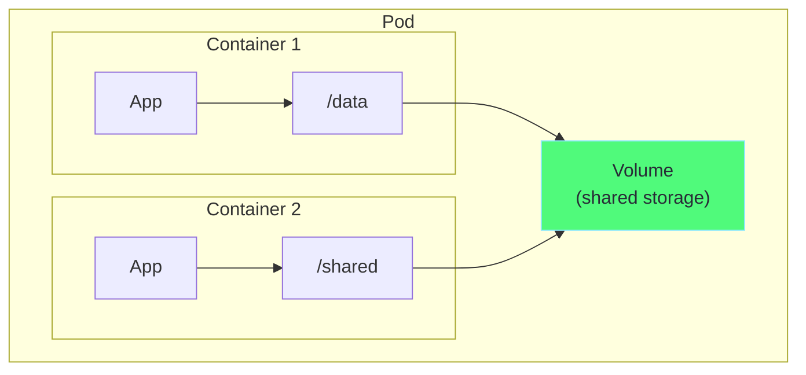
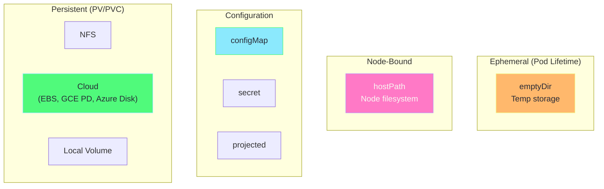
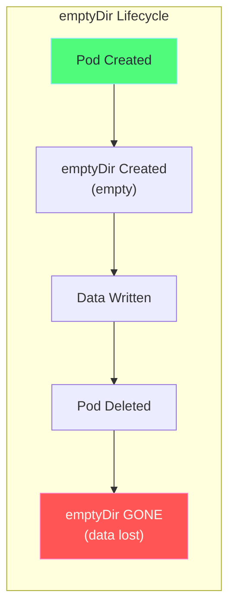
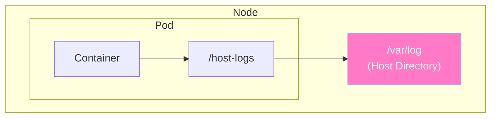
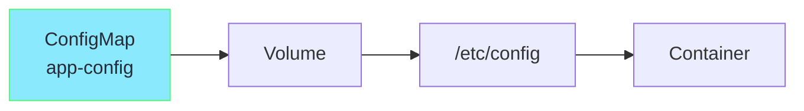
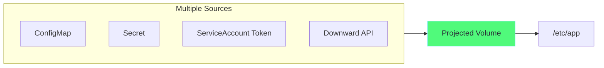

# Chapter 1: Volumes & Volume Types

## Table of Contents

1. [What are Volumes?](#what-are-volumes)
2. [Why Volumes are Needed](#why-volumes-are-needed)
3. [Volume Types](#volume-types)
4. [emptyDir](#emptydir)
5. [hostPath](#hostpath)
6. [configMap & secret](#configmap--secret)
7. [Projected Volumes](#projected-volumes)
8. [Hands-on Labs](#hands-on-labs)

---

## What are Volumes?

A **Volume** is a directory accessible to containers in a pod. Unlike container filesystems, volumes can persist data and share data between containers.



### Key Properties

| Property | Description |
|----------|-------------|
| **Lifetime** | Tied to pod lifetime (for most types) |
| **Sharing** | Multiple containers can access same volume |
| **Mount Point** | Directory path inside container |
| **Read/Write** | Can be mounted as readOnly or readWrite |

---

## Why Volumes are Needed

### Problem: Container Filesystem is Ephemeral

```
Timeline without Volume:
────────────────────────────────────────────────────────────►

t=0:  Container starts
t=1:  App writes data to /data/file.txt ✓
t=2:  Container crashes
t=3:  Container restarts
t=4:  /data/file.txt is GONE! ✗

Container's filesystem is recreated on restart.
All data is lost!
```

### Solution: Volumes

```
Timeline with Volume:
────────────────────────────────────────────────────────────►

t=0:  Container starts, volume mounted at /data
t=1:  App writes data to /data/file.txt ✓
t=2:  Container crashes
t=3:  Container restarts, same volume mounted
t=4:  /data/file.txt is STILL THERE! ✓

Volume exists independently of container.
Data survives restarts!
```

---

## Volume Types

### Overview



### Comparison Table

| Volume Type | Persistence | Use Case | Production? |
|-------------|-------------|----------|-------------|
| **emptyDir** | Pod lifetime | Temp files, cache, inter-container sharing | ✅ |
| **hostPath** | Node-bound | Node-level access, DaemonSets | ⚠️ Limited |
| **configMap** | ConfigMap lifetime | Configuration files | ✅ |
| **secret** | Secret lifetime | Sensitive data | ✅ |
| **persistentVolumeClaim** | Independent | Databases, stateful apps | ✅ |
| **nfs** | NFS server | Shared storage | ✅ |

---

## emptyDir

### What is emptyDir?

An **emptyDir** volume is created when a pod is assigned to a node and exists as long as the pod runs. It's initially empty.



### Use Cases

1. **Scratch space** - Temporary files
2. **Cache** - Disk-based merge sort
3. **Checkpoints** - Long computation recovery
4. **Shared data** - Between containers in same pod

### YAML Example

```yaml
# ============================================================================
# emptyDir Volume Example
# ============================================================================
apiVersion: v1
kind: Pod
metadata:
  name: emptydir-demo
spec:
  containers:
    # Container 1: Writer
    - name: writer
      image: busybox
      command: ["sh", "-c"]
      args:
        - |
          # Write data every 5 seconds
          while true; do
            echo "[$(date)] Data from writer" >> /data/shared.txt
            sleep 5
          done
      # ---------------------------------------------------------------------------
      # volumeMounts: Mount volume inside container
      # ---------------------------------------------------------------------------
      volumeMounts:
        - name: shared-data        # Must match volume name
          mountPath: /data         # Path inside container
    
    # Container 2: Reader
    - name: reader
      image: busybox
      command: ["sh", "-c"]
      args:
        - |
          # Read data every 5 seconds
          while true; do
            echo "=== Reading shared file ==="
            cat /data/shared.txt
            sleep 5
          done
      volumeMounts:
        - name: shared-data
          mountPath: /data
  
  # ---------------------------------------------------------------------------
  # volumes: Define the volumes
  # ---------------------------------------------------------------------------
  volumes:
    - name: shared-data
      emptyDir: {}              # Empty directory, created when pod starts

# HOW TO RUN:
# -----------
# kubectl apply -f emptydir-demo.yaml
# kubectl logs emptydir-demo -c reader -f
# kubectl delete pod emptydir-demo
```

### emptyDir with Memory (tmpfs)

```yaml
# Store emptyDir in RAM (faster, limited size)
volumes:
  - name: cache
    emptyDir:
      medium: Memory           # Use RAM instead of disk
      sizeLimit: 100Mi         # Limit to 100MB

# Benefits:
# - Very fast (RAM speed)
# - Automatically cleared on pod restart
#
# Drawbacks:
# - Uses pod's memory limit
# - Data lost on pod restart
```

---

## hostPath

### What is hostPath?

A **hostPath** volume mounts a file or directory from the host node's filesystem into the pod.



### Use Cases

1. **Access node data** - Read node's /var/log
2. **DaemonSets** - Node monitoring, log collection
3. **Development** - Mount local source code

### ⚠️ Warnings

> [!CAUTION]
> **hostPath is a security risk!**
> - Pod can access host filesystem
> - Data is node-specific (not portable)
> - Avoid in production unless necessary

### hostPath Types

| Type | Behavior |
|------|----------|
| `""` (empty) | No check, mount whatever exists |
| `DirectoryOrCreate` | Create directory if missing |
| `Directory` | Must exist as directory |
| `FileOrCreate` | Create file if missing |
| `File` | Must exist as file |
| `Socket` | Must exist as UNIX socket |
| `CharDevice` | Must exist as character device |
| `BlockDevice` | Must exist as block device |

### YAML Example

```yaml
# ============================================================================
# hostPath Volume Example
# ============================================================================
apiVersion: v1
kind: Pod
metadata:
  name: hostpath-demo
spec:
  containers:
    - name: log-reader
      image: busybox
      command: ["sh", "-c"]
      args:
        - |
          echo "Reading host logs..."
          # Access node's log files
          ls -la /host-logs/
          tail -f /host-logs/syslog 2>/dev/null || sleep infinity
      volumeMounts:
        - name: host-logs
          mountPath: /host-logs        # Path inside container
          readOnly: true               # Read-only access (safer)
  
  volumes:
    - name: host-logs
      hostPath:
        path: /var/log                 # Path on host
        type: Directory                # Must exist as directory

# HOW TO RUN:
# -----------
# kubectl apply -f hostpath-demo.yaml
# kubectl exec hostpath-demo -- ls /host-logs/
# kubectl delete pod hostpath-demo
```

### hostPath for DaemonSet (Log Collector)

```yaml
# DaemonSet using hostPath to collect logs
apiVersion: apps/v1
kind: DaemonSet
metadata:
  name: log-collector
spec:
  selector:
    matchLabels:
      app: log-collector
  template:
    metadata:
      labels:
        app: log-collector
    spec:
      containers:
        - name: collector
          image: busybox
          command: ["sh", "-c", "tail -f /var/log/containers/*.log"]
          volumeMounts:
            # Mount container logs
            - name: container-logs
              mountPath: /var/log/containers
              readOnly: true
            # Mount Docker/containerd logs
            - name: docker-logs
              mountPath: /var/lib/docker/containers
              readOnly: true
      volumes:
        - name: container-logs
          hostPath:
            path: /var/log/containers
            type: Directory
        - name: docker-logs
          hostPath:
            path: /var/lib/docker/containers
            type: DirectoryOrCreate
```

---

## configMap & secret

### Mounting configMap as Volume



```yaml
# ============================================================================
# configMap Volume Example
# ============================================================================

# Step 1: Create ConfigMap
apiVersion: v1
kind: ConfigMap
metadata:
  name: app-config
data:
  # Each key becomes a file
  database.conf: |
    host=postgres
    port=5432
    database=myapp
  cache.conf: |
    redis_host=redis
    redis_port=6379
---
# Step 2: Mount in Pod
apiVersion: v1
kind: Pod
metadata:
  name: configmap-volume-demo
spec:
  containers:
    - name: app
      image: busybox
      command: ["sh", "-c"]
      args:
        - |
          echo "=== Config files ==="
          ls -la /etc/config/
          echo "=== database.conf ==="
          cat /etc/config/database.conf
          sleep infinity
      volumeMounts:
        - name: config-volume
          mountPath: /etc/config       # Mount point
          readOnly: true
  
  volumes:
    - name: config-volume
      configMap:
        name: app-config               # ConfigMap name
        # Optional: Mount specific keys
        # items:
        #   - key: database.conf
        #     path: db.conf            # Rename file

# Result:
# /etc/config/database.conf  (from configMap)
# /etc/config/cache.conf     (from configMap)

# HOW TO RUN:
# -----------
# kubectl apply -f configmap-volume-demo.yaml
# kubectl exec configmap-volume-demo -- cat /etc/config/database.conf
```

### Mounting secret as Volume

```yaml
# ============================================================================
# secret Volume Example
# ============================================================================

# Step 1: Create Secret
apiVersion: v1
kind: Secret
metadata:
  name: app-secrets
type: Opaque
stringData:                            # Use stringData for plain text
  db-password: "supersecret123"
  api-key: "sk-abc123xyz"
---
# Step 2: Mount in Pod
apiVersion: v1
kind: Pod
metadata:
  name: secret-volume-demo
spec:
  containers:
    - name: app
      image: busybox
      command: ["sh", "-c"]
      args:
        - |
          echo "=== Secret files ==="
          ls -la /etc/secrets/
          echo "=== db-password ==="
          cat /etc/secrets/db-password
          sleep infinity
      volumeMounts:
        - name: secrets-volume
          mountPath: /etc/secrets
          readOnly: true               # Always use readOnly for secrets!
  
  volumes:
    - name: secrets-volume
      secret:
        secretName: app-secrets
        defaultMode: 0400              # File permissions (read-only)

# Result:
# /etc/secrets/db-password   (contains: supersecret123)
# /etc/secrets/api-key       (contains: sk-abc123xyz)

# HOW TO RUN:
# -----------
# kubectl apply -f secret-volume-demo.yaml
# kubectl exec secret-volume-demo -- cat /etc/secrets/db-password
```

---

## Projected Volumes

### What are Projected Volumes?

A **projected** volume maps several volume sources into a single directory.



### YAML Example

```yaml
# ============================================================================
# Projected Volume Example
# ============================================================================
apiVersion: v1
kind: Pod
metadata:
  name: projected-demo
spec:
  serviceAccountName: default
  containers:
    - name: app
      image: busybox
      command: ["sh", "-c"]
      args:
        - |
          echo "=== Projected volume contents ==="
          ls -la /etc/projected/
          echo "=== Pod name (from downward API) ==="
          cat /etc/projected/pod-name
          echo "=== Config (from ConfigMap) ==="
          cat /etc/projected/app.conf
          sleep infinity
      volumeMounts:
        - name: all-in-one
          mountPath: /etc/projected
  
  volumes:
    - name: all-in-one
      projected:
        sources:
          # Source 1: ConfigMap
          - configMap:
              name: app-config
              items:
                - key: database.conf
                  path: app.conf
          
          # Source 2: Secret
          - secret:
              name: app-secrets
              items:
                - key: db-password
                  path: password
          
          # Source 3: Downward API (pod metadata)
          - downwardAPI:
              items:
                - path: pod-name
                  fieldRef:
                    fieldPath: metadata.name
                - path: pod-namespace
                  fieldRef:
                    fieldPath: metadata.namespace
          
          # Source 4: Service Account Token
          - serviceAccountToken:
              path: token
              expirationSeconds: 3600
              audience: api

# Result:
# /etc/projected/app.conf      (from ConfigMap)
# /etc/projected/password      (from Secret)
# /etc/projected/pod-name      (from Downward API)
# /etc/projected/pod-namespace (from Downward API)
# /etc/projected/token         (from ServiceAccount)
```

---

## Hands-on Labs

### Lab 1: emptyDir for Container Communication

```bash
# Create pod with shared emptyDir
cat <<EOF | kubectl apply -f -
apiVersion: v1
kind: Pod
metadata:
  name: lab-emptydir
spec:
  containers:
    - name: producer
      image: busybox
      command: ["sh", "-c", "while true; do echo \$(date) >> /data/log.txt; sleep 2; done"]
      volumeMounts:
        - name: shared
          mountPath: /data
    - name: consumer
      image: busybox
      command: ["sh", "-c", "tail -f /data/log.txt"]
      volumeMounts:
        - name: shared
          mountPath: /data
  volumes:
    - name: shared
      emptyDir: {}
EOF

# Watch consumer read producer's data
kubectl logs lab-emptydir -c consumer -f

# Cleanup
kubectl delete pod lab-emptydir
```

### Lab 2: hostPath for Node Access

```bash
# Create pod that reads node's logs
cat <<EOF | kubectl apply -f -
apiVersion: v1
kind: Pod
metadata:
  name: lab-hostpath
spec:
  containers:
    - name: log-reader
      image: busybox
      command: ["sh", "-c", "ls -la /host-var-log/; sleep infinity"]
      volumeMounts:
        - name: logs
          mountPath: /host-var-log
          readOnly: true
  volumes:
    - name: logs
      hostPath:
        path: /var/log
        type: Directory
EOF

# See node's log files
kubectl exec lab-hostpath -- ls -la /host-var-log/

# Cleanup
kubectl delete pod lab-hostpath
```

### Lab 3: ConfigMap as Files

```bash
# Create ConfigMap
kubectl create configmap nginx-config --from-literal=server.conf='server { listen 80; }'

# Create pod with ConfigMap volume
cat <<EOF | kubectl apply -f -
apiVersion: v1
kind: Pod
metadata:
  name: lab-configmap
spec:
  containers:
    - name: nginx
      image: nginx
      volumeMounts:
        - name: config
          mountPath: /etc/nginx/conf.d
  volumes:
    - name: config
      configMap:
        name: nginx-config
EOF

# Verify
kubectl exec lab-configmap -- cat /etc/nginx/conf.d/server.conf

# Cleanup
kubectl delete pod lab-configmap
kubectl delete configmap nginx-config
```

---

## Key Takeaways

> [!IMPORTANT]
> 1. **emptyDir** is great for temp storage and container sharing
> 2. **hostPath** should be used with caution (security risk)
> 3. **configMap/secret** volumes auto-update when values change
> 4. **projected** volumes combine multiple sources into one mount

---

## Next: [Chapter 2 - PersistentVolumes →](02-persistentvolumes.md)
