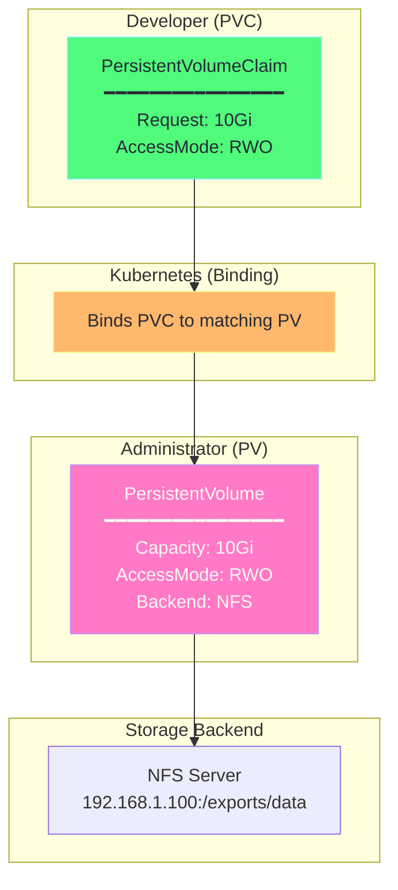
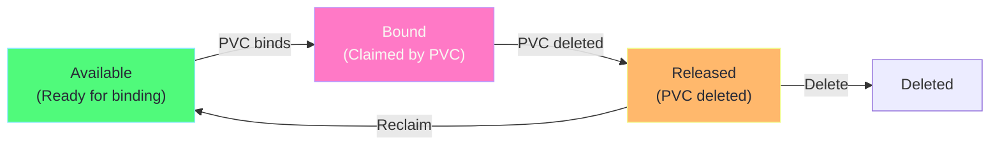
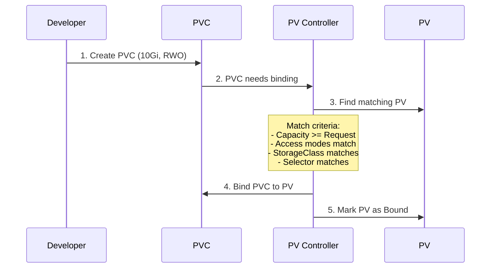
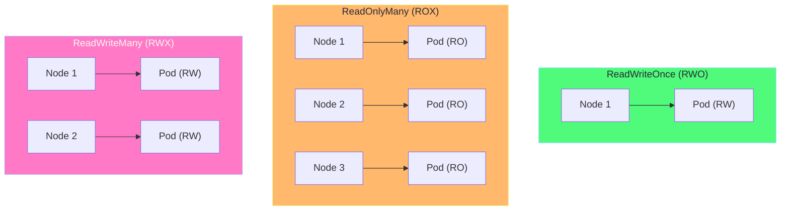
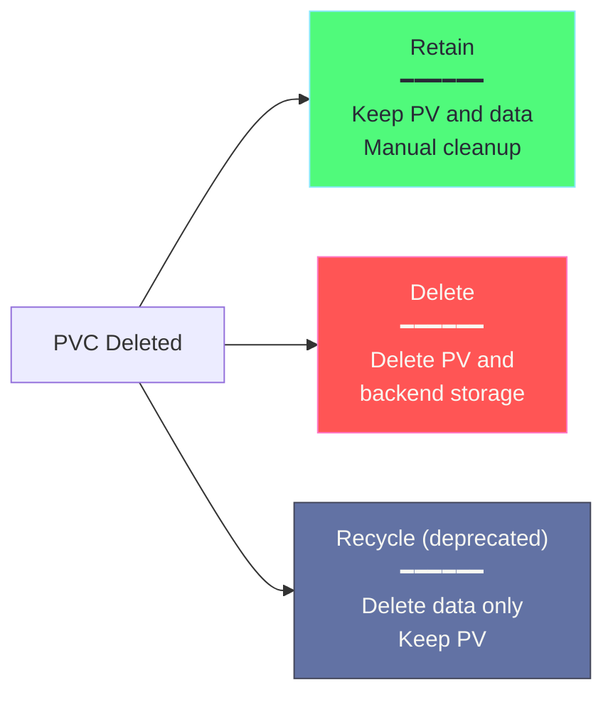

# Chapter 2: PersistentVolumes (PV) & PersistentVolumeClaims (PVC)

## Table of Contents

1. [The Storage Problem](#the-storage-problem)
2. [PV and PVC Concept](#pv-and-pvc-concept)
3. [PersistentVolume (PV)](#persistentvolume-pv)
4. [PersistentVolumeClaim (PVC)](#persistentvolumeclaim-pvc)
5. [Binding Process](#binding-process)
6. [Access Modes](#access-modes)
7. [Reclaim Policies](#reclaim-policies)
8. [YAML Explained](#yaml-explained)
9. [Hands-on Labs](#hands-on-labs)

---

## The Storage Problem

### Why Not Just Use Volumes?

```
Problem with Regular Volumes:
─────────────────────────────────────────────────────────────

Deployment A                     Deployment B
    │                                │
    ▼                                ▼
Volume: hostPath                 Volume: hostPath
path: /data/app-a                path: /data/app-b

Issues:
1. Developer needs to know storage details (hostPath, NFS server IP)
2. Storage is tied to specific pods
3. No access control or quotas
4. Hard to manage at scale
5. Different clusters have different storage backends
```

### The Solution: PV/PVC Abstraction

```
Solution with PV/PVC:
─────────────────────────────────────────────────────────────

Developer                        Administrator
────────                         ─────────────
                                 
PVC: "I need 10GB"               PV: "Here's 10GB of NFS storage"
                                 
    │                                │
    └────────────────────────────────┘
              Kubernetes Binds
              
Benefits:
1. Developer doesn't care about storage backend
2. Storage is decoupled from pods
3. Admins manage storage separately
4. Portable across clusters
5. Access control via PVC
```

---

## PV and PVC Concept

### Architecture



### Analogy: Restaurant

```
PV = Kitchen (storage resource)
    - Chef (admin) sets up the kitchen
    - Has specific capacity and equipment

PVC = Order (storage request)
    - Customer (developer) places an order
    - Doesn't need to know kitchen details

Binding = Waiter
    - Matches order to available kitchen capacity
```

---

## PersistentVolume (PV)

### What is a PV?

A **PersistentVolume** is a cluster resource that represents storage. It's provisioned by an administrator or dynamically via StorageClass.

### PV Lifecycle



### PV Phases

| Phase | Description |
|-------|-------------|
| **Available** | PV is ready and not bound to any PVC |
| **Bound** | PV is bound to a PVC |
| **Released** | PVC was deleted, but PV not yet reclaimed |
| **Failed** | Automatic reclamation failed |

### PV YAML Structure

```yaml
# ============================================================================
# PersistentVolume
# ============================================================================
apiVersion: v1
kind: PersistentVolume
metadata:
  name: my-pv
  labels:
    type: local                    # Labels for selection
spec:
  # ---------------------------------------------------------------------------
  # Capacity: How much storage
  # ---------------------------------------------------------------------------
  capacity:
    storage: 10Gi
  
  # ---------------------------------------------------------------------------
  # Access Modes: How can it be accessed
  # ---------------------------------------------------------------------------
  accessModes:
    - ReadWriteOnce               # RWO - single node read-write
  
  # ---------------------------------------------------------------------------
  # Reclaim Policy: What happens when PVC is deleted
  # ---------------------------------------------------------------------------
  persistentVolumeReclaimPolicy: Retain
  
  # ---------------------------------------------------------------------------
  # Storage Class: Optional, for matching with PVC
  # ---------------------------------------------------------------------------
  storageClassName: manual
  
  # ---------------------------------------------------------------------------
  # Volume Source: Where is the actual storage
  # ---------------------------------------------------------------------------
  # Option 1: hostPath (single node, not for production)
  hostPath:
    path: /mnt/data
  
  # Option 2: NFS
  # nfs:
  #   server: 192.168.1.100
  #   path: /exports/data
  
  # Option 3: Cloud volumes (AWS EBS)
  # awsElasticBlockStore:
  #   volumeID: vol-abc123
  #   fsType: ext4
```

---

## PersistentVolumeClaim (PVC)

### What is a PVC?

A **PersistentVolumeClaim** is a request for storage. Pods use PVCs to claim PV resources.

### PVC YAML Structure

```yaml
# ============================================================================
# PersistentVolumeClaim
# ============================================================================
apiVersion: v1
kind: PersistentVolumeClaim
metadata:
  name: my-pvc
spec:
  # ---------------------------------------------------------------------------
  # Access Modes: What access do you need
  # ---------------------------------------------------------------------------
  accessModes:
    - ReadWriteOnce
  
  # ---------------------------------------------------------------------------
  # Resources: How much storage
  # ---------------------------------------------------------------------------
  resources:
    requests:
      storage: 5Gi                 # Request 5GB
  
  # ---------------------------------------------------------------------------
  # Storage Class: Optional, must match PV
  # ---------------------------------------------------------------------------
  storageClassName: manual
  
  # ---------------------------------------------------------------------------
  # Selector: Optional, select specific PV by labels
  # ---------------------------------------------------------------------------
  selector:
    matchLabels:
      type: local
```

### Using PVC in a Pod

```yaml
# ============================================================================
# Pod using PVC
# ============================================================================
apiVersion: v1
kind: Pod
metadata:
  name: pod-with-pvc
spec:
  containers:
    - name: app
      image: nginx
      volumeMounts:
        - name: data                # Must match volume name
          mountPath: /usr/share/nginx/html
  
  volumes:
    - name: data
      persistentVolumeClaim:
        claimName: my-pvc           # Reference the PVC
```

---

## Binding Process

### How Kubernetes Binds PVC to PV



### Matching Criteria

For a PVC to bind to a PV:

1. **Capacity**: PV capacity >= PVC request
2. **Access Mode**: PV supports requested access mode
3. **StorageClass**: Must match (or both empty)
4. **Selector**: If specified, PV labels must match
5. **Volume Mode**: Filesystem or Block must match

### Binding Example

```
PV: my-pv                         PVC: my-pvc
─────────────                     ─────────────

capacity: 10Gi           ≥        requests: 5Gi        ✓
accessModes: [RWO]       ==       accessModes: [RWO]   ✓
storageClassName: manual ==       storageClassName: manual ✓
labels: type=local       ==       selector: type=local ✓

Result: BOUND!
```

---

## Access Modes

### Understanding Access Modes



### Access Mode Table

| Mode | Abbrev | Description | Multi-Node | Multi-Pod |
|------|--------|-------------|------------|-----------|
| ReadWriteOnce | RWO | Read-Write, one node only | ❌ | ✅ (same node) |
| ReadOnlyMany | ROX | Read-Only, multiple nodes | ✅ | ✅ |
| ReadWriteMany | RWX | Read-Write, multiple nodes | ✅ | ✅ |
| ReadWriteOncePod | RWOP | Read-Write, one pod only | ❌ | ❌ |

### What Supports What?

| Storage Backend | RWO | ROX | RWX |
|-----------------|-----|-----|-----|
| AWS EBS | ✅ | ❌ | ❌ |
| GCE PD | ✅ | ❌ | ❌ |
| Azure Disk | ✅ | ❌ | ❌ |
| NFS | ✅ | ✅ | ✅ |
| CephFS | ✅ | ✅ | ✅ |
| hostPath | ✅ | ❌ | ❌ |

---

## Reclaim Policies

### What Happens When PVC is Deleted?



### Policy Details

| Policy | PV After PVC Delete | Data | Use Case |
|--------|---------------------|------|----------|
| **Retain** | Released (manual cleanup) | Preserved | Production, important data |
| **Delete** | Deleted | Deleted | Development, temporary |
| **Recycle** (deprecated) | Available | Wiped (`rm -rf`) | Legacy |

### Retain Example

```yaml
apiVersion: v1
kind: PersistentVolume
metadata:
  name: important-data
spec:
  capacity:
    storage: 100Gi
  accessModes:
    - ReadWriteOnce
  # ---------------------------------------------------------------------------
  # Retain: PV stays after PVC deleted, data is preserved
  # Admin must manually reclaim
  # ---------------------------------------------------------------------------
  persistentVolumeReclaimPolicy: Retain
  hostPath:
    path: /mnt/important
```

---

## YAML Explained

### Complete PV/PVC/Pod Example

```yaml
# ============================================================================
# STEP 1: Create PersistentVolume (Admin)
# ============================================================================
apiVersion: v1
kind: PersistentVolume
metadata:
  name: example-pv
  labels:
    # Labels help with PVC selector matching
    type: local
    environment: development
spec:
  # ---------------------------------------------------------------------------
  # capacity: How much storage this PV provides
  # ---------------------------------------------------------------------------
  capacity:
    storage: 5Gi
  
  # ---------------------------------------------------------------------------
  # volumeMode: Filesystem (default) or Block
  # ---------------------------------------------------------------------------
  volumeMode: Filesystem
  
  # ---------------------------------------------------------------------------
  # accessModes: How the volume can be mounted
  # ---------------------------------------------------------------------------
  accessModes:
    - ReadWriteOnce              # Single node read-write
  
  # ---------------------------------------------------------------------------
  # persistentVolumeReclaimPolicy: What to do after PVC is deleted
  # ---------------------------------------------------------------------------
  persistentVolumeReclaimPolicy: Retain
  
  # ---------------------------------------------------------------------------
  # storageClassName: Empty string means no StorageClass
  # Use "manual" for explicit matching
  # ---------------------------------------------------------------------------
  storageClassName: manual
  
  # ---------------------------------------------------------------------------
  # nodeAffinity: Optional, which nodes can use this PV
  # ---------------------------------------------------------------------------
  # nodeAffinity:
  #   required:
  #     nodeSelectorTerms:
  #       - matchExpressions:
  #           - key: kubernetes.io/hostname
  #             operator: In
  #             values:
  #               - node1
  
  # ---------------------------------------------------------------------------
  # Storage backend: hostPath, NFS, cloud volumes, etc.
  # ---------------------------------------------------------------------------
  hostPath:
    path: /mnt/data
    type: DirectoryOrCreate      # Create if doesn't exist

---
# ============================================================================
# STEP 2: Create PersistentVolumeClaim (Developer)
# ============================================================================
apiVersion: v1
kind: PersistentVolumeClaim
metadata:
  name: example-pvc
spec:
  # ---------------------------------------------------------------------------
  # accessModes: Must match PV's capabilities
  # ---------------------------------------------------------------------------
  accessModes:
    - ReadWriteOnce
  
  # ---------------------------------------------------------------------------
  # volumeMode: Must match PV
  # ---------------------------------------------------------------------------
  volumeMode: Filesystem
  
  # ---------------------------------------------------------------------------
  # resources: How much storage you need
  # PV capacity must be >= this request
  # ---------------------------------------------------------------------------
  resources:
    requests:
      storage: 3Gi               # Request 3GB (PV has 5GB)
  
  # ---------------------------------------------------------------------------
  # storageClassName: Must match PV
  # ---------------------------------------------------------------------------
  storageClassName: manual
  
  # ---------------------------------------------------------------------------
  # selector: Optional, select specific PV by labels
  # ---------------------------------------------------------------------------
  selector:
    matchLabels:
      type: local

---
# ============================================================================
# STEP 3: Use PVC in Pod
# ============================================================================
apiVersion: v1
kind: Pod
metadata:
  name: example-pod
spec:
  containers:
    - name: app
      image: nginx
      ports:
        - containerPort: 80
      
      # -----------------------------------------------------------------------
      # volumeMounts: Mount the volume inside container
      # -----------------------------------------------------------------------
      volumeMounts:
        - name: data-volume        # Must match volumes[].name
          mountPath: /usr/share/nginx/html
          # Optional: Mount as read-only
          # readOnly: true
          # Optional: Mount specific subpath
          # subPath: subdir
      
      resources:
        requests:
          cpu: 100m
          memory: 128Mi
  
  # ---------------------------------------------------------------------------
  # volumes: Reference the PVC
  # ---------------------------------------------------------------------------
  volumes:
    - name: data-volume
      persistentVolumeClaim:
        claimName: example-pvc     # Must match PVC name

# HOW TO RUN:
# -----------
# kubectl apply -f pv-pvc-pod.yaml
#
# # Check PV status
# kubectl get pv
# # NAME         CAPACITY   ACCESS MODES   RECLAIM POLICY   STATUS   CLAIM
# # example-pv   5Gi        RWO            Retain           Bound    default/example-pvc
#
# # Check PVC status
# kubectl get pvc
# # NAME          STATUS   VOLUME       CAPACITY   ACCESS MODES
# # example-pvc   Bound    example-pv   5Gi        RWO
#
# # Write data
# kubectl exec example-pod -- sh -c 'echo "Hello PV!" > /usr/share/nginx/html/index.html'
#
# # Read data
# kubectl exec example-pod -- cat /usr/share/nginx/html/index.html
#
# # Delete pod - data persists!
# kubectl delete pod example-pod
#
# # Recreate pod with same PVC - data still there!
# kubectl apply -f pod.yaml
# kubectl exec example-pod -- cat /usr/share/nginx/html/index.html
```

---

## Hands-on Labs

### Lab 1: Basic PV/PVC

```bash
# Create PV
cat <<EOF | kubectl apply -f -
apiVersion: v1
kind: PersistentVolume
metadata:
  name: lab-pv
spec:
  capacity:
    storage: 1Gi
  accessModes:
    - ReadWriteOnce
  persistentVolumeReclaimPolicy: Retain
  storageClassName: manual
  hostPath:
    path: /tmp/lab-data
EOF

# Create PVC
cat <<EOF | kubectl apply -f -
apiVersion: v1
kind: PersistentVolumeClaim
metadata:
  name: lab-pvc
spec:
  accessModes:
    - ReadWriteOnce
  resources:
    requests:
      storage: 500Mi
  storageClassName: manual
EOF

# Check binding
kubectl get pv,pvc

# Use in pod
cat <<EOF | kubectl apply -f -
apiVersion: v1
kind: Pod
metadata:
  name: lab-pod
spec:
  containers:
    - name: app
      image: busybox
      command: ["sh", "-c", "echo 'Hello PV!' > /data/hello.txt; sleep infinity"]
      volumeMounts:
        - name: data
          mountPath: /data
  volumes:
    - name: data
      persistentVolumeClaim:
        claimName: lab-pvc
EOF

# Verify data
kubectl exec lab-pod -- cat /data/hello.txt

# Cleanup
kubectl delete pod lab-pod
kubectl delete pvc lab-pvc
kubectl get pv  # Still exists with status "Released"
kubectl delete pv lab-pv
```

### Lab 2: Data Persistence Test

```bash
# Create PVC (will use default StorageClass in Minikube)
cat <<EOF | kubectl apply -f -
apiVersion: v1
kind: PersistentVolumeClaim
metadata:
  name: test-persistence
spec:
  accessModes:
    - ReadWriteOnce
  resources:
    requests:
      storage: 100Mi
EOF

# Create pod and write data
cat <<EOF | kubectl apply -f -
apiVersion: v1
kind: Pod
metadata:
  name: writer-pod
spec:
  containers:
    - name: writer
      image: busybox
      command: ["sh", "-c", "echo 'Persisted data!' > /mnt/data.txt; sleep infinity"]
      volumeMounts:
        - name: pvc-vol
          mountPath: /mnt
  volumes:
    - name: pvc-vol
      persistentVolumeClaim:
        claimName: test-persistence
EOF

# Wait and verify
kubectl wait --for=condition=ready pod/writer-pod
kubectl exec writer-pod -- cat /mnt/data.txt

# Delete pod (not PVC)
kubectl delete pod writer-pod

# Create new pod with same PVC
cat <<EOF | kubectl apply -f -
apiVersion: v1
kind: Pod
metadata:
  name: reader-pod
spec:
  containers:
    - name: reader
      image: busybox
      command: ["sh", "-c", "cat /mnt/data.txt; sleep infinity"]
      volumeMounts:
        - name: pvc-vol
          mountPath: /mnt
  volumes:
    - name: pvc-vol
      persistentVolumeClaim:
        claimName: test-persistence
EOF

# Data is still there!
kubectl logs reader-pod

# Cleanup
kubectl delete pod reader-pod
kubectl delete pvc test-persistence
```

---

## Key Takeaways

> [!IMPORTANT]
> 1. **PV** = Storage resource (provisioned by admin)
> 2. **PVC** = Storage request (created by developer)
> 3. **Binding** = Kubernetes matches PVC to compatible PV
> 4. **Access Modes** = RWO (single node), ROX (read-only many), RWX (read-write many)
> 5. **Reclaim Policy** = What happens to PV when PVC is deleted

---

## Next: [Chapter 3 - StorageClasses →](03-storageclasses.md)
