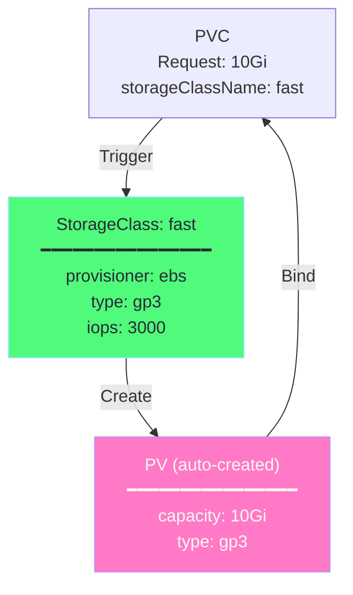
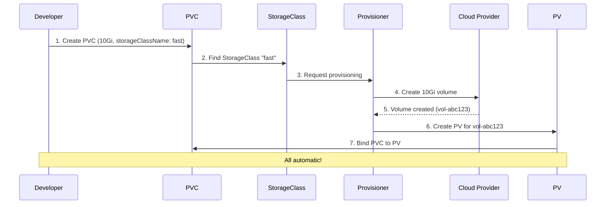
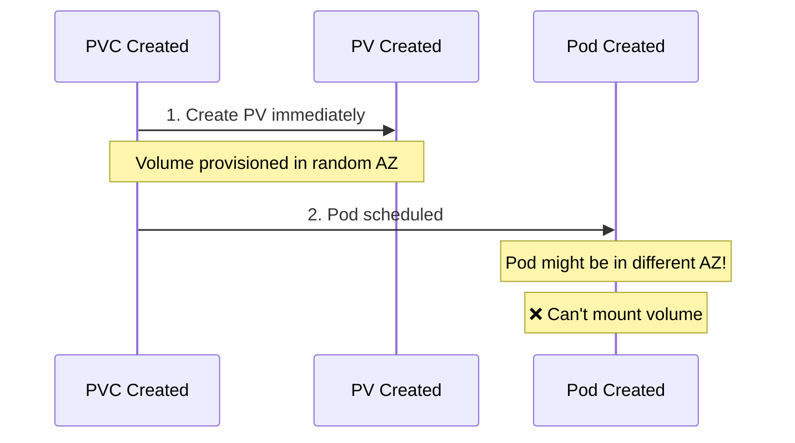
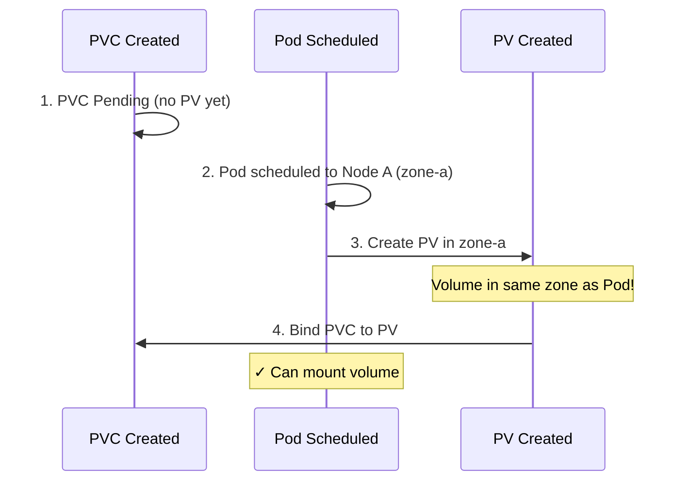
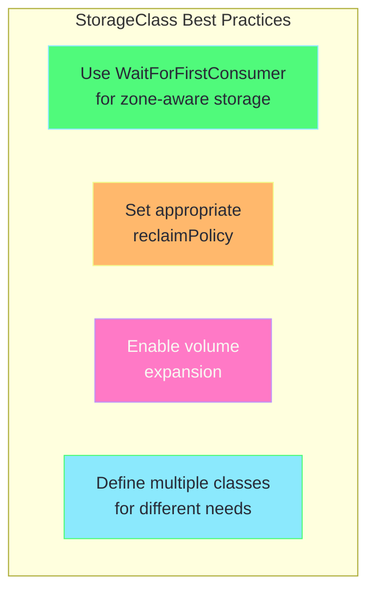

# Chapter 3: StorageClasses & Dynamic Provisioning

## Table of Contents

1. [The Problem with Static Provisioning](#the-problem-with-static-provisioning)
2. [What is a StorageClass?](#what-is-a-storageclass)
3. [Dynamic Provisioning](#dynamic-provisioning)
4. [StorageClass Parameters](#storageclass-parameters)
5. [Default StorageClass](#default-storageclass)
6. [Volume Binding Modes](#volume-binding-modes)
7. [YAML Explained](#yaml-explained)
8. [Hands-on Labs](#hands-on-labs)

---

## The Problem with Static Provisioning

### Static Provisioning Workflow

```
Admin creates PVs in advance:
─────────────────────────────────────────────────────────────

1. Admin predicts storage needs
2. Admin creates PVs: 5×10Gi, 3×50Gi, 2×100Gi
3. Developer creates PVC requesting 15Gi
4. No matching PV! PVC stays Pending ❌
5. Developer waits for admin to create new PV
6. Admin creates 15Gi PV
7. PVC binds ✓

Problems:
- Admin overhead
- Wasteful (over-provisioning)
- Slow (waiting for manual action)
- Doesn't scale
```

### Solution: Dynamic Provisioning

```
Dynamic Provisioning:
─────────────────────────────────────────────────────────────

1. Admin creates StorageClass once
2. Developer creates PVC requesting 15Gi
3. StorageClass automatically creates 15Gi PV ✓
4. PVC binds immediately ✓

Benefits:
- No admin intervention
- No waste (exact size)
- Instant provisioning
- Scales infinitely
```

---

## What is a StorageClass?

A **StorageClass** is a template for dynamically provisioning PVs. It defines:
- Which provisioner to use
- What parameters to apply
- What reclaim policy



### StorageClass Components

| Component | Description |
|-----------|-------------|
| **provisioner** | Plugin that creates volumes (e.g., kubernetes.io/aws-ebs) |
| **parameters** | Backend-specific settings (type, iops, zone) |
| **reclaimPolicy** | What happens when PVC deleted (Delete/Retain) |
| **volumeBindingMode** | When to bind (Immediate/WaitForFirstConsumer) |
| **allowVolumeExpansion** | Can volumes be resized |

---

## Dynamic Provisioning

### How It Works



### Example Flow in AWS

```
1. PVC requests 100Gi with StorageClass "gp3"

2. StorageClass "gp3" has:
   - provisioner: ebs.csi.aws.com
   - type: gp3
   - iops: 3000

3. EBS CSI Driver:
   - Calls AWS API
   - Creates 100Gi gp3 EBS volume
   - Returns volume ID

4. Kubernetes:
   - Creates PV with EBS volume ID
   - Binds PVC to new PV

5. Result: Ready to use in ~30 seconds!
```

---

## StorageClass Parameters

### Common Provisioners

| Cloud/Platform | Provisioner | Volume Type |
|----------------|-------------|-------------|
| **AWS** | ebs.csi.aws.com | EBS volumes |
| **GCP** | pd.csi.storage.gke.io | Persistent Disks |
| **Azure** | disk.csi.azure.com | Azure Disks |
| **Minikube** | k8s.io/minikube-hostpath | Host directories |
| **Kind** | rancher.io/local-path | Local paths |
| **NFS** | nfs.csi.k8s.io | NFS shares |

### AWS EBS Parameters

```yaml
apiVersion: storage.k8s.io/v1
kind: StorageClass
metadata:
  name: fast-ebs
provisioner: ebs.csi.aws.com
parameters:
  type: gp3              # gp2, gp3, io1, io2, st1, sc1
  iops: "3000"           # For gp3, io1, io2
  throughput: "125"      # For gp3 (MiB/s)
  encrypted: "true"
  kmsKeyId: "arn:aws:kms:..."
```

### GCP Persistent Disk Parameters

```yaml
apiVersion: storage.k8s.io/v1
kind: StorageClass
metadata:
  name: fast-gcp
provisioner: pd.csi.storage.gke.io
parameters:
  type: pd-ssd           # pd-standard, pd-ssd, pd-balanced
  replication-type: none # or regional-pd
```

### Azure Disk Parameters

```yaml
apiVersion: storage.k8s.io/v1
kind: StorageClass
metadata:
  name: fast-azure
provisioner: disk.csi.azure.com
parameters:
  skuName: Premium_LRS   # Standard_LRS, Premium_LRS, StandardSSD_LRS
  cachingMode: ReadOnly
```

---

## Default StorageClass

### What is Default StorageClass?

A **default StorageClass** is used when a PVC doesn't specify `storageClassName`.

```yaml
# PVC without storageClassName
apiVersion: v1
kind: PersistentVolumeClaim
metadata:
  name: my-pvc
spec:
  accessModes:
    - ReadWriteOnce
  resources:
    requests:
      storage: 5Gi
  # storageClassName: not specified → uses default!
```

### Setting Default StorageClass

```yaml
apiVersion: storage.k8s.io/v1
kind: StorageClass
metadata:
  name: standard
  annotations:
    # This makes it the default!
    storageclass.kubernetes.io/is-default-class: "true"
provisioner: k8s.io/minikube-hostpath
```

### Check Default StorageClass

```bash
# List StorageClasses (default has "(default)" annotation)
kubectl get storageclass
# NAME                 PROVISIONER                RECLAIMPOLICY   VOLUMEBINDINGMODE
# standard (default)   k8s.io/minikube-hostpath   Delete          Immediate

# Or describe
kubectl describe storageclass standard | grep IsDefaultClass
```

---

## Volume Binding Modes

### Immediate (Default)

Volume is provisioned immediately when PVC is created.



**Problem**: Volume might be in wrong zone!

### WaitForFirstConsumer

Volume is provisioned when first pod using it is scheduled.



**Solution**: Volume created in correct zone!

### YAML Example

```yaml
apiVersion: storage.k8s.io/v1
kind: StorageClass
metadata:
  name: zone-aware
provisioner: ebs.csi.aws.com
# ---------------------------------------------------------------------------
# volumeBindingMode: WaitForFirstConsumer
# Wait until pod is scheduled to create volume in same zone
# ---------------------------------------------------------------------------
volumeBindingMode: WaitForFirstConsumer
parameters:
  type: gp3
```

---

## YAML Explained

### Basic StorageClass

```yaml
# ============================================================================
# StorageClass - Basic Example
# ============================================================================
apiVersion: storage.k8s.io/v1
kind: StorageClass
metadata:
  name: standard
  # ---------------------------------------------------------------------------
  # annotations: Optional settings
  # ---------------------------------------------------------------------------
  annotations:
    # Make this the default StorageClass
    storageclass.kubernetes.io/is-default-class: "true"

# ---------------------------------------------------------------------------
# provisioner: Who creates the volumes
# ---------------------------------------------------------------------------
provisioner: k8s.io/minikube-hostpath

# ---------------------------------------------------------------------------
# reclaimPolicy: What happens when PVC is deleted
# - Delete: Delete PV and backing storage (default)
# - Retain: Keep PV and data
# ---------------------------------------------------------------------------
reclaimPolicy: Delete

# ---------------------------------------------------------------------------
# volumeBindingMode: When to provision
# - Immediate: Create volume when PVC is created (default)
# - WaitForFirstConsumer: Wait for pod to be scheduled
# ---------------------------------------------------------------------------
volumeBindingMode: Immediate

# ---------------------------------------------------------------------------
# allowVolumeExpansion: Can PVC request more storage later
# ---------------------------------------------------------------------------
allowVolumeExpansion: true
```

### AWS EBS StorageClass

```yaml
# ============================================================================
# StorageClass - AWS EBS (Production)
# ============================================================================
apiVersion: storage.k8s.io/v1
kind: StorageClass
metadata:
  name: fast-ebs-encrypted
provisioner: ebs.csi.aws.com

# ---------------------------------------------------------------------------
# parameters: Provisioner-specific settings
# ---------------------------------------------------------------------------
parameters:
  # Volume type
  type: gp3
  
  # Performance settings (gp3 specific)
  iops: "3000"
  throughput: "125"
  
  # Encryption
  encrypted: "true"
  # kmsKeyId: "arn:aws:kms:us-east-1:123456789:key/abc-123"

# Wait for pod to be scheduled (zone-aware)
volumeBindingMode: WaitForFirstConsumer

# Delete volume when PVC deleted
reclaimPolicy: Delete

# Allow resizing
allowVolumeExpansion: true

# Allowed topologies (restrict to specific zones)
# allowedTopologies:
#   - matchLabelExpressions:
#       - key: topology.ebs.csi.aws.com/zone
#         values:
#           - us-east-1a
#           - us-east-1b
```

### PVC Using StorageClass

```yaml
# ============================================================================
# PVC with StorageClass (Dynamic Provisioning)
# ============================================================================
apiVersion: v1
kind: PersistentVolumeClaim
metadata:
  name: fast-storage
spec:
  # ---------------------------------------------------------------------------
  # storageClassName: Reference the StorageClass
  # ---------------------------------------------------------------------------
  storageClassName: fast-ebs-encrypted
  
  accessModes:
    - ReadWriteOnce
  
  resources:
    requests:
      storage: 100Gi

# Result:
# 1. PVC is created
# 2. StorageClass triggers provisioner
# 3. Provisioner creates 100Gi gp3 encrypted EBS volume
# 4. Kubernetes creates PV
# 5. PVC binds to PV
# All automatic!
```

### Volume Expansion

```yaml
# ============================================================================
# Expanding a PVC
# ============================================================================

# Step 1: StorageClass must allow expansion
apiVersion: storage.k8s.io/v1
kind: StorageClass
metadata:
  name: expandable
provisioner: ebs.csi.aws.com
allowVolumeExpansion: true    # Required!
---
# Step 2: PVC with original size
apiVersion: v1
kind: PersistentVolumeClaim
metadata:
  name: expandable-pvc
spec:
  storageClassName: expandable
  accessModes:
    - ReadWriteOnce
  resources:
    requests:
      storage: 10Gi

# Step 3: To expand, edit the PVC
# kubectl patch pvc expandable-pvc -p '{"spec":{"resources":{"requests":{"storage":"20Gi"}}}}'
# or
# kubectl edit pvc expandable-pvc
# Change storage: 10Gi → 20Gi
```

---

## Hands-on Labs

### Lab 1: View Minikube's Default StorageClass

```bash
# Minikube comes with a default StorageClass
kubectl get storageclass

# Describe it
kubectl describe storageclass standard

# Output shows:
# - Provisioner: k8s.io/minikube-hostpath
# - ReclaimPolicy: Delete
# - VolumeBindingMode: Immediate
```

### Lab 2: Dynamic Provisioning

```bash
# Create PVC (no PV needed!)
cat <<EOF | kubectl apply -f -
apiVersion: v1
kind: PersistentVolumeClaim
metadata:
  name: dynamic-pvc
spec:
  accessModes:
    - ReadWriteOnce
  resources:
    requests:
      storage: 1Gi
  # Uses default StorageClass since not specified
EOF

# Check - PV is auto-created!
kubectl get pv
kubectl get pvc

# Use in pod
cat <<EOF | kubectl apply -f -
apiVersion: v1
kind: Pod
metadata:
  name: dynamic-pod
spec:
  containers:
    - name: app
      image: busybox
      command: ["sh", "-c", "echo 'Dynamic!' > /data/test.txt; sleep infinity"]
      volumeMounts:
        - name: storage
          mountPath: /data
  volumes:
    - name: storage
      persistentVolumeClaim:
        claimName: dynamic-pvc
EOF

# Verify
kubectl exec dynamic-pod -- cat /data/test.txt

# Cleanup - PV is auto-deleted!
kubectl delete pod dynamic-pod
kubectl delete pvc dynamic-pvc
kubectl get pv  # PV is gone!
```

### Lab 3: Create Custom StorageClass

```bash
# Create custom StorageClass
cat <<EOF | kubectl apply -f -
apiVersion: storage.k8s.io/v1
kind: StorageClass
metadata:
  name: retain-storage
provisioner: k8s.io/minikube-hostpath
reclaimPolicy: Retain              # Keep PV after PVC delete
volumeBindingMode: Immediate
allowVolumeExpansion: true
EOF

# Create PVC using it
cat <<EOF | kubectl apply -f -
apiVersion: v1
kind: PersistentVolumeClaim
metadata:
  name: retain-pvc
spec:
  storageClassName: retain-storage
  accessModes:
    - ReadWriteOnce
  resources:
    requests:
      storage: 500Mi
EOF

# Check
kubectl get pv,pvc

# Delete PVC
kubectl delete pvc retain-pvc

# PV still exists with "Released" status!
kubectl get pv

# Cleanup
kubectl delete pv <pv-name>
kubectl delete storageclass retain-storage
```

### Lab 4: Volume Expansion

```bash
# Create expandable StorageClass
cat <<EOF | kubectl apply -f -
apiVersion: storage.k8s.io/v1
kind: StorageClass
metadata:
  name: expandable
provisioner: k8s.io/minikube-hostpath
allowVolumeExpansion: true
EOF

# Create small PVC
cat <<EOF | kubectl apply -f -
apiVersion: v1
kind: PersistentVolumeClaim
metadata:
  name: expand-pvc
spec:
  storageClassName: expandable
  accessModes:
    - ReadWriteOnce
  resources:
    requests:
      storage: 100Mi
EOF

# Check initial size
kubectl get pvc expand-pvc

# Expand to 500Mi
kubectl patch pvc expand-pvc -p '{"spec":{"resources":{"requests":{"storage":"500Mi"}}}}'

# Check new size
kubectl get pvc expand-pvc
# Note: In Minikube, actual filesystem resize happens when pod mounts it

# Cleanup
kubectl delete pvc expand-pvc
kubectl delete storageclass expandable
```

---

## StorageClass Best Practices



### Recommended StorageClasses

```yaml
# Fast storage for databases
apiVersion: storage.k8s.io/v1
kind: StorageClass
metadata:
  name: fast
provisioner: ebs.csi.aws.com
parameters:
  type: gp3
  iops: "3000"
volumeBindingMode: WaitForFirstConsumer
reclaimPolicy: Delete
allowVolumeExpansion: true
---
# Standard storage for general use
apiVersion: storage.k8s.io/v1
kind: StorageClass
metadata:
  name: standard
  annotations:
    storageclass.kubernetes.io/is-default-class: "true"
provisioner: ebs.csi.aws.com
parameters:
  type: gp3
volumeBindingMode: WaitForFirstConsumer
reclaimPolicy: Delete
allowVolumeExpansion: true
---
# Archive storage for backups
apiVersion: storage.k8s.io/v1
kind: StorageClass
metadata:
  name: archive
provisioner: ebs.csi.aws.com
parameters:
  type: st1    # Throughput optimized HDD
volumeBindingMode: WaitForFirstConsumer
reclaimPolicy: Retain    # Keep backups!
allowVolumeExpansion: true
```

---

## Key Takeaways

> [!IMPORTANT]
> 1. **StorageClass** enables dynamic provisioning (no pre-created PVs needed)
> 2. **WaitForFirstConsumer** prevents zone mismatch issues
> 3. **reclaimPolicy** controls data retention after PVC deletion
> 4. **allowVolumeExpansion** enables growing volumes without migration
> 5. **Default StorageClass** is used when PVC doesn't specify one

---

## Next: [Chapter 4 - CSI Drivers →](04-csi-drivers.md)
