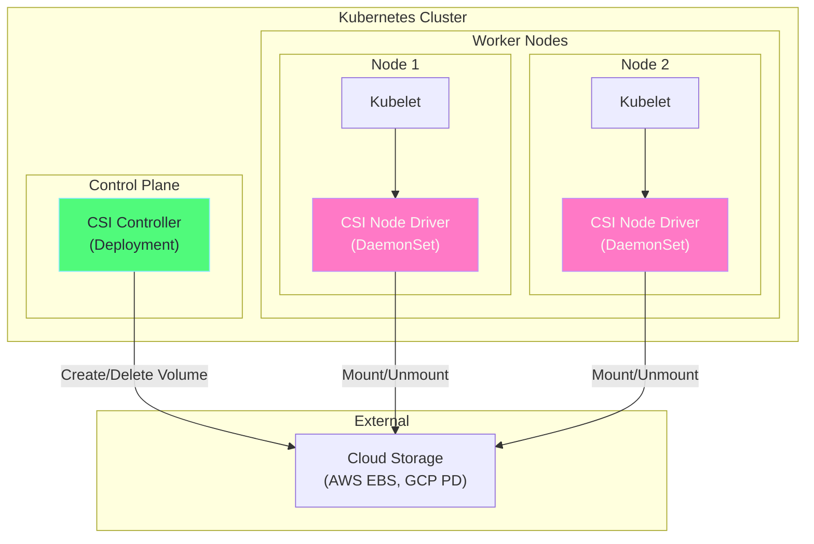
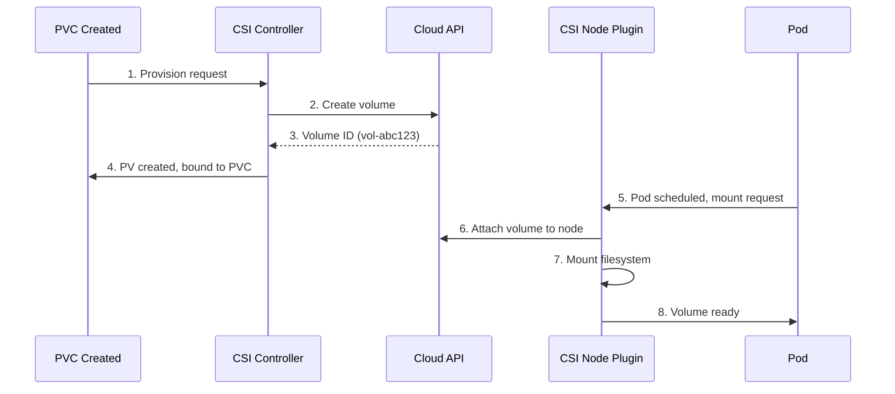
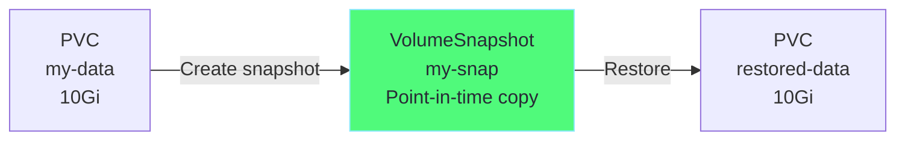
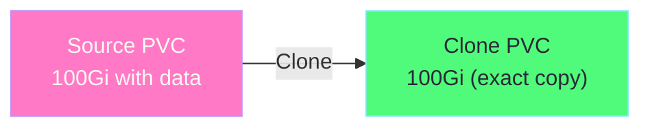
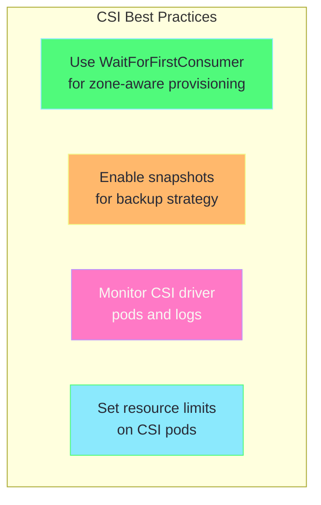

# Chapter 4: CSI Drivers - Cloud & Custom Storage Integration

## Table of Contents

1. [What is CSI?](#what-is-csi)
2. [CSI Architecture](#csi-architecture)
3. [Common CSI Drivers](#common-csi-drivers)
4. [AWS EBS CSI Driver](#aws-ebs-csi-driver)
5. [NFS CSI Driver](#nfs-csi-driver)
6. [Volume Snapshots](#volume-snapshots)
7. [Volume Cloning](#volume-cloning)
8. [Hands-on Labs](#hands-on-labs)

---

## What is CSI?

**Container Storage Interface (CSI)** is a standard for exposing storage systems to container orchestrators like Kubernetes.

### Before CSI (In-Tree)

```
Problem with In-Tree Drivers:
─────────────────────────────────────────────────────────────

Kubernetes Core
┌─────────────────────────────────────────────────────────┐
│                                                         │
│   AWS EBS Driver   GCE PD Driver   Azure Disk Driver   │
│   Cinder Driver    vSphere Driver  Ceph Driver         │
│   ...20+ drivers built into Kubernetes core...         │
│                                                         │
└─────────────────────────────────────────────────────────┘

Problems:
1. Hard to add new drivers (requires Kubernetes release)
2. Bugs in drivers affect Kubernetes stability
3. Different release cycles
4. Code bloat
```

### With CSI (Out-of-Tree)

```
Solution with CSI:
─────────────────────────────────────────────────────────────

Kubernetes Core                   CSI Drivers (separate)
┌────────────────┐               ┌─────────────────────────┐
│                │               │                         │
│  CSI Interface │◄─────────────►│  AWS EBS CSI Driver    │
│  (standard)    │               │  GCE PD CSI Driver     │
│                │               │  Azure CSI Driver      │
│                │               │  NFS CSI Driver        │
│                │               │  Custom drivers...     │
└────────────────┘               └─────────────────────────┘

Benefits:
1. Independent development and releases
2. Storage vendors maintain their own drivers
3. Easier to add support for new storage
4. Kubernetes core stays lean
```

---

## CSI Architecture

### Components



### CSI Driver Components

| Component | Deployment | Responsibility |
|-----------|------------|----------------|
| **Controller Plugin** | Deployment (1 replica) | Create, delete, snapshot volumes |
| **Node Plugin** | DaemonSet (every node) | Mount, unmount, format volumes |
| **CSI Sidecar** | With controller | Watch PVCs, trigger provisioning |

### Volume Lifecycle with CSI



---

## Common CSI Drivers

### Official CSI Drivers

| Driver | Storage Backend | Use Case |
|--------|-----------------|----------|
| **aws-ebs-csi-driver** | AWS EBS | Block storage on AWS |
| **gcp-pd-csi-driver** | GCE Persistent Disk | Block storage on GCP |
| **azuredisk-csi-driver** | Azure Disk | Block storage on Azure |
| **csi-driver-nfs** | NFS | Shared file storage |
| **csi-driver-smb** | SMB/CIFS | Windows file shares |
| **secrets-store-csi-driver** | Vault, AWS SM | Secret management |
| **hostpath-csi-driver** | Local disk | Development/testing |

### Installing CSI Drivers

```bash
# AWS EBS CSI Driver
kubectl apply -k "github.com/kubernetes-sigs/aws-ebs-csi-driver/deploy/kubernetes/overlays/stable/?ref=release-1.25"

# Or with Helm
helm repo add aws-ebs-csi-driver https://kubernetes-sigs.github.io/aws-ebs-csi-driver
helm install aws-ebs-csi-driver aws-ebs-csi-driver/aws-ebs-csi-driver \
  --namespace kube-system

# NFS CSI Driver
helm repo add csi-driver-nfs https://raw.githubusercontent.com/kubernetes-csi/csi-driver-nfs/master/charts
helm install csi-driver-nfs csi-driver-nfs/csi-driver-nfs \
  --namespace kube-system
```

---

## AWS EBS CSI Driver

### Prerequisites

```bash
# 1. IAM Role for Service Account (IRSA)
# EKS cluster with OIDC provider

# 2. Create IAM policy for EBS CSI driver
aws iam create-policy \
  --policy-name AmazonEBSCSIDriverPolicy \
  --policy-document file://ebs-csi-driver-policy.json

# 3. Create service account with IAM role
eksctl create iamserviceaccount \
  --name ebs-csi-controller-sa \
  --namespace kube-system \
  --cluster <cluster-name> \
  --attach-policy-arn arn:aws:iam::<account>:policy/AmazonEBSCSIDriverPolicy \
  --approve
```

### Installation

```bash
# Install with EKS addon
aws eks create-addon \
  --cluster-name <cluster-name> \
  --addon-name aws-ebs-csi-driver \
  --service-account-role-arn arn:aws:iam::<account>:role/AmazonEBSCSIDriverRole

# Or with Helm
helm install aws-ebs-csi-driver aws-ebs-csi-driver/aws-ebs-csi-driver \
  --namespace kube-system \
  --set controller.serviceAccount.create=false \
  --set controller.serviceAccount.name=ebs-csi-controller-sa
```

### StorageClass for EBS

```yaml
# ============================================================================
# StorageClass - AWS EBS gp3
# ============================================================================
apiVersion: storage.k8s.io/v1
kind: StorageClass
metadata:
  name: ebs-gp3
  annotations:
    storageclass.kubernetes.io/is-default-class: "true"
provisioner: ebs.csi.aws.com
parameters:
  # ---------------------------------------------------------------------------
  # type: Volume type
  # Options: gp2, gp3, io1, io2, st1, sc1
  # ---------------------------------------------------------------------------
  type: gp3
  
  # ---------------------------------------------------------------------------
  # Performance settings (gp3)
  # ---------------------------------------------------------------------------
  iops: "3000"           # 3000-16000
  throughput: "125"      # 125-1000 MiB/s
  
  # ---------------------------------------------------------------------------
  # Encryption
  # ---------------------------------------------------------------------------
  encrypted: "true"
  # kmsKeyId: "arn:aws:kms:..."
  
  # ---------------------------------------------------------------------------
  # Filesystem type
  # ---------------------------------------------------------------------------
  csi.storage.k8s.io/fstype: ext4

volumeBindingMode: WaitForFirstConsumer
reclaimPolicy: Delete
allowVolumeExpansion: true

# HOW TO USE:
# -----------
# apiVersion: v1
# kind: PersistentVolumeClaim
# metadata:
#   name: my-ebs-claim
# spec:
#   storageClassName: ebs-gp3
#   accessModes:
#     - ReadWriteOnce
#   resources:
#     requests:
#       storage: 100Gi
```

### EBS CSI Features

| Feature | Supported | Notes |
|---------|-----------|-------|
| Dynamic Provisioning | ✅ | Auto-create EBS volumes |
| Volume Expansion | ✅ | Online resize supported |
| Snapshots | ✅ | VolumeSnapshot CRD |
| Block Volume | ✅ | volumeMode: Block |
| Multi-Attach | ⚠️ | io1/io2 only |

---

## NFS CSI Driver

### Why NFS?

```
NFS Benefits:
─────────────────────────────────────────────────────────────

EBS (Block):                    NFS (File):
┌─────────────────┐             ┌─────────────────┐
│                 │             │                 │
│  Node 1         │             │  Node 1         │
│  ┌──────────┐   │             │  ┌──────────┐   │
│  │ Pod      │   │             │  │ Pod      │◄──┼──┐
│  │ (RW)     │   │             │  │ (RW)     │   │  │
│  └─────┬────┘   │             │  └──────────┘   │  │
│        │        │             │                 │  │
└────────┼────────┘             └─────────────────┘  │
         │                                           │  NFS
         ▼                      ┌─────────────────┐  │ Share
   ┌───────────┐                │  Node 2         │  │
   │EBS Volume │                │  ┌──────────┐   │  │
   │(1 node)   │                │  │ Pod      │◄──┼──┘
   └───────────┘                │  │ (RW)     │   │
                                │  └──────────┘   │
Only 1 node can mount!          └─────────────────┘
                                Multiple nodes can mount!
```

### Installation

```bash
# Install NFS CSI driver
helm repo add csi-driver-nfs https://raw.githubusercontent.com/kubernetes-csi/csi-driver-nfs/master/charts
helm install csi-driver-nfs csi-driver-nfs/csi-driver-nfs --namespace kube-system

# Verify
kubectl get pods -n kube-system -l app.kubernetes.io/name=csi-driver-nfs
```

### StorageClass for NFS

```yaml
# ============================================================================
# StorageClass - NFS Dynamic Provisioning
# ============================================================================
apiVersion: storage.k8s.io/v1
kind: StorageClass
metadata:
  name: nfs-csi
provisioner: nfs.csi.k8s.io
parameters:
  # ---------------------------------------------------------------------------
  # NFS Server settings
  # ---------------------------------------------------------------------------
  server: 192.168.1.100          # NFS server IP
  share: /exports/dynamic        # Base path for shares
  
  # ---------------------------------------------------------------------------
  # subDir: Create subdirectory per PVC
  # ${pvc.metadata.namespace}-${pvc.metadata.name}
  # ---------------------------------------------------------------------------
  subDir: "${pvc.metadata.namespace}/${pvc.metadata.name}"

reclaimPolicy: Delete
volumeBindingMode: Immediate
mountOptions:
  - nfsvers=4.1
  - hard
  - noatime

# Result:
# PVC "my-pvc" in "prod" namespace → /exports/dynamic/prod/my-pvc

# HOW TO USE:
# -----------
# apiVersion: v1
# kind: PersistentVolumeClaim
# metadata:
#   name: shared-data
# spec:
#   storageClassName: nfs-csi
#   accessModes:
#     - ReadWriteMany           # Multiple nodes can write!
#   resources:
#     requests:
#       storage: 10Gi
```

---

## Volume Snapshots

### What are Volume Snapshots?

Volume snapshots create point-in-time copies of volumes for backup and cloning.



### Prerequisites

```bash
# Install snapshot CRDs
kubectl apply -f https://raw.githubusercontent.com/kubernetes-csi/external-snapshotter/master/client/config/crd/snapshot.storage.k8s.io_volumesnapshotclasses.yaml
kubectl apply -f https://raw.githubusercontent.com/kubernetes-csi/external-snapshotter/master/client/config/crd/snapshot.storage.k8s.io_volumesnapshotcontents.yaml
kubectl apply -f https://raw.githubusercontent.com/kubernetes-csi/external-snapshotter/master/client/config/crd/snapshot.storage.k8s.io_volumesnapshots.yaml

# Install snapshot controller
kubectl apply -f https://raw.githubusercontent.com/kubernetes-csi/external-snapshotter/master/deploy/kubernetes/snapshot-controller/rbac-snapshot-controller.yaml
kubectl apply -f https://raw.githubusercontent.com/kubernetes-csi/external-snapshotter/master/deploy/kubernetes/snapshot-controller/setup-snapshot-controller.yaml
```

### VolumeSnapshotClass

```yaml
# ============================================================================
# VolumeSnapshotClass - Defines how snapshots are created
# ============================================================================
apiVersion: snapshot.storage.k8s.io/v1
kind: VolumeSnapshotClass
metadata:
  name: ebs-snapshot-class
  annotations:
    # Make this the default snapshot class
    snapshot.storage.kubernetes.io/is-default-class: "true"
# ---------------------------------------------------------------------------
# driver: Must match the CSI driver
# ---------------------------------------------------------------------------
driver: ebs.csi.aws.com
# ---------------------------------------------------------------------------
# deletionPolicy: What happens when VolumeSnapshot is deleted
# - Delete: Delete snapshot from cloud
# - Retain: Keep snapshot in cloud
# ---------------------------------------------------------------------------
deletionPolicy: Delete
```

### Creating a Snapshot

```yaml
# ============================================================================
# VolumeSnapshot - Create snapshot of existing PVC
# ============================================================================
apiVersion: snapshot.storage.k8s.io/v1
kind: VolumeSnapshot
metadata:
  name: my-snapshot
spec:
  # ---------------------------------------------------------------------------
  # volumeSnapshotClassName: Which class to use
  # ---------------------------------------------------------------------------
  volumeSnapshotClassName: ebs-snapshot-class
  
  # ---------------------------------------------------------------------------
  # source: Which PVC to snapshot
  # ---------------------------------------------------------------------------
  source:
    persistentVolumeClaimName: my-data-pvc

# HOW TO CHECK:
# -------------
# kubectl get volumesnapshot
# NAME          READYTOUSE   SOURCEPVC       AGE
# my-snapshot   true         my-data-pvc     1m
```

### Restoring from Snapshot

```yaml
# ============================================================================
# Restore PVC from VolumeSnapshot
# ============================================================================
apiVersion: v1
kind: PersistentVolumeClaim
metadata:
  name: restored-pvc
spec:
  storageClassName: ebs-gp3
  
  # ---------------------------------------------------------------------------
  # dataSource: Restore from snapshot
  # ---------------------------------------------------------------------------
  dataSource:
    name: my-snapshot
    kind: VolumeSnapshot
    apiGroup: snapshot.storage.k8s.io
  
  accessModes:
    - ReadWriteOnce
  resources:
    requests:
      storage: 10Gi              # Must be >= snapshot size
```

---

## Volume Cloning

### What is Volume Cloning?

Clone an existing PVC to create a new PVC with the same data.



### YAML Example

```yaml
# ============================================================================
# PVC Clone - Copy existing PVC
# ============================================================================
apiVersion: v1
kind: PersistentVolumeClaim
metadata:
  name: cloned-pvc
spec:
  storageClassName: ebs-gp3
  
  # ---------------------------------------------------------------------------
  # dataSource: Clone from existing PVC
  # ---------------------------------------------------------------------------
  dataSource:
    name: source-pvc              # PVC to clone
    kind: PersistentVolumeClaim   # Note: not VolumeSnapshot
  
  accessModes:
    - ReadWriteOnce
  resources:
    requests:
      storage: 100Gi             # Must be >= source size

# Use cases:
# - Create test environment from production data
# - Create backups before migrations
# - Scale read replicas with same data
```

---

## Hands-on Labs

### Lab 1: Explore CSI in Minikube

```bash
# Minikube uses hostpath CSI
kubectl get csidrivers

# View CSI pods
kubectl get pods -n kube-system | grep csi

# View default StorageClass
kubectl get storageclass

# Describe to see CSI provisioner
kubectl describe storageclass standard
```

### Lab 2: Install NFS CSI Driver with Minikube

```bash
# Start NFS server addon (Minikube)
minikube addons enable csi-hostpath-driver

# Verify
kubectl get csidrivers

# Create StorageClass using CSI
cat <<EOF | kubectl apply -f -
apiVersion: storage.k8s.io/v1
kind: StorageClass
metadata:
  name: csi-hostpath
provisioner: hostpath.csi.k8s.io
reclaimPolicy: Delete
volumeBindingMode: Immediate
EOF

# Create PVC
cat <<EOF | kubectl apply -f -
apiVersion: v1
kind: PersistentVolumeClaim
metadata:
  name: csi-pvc
spec:
  storageClassName: csi-hostpath
  accessModes:
    - ReadWriteOnce
  resources:
    requests:
      storage: 1Gi
EOF

# Check
kubectl get pvc csi-pvc
kubectl get pv

# Cleanup
kubectl delete pvc csi-pvc
```

### Lab 3: Volume Snapshots (Minikube CSI)

```bash
# Enable CSI hostpath driver addon
minikube addons enable csi-hostpath-driver
minikube addons enable volumesnapshots

# Create VolumeSnapshotClass
cat <<EOF | kubectl apply -f -
apiVersion: snapshot.storage.k8s.io/v1
kind: VolumeSnapshotClass
metadata:
  name: csi-hostpath-snapclass
driver: hostpath.csi.k8s.io
deletionPolicy: Delete
EOF

# Create source PVC
cat <<EOF | kubectl apply -f -
apiVersion: v1
kind: PersistentVolumeClaim
metadata:
  name: source-pvc
spec:
  storageClassName: csi-hostpath-sc
  accessModes:
    - ReadWriteOnce
  resources:
    requests:
      storage: 1Gi
EOF

# Write data to source
cat <<EOF | kubectl apply -f -
apiVersion: v1
kind: Pod
metadata:
  name: write-data
spec:
  containers:
    - name: writer
      image: busybox
      command: ["sh", "-c", "echo 'Important data!' > /data/file.txt; sleep infinity"]
      volumeMounts:
        - name: data
          mountPath: /data
  volumes:
    - name: data
      persistentVolumeClaim:
        claimName: source-pvc
EOF

# Wait for pod
kubectl wait --for=condition=ready pod/write-data

# Create snapshot
cat <<EOF | kubectl apply -f -
apiVersion: snapshot.storage.k8s.io/v1
kind: VolumeSnapshot
metadata:
  name: my-snapshot
spec:
  volumeSnapshotClassName: csi-hostpath-snapclass
  source:
    persistentVolumeClaimName: source-pvc
EOF

# Check snapshot
kubectl get volumesnapshot
kubectl describe volumesnapshot my-snapshot

# Cleanup
kubectl delete pod write-data
kubectl delete volumesnapshot my-snapshot
kubectl delete pvc source-pvc
```

### Lab 4: View CSI Driver Details

```bash
# List all CSI drivers
kubectl get csidrivers

# Describe a driver
kubectl describe csidriver hostpath.csi.k8s.io

# View CSI nodes (which nodes have the driver)
kubectl get csinodes

# Describe node CSI info
kubectl describe csinode <node-name>
```

---

## CSI Best Practices



### Troubleshooting CSI

```bash
# Check CSI driver pods
kubectl get pods -n kube-system -l app.kubernetes.io/name=aws-ebs-csi-driver

# Check controller logs
kubectl logs -n kube-system -l app=ebs-csi-controller -c csi-provisioner

# Check node driver logs
kubectl logs -n kube-system -l app=ebs-csi-node -c ebs-plugin

# Check PVC events
kubectl describe pvc <pvc-name>

# Check PV events
kubectl describe pv <pv-name>
```

---

## Key Takeaways

> [!IMPORTANT]
> 1. **CSI** is the standard for storage integration (replaces in-tree drivers)
> 2. **CSI drivers** run as controller (Deployment) and node (DaemonSet) components
> 3. **Volume snapshots** enable point-in-time backups
> 4. **Volume cloning** creates copies of existing PVCs
> 5. **Cloud CSI drivers** (EBS, GCE PD, Azure) are production-ready

---

## 🎉 Congratulations!

You've completed the Kubernetes Storage Mastery Guide!

### What You've Learned:

1. ✅ Volumes & Volume Types (emptyDir, hostPath, configMap)
2. ✅ PersistentVolumes & PersistentVolumeClaims
3. ✅ StorageClasses & Dynamic Provisioning
4. ✅ CSI Drivers & Cloud Integration

### Next Steps:

- Practice the labs multiple times
- Try different storage backends
- Implement backup strategies with snapshots
- Explore your cloud provider's CSI driver
