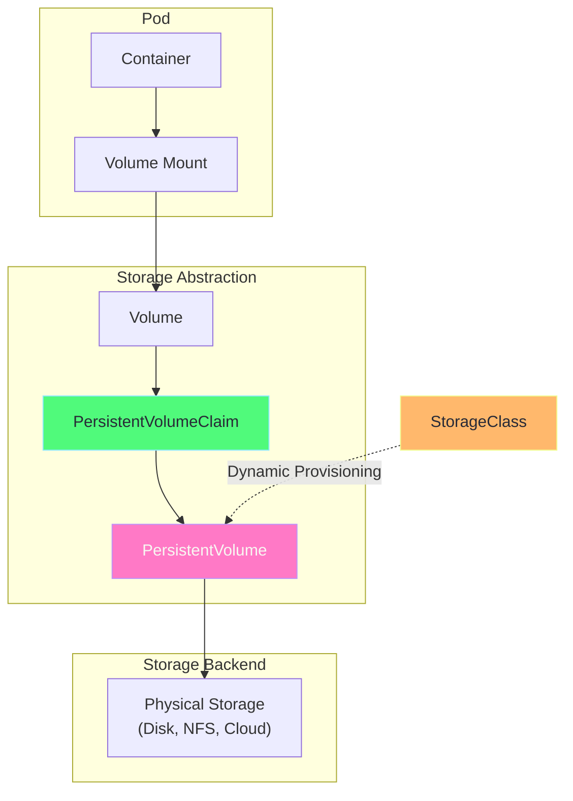
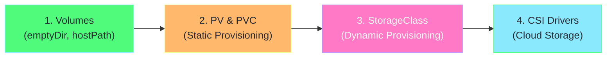

# Kubernetes Storage Mastery Guide

> **Complete guide to mastering Kubernetes storage with Minikube**

---

## 📚 Guide Structure

| Chapter | File | Topic |
|---------|------|-------|
| 1 | [01-volumes-basics.md](01-volumes-basics.md) | Volumes & Volume Types |
| 2 | [02-persistentvolumes.md](02-persistentvolumes.md) | PV & PVC |
| 3 | [03-storageclasses.md](03-storageclasses.md) | Dynamic Provisioning |
| 4 | [04-csi-drivers.md](04-csi-drivers.md) | CSI & Cloud Storage |

### Examples Folder
| File | Examples |
|------|----------|
| [examples/01-volumes-examples.yaml](examples/01-volumes-examples.yaml) | emptyDir, hostPath, configMap, secret |
| [examples/02-pv-pvc-examples.yaml](examples/02-pv-pvc-examples.yaml) | Static PV, PVC, access modes |
| [examples/03-storageclass-examples.yaml](examples/03-storageclass-examples.yaml) | Dynamic provisioning |
| [examples/04-statefulset-storage.yaml](examples/04-statefulset-storage.yaml) | StatefulSet with storage |

---

## Storage Overview



---

## Quick Start

```bash
# Minikube has a default StorageClass
minikube start

# Check default StorageClass
kubectl get storageclass

# View storage examples
kubectl apply -f examples/01-volumes-examples.yaml
```

---

## Learning Path



---

## Key Concepts at a Glance

| Concept | Description | Persistence |
|---------|-------------|-------------|
| **emptyDir** | Temporary storage, deleted with pod | ❌ Pod lifecycle |
| **hostPath** | Node's filesystem | ⚠️ Node-bound |
| **PersistentVolume** | Cluster-wide storage resource | ✅ Independent |
| **PersistentVolumeClaim** | Request for storage | ✅ Independent |
| **StorageClass** | Template for dynamic PV creation | N/A |
| **CSI Driver** | Plugin for external storage | ✅ External |

---

## Next: [Chapter 1 - Volumes Basics →](01-volumes-basics.md)
